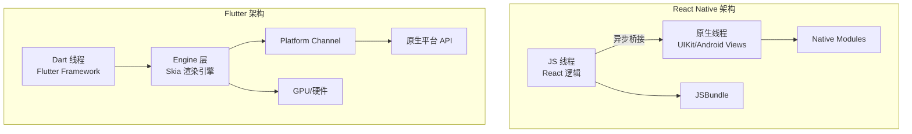
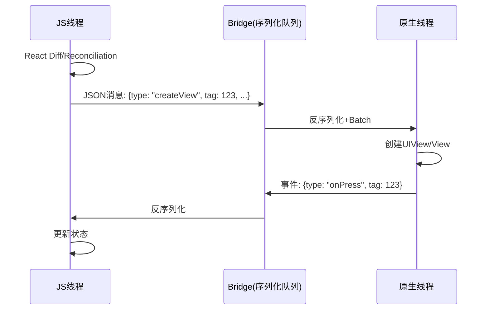
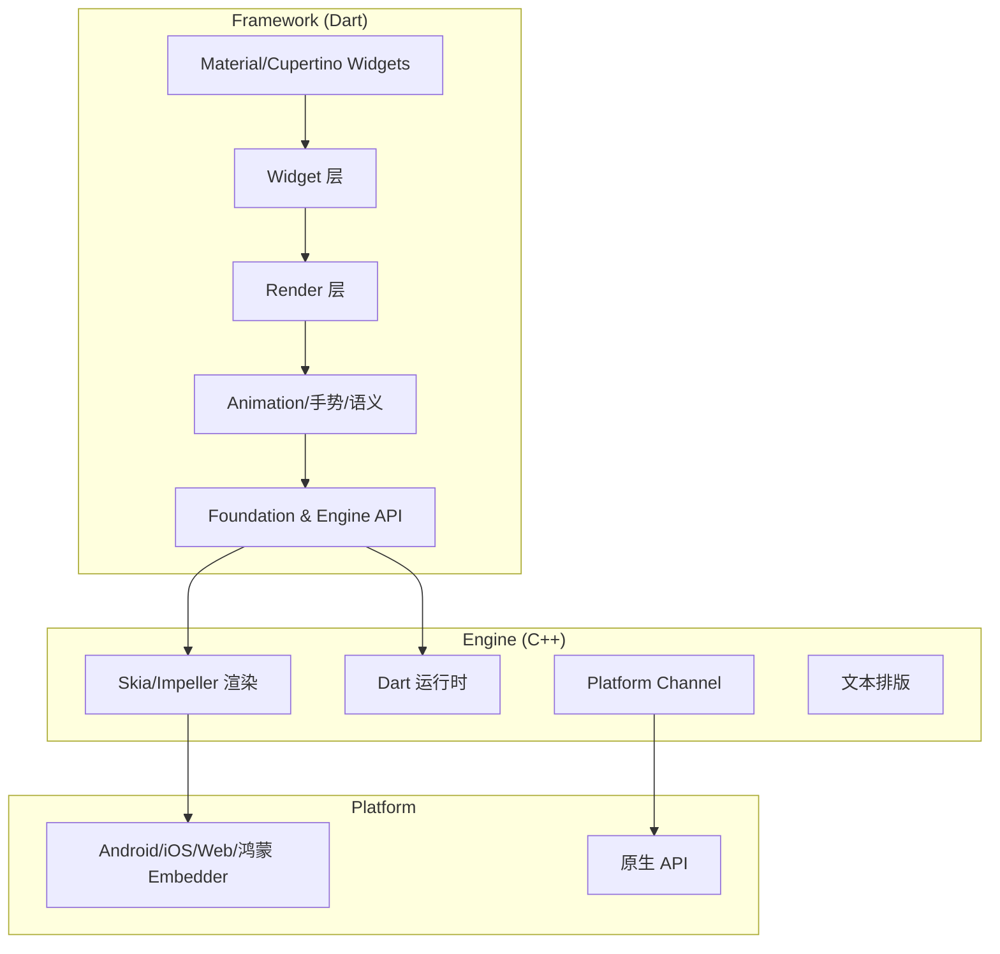
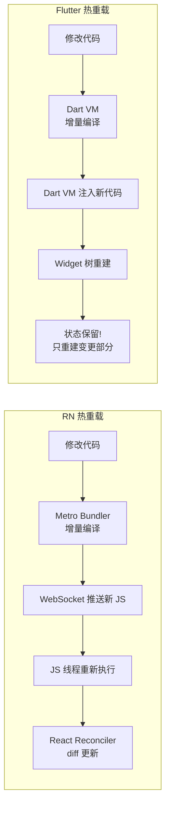

> **一句话概括**：React Native 采用"JS 桥接原生"的桥梁架构，Flutter 采用"自绘引擎 + Dart 运行时"的编译直通架构，两者在渲染性能、开发体验、生态成熟度上各有取舍——RN 胜在原生体验和 Web 生态，Flutter 赢在渲染一致性和极致的跨平台能力。

## 一、背景与意义

### 1.1 跨端开发的演化路径

跨端框架在过去十年经历了三次浪潮：

**第一波：WebView 封装（2010-2015）**
Cordova/PhoneGap 为代表，在原生外壳中嵌入 WebView。开发快、性能差——不适合复杂交互。

**第二波：JS 桥接原生（2015-2020）**
React Native 开创了"JS 驱动原生控件"的模式。Weex、NativeScript 跟随。性能大幅提升，但桥接通信仍然是瓶颈。

**第三波：自绘引擎（2018-至今）**
Flutter 带来"万物皆 Widget"的理念，用 Skia 直接渲染所有像素，不受平台原生控件限制。性能逼近原生，但包体变大（约 6-10MB 的基础引擎）。

今天，RN 和 Flutter 是跨端开发的两大阵营。鸿蒙 ArkTS 则代表了第三种路径——平台自研的声明式框架。

### 1.2 为什么要对比架构？

选择跨端框架不只是选 API 习惯——你要选的是**性能上限、调试难度、生态范围、团队门槛**。架构不同，这些指标上限就不同。

## 二、架构总览对比



| 维度 | React Native 0.76+ (新架构) | Flutter 3.x |
|------|---------------------------|-------------|
| 语言 | JavaScript/TypeScript | Dart |
| 渲染方式 | 原生控件桥接 | Skia 自绘引擎 |
| 通信机制 | JSI (新架构) / 旧 Bridge | Dart FFI + MethodChannel |
| 包体积（空应用） | 约 5-8MB | 约 6-10MB |
| 多线程 | 3 线程（JS/原生/Shadow） | 多线程 + IO/Worker |
| 首次发布 | 2015 | 2018 |
| GitHub Stars | 12万+ | 16万+ |

## 三、React Native 架构深度解析

### 3.1 传统架构（Old Architecture）

React Native 的传统架构核心是**Bridge（桥接）**：



传统架构的问题：
1. **序列化开销**：每次 JS↔Native 通信都要 JSON.stringify/parse
2. **异步阻塞**：Bridge 消息是异步批处理的，高频率交互（如手势）有延迟
3. **单线程 JS**：所有 JS 逻辑在同一个线程，复杂计算会卡 UI

### 3.2 新架构（New Architecture）

React Native 0.76 以来的新架构（Fabric + JSI + TurboModules）彻底重写了通信层：

```typescript
// JSI —— 直接函数调用，无需序列化
// C++ 层暴露原生模块
class NativeHelloModule {
  static sayHello(name: string): string {
    return `Hello, ${name}! (from native)`;
  }

  // 同步计算——不再需要 bridge queue
  static heavyCompute(n: number): number {
    let result = 0;
    for (let i = 0; i < n; i++) {
      result += i;
    }
    return result;
  }
}

// JS 端调用——直接同步，无需 Promise
import { NativeModules } from 'react-native';
const result = NativeModules.HelloModule.sayHello('World');

// TurboModules 自动生成类型安全接口
import { requireNativeModule } from 'react-native';
const module = requireNativeModule('HelloModule');
// 类型安全的方法调用
const greeting: string = module.sayHello('World');
```

**新架构的关键改进：**
- **Fabric**：渲染器直接操作 C++ Shadows Tree，减少 JS 和 Native 的通信次数
- **JSI（JavaScript Interface）**：JS 可以直接持有 C++ 对象的引用并调用方法，无需序列化
- **TurboModules**：原生模块延迟加载，按需初始化
- **Codegen**：自动生成 JS/Native 的类型定义，减少运行时类型检查

```typescript
// 新架构下的 TurboModule 定义
// Codegen 会自动生成 TypeScript 声明
export interface Spec extends TurboModule {
  readonly getConstants: () => {|
    +BUILD_VERSION: string,
    +APP_NAME: string,
  |};
  
  // 同步方法（JSI 支持）
  encrypt(input: string, key: string): string;
  
  // 异步方法
  sendAnalytics(event: AnalyticEvent): Promise<void>;
}
```

### 3.3 RN 的渲染管道


RN 渲染管道的关键步骤：
1. JS 线程运行 React reconciler，生成组件树的变更描述
2. Fabric 将变更同步到 C++ Shadow Tree（新架构下这一步是同步的）
3. Yoga 引擎执行 Flexbox 布局计算
4. 布局结果提交到原生 UI 队列
5. 原生线程隐式执行实际的 view 创建/更新

## 四、Flutter 架构深度解析

### 4.1 三层架构

Flutter 的架构非常清晰——三层堆叠：



### 4.2 渲染管道（Pipeline）

Flutter 的渲染管道的精妙之处在于**管道化（Pipeline）**设计：

```dart
// Flutter 渲染管道示意图（伪代码）
class RenderingPipeline {
  // Step 1: 构建阶段 - 遍历 Widget 树生成 Element 树
  Widget build(BuildContext context) {
    return Container(
      child: Column(
        children: [
          Text('Hello Flutter'),
          ElevatedButton(onPressed: () {}, child: Text('Click')),
        ],
      ),
    );
  }

  // Step 2: 布局阶段 - 从根 RenderObject 开始，双层遍历
  void layout() {
    // 上层 pass: 父约束传递给子
    // 下层 pass: 子大小返回给父
    renderObject.performLayout(constraints);
  }

  // Step 3: 绘制阶段 - 生成 Layer 树
  void paint() {
    // 如果只有位置变化 → 只需重绘，不需要重新布局
    if (needsPaint && !needsLayout) {
      renderObject.paint(context, offset);
      return;
    }
    // 完整 rebuild
    rebuildPipeline();
  }

  // Step 4: 合成阶段 - 提交给 Engine
  void compositing() {
    final scene = layerTree.buildScene();
    window.render(scene);
  }
}

// 实际开发中的高性能写法
class OptimizedWidget extends StatelessWidget {
  // ✅ 好做法：const Widget 避免重建
  const OptimizedWidget({super.key});

  @override
  Widget build(BuildContext context) {
    return RepaintBoundary(
      // RepaintBoundary 将绘制隔离
      // 子区域的 repaint 不会影响父区域
      child: CustomPaint(
        painter: MyPainter(),
        size: Size(100, 100),
      ),
    );
  }
}
```

### 4.3 Flutter 的自绘哲学

Flutter 不依赖平台原生控件。每个像素——包括按钮、输入框、文字——都由 Skia 或 Impeller（Flutter 3.20+ 的新渲染引擎）直接绘制到 GPU 上。

这意味着：
1. **跨平台一致性极高**——iOS 和 Android 上的 Flutter Button 看起来完全一样
2. **不受平台 UI 升级影响**——iOS 18 的 UIKit 变化不波及 Flutter 应用
3. **全权控制渲染**——你可以绘制任何想要的像素效果

代价呢？
1. **包体体积大**：Skia 引擎本身约 4MB，加上基础组件等 ≈ 10MB
2. **启动时间较长**：需要初始化 Dart VM，比纯原生启动慢
3. **平台原生生体验失落**：iOS 用户期望的系统级交互动画需要额外实现

### 4.4 Platform Channel 通信

```dart
// Flutter 端
import 'package:flutter/services.dart';

class NativeBridge {
  // 创建 MethodChannel（命名通道）
  static const platform = MethodChannel('com.example/battery');

  Future<BatteryLevel> getBatteryLevel() async {
    try {
      // 调用原生方法（异步，通过 MethodChannel）
      final result = await platform.invokeMethod<int>('getBatteryLevel');
      return BatteryLevel(level: result);
    } on PlatformException catch (e) {
      print('Failed: ${e.message}');
      return BatteryLevel(error: e.message);
    }
  }

  // EventChannel（持续事件流）
  static const eventChannel = EventChannel('com.example/sensor');
  Stream<SensorEvent> getSensorStream() {
    return eventChannel.receiveBroadcastStream().map((data) {
      final values = (data as List<dynamic>).cast<double>();
      return SensorEvent(x: values[0], y: values[1], z: values[2]);
    });
  }
}

// iOS 原生实现 (Swift)
class BatteryPlugin: NSObject, FlutterPlugin {
  static func register(with registrar: FlutterPluginRegistrar) {
    let channel = FlutterMethodChannel(name: "com.example/battery",
      binaryMessenger: registrar.messenger())
    let instance = BatteryPlugin()
    registrar.addMethodCallDelegate(instance, channel: channel)
  }

  func handle(_ call: FlutterMethodCall, result: @escaping FlutterResult) {
    switch call.method {
    case "getBatteryLevel":
      UIDevice.current.isBatteryMonitoringEnabled = true
      let level = Int(UIDevice.current.batteryLevel * 100)
      result(level)
    default:
      result(FlutterMethodNotImplemented)
    }
  }
}
```

## 五、性能基准对比

### 5.1 关键指标的定性分析

| 指标 | React Native | Flutter | 胜出原因 |
|------|-------------|---------|---------|
| 首屏启动时间 | 较快（约 1-2s） | 较慢（约 2-4s） | RN 复用原生引擎，Flutter 需初始化 DartVM |
| 列表滚动 | 良好 | 优秀 | Flutter 自绘 → 无原生 View 回收开销 |
| 动画帧率 | 60fps（复杂场景掉帧） | 满 60/120fps | Flutter 直接通知 GPU |
| 内存占用 | 较低（复用原生 View） | 较高（自身渲染树） | RN 无额外渲染缓存 |
| 包体积 | 较小（约 5-8MB） | 较大（约 10-15MB） | Flutter 携带完整渲染引擎 |
| 手势延迟 | 有桥接延迟（旧架构） | 极低 | Flutter 在 Dart 层直接处理手势 |

### 5.2 实战对比：数据列表

```typescript
// React Native 版本
import React, { useState, useCallback } from 'react';
import { FlatList, Text, View, StyleSheet } from 'react-native';

const DataList = () => {
  const [data] = useState(() =>
    Array.from({ length: 10000 }, (_, i) => ({
      id: i,
      title: `Item ${i}`,
      subtitle: `This is item number ${i} in the list`,
      value: Math.random() * 1000,
    }))
  );

  const renderItem = useCallback(({ item }) => (
    <View style={styles.item}>
      <Text style={styles.title}>{item.title}</Text>
      <Text style={styles.subtitle}>{item.subtitle}</Text>
      <Text style={styles.value}>{item.value.toFixed(2)}</Text>
    </View>
  ), []);

  return (
    <FlatList
      data={data}
      renderItem={renderItem}
      keyExtractor={item => item.id.toString()}
      // 关键优化：预定 Item 高度避免动态测量
      getItemLayout={(_, index) => ({
        length: 80,
        offset: 80 * index,
        index,
      })}
      // 窗口优化
      windowSize={21}
      maxToRenderPerBatch={10}
      initialNumToRender={10}
      removeClippedSubviews={true}
    />
  );
};
```

```dart
// Flutter 版本
import 'package:flutter/material.dart';

class DataList extends StatelessWidget {
  final List<ItemData> data = List.generate(
    10000,
    (i) => ItemData(
      id: i,
      title: 'Item $i',
      subtitle: 'This is item number $i in the list',
      value: Random().nextDouble() * 1000,
    ),
  );

  @override
  Widget build(BuildContext context) {
    return ListView.builder(
      itemCount: data.length,
      // Flutter 的 prototype item 优化
      prototypeItem: ListTile(
        title: Text(data[0].title),
        subtitle: Text(data[0].subtitle),
        trailing: Text(data[0].value.toStringAsFixed(2)),
      ),
      itemBuilder: (context, index) {
        return SizedBox(
          height: 72, // 固定高度避免测量
          child: ListTile(
            title: Text(data[index].title),
            subtitle: Text(data[index].subtitle),
            trailing: Text(
              data[index].value.toStringAsFixed(2),
              style: TextStyle(fontWeight: FontWeight.bold),
            ),
          ),
        );
      },
    );
  }
}
```

Flutter 在此场景的优势：**所有 Item 渲染都在 Dart 层完成**，没有跨语言桥接开销。`prototypeItem` 参数允许 Flutter 在布局阶段使用样板 Item 快速计算所有 Item 的高度，避免逐个测量。

## 六、生态与工具链对比

### 6.1 包管理器 & 三方库

| 维度 | React Native | Flutter |
|------|-------------|---------|
| 包管理 | npm/yarn + pod install | pub.dev + Flutter pub |
| 三方库数量 | 10000+（含大部分 npm 包） | 15000+ |
| 原生模块 | TurboModules（新架构） | MethodChannel/FFI |
| Web 支持 | React Native Web | Flutter Web（CanvasKit） |
| 桌面支持 | 实验性（社区） | 稳定（Windows/macOS/Linux） |
| 鸿蒙支持 | 社区适配 | 官方适配进行中 |

### 6.2 热重载对比

两者都支持热重载，但底层机制不同：



关键区别：Flutter 热重载**保留状态**——编辑代码后，界面更新但当前页面状态（输入框内容、滚动位置）不丢失。RN 的热重载通常丢失组件状态（除非用 Fast Refresh 的特殊处理）。

## 七、选择决策指南

### 7.1 什么时候选 React Native？

✅ **适合的场景：**
1. 团队已有 React/Web 背景——学习成本最低
2. 需要高原生一致性——RN 渲染平台原生控件
3. 已有 Native 模块积累——TurboModules 可直接复用
4. 需要快速集成 Web 技术栈——可复用现有 Web 逻辑
5. 应用本身依赖大量平台功能——通知、地图、蓝牙

❌ **不适合的场景：**
1. 对帧率和动画有极高要求——手势动画中的桥接延迟仍存在
2. 从零开始构建全新应用——无 Web 背景的情况下 Flutter 学习曲线更平

### 7.2 什么时候选 Flutter？

✅ **适合的场景：**
1. 从零开始构建——Dart 语言清晰，学习路径明确
2. 对 UI 一致性要求极强——所有平台像素级一致
3. 需要高度自定义 UI——不像 RN 受限于原生控件
4. 包体积不是瓶颈——家用场景不考虑首次下载大小
5. 未来可能扩展到桌面/Web——一套代码覆盖移动+桌面+Web

❌ **不适合的场景：**
1. 需要极小的包体积——IoT 设备或首次安装体验优先
2. 必须使用非常新的平台 API——Flutter 的 platform channel 有版本滞后
3. 团队是以 Web 为主的技术栈——Dart 是额外学习成本

### 7.3 实战决策矩阵

```typescript
// 决策评分函数（伪代码）
function recommendFramework(params: ProjectParams): Framework {
  const scores = {
    flutter: 0,
    reactNative: 0,
  };

  if (params.hasWebExperience) scores.reactNative += 3;
  if (params.teamSize < 5) scores.flutter += 2; // 小团队 Flutter 上手更快
  if (params.requiresCustomAnimations) scores.flutter += 3;
  if (params.platformFeel == 'native') scores.reactNative += 2;
  if (params.futureDesktop) scores.flutter += 3;
  if (params.appSizeSensitive) scores.reactNative += 2;

  return scores.flutter > scores.reactNative ?
    Framework.Flutter : Framework.ReactNative;
}
```

## 八、高频面试题解析

### Q1：Flutter 的"没有桥接"是什么意思？

**答：** Flutter 没有 JS Bridge 那种跨语言通信的序列化开销。Flutter 框架本身（Widgets、Rendering）用 Dart 编写，运行在 Dart 运行时中。渲染走 Skia/Impeller C++ 引擎，通过 Dart FFI 直接调用。所有 UI 更新、手势处理都在进程内完成，不需要序列化和跨线程发送消息。Flutter 的 "Platform Channel" 只在访问原生平台 API（如打开摄像头、读取传感器）时使用。

### Q2：React Native 新架构的 JSI 解决了什么核心问题？

**答：** JSI（JavaScript Interface）解决了传统 Bridge 的**异步序列化瓶颈**。旧架构中，JS 调用原生方法是异步的（即使只是同步逻辑，也要过 Bridge 队列）。JSI 让 JS 可以直接持有 C++ 对象的引用并同步调用。这意味着：1）原生模块方法可以同步返回；2）高频调用（如手势处理）不再有桥接延迟；3）内存分配更高效（C++ 对象不需要序列化为 JSON 再返回）。

### Q3：Flutter 的 Impeller 渲染引擎是什么？为什么替代 Skia？

**答：** Impeller 是 Flutter 团队为解决 Skia 在移动端的一些问题而开发的新渲染引擎。Skia 需要即时编译着色器，在首次运行某些动画时会有卡顿（"着色器编译卡顿"——shader jank）。Impeller 采用预编译着色器，消除了运行时编译的延迟。优点是帧率更稳定、启动更快。目前 Android 和 iOS 平台上 Flutter 3.20+ 默认使用 Impeller。

### Q4：如果鸿蒙成为主流，RN 和 Flutter 哪个更可能适配？

**答：** 从适配难度看：Flutter 更容易。因为 Flutter 的 Embedder 层（连接 Engine 和平台的胶水代码）是标准化的——只要实现一套 Embedder API 就可以让 Flutter 跑在任何系统上。实际上华为已经做了 Flutter for HarmonyOS 的适配。RN 的适配需要同时解决 JSI 引擎适配和原生组件映射两个问题，复杂度更高。但 RN 的优势是社区生态成熟，适配工作可以社区驱动。

### Q5：在性能敏感场景，两者差距有多大？

**答：** 实测数据显示（来自公开 benchmark）：在列表快速滚动（60fps 维持率）上，Flutter 比 RN 高约 5-8%；在复杂手势动画（如拖拽缩放图片）上，Flutter 满帧（60fps），RN 旧架构通常 45-55fps，新架构提升到 55-60fps。在 CPU 密集型计算上，Dart 编译为原生机器码（AOT），比 RN 的 JIT JS 快 2-3 倍。但请注意：**对大多数应用来说，这些差异用户感知不到。真正影响体验的往往是开发者写的低效代码，而不是框架本身。**

## 九、总结与扩展

RN 和 Flutter 代表了跨端开发的两种哲学：

- **RN 的哲学**："和原生做朋友"——拥抱平台差异，输出原生体验
- **Flutter 的哲学**："做自己的世界"——掌控所有像素，输出一致体验

两种哲学没有绝对的对错。关键看你的场景：**需要深度融入平台生态，选 RN；需要跨平台高度一致，选 Flutter。**

从架构演进趋势来看，两者的方向是**趋同**的：RN 正在向 JSI + Fabric 的"更薄桥梁"演进，减少 JS↔Native 通信开销；Flutter 正在向 Impeller + Dart Native 的"更厚框架"演进，让更多能力在 Dart 层完成而不需要 platform channel。最终两者的性能差距会越来越小。

对于开发者，我的建议是：**不要只看架构图选框架，打开一个真实的、中等复杂度的应用（比如一个 EHR 记录应用或一个社交信息流应用），用两个框架各做一个功能模块，切身体会开发体验的差异。** 架构评测的分数差异，远远不如"我一天能写出多少可维护代码"这个指标重要。

---

**扩展阅读：**
- React Native New Architecture 官方文档
- Flutter Engine 架构白皮书
- React Native Fabric 渲染器设计原理
- Dart 运行时与渲染引擎的协作机制
