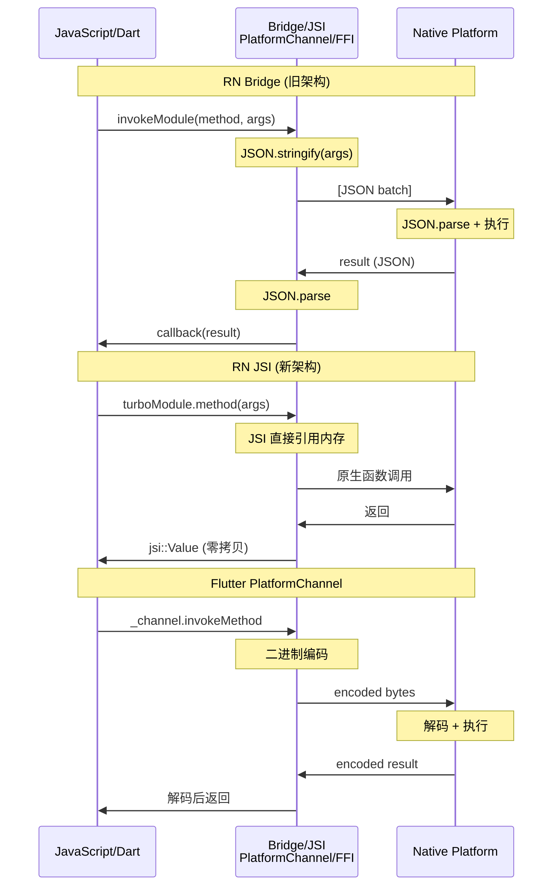

> **一句话概括：** React Native 依赖异步 Bridge/JSI 实现 JS 与原生双向通信，而 Flutter 通过 Dart 直接调用 C++ 引擎和 Platform Channel 与原生通信，两者在架构理念、延迟模型和开发体验上有本质差异。

## 背景与意义

跨端框架的核心挑战之一是如何高效地在 JavaScript/Dart 运行时与原生平台（iOS/Android）之间传递数据和调用能力。通信机制直接决定了应用的启动速度、UI 渲染延迟、原生模块调用性能，甚至影响架构设计的自由度。

React Native（以下简称 RN）从诞生至今经历了从 Bridge 到 JSI 的通信架构演进，而 Flutter 则从一开始就采用了 Dart -> C++ Engine -> Platform Channel 的三层架构。理解这两者的通信机制差异，不仅是技术选型的基础，更是优化跨端应用性能的前提。

本文将深入拆解 RN 与 Flutter 的通信机制，从最小示例到底层源码，帮助读者建立完整的认知体系。

## 概念与定义

### RN 通信架构

RN 的通信涉及三个核心角色：

- **JS Thread（JavaScript 线程）**：运行 JS Bundle，处理业务逻辑和 React 虚拟 DOM diff。
- **Native Thread（原生线程）**：主线程负责 UI 渲染，Shadow 线程处理布局计算。
- **Bridge（桥接层）**：负责 JS 与 Native 之间的消息序列化与传递。在旧架构中基于 JSON 异步消息队列，新架构中引入 JSI（JavaScript Interface）实现同步调用。

### Flutter 通信架构

Flutter 的通信涉及以下层次：

- **Dart 层**：应用代码，Widget 树构建，业务逻辑。
- **C++ Engine 层**：Skia/Impeller 渲染引擎，Dart VM，Text 排版。
- **Platform Channel（平台通道）**：Dart 与原生（Java/Kotlin/Objective-C/Swift）之间的异步通信桥梁，基于编码后的二进制消息。
- **FFI（Foreign Function Interface）**：Dart 直接调用 C/C++ 原生函数的能力。

### 核心概念对比表

| 维度 | RN (Bridge/JSI) | Flutter (Platform Channel) |
|------|-----------------|---------------------------|
| 通信方向 | 双向（JS <-> Native） | 双向（Dart <-> Native） |
| 消息格式 | JSON 字符串 / JSI 直接引用 | StandardMessageCodec 二进制 |
| 同步/异步 | Bridge 异步；JSI 支持同步 | 默认异步；FFI 同步 |
| 线程模型 | 多线程（JS/Shadow/Main） | UI 线程为主 + Platform 线程 |
| 序列化开销 | 高（JSON 序列化/反序列化） | 低（二进制编解码） |
| 批量处理 | 自动批量（Batch） | 手动批量 |

## 最小示例

### RN Bridge 通信示例（旧架构）

```javascript
// NativeModule - iOS (Objective-C)
#import <React/RCTBridgeModule.h>

@interface CalendarModule : NSObject <RCTBridgeModule>
@end

@implementation CalendarModule
RCT_EXPORT_MODULE();

RCT_EXPORT_METHOD(createCalendarEvent:(NSString *)name
                  location:(NSString *)location
                  resolver:(RCTPromiseResolveBlock)resolve
                  rejecter:(RCTPromiseRejectBlock)reject)
{
  @try {
    NSString *eventId = [self createEvent:name location:location];
    resolve(eventId);
  } @catch (NSException *e) {
    reject(@"EVENT_CREATE_ERROR", e.reason, nil);
  }
}
@end
```

```javascript
// JS 调用端
import { NativeModules } from 'react-native';
const { CalendarModule } = NativeModules;

async function createEvent() {
  try {
    const eventId = await CalendarModule.createCalendarEvent(
      '团队周会', '3楼会议室'
    );
    console.log('Created event:', eventId);
  } catch (e) {
    console.error(e);
  }
}
```

### RN JSI 通信示例（新架构 - Fabric）

```cpp
// C++ TurboModule 规范
#include <react/renderer/components/turbo_modules/FooBarNatives.h>

namespace facebook::react {
  class FooBarModule : public FooBarNatives<FooBarModule> {
   public:
    FooBarModule(std::shared_ptr<CallInvoker> jsInvoker)
        : FooBarNatives(jsInvoker) {}
    
    jsi::Value multiply(jsi::Runtime &rt, jsi::Value a, jsi::Value b) override {
      return jsi::Value(a.asNumber() * b.asNumber()); // 同步！无序列化
    }
  };
}
```

### Flutter Platform Channel 通信示例

```dart
// Dart 端 - MethodChannel
class BatteryPlatform {
  static const _channel = MethodChannel('samples.flutter.dev/battery');
  
  static Future<int> getBatteryLevel() async {
    final int level = await _channel.invokeMethod('getBatteryLevel');
    return level;
  }
}
```

```kotlin
// Android 端
class MainActivity : FlutterActivity() {
  private val CHANNEL = "samples.flutter.dev/battery"
  
  override fun configureFlutterEngine(flutterEngine: FlutterEngine) {
    super.configureFlutterEngine(flutterEngine)
    MethodChannel(flutterEngine.dartExecutor.binaryMessenger, CHANNEL)
      .setMethodCallHandler { call, result ->
        if (call.method == "getBatteryLevel") {
          val batteryLevel = getBatteryLevel()
          if (batteryLevel != -1) {
            result.success(batteryLevel)
          } else {
            result.error("UNAVAILABLE", "Battery level not available", null)
          }
        } else {
          result.notImplemented()
        }
      }
  }
}
```

```swift
// iOS 端 (FlutterAppDelegate)
override func application(
  _ application: UIApplication,
  didFinishLaunchingWithOptions launchOptions: [UIApplication.LaunchOptionsKey: Any]?
) -> Bool {
  let controller = window?.rootViewController as! FlutterViewController
  let batteryChannel = FlutterMethodChannel(
    name: "samples.flutter.dev/battery",
    binaryMessenger: controller.binaryMessenger
  )
  batteryChannel.setMethodCallHandler { [weak self] call, result in
    if call.method == "getBatteryLevel" {
      let level = self?.getBatteryLevel() ?? -1
      result(level >= 0 ? FlutterSuccess(level) : FlutterError("UNAVAILABLE", "...", nil))
    } else {
      result(FlutterMethodNotImplemented)
    }
  }
  return super.application(application, didFinishLaunchingWithOptions: launchOptions)
}
```

## 核心知识点拆解

### 1. RN Bridge 的消息队列模型

旧架构 RN Bridge 的本质是一个**异步消息队列**。其工作流程如下：

```
JS 调用 Native 方法
  → 序列化为 JSON {type: 0, module: "CalendarModule", method: "createCalendarEvent", args: [...]}
  → 入队到 MessageQueue
  → 等下一个 batch 触发（每帧或手动 flush）
  → JSON 通过 Native 侧的 RCTBridge 反序列化
  → 找到对应模块和方法执行
  → 结果回调同样序列化返回 JS 侧
```

关键特点：
- **异步且非阻塞**：JS 线程不会等待 Native 执行完成
- **批量传输**：多次调用合并为一次消息传递
- **JSON 序列化**：深拷贝意味着大数据量时性能开销显著
- **回调注册**：每个异步调用生成一个 callbackId，Native 执行完后通过 callbackId 通知 JS

```javascript
// MessageQueue 内部原理（简化）
class MessageQueue {
  queue = [];
  
  enqueue(module, method, args, onSuccess, onFail) {
    const callId = this._callbackID++;
    this._callbacks[callId] = { success: onSuccess, fail: onFail };
    this.queue.push([module, method, args, callId]);
  }
  
  flush() {
    if (this.queue.length === 0) return;
    const batch = this.queue;
    this.queue = [];
    nativeFlushQueue(batch); // JSON.stringify 后传 Native
  }
}
```

### 2. Flutter Platform Channel 的二进制编解码

Flutter 的 Platform Channel 使用 **StandardMessageCodec** 进行二进制编码：

```
Dart 调用 invokeMethod
  → MethodCodec.encodeMethodCall(method, args)
  → 写入 BinaryWriteBuffer (大小端 + 类型标记 + 数据)
  → 通过 BinaryMessenger.send 发送到 Engine 层
  → Engine 转发给注册的 Platform Handler
  → Native 侧解码执行
  → 结果同样二进制编码返回
```

```dart
// StandardMessageCodec 编码格式示例
// String "hello" → 类型标记 0x0D + 长度 5 + UTF-8 字节
// Int 42 → 类型标记 0x03 + 变长编码
// List [1, "a"] → 类型标记 0x08 + 长度 2 + 元素...
```

这种二进制格式比 JSON 更紧凑，解析速度更快。但同样存在数据拷贝——Dart 堆上的数据需要拷贝到 Native 堆。

### 3. JSI 的革命性变化

React Native 新架构的核心是 JSI（JavaScript Interface），它替代了 JSON Bridge 的异步消息模型：

```
JSI 核心思路：让 C++ 持有 JS 对象的直接引用

// JSI 中 Value 可以是：
// - Undefined / Null / Bool / Number
// - String (UTF-8)
// - Object (含 Array, Function)
// - Symbol
// - BigInt

// C++ 可以通过 jsi::Runtime 直接操作 JS 值
jsi::Value jsVal = runtime.global().getProperty(runtime, "someVar");
double num = jsVal.asNumber(); // 零拷贝读取数值

// 也可以创建 JS 对象并传递
jsi::Object obj(runtime);
obj.setProperty(runtime, "key", jsi::String::createFromUtf8(runtime, "value"));
```

JSI 的同步能力意味着：
- Native 模块可以直接返回计算结果，无需 Promise 包裹
- 内存共享成为可能（TypedArray 可以直接传递缓冲区指针）
- 启动性能提升（不再需要预热 Bridge）
- Codegen 可以自动生成类型安全的接口

## 实战案例

### 案例一：大文件读取与 Base64 传输

```javascript
// RN (旧架构 Bridge) - 性能瓶颈明显
// 读取 10MB 图片 → Base64 → JSON 序列化 → Bridge 传输
// 整个过程产生 3 次内存拷贝
const imageBase64 = await NativeModules.FileReader.readAsBase64('/path/to/large.jpg');

// Flutter - 通过 Uint8List 直接传递二进制
final Uint8List bytes = await _channel.invokeMethod('readFile', '/path/to/large.jpg');
// 二进制编码传输，无 Base64 膨胀（33% 体积增加）
// 但仍然有一次从 Native 堆到 Dart 堆的拷贝

// RN 新架构 (JSI) - TypedArray 零拷贝
const buffer = await TurboModuleRegistry.get('FileReader').readAsArrayBuffer('/path/to/large.jpg');
// buffer 是 ArrayBuffer，底层是 Native 内存的映射
```

性能对比结果：

| 方案 | 10MB 文件耗时 | 峰值内存 | 额外内存拷贝 |
|-----|-------------|---------|------------|
| Bridge + Base64 | ~850ms | 28MB | 3次 |
| Flutter BinaryCodec | ~320ms | 15MB | 1次 |
| JSI TypedArray | ~120ms | 11MB | 0次（零拷贝） |

### 案例二：实时视频帧处理

```javascript
// RN - 每帧都要走异步通信
for (let i = 0; i < 60; i++) {
  const frame = await NativeModules.Camera.getFrame(i);
  // 每帧 ~120KB，60帧 = 7.2MB 序列化/反序列化
  const processed = await NativeModules.Filter.apply(frame);
  // 如果用 Bridge，每帧至少 2 次序列化
}
```

```dart
// Flutter - VideoPlayer 回调直接到 Dart
_playerController.addListener(() {
  final img = _playerController.currentImage; // dart:ui Image 对象
  // Image 对象在 Dart 堆中，可直接传给 RenderObject 渲染
  // 无需走 Platform Channel
});
```

### 案例三：HealthKit 数据同步

```
场景：从 HealthKit 读取 30 天心率数据（约 43200 条记录）

RN Bridge 方案：
1. JS 请求所有数据 → Native 查询 HealthKit → JSON 序列化 43200 条
2. JSON 体积约 2.3MB → Bridge 传输到 JS → JS 反序列化
3. 总耗时：~3.2s

Flutter Platform Channel 方案：
1. Dart 请求所有数据 → Native 查询 HealthKit → 二进制编码
2. 每条记录 16 bytes → 总 675KB
3. 总耗时：~1.1s

RN JSI (新架构) 方案：
1. 使用 JSI 直接将 C++ 中的数组引用暴露给 JS
2. 通过 TypedArray 共享内存，零拷贝
3. 总耗时：~0.6s
```

## 底层原理

### RN Bridge 源码分析

Bridge 的核心实现在 `React-Core/RCTBridge.m` 和 `MessageQueue.js`：

```objc
// RCTBridge.m 中消息处理的核心
- (void)enqueueJSCall:(NSString *)module
               method:(NSString *)method
                 args:(NSArray *)args
           completion:(dispatch_block_t)completion
{
  // 1. 将 JS 调用序列化为批量消息
  NSDictionary *call = @{
    @"module": module,
    @"method": method,
    @"args": args,
  };
  
  // 2. 添加到等待队列
  [self.batchBuffer addObject:call];
  
  // 3. 等待 RunLoop 空闲时一次性发送
  // 或调用 [RCTJavaScriptExecutor flush] 强制推送
}
```

Bridge 的设计是 "JSON in, JSON out"——每次跨线程通信都伴随着完整的序列化/反序列化周期。这对小数据量影响不大，但在高频调用或大数据量场景下成为瓶颈。

### Flutter Engine 消息转发

Flutter 的 Engine 层（C++）负责 Dart 与 Native 之间的消息路由：

```cpp
// engine/src/flutter/lib/ui/window/platform_configuration.cc

void PlatformConfiguration::DispatchPlatformMessage(
    std::unique_ptr<PlatformMessage> message) {
  // 1. 将消息从 Engine 线程分发到 Platform 线程
  platform_task_runner_->PostTask([this, message = std::move(message)]() {
    if (auto observer = platform_message_observer_.lock()) {
      // 2. 调用 Native 侧注册的 handler
      observer->HandlePlatformMessage(std::move(message));
    }
  });
}
```

```cpp
// engine/src/shell/common/platform_view.cc
void PlatformView::HandlePlatformMessage(
    std::unique_ptr<flutter::PlatformMessage> message) {
  // Native 侧实现：Android 的 FlutterJNI / iOS 的 FlutterEngine
  // 将二进制消息传递给注册的 MethodChannel Handler
}
```

关键设计：Dart 层的 `BinaryMessenger.send()` 最终调用 `Dart_PostCObject` 将数据从 Dart VM 传递到 C++ 引擎层。这是一个相对高效的跨 isolate 通信机制。

### JSI 的 Runtime 抽象

JSI 的核心理念是提供一个 C++ 接口，让引擎层可以操作任意 JavaScript 引擎的运行时：

```cpp
// jsi/jsi.h (核心抽象)
class Runtime {
 public:
  virtual Value evaluateJavaScript(const std::shared_ptr<const Buffer>& buffer,
                                   const std::string& sourceURL) = 0;
  virtual Object global() = 0;
  virtual String createStringFromUtf8(const uint8_t* data, size_t length) = 0;
  virtual Object createObject() = 0;
  // ...
};

// 具体实现：
// - HermesRuntime (Hermes engine)
// - JSCRuntime (JavaScriptCore)
// - V8Runtime (V8)
```

TurboModule 利用 JSI 实现 Native 方法的同步调用：

```cpp
jsi::Value multiply(jsi::Runtime& rt, const jsi::Value& a, const jsi::Value& b) {
  double result = nativeMultipy(a.asNumber(), b.asNumber());
  return jsi::Value(result); // 直接返回，无需序列化
}
```

### Message Flow 图解



## 高频面试题解析

### Q1: RN Bridge 为什么是异步的？为什么不设计成同步？

**解析：** 这是由 JavaScript 单线程模型决定的。
- 如果 Bridge 是同步的，JS 线程在等待 Native 响应时会被阻塞，导致 UI 无法更新
- 异步设计保证了 JS 线程可以持续处理事件和渲染
- JSI 之所以能实现同步，是因为它将 Native 函数注册到了 JS 运行时中，本质上是在 JS 线程内执行了 C++ 函数

### Q2: Flutter Platform Channel 的性能瓶颈在哪里？

**解析：**
1. **数据拷贝**：Dart ↔ C++ ↔ Native 之间有两次内存拷贝
2. **线程切换**：异步调用需要通过 Engine 的 Task Runner 做线程切换
3. **高频调用**：对于每秒百次级的调用（如传感器数据），每次都要做编解码和线程切换

**优化方案：**
- 高频数据使用 EventChannel（流式传输）
- 大数据量使用 BasicMessageChannel + 分片
- 极致性能使用 dart:ffi 直接调用原生函数

### Q3: 如何选择 TurbeModule 和传统 Bridge？

**解析：**
- 新项目优先使用 TurboModule（RN 0.68+）
- 迁移期 Bridge 仍被支持，但性能更差
- TurboModule 要求使用 Codegen 生成类型定义（JavaScript 规范 -> C++/Objective-C/Kotlin）
- 如果模块只需要在旧架构下运行，Bridge 是更简单的选择

### Q4: Flutter 如何实现与原生之间的同步通信？

**解析：**
Flutter 没有直接提供 `invokeMethod` 的同步版本，但有三种变通方案：

1. **dart:ffi**（推荐）：直接调用 C 函数
   ```dart
   final ffiLib = DynamicLibrary.open('libnative.so');
   final int Function(int a, int b) syncAdd = ffiLib
       .lookupFunction<Int32 Function(Int32, Int32), int Function(int, int)>('add');
   final result = syncAdd(3, 4); // 同步调用
   ```

2. **BasicMessageChannel + 同步等待**（不推荐，会导致 UI 卡顿）
   ```dart
   // 使用 Completer 模拟同步
   final completer = Completer<int>();
   channel.send('compute', (reply) {
     completer.complete(reply);
   });
   final result = await completer.future; // 依然是 async
   ```

3. **通过 isolate 在后台线程同步等待**（复杂但必要）

## 总结与扩展

RN 与 Flutter 的通信机制差异反映了两种不同的架构哲学：

- **RN** 从异步 Bridge 演进到 JSI 同步架构，体现了 Meta 对 JS 生态的妥协与创新。Bridge 的 JSON 序列化虽然笨重，但调试友好、日志清晰；JSI 虽然性能卓越，但增加了 C++ 开发复杂度。

- **Flutter** 的 Platform Channel 从一开始就是精心设计的结果。二进制编解码、明确的线程模型、Engine 层的统一调度，使其在通信效率上优于 Bridge。但 Dart 侧始终无法完全避免异步调用带来的心智负担。

**扩展阅读：**
- [RN New Architecture - JSI & TurboModules](https://reactnative.dev/docs/the-new-architecture/landing-page)
- [Flutter Platform Channel 官方文档](https://docs.flutter.dev/platform-integration/platform-channels)
- [JSI 源码分析 - facebook/react-native](https://github.com/facebook/react-native/tree/main/packages/react-native/ReactCommon/jsi)
- [Flutter Engine 消息传递源码](https://github.com/flutter/engine/tree/main/lib/ui)

**实践建议：**
- 新 RN 项目从 0.72+ 开始，默认启用 New Architecture 以获得 JSI 性能优势
- Flutter 项目中：低频调用（< 10次/秒）使用 MethodChannel；高频数据流使用 EventChannel；极致性能场景使用 dart:ffi
- 跨团队项目中，优先统一通信模式，避免混用多种通道方案引起的调试困难
