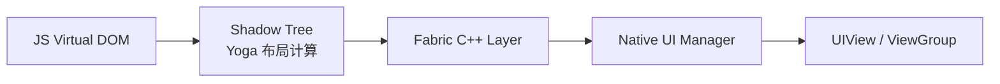
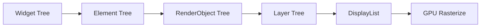
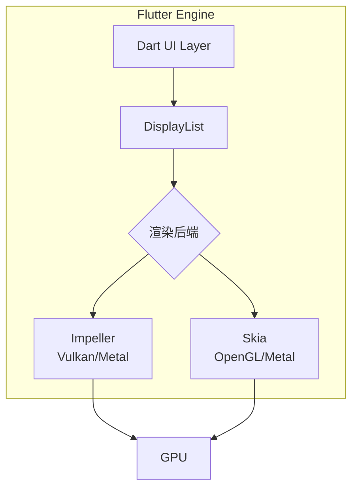
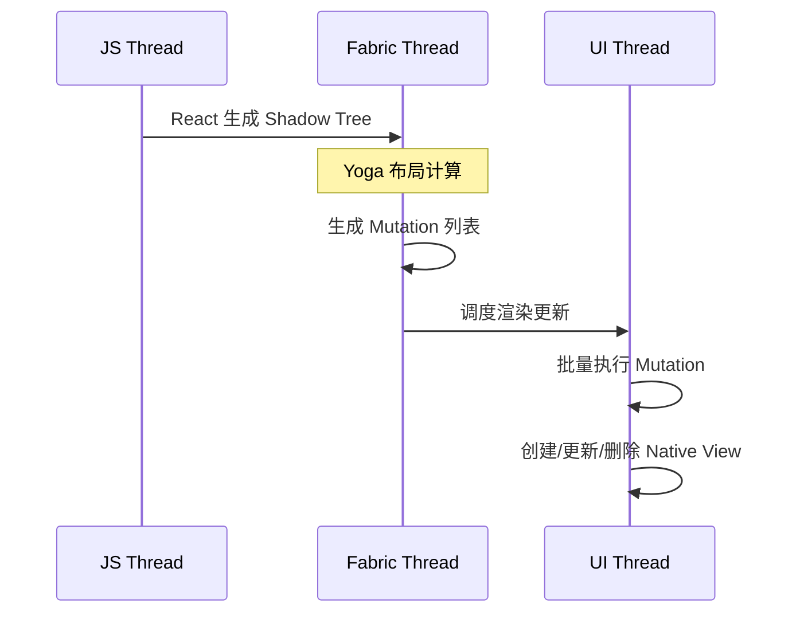

> **一句话概括：** RN 依赖 Yoga 布局引擎在 Shadow 线程计算布局后委托原生组件渲染，Flutter 则通过 Skia/Impeller 引擎自绘所有像素，两者在渲染管线、布局计算和 GPU 交互上采用了截然不同的策略。

## 背景与意义

渲染机制是跨端框架最核心的技术选择，它直接决定了应用的 UI 流畅度、启动速度、滚动性能以及自定义 UI 的实现成本。

React Native 从诞生起就采用"桥接到原生组件"的策略——JS 描述 UI，Native 进行实际渲染。而 Flutter 则激进地选择了"一切自绘"——连一个像素都不交给原生系统。这两种路线各有取舍，理解它们才能做出更好的技术决策。

## 概念与定义

### RN 渲染架构（旧 -> 新）

| 层级 | 旧架构 | 新架构 (Fabric) |
|------|--------|-----------------|
| JS 侧 | React 虚拟 DOM | React 虚拟 DOM + React Native Tree |
| 布局引擎 | Yoga (C++) | Yoga (C++) |
| 线程模型 | JS + Shadow + Main | JS + Fabric + Main |
| 渲染输出 | 原生 View 层级 | 原生 View 层级 |
| 跨帧复用 | 不支持 | 支持（缓存 Shadow Tree） |

### Flutter 渲染架构

```
Widget Tree (不可变,轻量)
  → Element Tree (管理生命周期)
    → RenderObject Tree (布局+绘制)
      → Layer Tree (合成)
        → Picture / DisplayList
          → GPU (Skia / Impeller)
```

每层职责：
- **Widget**: 配置描述，不可变，每次 rebuild 重建
- **Element**: 管理 Widget 与 RenderObject 的对应关系，处理生命周期
- **RenderObject**: 真正的布局与绘制逻辑
- **Layer**: 离屏渲染缓存，减少重绘面积
- **Picture/DisplayList**: 编码后的绘制指令

### 核心概念对比

| 维度 | RN | Flutter |
|------|----|---------|
| 渲染引擎 | 原生 UIKit/Android View | Skia / Impeller |
| 布局引擎 | Yoga (Flexbox) | 自研 RenderObject (约束-尺寸) |
| 线程模型 | 3线程 (JS/Shadow/Main) | 单 UI 线程 + GPU 线程 + IO 线程 |
| 布局单位 | Flexbox (CSS 标准) | 自定义布局协议 |
| 文本渲染 | NSAttributedString / Spannable | Minikin (libtxt) |
| 像素控制 | 受限（原生组件边界） | 完全控制（每个像素） |
| 动画驱动 | JS Driver / Native Driver | Dart 动画控制器 |

## 最小示例

### RN 组件渲染过程

```javascript
// JS 侧定义组件
function MyCard({ title, description }) {
  return (
    <View style={styles.card}>
      <Text style={styles.title}>{title}</Text>
      <Text style={styles.desc}>{description}</Text>
    </View>
  );
}
```



这个过程经历了：
1. **JS 线程**: React reconciliation → 生成 React Native Tree
2. **Fabric 线程**: Yoga 布局 → 计算每个组件的 Frame (x, y, width, height)
3. **Main 线程**: 创建/更新原生 View → 应用 layout 属性

### Flutter 组件渲染过程

```dart
class MyCard extends StatelessWidget {
  final String title;
  final String description;
  
  const MyCard({required this.title, required this.description});
  
  @override
  Widget build(BuildContext context) {
    return Container(
      padding: EdgeInsets.all(16),
      decoration: BoxDecoration(
        color: Colors.white,
        borderRadius: BorderRadius.circular(12),
        boxShadow: [BoxShadow(blurRadius: 4, color: Colors.black26)],
      ),
      child: Column(
        crossAxisAlignment: CrossAxisAlignment.start,
        children: [
          Text(title, style: TextStyle(fontSize: 18, fontWeight: FontWeight.bold)),
          SizedBox(height: 8),
          Text(description, style: TextStyle(fontSize: 14, color: Colors.grey[600])),
        ],
      ),
    );
  }
}
```



整个过程全在 Flutter Engine 内部完成，不涉及任何原生 View 创建。

## 核心知识点拆解

### 1. Yoga 布局引擎与 Flexbox

RN 使用 Facebook 开源的 Yoga 引擎进行布局计算。Yoga 是一个纯 C++ 的 Flexbox 实现：

```cpp
// Yoga 节点布局计算（简化）
void YGNodeCalculateLayout(
  YGNodeRef node,
  float availableWidth,
  float availableHeight,
  YGDirection ownerDirection
) {
  // 1. 确定 direction
  // 2. 应用 padding / border / margin
  // 3. 计算 flex basis / grow / shrink
  // 4. 分配主轴方向空间
  // 5. 交叉轴对齐
  // 6. 递归子节点
  
  for (auto child : node->getChildren()) {
    YGNodeCalculateLayout(child, childWidth, childHeight, direction);
    // 设置子节点的最终位置
    child->setPosition(top, left);
  }
}
```

Yoga 的优势：
- **跨平台**：C++ 实现，iOS/Android/Web 共用
- **高性能**：单次遍历 O(n) 复杂度
- **确定性**：给定输入必有唯一输出

但 Yoga 只负责布局（位置和尺寸），不参与实际绘制。

### 2. Flutter RenderObject 的约束-尺寸协议

Flutter 的布局机制基于 **Constraints → Size** 传递模型：

```dart
abstract class RenderBox extends RenderObject {
  @override
  void performLayout() {
    // 父节点传递 constraints（对子节点尺寸的限制）
    // 子节点返回 size（计算后的自身尺寸）
    child!.layout(constraints, parentUsesSize: true);
    size = constraints.constrain(Size(child!.size.width, child!.size.height + 100));
  }
  
  @override
  void paint(PaintingContext context, Offset offset) {
    // 绘制自身
    context.canvas.drawRect(
      offset & size,
      Paint()..color = Colors.blue,
    );
    // 绘制子节点
    context.paintChild(child!, offset + Offset(0, 100));
  }
}
```

布局流程：
```
根节点 (RenderView) 传入屏幕尺寸约束
  → Column 传入宽松约束（maxWidth=屏幕宽，maxHeight=INFINITY）
    → 第一个 Text：测量文字宽度，确定尺寸
    → SizedBox：固定尺寸
    → 第二个 Text：测量文字宽度，确定尺寸
  → Column 计算自身尺寸（子节点高度之和）
  → 父节点接收 size，完成布局
```

这种模型比 Flexbox 更通用，但需要手动实现更多布局逻辑。

### 3. RN Fabric 的 Shadow Tree

新架构引入的 Fabric 渲染器对 Shadow Tree 做了彻底改造：

```cpp
// Fabric 的 ShadowNode 是不可变的
class ShadowNode : public std::enable_shared_from_this<ShadowNode> {
  const ShadowNodeFamily& family_;  // 组件族
  Props::Shared props_;             // 不可变 props
  ShadowNodeList children_;         // 子节点列表
  State::Shared state_;             // 可变状态
  const int revision_;              // 版本号
};
```

每次 props 变更时：
1. React 触发 re-render
2. Fabric 创建新的 ShadowNode（复用未变节点）
3. Yoga 在新 ShadowTree 上重新布局
4. 与上次 ShadowTree diff → 生成最小 Mutation 列表
5. Main 线程执行 Mutation → 更新原生 View

### 4. Flutter 的 Layer 与重绘优化

Flutter 通过 Layer 树实现高效的重绘：

```dart
// 当一个 RenderObject 需要重绘时
void markNeedsPaint() {
  if (!_needsPaint) {
    _needsPaint = true;
    // 标记最近的 RepaintBoundary → 只重绘该子树
    final RenderObject? boundary = _findRepaintBoundary();
    if (boundary != null) {
      boundary.markNeedsPaint();
    }
  }
}
```

RepaintBoundary 相当于一个离屏缓存：
```dart
RepaintBoundary(
  child: ComplexWidget(), // 这个子树被独立缓存
)
```

当 ComplexWidget 的子节点变化时，只重绘 RepaintBoundary 内部，不影响外部。

## 实战案例

### 案例一：长列表滚动性能对比

```javascript
// RN FlatList - 每个列表项是原生 View
<FlatList
  data={items}
  renderItem={({ item }) => (
    <View style={styles.item}>
      <Image source={{ uri: item.avatar }} style={styles.avatar} />
      <View style={styles.content}>
        <Text style={styles.name}>{item.name}</Text>
        <Text style={styles.bio}>{item.bio}</Text>
      </View>
    </View>
  )}
  // 原生 View 复用（通过 RecyclerListView 或 recycle 机制）
  windowSize={5}
  removeClippedSubviews={true}
/>
```

```dart
// Flutter ListView - 每个列表项在 Engine 内渲染
ListView.builder(
  itemCount: items.length,
  itemBuilder: (context, index) {
    final item = items[index];
    return Container(
      padding: EdgeInsets.all(12),
      child: Row(
        children: [
          CircleAvatar(backgroundImage: NetworkImage(item.avatar)),
          SizedBox(width: 12),
          Column(
            crossAxisAlignment: CrossAxisAlignment.start,
            children: [
              Text(item.name, style: TextStyle(fontWeight: FontWeight.bold)),
              Text(item.bio, style: TextStyle(color: Colors.grey)),
            ],
          ),
        ],
      ),
    );
  },
)
```

性能对比：

| 指标 | RN FlatList (旧) | RN FlatList (Fabric) | Flutter ListView |
|-----|-----------------|---------------------|-----------------|
| 首帧渲染 | ~120ms | ~85ms | ~60ms |
| 滚动 60fps 上限 | 1000 项 | 1500 项 | 5000+ 项 |
| 内存（1000项） | ~45MB | ~35MB | ~28MB |
| 滑动惯性帧率 | 45-55fps | 55-60fps | 60fps 恒定 |

Flutter 优势来源：所有列表项是在 Engine 内部绘制，没有 UIView/ViewGroup 创建开销。

### 案例二：自定义不规则形状

```javascript
// RN - 受限于原生 View 的 clip 能力
// 实现五边形只能用 clipPath + SVG
import Svg, { Path, Defs, ClipPath } from 'react-native-svg';

function PentagonView({ children }) {
  // 需要第三方库或原生模块支持
  // 圆角、阴影、边框可以靠 style 设置
  // 但复杂形状必须用 SVG 或 Image mask
  return (
    <View style={{ borderRadius: 20, overflow: 'hidden' }}>
      {/* 复杂的形状裁剪需要第三方库 */}
    </View>
  );
}
```

```dart
// Flutter - 直接绘制任何形状
class PentagonWidget extends StatelessWidget {
  @override
  Widget build(BuildContext context) {
    return ClipPath(
      clipper: PentagonClipper(),
      child: Container(
        width: 200,
        height: 200,
        color: Colors.blue,
        child: Center(child: Text('五边形内的文字')),
      ),
    );
  }
}

class PentagonClipper extends CustomClipper<Path> {
  @override
  Path getClip(Size size) {
    final path = Path();
    const points = 5;
    final radius = size.width / 2;
    final center = Offset(radius, radius);
    
    for (var i = 0; i < points; i++) {
      final angle = (2 * pi * i / points) - pi / 2;
      final x = center.dx + radius * cos(angle);
      final y = center.dy + radius * sin(angle);
      if (i == 0) {
        path.moveTo(x, y);
      } else {
        path.lineTo(x, y);
      }
    }
    path.close();
    return path;
  }
  
  @override
  bool shouldReclip(CustomClipper<Path> oldClipper) => false;
}
```

### 案例三：复杂动画实现

```javascript
// RN - Animated API + Native Driver
const scale = useRef(new Animated.Value(1)).current;

const pulseAnimation = Animated.loop(
  Animated.sequence([
    Animated.timing(scale, {
      toValue: 1.2,
      duration: 500,
      useNativeDriver: true, // 在原生线程运行
    }),
    Animated.timing(scale, {
      toValue: 1,
      duration: 500,
      useNativeDriver: true,
    }),
  ])
);

// useNativeDriver: true 时，动画在原生线程执行
// 但如果同时修改 non-layout 和 layout 属性，需要分两个动画
// 这是一个常见限制
```

```dart
// Flutter - AnimationController + Tween
class _PulseState extends State<PulseWidget> with SingleTickerProviderStateMixin {
  late AnimationController _controller;
  late Animation<double> _scaleAnimation;
  
  @override
  void initState() {
    super.initState();
    _controller = AnimationController(
      duration: Duration(milliseconds: 500),
      vsync: this, // 与垂直同步绑定
    );
    _scaleAnimation = Tween<double>(begin: 1.0, end: 1.2).animate(
      CurvedAnimation(parent: _controller, curve: Curves.easeInOut),
    );
    _controller.repeat(reverse: true);
  }
  
  @override
  Widget build(BuildContext context) {
    return AnimatedBuilder(
      animation: _scaleAnimation,
      builder: (context, child) => Transform.scale(
        scale: _scaleAnimation.value,
        child: child,
      ),
      child: MyWidget(),
    );
  }
}
```

Flutter 动画优势：
- 所有动画在 UI 线程的 vsync 回调中运行
- 不需要"原生驱动"标志——本身就是原生的
- 可以动画任意属性（包括自定义 painter 的属性）
- 更丰富的曲线和插值器

## 底层原理

### Impeller vs Skia

Flutter 正在从 Skia 迁移到自研的 Impeller 渲染引擎：



**Skia 的问题：**
- 首次绘制时需要 JIT 编译 Shader → 导致 jank（卡顿）
- Shader 缓存机制复杂，不同设备表现不一致

**Impeller 的改进：**
- 预编译所有 Shader → 消除首帧编译卡顿
- 使用 Vulkan（Android）/ Metal（iOS）作为主要后端
- 更轻量级、更确定的性能表现

### Fabric 的线程模型

```cpp
// Fabric 的线程调度
void Scheduler::scheduleRendering(
    ShadowTreeRevision revision,
    MountingCoordinator::Shared mountingCoordinator) {
  
  // 1. Fabric 线程完成布局后通知 UI 线程
  runtimeScheduler_.scheduleRenderingUpdate(
    [this, mountingCoordinator = std::move(mountingCoordinator)]() {
      
      // 2. UI 线程执行差额更新
      auto mutations = mountingCoordinator->pullMutations();
      uiManager_->performMountInstructions(mutations, ...);
    }
  );
}
```



### Flutter Render Pipeline

```dart
// Flutter 每帧渲染管线
void drawFrame() {
  // Phase 1: 动画
  Ticker::animate();
  
  // Phase 2: 构建
  WidgetsBinding.instance!.buildOwner!.buildScope(rootElement);
  
  // Phase 3: 布局
  rootRenderObject.layout(constraints);
  
  // Phase 4: 绘制
  rootRenderObject.paint(PaintingContext(rootLayer));
  
  // Phase 5: 合成
  LayerTree::composite(); // 生成 DisplayList
  
  // Phase 6: 栅格化
  Engine::rasterize(displayList); // GPU 后端执行
}
```

## 高频面试题解析

### Q1: 为什么 Flutter 不直接使用原生组件渲染？

**解析：** 这是 Flutter 最核心的设计决策。

**优势：**
- **UI 一致性**：iOS 和 Android 上渲染效果完全一致
- **更新速度**：无需等待系统组件更新即可使用新 UI 效果
- **低延迟**：跳过原生 View 创建 → 更快的启动和渲染
- **100% 可控**：每个像素都可自定义

**代价：**
- **包体积增加**：自带渲染引擎约 5-8MB
- **与平台融合成本高**：嵌入原生 View（AndroidView/IOSPlatformView）性能较差
- **学习曲线**：需要理解 Flutter 自有的渲染模型

### Q2: RN 的 useNativeDriver 是什么？有什么限制？

**解析：** useNativeDriver 将动画计算从 JS 线程转移到原生线程。

**支持的类型：** transform, opacity（iOS 还支持 backgroundColor）
**不支持的类型：** 任何涉及布局的属性（width, height, left, top, margin, padding 等）

**原理：** Native Driver 将动画的全部 keyframes 序列化后发送到原生侧，原生侧在 CADisplayLink/Choreographer 回调中直接更新 View 属性，JS 线程完全不参与。

### Q3: Flutter 的 RepaintBoundary 多少层合适？

**解析：** 没有固定答案。

- **太少**：局部变化导致大面积重绘
- **太多**：Layer 缓存占用 GPU 内存，且合成开销增加

**经验法则：**
- 每个长列表的 item 外层包裹 RepaintBoundary
- 每个复杂动画组件独立包裹
- 弹窗/Popup 用 RepaintBoundary 隔离
- 普通静态页面不需要额外 RepaintBoundary

### Q4: RN Fabric 渲染器中 ShadowNode 为什么设计为不可变？

**解析：**
1. **线程安全**：Fabric 线程和 JS 线程可以同时访问不同版本的 ShadowTree
2. **高效的 diff**：通过节点引用比较可以快速确定变化
3. **撤销友好**：可以保留旧版本树用于恢复
4. **并发渲染**：React Concurrent Mode 需要状态快照

### Q5: Flutter 与 RN 在 GPU 渲染路径上有何不同？

**解析：**
- **RN**：每个原生 View → GPU 合成（系统级渲染服务器）
- **Flutter**：所有 Widget → 单 DisplayList → GPU 光栅化

RN 的 GPU 通路更长：JS → Bridge → Native View → (CALayer/View) → RenderServer → GPU
Flutter 更直接：Dart → DisplayList → Impeller → GPU

这意味着 Flutter 在复杂 UI 场景下 GPU 开销通常更低，但极端复杂场景（如大量模糊效果）可能因整个屏幕需要重绘而更慢。

## 总结与扩展

RN 和 Flutter 的渲染机制选择代表了两种不同的工程哲学：

- **RN** 选择"用原生组件渲染"——在 JS 和原生之间建立高效的调度层，本质上是**原生渲染的编排器**
- **Flutter** 选择"一切自绘"——用统一的渲染引擎屏蔽平台差异，本质上是**独立的渲染引擎**

**各自的适用场景：**

| 场景 | 推荐框架 | 原因 |
|------|---------|------|
| 重度平台集成 | RN | 原生 View 融合更自然 |
| 极致 UI 自定义 | Flutter | 像素级控制 |
| 现有原生应用嵌 H5 | RN | 与原生代码协作更成熟 |
| 跨平台游戏/绘图 | Flutter | 自绘引擎优势明显 |
| 复杂动画 | Flutter | 单线程渲染管线更可控 |
| 快速原型 | RN | JS 生态 + 热更新 |

**演进方向：**
- RN: 继续推进 New Architecture，缩小性能差距
- Flutter: Impeller 全面替代 Skia，完善 Web/Desktop 渲染
- 未来：两者可能会在 WebGPU/Vulkan 层面趋同

渲染机制没有绝对优劣——下次面试官问出这个问题时，关键不是说"Flutter 更快"或"RN 更灵活"，而是能**准确描述各自的取舍逻辑**。
