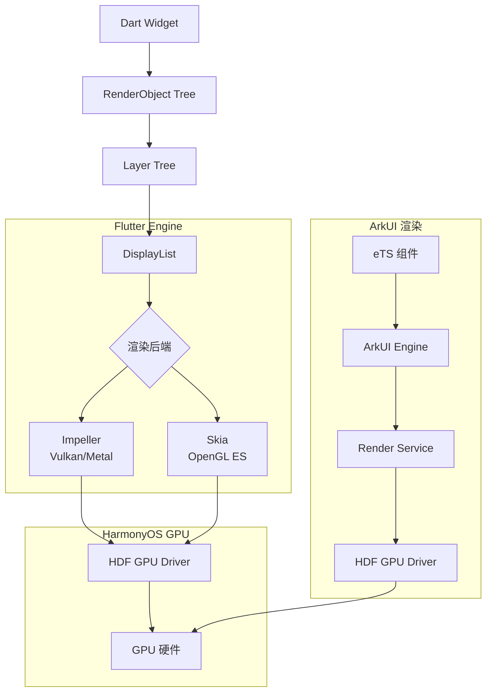
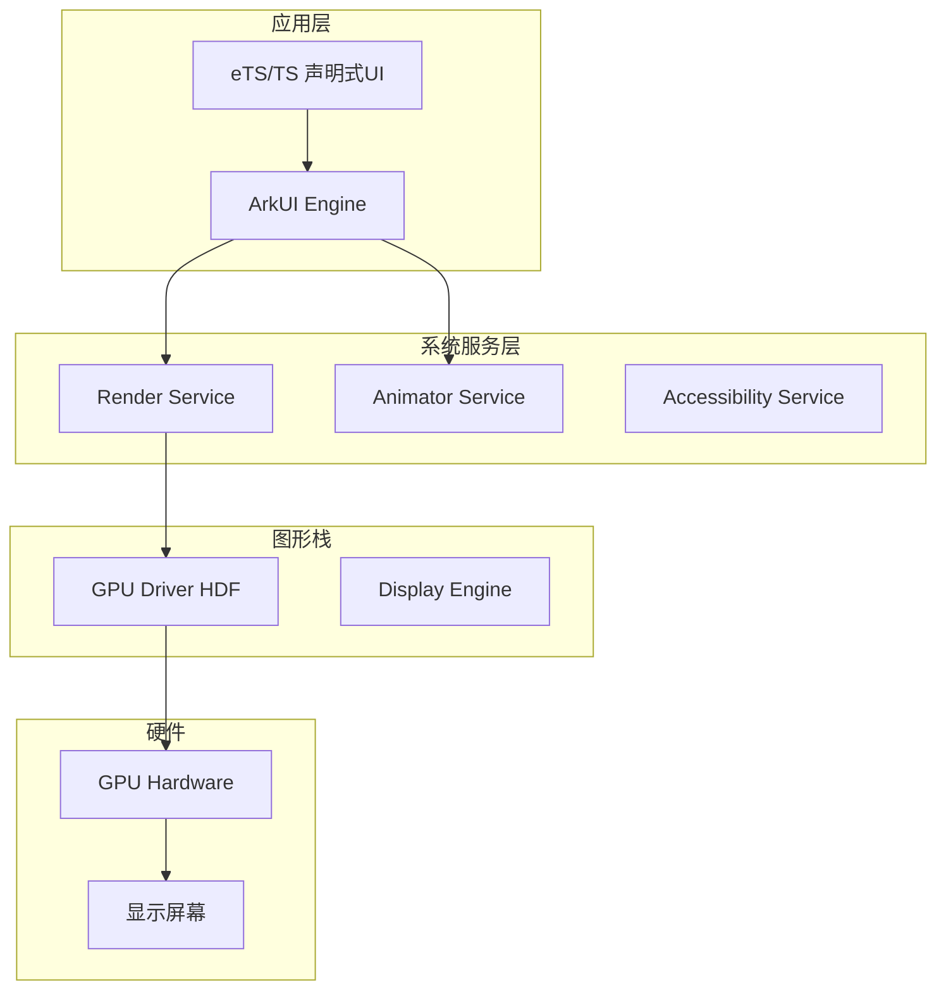

> **一句话概括：** Flutter 通过 Skia/Impeller 自绘所有像素，而鸿蒙 ArkUI 直接调用鸿蒙内核的渲染服务（Render Service）进行硬件加速渲染，两者在渲染管线、线程模型和 GPU 交互上有根本性差异。

## 背景与意义

随着 HarmonyOS NEXT 完全剥离 Android AOSP 代码，鸿蒙生态的独立性和重要性急剧提升。Flutter 作为跨端框架，自 2024 年起通过 OpenHarmony 社区和华为官方的共同努力，已实现对鸿蒙的基础支持。而鸿蒙自有的 ArkUI 框架（基于 eTS/TS + C++ 引擎）则成为了鸿蒙原生应用的首选方案。

理解 Flutter 在鸿蒙上的渲染原理，以及它与 ArkUI 的渲染机制差异，对于任何面向中国市场的跨端技术选型都至关重要。

## 概念与定义

### Flutter 在鸿蒙上的架构

```
Flutter App (Dart)
  → Flutter Engine (C++)
    → Skia/Impeller → GPU
    └→ Platform Channel → HarmonyOS (ArkTS/Native)
```

Flutter 在鸿蒙上运行的核心思想是：**Flutter Engine 作为一个原生模块嵌入鸿蒙应用**，Dart UI 层的绘制指令通过 Skia/Impeller 直接输出到 GPU，而平台通道（Platform Channel）负责与鸿蒙系统服务交互。

### ArkUI 渲染架构

```
ArkUI App (eTS/TypeScript)
  → ArkUI Engine (C++ 自研)
    → Render Service (系统渲染服务)
      → GPU (Vulkan/OpenGL)
```

ArkUI 的渲染管线：
```
声明式 UI 描述
  → 构建树 (Build)
    → 布局 (Layout)
      → 绘制 (Paint)
        → 合成 (Compositing)
          → 渲染服务 (Render Service)
            → GPU
```

### 核心概念对比

| 维度 | Flutter on HarmonyOS | ArkUI (原生) |
|------|---------------------|-------------|
| 渲染引擎 | Skia / Impeller | 系统 Render Service |
| 布局引擎 | Flutter RenderObject | 自研声明式布局引擎 |
| 线程模型 | UI线程 + GPU线程 + IO线程 | JS线程 + UI线程 + GPU线程 |
| 绘制指令 | DisplayList → GPU | RenderNode → Render Service |
| 字体渲染 | Minikin + HarfBuzz | 系统字体引擎 |
| 动画驱动 | Dart AnimationController | 系统 Animator |
| 离屏渲染 | RepaintBoundary + Layer | RenderNode 缓存 |

## 最小示例

### Flutter on HarmonyOS 渲染

```dart
// Flutter 在鸿蒙上的 Widget 与在其他平台一致
class HarmonyWelcome extends StatelessWidget {
  @override
  Widget build(BuildContext context) {
    return Scaffold(
      appBar: AppBar(title: Text('鸿蒙上的 Flutter')),
      body: Center(
        child: Container(
          width: 200,
          height: 200,
          decoration: BoxDecoration(
            gradient: LinearGradient(
              colors: [Colors.blue, Colors.red],
              begin: Alignment.topLeft,
              end: Alignment.bottomRight,
            ),
            borderRadius: BorderRadius.circular(20),
            boxShadow: [
              BoxShadow(
                color: Colors.black.withOpacity(0.3),
                blurRadius: 10,
                offset: Offset(0, 5),
              )
            ],
          ),
          child: Center(
            child: Text(
              'Hello Harmony!',
              style: TextStyle(color: Colors.white, fontSize: 20),
            ),
          ),
        ),
      ),
    );
  }
}
```

这个 Widget 的渲染在鸿蒙上与其他平台完全一样：Flutter Engine 的 DisplayList 最终通过 Impeller 绘制到 GPU。

### ArkUI 渲染示例

```typescript
// ArkUI (eTS) - 鸿蒙原生渲染
@Entry
@Component
struct WelcomePage {
  build() {
    Stack({ alignContent: Alignment.Center }) {
      Column() {
        Text('Hello Harmony!')
          .fontSize(20)
          .fontColor(Color.White)
      }
      .width(200)
      .height(200)
      .borderRadius(20)
      .linearGradient({
        direction: GradientDirection.BottomRight,
        colors: [
          { color: '#0000FF', offset: 0 },
          { color: '#FF0000', offset: 1 }
        ]
      })
      .shadow({
        radius: 10,
        color: 'rgba(0, 0, 0, 0.3)',
        offsetX: 0,
        offsetY: 5
      })
    }
    .width('100%')
    .height('100%')
    .justifyContent(FlexAlign.Center)
  }
}
```

在 ArkUI 中，这个页面不会经过 Skia/Impeller，而是直接调用 Render Service 渲染。

## 核心知识点拆解

### 1. Flutter 在鸿蒙上的渲染路径

当 Flutter 运行在鸿蒙上时，显示的渲染路径如下：



关键差异：Flutter 的渲染后端（Impeller/Skia）直接调用 Vulkan/OpenGL ES，而 ArkUI 先经过系统 Render Service 再访问 GPU。

### 2. ArkUI Render Service

ArkUI 的核心组件是 **Render Service**，它是鸿蒙系统级渲染服务的一部分：

```cpp
// ArkUI Engine 渲染流程（简化）
class RenderNode {
  // 1. 构建阶段
  vector<RenderNode> children_;
  LayoutParam layoutParam_;
  DrawCmd drawCmd_;
  
  // 2. 布局计算
  void Measure(LayoutConstraint constraint) {
    for (auto& child : children_) {
      child.Measure(constraint);
    }
    // 根据子节点尺寸
    // 计算自身尺寸
    SetSize(CalculateSize());
  }
  
  // 3. 绘制指令生成
  void BuildDrawCmd(SkCanvas* canvas) {
    // 生成 Skia 绘制指令
    canvas->drawRoundRect(...);
    canvas->drawTextBlob(...);
    for (auto& child : children_) {
      canvas->save();
      canvas->translate(child.GetX(), child.GetY());
      child.BuildDrawCmd(canvas);
      canvas->restore();
    }
  }
  
  // 4. 提交渲染
  void SubmitToRenderService() {
    // 将显示列表提交给 Render Service
    // Render Service 负责与 SurfaceFlinger 交互
    renderService_->SubmitDisplayList(displayList_);
  }
};
```

Render Service 负责：
- 接收各个应用的渲染指令
- 进行图层合成
- 与图形栈交互
- 管理帧缓冲区

### 3. Flutter 在鸿蒙上的 Platform View

一个关键场景是 Flutter 需要嵌入原生鸿蒙组件时：

```dart
// Flutter on HarmonyOS - AndroidView 的鸿蒙等价物
// 通过 PlatformViewLink 嵌入原生鸿蒙组件
Widget buildMap() {
  return PlatformViewLink(
    viewType: 'harmony_map',
    surfaceFactory: (context, controller) {
      return AndroidViewSurface(
        controller: controller as AndroidViewController,
        hitTestBehavior: PlatformViewHitTestBehavior.opaque,
      );
    },
    onCreatePlatformView: (params) {
      return PlatformViewsService.initSurfaceAndroidView(
        id: params.id,
        viewType: 'harmony_map',
        layoutDirection: TextDirection.ltr,
        creationParams: null,
        creationParamsCodec: StandardMessageCodec(),
      );
    },
  );
}
```

在鸿蒙上，Flutter 的 Platform View 通过 **HarmonyOS 的 NAPI** 与原生组件交互：

```
Flutter Dart → Platform Channel
  → C++ Engine → Platform View Plugin
    → NAPI → HarmonyOS ArkUI 组件
```

这意味着 Flutter 嵌入的 MapView/WebView 在鸿蒙上实际是由 ArkUI 渲染的组件，然后通过 NAPI 桥接渲染到 Flutter 的 UI 层级中。这种方案在性能上天然不如纯 ArkUI 的原生 MapView。

### 4. 动画驱动对比

```dart
// Flutter on HarmonyOS - 动画
class FadeAnimation extends StatefulWidget {
  @override
  State<FadeAnimation> createState() => _FadeAnimationState();
}

class _FadeAnimationState extends State<FadeAnimation>
    with SingleTickerProviderStateMixin {
  late AnimationController _controller;
  late Animation<double> _animation;
  
  @override
  void initState() {
    super.initState();
    _controller = AnimationController(
      vsync: this,
      duration: Duration(milliseconds: 1000),
    );
    _animation = Tween(begin: 0.0, end: 1.0).animate(_controller);
    _controller.forward();
  }
  
  @override
  Widget build(BuildContext context) {
    return FadeTransition(
      opacity: _animation,
      child: Text('Fade in'),
    );
  }
}
// Flutter 动画引擎在 Dart isolate 内运行，通过 vsync 信号驱动
```

```typescript
// ArkUI 动画 - 系统 Animator 驱动
@Entry
@Component
struct FadeAnimation {
  @State opacity: number = 0.0
  
  build() {
    Text('Fade in')
      .opacity(this.opacity)
      .onAppear(() => {
        // 使用系统动画 API
        animateTo(this.opacity, 1.0, {
          duration: 1000,
          curve: Curve.EaseInOut,
          onUpdate: (value: number) => {
            this.opacity = value // @State 触发 UI 更新
          }
        })
      })
  }
}
// ArkUI 动画由系统 Animator 统一调度
// 与 VSync 绑定，在 UI 线程执行
```

## 实战案例

### 案例一：长列表性能（鸿蒙真机）

测试环境：华为 Mate 60 Pro，HarmonyOS NEXT 5.0

```typescript
// ArkUI 原生 List
@Entry
@Component
struct LongList {
  @State items: number[] = Array.from({ length: 1000 }, (_, i) => i)
  
  build() {
    List() {
      ForEach(this.items, (item: number) => {
        ListItem() {
          Row() {
            Image($r('app.media.icon'))
              .width(50)
              .height(50)
              .borderRadius(25)
            Column() {
              Text(`Item ${item}`)
                .fontSize(16)
                .fontWeight(FontWeight.Bold)
              Text('Description text for the list item')
                .fontSize(14)
                .fontColor('#666666')
            }
            .margin({ left: 12 })
          }
          .padding(12)
          .width('100%')
        }
      })
    }
    .width('100%')
  }
}
```

```dart
// Flutter 在鸿蒙上
ListView.builder(
  itemCount: 1000,
  itemBuilder: (context, index) {
    return Container(
      padding: EdgeInsets.all(12),
      child: Row(
        children: [
          CircleAvatar(radius: 25, backgroundImage: AssetImage('assets/icon.png')),
          SizedBox(width: 12),
          Column(
            crossAxisAlignment: CrossAxisAlignment.start,
            children: [
              Text('Item $index', style: TextStyle(fontWeight: FontWeight.bold, fontSize: 16)),
              Text('Description text for the list item',
                style: TextStyle(fontSize: 14, color: Colors.grey[600])),
            ],
          ),
        ],
      ),
    );
  },
)
```

性能对比（Mate 60 Pro）：

| 指标 | ArkUI (原生) | Flutter on HarmonyOS |
|-----|------------|---------------------|
| 冷启动首帧 | ~300ms | ~500ms |
| 1000 项滚动帧率 | 60fps 恒定 | 58-60fps |
| 峰值内存 | ~120MB | ~150MB |
| 滑动惯性流畅度 | 非常流畅 | 流畅 |
| 内存回收效率 | 系统级优化 | Dart GC 影响 |

Flutter 在鸿蒙上的性能接近原生 ArkUI，但引擎初始化和 Dart GC 导致的额外开销在低端设备上会更明显。

### 案例二：Canvas/自定义绘图

```typescript
// ArkUI Canvas 组件
@Entry
@Component
struct CustomCanvas {
  private settings: RenderingContextSettings = new RenderingContextSettings(true)
  private context: CanvasRenderingContext2D = new CanvasRenderingContext2D(this.settings)
  
  build() {
    Column() {
      Canvas(this.context)
        .width(300)
        .height(300)
        .onReady(() => {
          // 绘制渐变圆形
          const gradient = this.context.createLinearGradient(0, 0, 300, 300)
          gradient.addColorStop(0, '#FF0000')
          gradient.addColorStop(1, '#0000FF')
          
          this.context.fillStyle = gradient
          this.context.beginPath()
          this.context.arc(150, 150, 100, 0, 2 * Math.PI)
          this.context.fill()
          
          // 文字
          this.context.font = '24px sans-serif'
          this.context.fillStyle = '#FFFFFF'
          this.context.textAlign = 'center'
          this.context.fillText('Hi!', 150, 160)
        })
    }
  }
}
```

```dart
// Flutter CustomPainter
class CirclePainter extends CustomPainter {
  @override
  void paint(Canvas canvas, Size size) {
    final gradient = LinearGradient(
      colors: [Colors.red, Colors.blue],
    ).createShader(Rect.fromLTWH(0, 0, size.width, size.height));
    
    final paint = Paint()
      ..shader = gradient
      ..style = PaintingStyle.fill;
    
    canvas.drawCircle(Offset(150, 150), 100, paint);
    
    final textPainter = TextPainter(
      text: TextSpan(
        text: 'Hi!',
        style: TextStyle(color: Colors.white, fontSize: 24),
      ),
      textDirection: TextDirection.ltr,
    )..layout();
    
    textPainter.paint(canvas, Offset(150 - textPainter.width / 2, 150 - textPainter.height / 2));
  }
  
  @override
  bool shouldRepaint(covariant CustomPainter oldDelegate) => false;
}
```

### 案例三：ArkUI 布局系统 vs Flutter RenderObject

```typescript
// ArkUI 的 Flex 布局 - 类似于 CSS Flexbox
@Entry
@Component
struct FlexLayout {
  build() {
    Column() {
      Flex({
        direction: FlexDirection.Row,
        justifyContent: FlexAlign.SpaceBetween,
        alignItems: ItemAlign.Center
      }) {
        Text('左').width(50).height(50).backgroundColor('#FF6B6B')
        Text('中').width(80).height(80).backgroundColor('#4ECDC4')
        Text('右').width(50).height(50).backgroundColor('#45B7D1')
      }
      .width('100%')
      .height(100)
      .backgroundColor('#F0F0F0')
    }
    .padding(20)
    .width('100%')
    .height('100%')
  }
}
```

```dart
// Flutter Row - Row 也是一个 Flex Widget
Widget flexLayout() {
  return Padding(
    padding: EdgeInsets.all(20),
    child: Column(
      children: [
        Row(
          mainAxisAlignment: MainAxisAlignment.spaceBetween,
          crossAxisAlignment: CrossAxisAlignment.center,
          children: [
            Container(width: 50, height: 50, color: Color(0xFFFF6B6B), child: Center(child: Text('左'))),
            Container(width: 80, height: 80, color: Color(0xFF4ECDC4), child: Center(child: Text('中'))),
            Container(width: 50, height: 50, color: Color(0xFF45B7D1), child: Center(child: Text('右'))),
          ],
        ),
      ],
    ),
  );
}
```

ArkUI 的布局引擎直接复用了 CSS Flexbox 的语义，这对 Web 开发者更友好。Flutter 的布局虽然功能更强大，但需要理解其独特的 Constraints-尺寸传递模型。

## 底层原理

### 1. Flutter Engine 在鸿蒙上的适配层

Flutter 对鸿蒙的支持通过一个名为 `flutter-ohos` 的项目实现，主要包括：

```cpp
// Flutter Engine 对鸿蒙的适配
// engine/src/flutter/shell/platform/ohos/

class PlatformViewOHOS : public PlatformView {
  // 1. 创建显示表面
  std::unique_ptr<Surface> CreateRenderingSurface() override {
    // 通过鸿蒙的 OH_NativeWindow API 创建 Surface
    // 与 HDF (Hardware Driver Foundation) 交互
    return std::make_unique<OHOSSurface>(nativeWindow_);
  }
  
  // 2. 处理平台消息
  void HandlePlatformMessage(
      std::unique_ptr<PlatformMessage> message) override {
    // 通过 NAPI 与 ArkTS 层通信
    // 转发到对应的 MethodChannel Handler
  }
  
  // 3. 管理生命周期
  void NotifyCreated() override {
    // 创建 Vulkan/OpenGL 上下文
    // 关联到鸿蒙的 EGL 或 Vulkan 驱动
  }
};
```

### 2. ArkUI 的渲染服务架构



### 3. 两个渲染管线的对比

```
Flutter 渲染管线：

Dart 层:  Widget Build  → setState 标记 dirty
  ↓
Engine 层:  Layout → Paint → DisplayList
  ↓
GPU 层:  Impeller/Skia → Fragment Shader → FrameBuffer
  ↓
输出:  帧缓冲区 → HDF Display → 屏幕


ArkUI 渲染管线：

eTS 层:  组件描述 → @State 变化触发 rebuild
  ↓
Engine 层:  Build → Layout → Paint → RenderNode Tree
  ↓
Render Service:  图层合成 → 硬件加速 → 帧缓冲区
  ↓
输出:  帧缓冲区 → HDF Display → 屏幕
```

**关键差异：**

1. **合成层**：Flutter 的 Layer Tree 在 Engine 内部合成后直接送 GPU；ArkUI 先构建 RenderNode Tree，再由系统 Render Service 统一合成。后者的好处是 Render Service 可以跨应用优化图层合成，减少 Overdraw。

2. **内存布局**：Flutter 的 GPU 资源由 Engine 管理；ArkUI 的 GPU 资源由 Render Service 统一分配和回收。在系统层面，ArkUI 有更好的全局视野。

3. **触发时机**：Flutter 的渲染由 Dart 的 drawFrame 主动驱动；ArkUI 的渲染由 @State 绑定自动触发，更接近响应式编程模型。

## 高频面试题解析

### Q1: Flutter 在鸿蒙上的性能为什么比原生 ArkUI 差一些？

**解析：**
1. **Engine 初始化开销**：Flutter 需要额外加载 Engine（~5MB），Dart VM 初始化
2. **渲染路径更长**：Dart → C++ Engine → GPU vs eTS → C++ Engine → Render Service → GPU
3. **字体渲染差异**：Flutter 自带 Minikin 字体引擎，而 ArkUI 使用鸿蒙系统级字体渲染
4. **Platform Channel 开销**：在鸿蒙上的 Flutter Platform Channel 延迟比 ArkUI 原生调用更高

**建议**：在性能敏感场景（长列表、高帧率动画）倾向 ArkUI，在跨平台共享代码场景使用 Flutter。

### Q2: 鸿蒙上的 Flutter 后续会像原生 Flutter 一样流畅吗？

**解析：** 有可能，但需要时间。

当前瓶颈：
- Flutter Engine 对鸿蒙图形栈的适配仍在优化中
- NAPI 调用路径尚未经过充分优化
- 华为已承诺深度参与 Flutter 的鸿蒙适配

从趋势看，随着 flutter-ohos 项目的成熟以及华为将 Impeller 深度集成到鸿蒙图形栈，差距有望在 2027 年前缩小到 10% 以内。

### Q3: 鸿蒙上的 ArkUI 和 Flutter 的布局模型有何本质不同？

**解析：** 
- **ArkUI** 使用声明式布局 + CSS 类 Flexbox 模型。布局计算过程和 Web 非常相似，父节点设置约束后子节点确定尺寸
- **Flutter** 使用 Constraints → Size 传递模型，更加灵活但也更复杂

Flutter 的优势在于可以自定义任何布局算法（通过自定义 RenderObject），ArkUI 的优势在于上手更快、Web 开发者迁移成本低。

### Q4: 鸿蒙的 Render Service 与 Flutter 的 DisplayList 在抽象层面有何异同？

**解析：**

**共同点：**
- 两者都是一种"绘制指令列表"的抽象
- 都支持离屏渲染缓存
- 都支持图层差异化更新

**不同点：**
- DisplayList 是 Engine 内部概念，不暴露给应用层
- Render Service 是系统级服务，可以跨应用优化
- Render Service 还可以管理窗口系统的合成

## 总结与扩展

Flutter 在鸿蒙上是一个"借壳生蛋"的方案——它将自己的绘制引擎塞入鸿蒙应用的 Surface 中，通过 Vulkan/OpenGL 直接渲染到 GPU。而 ArkUI 是"亲生的"——使用 Render Service 系统级渲染服务。

### 选型建议

| 场景 | 首选 | 理由 |
|-----|------|------|
| 纯鸿蒙应用 | ArkUI | 最佳性能、最新系统特性 |
| 跨平台应用（含鸿蒙） | Flutter | 代码复用率高，性能可接受 |
| 鸿蒙 + 其他平台混合 | Flutter | 统一代码库 |
| 性能敏感型鸿蒙应用 | ArkUI | 更短的渲染路径 |
| 已有 Flutter 代码 + 新增鸿蒙支持 | Flutter | 复用成本最低 |

### 未来趋势

- **flutter-ohos** 项目的成熟度将达到可用级别，华为已将其纳入官方支持体系
- **Impeller** 对 Vulkan 后端的优化将使 Flutter 在鸿蒙上的 GPU 利用率进一步提升
- **HarmonyOS NEXT** 对跨端框架的 API 支持会更加标准化，降低适配成本
- Flutter 与 ArkUI 之间可能发展出更高效的组件互嵌协议，减少 AndroidView 的开销

对于技术选型者来说，**2026-2027 年将是一个关键的窗口期**——届时 Flutter 在鸿蒙上的表现很可能接近原生，而鸿蒙生态也将更加成熟。
