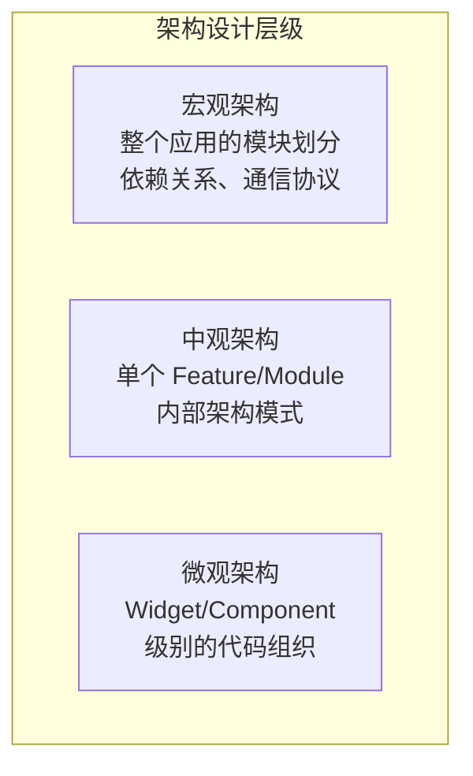
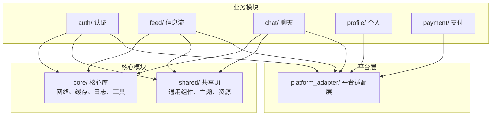
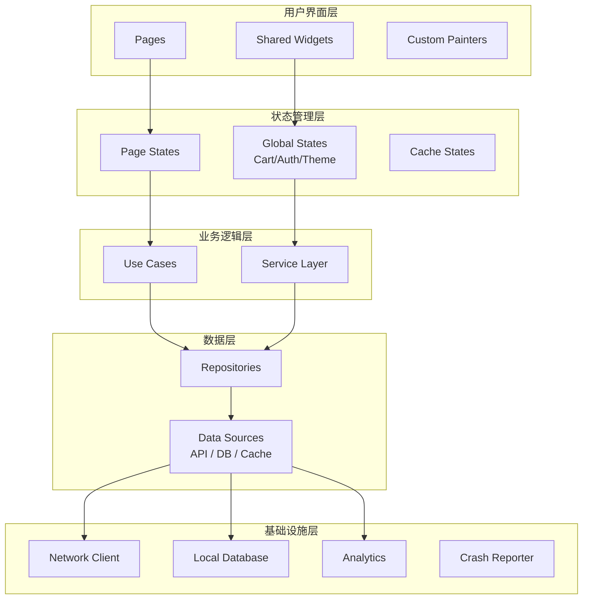
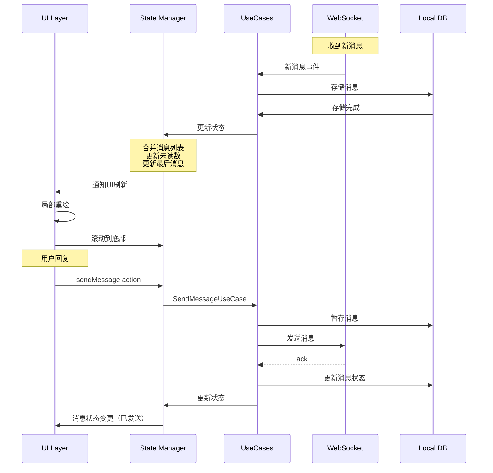
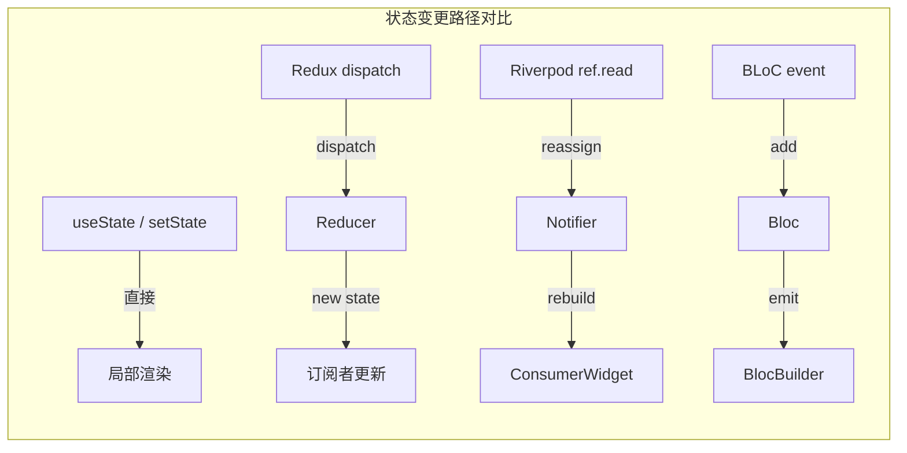

> **一句话概括：** 跨端架构设计不仅要解决"UI 怎么跨平台"的技术问题，更要处理好状态管理、分层解耦、模块化和平台适配四大核心挑战——复用最多的不是代码，而是架构思想。

## 背景与意义

当一个团队决定使用跨端框架（RN / Flutter / ArkUI）时，第一个面临的技术问题通常是"代码该怎么组织？"——这不仅是目录结构的问题，更是架构模式的选择。

跨端应用面临着比纯原生应用更复杂的架构挑战：
1. **多平台适配**：同一套代码需要适配不同平台的行为差异
2. **状态管理**：JS/Dart 层的状态如何高效同步到 UI
3. **分层解耦**：业务逻辑、数据访问、UI 表达如何清晰分离
4. **模块化**：跨端模块如何设计才能被多个平台复用

本文系统梳理跨端架构设计的核心模式，覆盖从经典 MVVM 到现代 Clean Architecture 的演变，给出可落地的代码示例和设计决策框架。

## 概念与定义

### 架构模式的层次



### 五大核心架构模式

| 模式 | 核心思想 | 代表库 | 适用场景 |
|------|---------|--------|---------|
| **MVC** | Model-View-Controller 分离 | Flutter 默认 | 简单页面 |
| **MVVM** | 数据绑定驱动 UI 更新 | Provider/Riverpod | 多数业务场景 |
| **Redux/Unidirectional** | 单向数据流 + 不可变状态 | Redux Toolkit/flutter_bloc | 复杂状态管理 |
| **Clean Architecture** | 严格分层 + 依赖倒置 | 自建 | 大型项目 |
| **Feature-based** | 按功能分包而非类型 | 自建 | 中大型项目 |

### 关键概念

- **状态管理**：State management，跨端架构的核心挑战——state 变化如何高效触达 UI
- **依赖注入**：Dependency Injection，层与层之间如何解耦
- **不可变性**：Immutability，状态更新的可预测性保障
- **副作用**：Side Effect，网络请求、数据库操作等纯函数之外的操作

## 最小示例

### 一个最简单的跨端状态管理

```javascript
// RN - 使用 Redux Toolkit
import { createSlice, configureStore } from '@reduxjs/toolkit';

// 1. 创建状态切片
const counterSlice = createSlice({
  name: 'counter',
  initialState: { value: 0 },
  reducers: {
    increment: (state) => { state.value += 1; },
    decrement: (state) => { state.value -= 1; },
    incrementByAmount: (state, action) => {
      state.value += action.payload;
    },
  },
});

export const { increment, decrement, incrementByAmount } = counterSlice.actions;

// 2. 创建 Store
const store = configureStore({
  reducer: { counter: counterSlice.reducer },
});

// 3. 在组件中使用
function Counter() {
  const count = useSelector((state) => state.counter.value);
  const dispatch = useDispatch();
  
  return (
    <View>
      <Text>{count}</Text>
      <Button title="+" onPress={() => dispatch(increment())} />
      <Button title="-" onPress={() => dispatch(decrement())} />
    </View>
  );
}
```

```dart
// Flutter - 使用 Riverpod
import 'package:flutter_riverpod/flutter_riverpod.dart';

// 1. 创建 Provider
final counterProvider = StateNotifierProvider<CounterNotifier, int>((ref) {
  return CounterNotifier();
});

class CounterNotifier extends StateNotifier<int> {
  CounterNotifier() : super(0);
  
  void increment() => state++;
  void decrement() => state--;
  void incrementBy(int amount) => state += amount;
}

// 2. 在组件中使用
class Counter extends ConsumerWidget {
  @override
  Widget build(BuildContext context, WidgetRef ref) {
    final count = ref.watch(counterProvider);
    
    return Column(
      children: [
        Text('$count'),
        ElevatedButton(
          onPressed: () => ref.read(counterProvider.notifier).increment(),
          child: Text('+'),
        ),
        ElevatedButton(
          onPressed: () => ref.read(counterProvider.notifier).decrement(),
          child: Text('-'),
        ),
      ],
    );
  }
}
```

```typescript
// ArkUI - @State + @Provide/@Consume
@Entry
@Component
struct CounterPage {
  @Provide('count') count: number = 0
  
  build() {
    Column() {
      CountDisplay()
      Row() {
        Button('+').onClick(() => this.count++)
        Button('-').onClick(() => this.count--)
      }
    }
  }
}

@Component
struct CountDisplay {
  @Consume('count') count: number
  
  build() {
    Text(`Count: ${this.count}`)
      .fontSize(24)
  }
}
```

## 核心知识点拆解

### 1. Clean Architecture 在跨端中的实践

Clean Architecture 是 Robert C. Martin 提出的分层架构思想，其核心在跨端应用中表现为：

```
┌──────────────────────────────────────────────┐
│                 Presentation                  │
│  (Widgets/Components + State Management)     │
├──────────────────────────────────────────────┤
│                   Domain                      │
│  (Entities + UseCases + Repository Interfaces)│
├──────────────────────────────────────────────┤
│                   Data                        │
│  (Repository Implementations + DataSources)  │
└──────────────────────────────────────────────┘
```

**依赖规则：** 外层可以依赖内层，内层绝不能依赖外层。

```dart
// Flutter Clean Architecture 示例

// ===== Domain Layer =====
// Entity - 纯业务对象
class User {
  final String id;
  final String name;
  final String email;
  
  User({required this.id, required this.name, required this.email});
}

// UseCase - 业务用例
class GetUserProfile {
  final UserRepository repository;
  
  GetUserProfile(this.repository);
  
  Future<User> execute(String userId) async {
    return repository.getUser(userId);
  }
}

// Repository Interface - 依赖倒置
abstract class UserRepository {
  Future<User> getUser(String userId);
  Future<void> updateUser(User user);
}

// ===== Data Layer =====
class UserRepositoryImpl implements UserRepository {
  final UserLocalDataSource localDataSource;
  final UserRemoteDataSource remoteDataSource;
  
  UserRepositoryImpl({
    required this.localDataSource,
    required this.remoteDataSource,
  });
  
  @override
  Future<User> getUser(String userId) async {
    try {
      // 先尝试网络获取
      final user = await remoteDataSource.getUser(userId);
      // 缓存到本地
      await localDataSource.cacheUser(user);
      return user;
    } catch (e) {
      // 网络失败回退本地
      return localDataSource.getUser(userId);
    }
  }
  
  @override
  Future<void> updateUser(User user) async {
    await remoteDataSource.updateUser(user);
    await localDataSource.cacheUser(user);
  }
}

// ===== Presentation Layer =====
final userProfileProvider = FutureProvider.family<User, String>((ref, userId) {
  final useCase = ref.read(getUserProfileProvider);
  return useCase.execute(userId);
});
```

```javascript
// RN Clean Architecture 等效实现
// Domain
class User {
  constructor(id, name, email) {
    this.id = id;
    this.name = name;
    this.email = email;
    Object.freeze(this); // 不可变
  }
}

class GetUserProfile {
  constructor(repository) {
    this.repository = repository;
  }
  
  async execute(userId) {
    return this.repository.getUser(userId);
  }
}

// Data
class UserRepositoryImpl {
  constructor(localDataSource, remoteDataSource) {
    this.local = localDataSource;
    this.remote = remoteDataSource;
  }
  
  async getUser(userId) {
    try {
      const user = await this.remote.getUser(userId);
      await this.local.cacheUser(user);
      return user;
    } catch (e) {
      return this.local.getUser(userId);
    }
  }
}

// Presentation
const useUserProfile = (userId) => {
  const [user, setUser] = useState(null);
  const [loading, setLoading] = useState(true);
  
  useEffect(() => {
    const useCase = new GetUserProfile(
      new UserRepositoryImpl(localDS, remoteDS)
    );
    
    useCase.execute(userId)
      .then(setUser)
      .finally(() => setLoading(false));
  }, [userId]);
  
  return { user, loading };
};
```

### 2. 模块化设计

跨端应用的模块化需要考虑跨平台复用性：



```dart
// Flutter 模块化目录结构示例
lib/
├── core/
│   ├── network/
│   │   ├── api_client.dart
│   │   ├── interceptors/
│   │   └── error_handler.dart
│   ├── cache/
│   │   ├── local_storage.dart
│   │   └── secure_storage.dart
│   ├── di/
│   │   └── injection_container.dart
│   └── utils/
│       ├── validators.dart
│       └── date_helpers.dart
│
├── shared/
│   ├── theme/
│   │   ├── app_theme.dart
│   │   └── app_colors.dart
│   ├── widgets/
│   │   ├── app_button.dart
│   │   ├── app_text_field.dart
│   │   └── loading_overlay.dart
│   └── extensions/
│       ├── context_extensions.dart
│       └── string_extensions.dart
│
├── features/
│   ├── auth/
│   │   ├── data/
│   │   │   ├── datasources/
│   │   │   ├── models/
│   │   │   └── repositories/
│   │   ├── domain/
│   │   │   ├── entities/
│   │   │   ├── usecases/
│   │   │   └── repositories/
│   │   └── presentation/
│   │       ├── providers/
│   │       ├── pages/
│   │       └── widgets/
│   │
│   ├── feed/
│   │   ├── data/
│   │   ├── domain/
│   │   └── presentation/
│   │
│   └── chat/
│       ├── data/
│       ├── domain/
│       └── presentation/
│
└── platform_adapter/
    ├── platform_info.dart
    ├── platform_permissions.dart
    └── platform_navigation_bar.dart
```

### 3. 平台适配模式

跨端架构中，平台适配是一个绕不开的问题。平台适配模式有几种常见的设计：

#### 策略模式适配

```dart
// Flutter - 平台适配策略模式
abstract class StatusBarStyle {
  void setStyle(Brightness brightness);
}

class iOSStatusBar extends StatusBarStyle {
  @override
  void setStyle(Brightness brightness) {
    // iOS 特定的状态栏样式设置
    SystemChrome.setSystemUIOverlayStyle(
      SystemUiOverlayStyle(
        statusBarBrightness: brightness,
        statusBarIconBrightness: brightness,
      ),
    );
  }
}

class AndroidStatusBar extends StatusBarStyle {
  @override
  void setStyle(Brightness brightness) {
    // Android 特定的状态栏样式设置
    SystemChrome.setSystemUIOverlayStyle(
      SystemUiOverlayStyle(
        statusBarIconBrightness: brightness,
      ),
    );
  }
}

class HarmonyStatusBar extends StatusBarStyle {
  @override
  void setStyle(Brightness brightness) {
    // 鸿蒙特定的状态栏样式设置
  }
}

// 工厂选择
StatusBarStyle getStatusBarStyle() {
  if (Platform.isIOS) return iOSStatusBar();
  if (Platform.isAndroid) return AndroidStatusBar();
  return HarmonyStatusBar();
}
```

```javascript
// RN - 平台适配策略模式
// react-native.config.js
import { Platform } from 'react-native';

const StatusBarAdapter = {
  setStyle: Platform.select({
    ios: (brightness) => {
      StatusBar.setBarStyle(brightness === 'dark' ? 'light-content' : 'dark-content');
    },
    android: (brightness) => {
      StatusBar.setBackgroundColor(brightness === 'dark' ? '#000' : '#fff');
      StatusBar.setBarStyle(brightness === 'dark' ? 'light-content' : 'dark-content');
    },
    default: (brightness) => {
      StatusBar.setBarStyle(brightness === 'dark' ? 'light-content' : 'dark-content');
    },
  }),
};
```

### 4. 状态管理架构对比

| 模式 | RN 代表方案 | Flutter 代表方案 | 复杂度 | 推荐团队规模 |
|-----|-----------|-----------------|-------|------------|
| 简单 setState | useState | StatefulWidget.setState | ⭐ | 1-3 人 |
| 依赖注入 | Context | Provider | ⭐⭐ | 3-8 人 |
| 响应式 | MobX | GetX | ⭐⭐ | 3-10 人 |
| 单向数据流 | Redux Toolkit | BLoC / Riverpod | ⭐⭐⭐ | 5-15 人 |
| 原子化 | Jotai / Recoil | Riverpod + family | ⭐⭐ | 5-10 人 |

```dart
// Flutter - BLoC 模式 (Business Logic Component)
// event
abstract class CounterEvent {}
class Increment extends CounterEvent {}
class Decrement extends CounterEvent {}

// bloc
class CounterBloc extends Bloc<CounterEvent, int> {
  CounterBloc() : super(0) {
    on<Increment>((event, emit) => emit(state + 1));
    on<Decrement>((event, emit) => emit(state - 1));
  }
}

// widget
BlocBuilder<CounterBloc, int>(
  builder: (context, count) {
    return Column(
      children: [
        Text('$count'),
        FloatingActionButton(
          onPressed: () => context.read<CounterBloc>().add(Increment()),
        ),
      ],
    );
  },
);
```

```javascript
// RN - Redux Toolkit 模式
import { createSlice, createAsyncThunk } from '@reduxjs/toolkit';

// 异步 Thunk
export const fetchUser = createAsyncThunk(
  'user/fetch',
  async (userId, { rejectWithValue }) => {
    try {
      const response = await api.getUser(userId);
      return response.data;
    } catch (err) {
      return rejectWithValue(err.response.data);
    }
  }
);

const userSlice = createSlice({
  name: 'user',
  initialState: { data: null, loading: false, error: null },
  reducers: {},
  extraReducers: (builder) => {
    builder
      .addCase(fetchUser.pending, (state) => {
        state.loading = true;
        state.error = null;
      })
      .addCase(fetchUser.fulfilled, (state, action) => {
        state.loading = false;
        state.data = action.payload;
      })
      .addCase(fetchUser.rejected, (state, action) => {
        state.loading = false;
        state.error = action.payload;
      });
  },
});
```

## 实战案例

### 案例一：电商 App 完整架构



```dart
// 电商 App - 产品详情页的数据层设计
// 数据层 - 多数据源合并
class ProductRepositoryImpl implements ProductRepository {
  final ProductRemoteDataSource remote;
  final ProductLocalDataSource local;
  final InventoryRemoteDataSource inventory;
  
  @override
  Future<ProductDetail> getProductDetail(String productId) async {
    // 并行获取多个数据源的数据
    final results = await Future.wait([
      remote.getProduct(productId),
      remote.getProductImages(productId),
      inventory.getStock(productId),
      local.getUserPreference(productId),
    ]);
    
    return ProductDetail(
      product: results[0] as Product,
      images: results[1] as List<ImageAsset>,
      stock: results[2] as StockInfo,
      userPreference: results[3] as UserPreference?,
    );
  }
}
```

### 案例二：即时通讯 App 的状态同步

IM App 是状态管理最复杂的场景之一：



```dart
// Flutter - 使用 Riverpod 管理 IM 状态
final chatProvider = StateNotifierProvider<ChatNotifier, ChatState>((ref) {
  return ChatNotifier(ref.read(messageRepositoryProvider));
});

class ChatState {
  final List<Message> messages;
  final int unreadCount;
  final Map<String, User> onlineUsers;
  final MessageStatus lastSentStatus;
  
  const ChatState({
    this.messages = const [],
    this.unreadCount = 0,
    this.onlineUsers = const {},
    this.lastSentStatus = MessageStatus.idle,
  });
  
  ChatState copyWith({
    List<Message>? messages,
    int? unreadCount,
    Map<String, User>? onlineUsers,
    MessageStatus? lastSentStatus,
  }) {
    return ChatState(
      messages: messages ?? this.messages,
      unreadCount: unreadCount ?? this.unreadCount,
      onlineUsers: onlineUsers ?? this.onlineUsers,
      lastSentStatus: lastSentStatus ?? this.lastSentStatus,
    );
  }
}

class ChatNotifier extends StateNotifier<ChatState> {
  final MessageRepository repository;
  StreamSubscription? _messageSubscription;
  
  ChatNotifier(this.repository) : super(ChatState()) {
    _subscribeToMessages();
  }
  
  void _subscribeToMessages() {
    _messageSubscription = repository
      .watchMessages()
      .listen((messages) {
        state = state.copyWith(messages: messages);
      });
  }
  
  Future<void> sendMessage(String content) async {
    state = state.copyWith(lastSentStatus: MessageStatus.sending);
    try {
      await repository.sendMessage(Message(
        id: Uuid().v4(),
        content: content,
        timestamp: DateTime.now(),
        status: MessageStatus.sent,
      ));
      state = state.copyWith(lastSentStatus: MessageStatus.sent);
    } catch (e) {
      state = state.copyWith(lastSentStatus: MessageStatus.failed);
    }
  }
  
  @override
  void dispose() {
    _messageSubscription?.cancel();
    super.dispose();
  }
}
```

### 案例三：导航与路由架构

```dart
// Flutter - 声明式路由 (GoRouter)
final router = GoRouter(
  initialLocation: '/',
  routes: [
    GoRoute(
      path: '/',
      builder: (context, state) => HomePage(),
    ),
    GoRoute(
      path: '/product/:id',
      builder: (context, state) => ProductPage(
        productId: state.pathParameters['id']!,
      ),
      routes: [
        GoRoute(
          path: 'review',
          builder: (context, state) => ReviewPage(
            productId: state.pathParameters['id']!,
          ),
        ),
      ],
    ),
    ShellRoute(
      builder: (context, state, child) => AppShell(child: child),
      routes: [
        GoRoute(path: '/feed', builder: (ctx, state) => FeedPage()),
        GoRoute(path: '/chat', builder: (ctx, state) => ChatListPage()),
        GoRoute(path: '/profile', builder: (ctx, state) => ProfilePage()),
      ],
    ),
  ],
);
```

```javascript
// RN - React Navigation
const Stack = createNativeStackNavigator();
const Tab = createBottomTabNavigator();

function AppNavigator() {
  return (
    <NavigationContainer>
      <Tab.Navigator>
        <Tab.Screen name="Home" component={HomeStack} />
        <Tab.Screen name="Feed" component={FeedStack} />
        <Tab.Screen name="Chat" component={ChatStack} />
        <Tab.Screen name="Profile" component={ProfileStack} />
      </Tab.Navigator>
    </NavigationContainer>
  );
}

function HomeStack() {
  return (
    <Stack.Navigator>
      <Stack.Screen name="HomeMain" component={HomePage} />
      <Stack.Screen name="Product" component={ProductPage} />
      <Stack.Screen name="Review" component={ReviewPage} />
    </Stack.Navigator>
  );
}
```

## 底层原理

### 跨端架构的核心挑战：状态同步

跨端架构中最根本的技术难题是：**一个状态变更如何高效、可预测地传递到 UI 层？**



这四个路径的性能差异主要体现在：

1. **通知范围**：setState 通知范围最窄（只需重绘 dirty widget），Redux 通知最广（所有 selector 重新评估）
2. **比较成本**：不可变状态比较 (=== / ==) 比 deep compare 快得多
3. **重建粒度**：从整棵子树重建到仅重建已变更节点

### Provider 模式的依赖注入原理

```dart
// Flutter Provider 的核心原理
class Provider<T> extends InheritedWidget {
  final T Function(BuildContext) create;
  final T value;
  
  Provider({
    required this.create,
    required Widget child,
  }) : value = create(null),
       super(child: child);
  
  static T of<T>(BuildContext context, {bool listen = true}) {
    final widget = listen
        ? context.dependOnInheritedWidgetOfExactType<Provider<T>>()
        : context.getInheritedWidgetOfExactType<Provider<T>>();
    
    if (widget == null) {
      throw FlutterError('Provider not found in tree');
    }
    
    return widget.value;
  }
  
  @override
  bool updateShouldNotify(Provider<T> oldWidget) {
    return oldWidget.value != value;
  }
}
```

关键设计：Provider 利用 Flutter 的 InheritedWidget 机制，当 value 变化时自动通知依赖该 Provider 的 Widget 重建。

## 高频面试题解析

### Q1: 跨端项目中，状态管理应该选 Bloc 还是 Riverpod？

**解析：** 这不是"哪个更好"的问题，而是"哪种模式更适合你的团队"。

**选 Bloc 如果：**
- 你偏好明确的 Event → State 转换
- 团队规模大，需要强制的事件流规范
- 你需要可追溯的状态变更日志（每个 Event 都可以记录）
- 项目有复杂的状态机逻辑（如登录流程、支付流程）

**选 Riverpod 如果：**
- 你希望更少的模板代码
- 需要细粒度的依赖管理（有 Provider 的生命周期）
- 需要异步状态的流畅处理（AsyncValue）
- 团队偏好声明式而非事件驱动风格

**性能差异？** 两者性能接近，不是主要考量因素。

### Q2: Clean Architecture 在中小型跨端项目中是否过度设计？

**解析：** 是的，可能过度。

Clean Architecture 的优势在中小型项目中会被它的复杂度抵消。如果你的项目满足以下条件，可以考虑简化：

- 团队 ≤ 5 人
- 项目生命周期 ≤ 1 年
- 业务逻辑不复杂（CRUD 为主）
- 不需要多端复用业务逻辑

**推荐的简化方案：**
```
MVP 阶段：
  pages/     ← 页面组件 + 内联逻辑
  services/  ← 网络/数据库操作
  models/    ← 数据模型

中期演进：
  features/  ← 按功能分包
    feature_a/
      ui/
      state/
      data/

成熟阶段：
  演进到完整的 Clean Architecture
```

### Q3: 怎么在跨端项目中实现"业务逻辑与 UI 框架无关"？

**解析：** 通过"六边形架构"思想，将核心业务逻辑完全独立于框架。

```dart
// 业务逻辑 - 完全与 Flutter/RN 无关
// 这段代码可以在 Dart 或 JS 中实现
abstract class OrderRepository {
  Future<Order> createOrder(Cart cart, ShippingAddress address);
  Future<void> cancelOrder(String orderId);
  Stream<OrderStatus> watchOrderStatus(String orderId);
}

class CheckoutUseCase {
  final OrderRepository orderRepo;
  final PaymentService paymentService;
  
  CheckoutUseCase(this.orderRepo, this.paymentService);
  
  Future<CheckoutResult> execute(CheckoutRequest request) async {
    // 1. 验证库存
    // 2. 扣减库存
    // 3. 处理支付
    // 4. 创建订单
    // 5. 返回结果
    
    // 所有业务逻辑在这里，与 UI 完全无关
    // 可以单元测试，可以移植到其他框架
  }
}
```

**关键原则：** UseCase 和 Entity 中不应该有任何 `import 'package:flutter/...'` 或 `import 'react-native'`。

### Q4: 大型跨端项目如何做模块拆分？

**解析：** 推荐使用"按功能 + 按层级"混合模式。

```
浅层拆分（按类型）：
  components/
  screens/
  services/
  models/
  
  问题：当项目达到 50+ 文件时，不可维护

推荐拆分（按功能 + 层级）：
  features/auth/
  features/home/
  features/product/
  shared/
  core/
  
  每个 feature 内部可以按分层或按类型再组织
```

**模块间通信原则：**
- 模块 A 不能直接访问模块 B 的内部状态
- 模块间通过 Facade 或 Event Bus 通信
- 共享数据通过核心层管理（如 auth token、用户信息）
- 避免循环依赖（使用 lint 规则强制）

## 总结与扩展

跨端架构设计是一个不断演进的过程，没有放之四海而皆准的"最佳实践"。但从大量实践中可以提炼出几条核心原则：

### 架构设计三原则

1. **分离关注点**（Separation of Concerns）：UI 层、业务逻辑层、数据访问层各自独立
2. **依赖倒置**（Dependency Inversion）：高层模块不依赖低层模块，两者都依赖抽象
3. **演化优先**（Evolution over Perfection）：架构要为变化留出空间，不要过早过度设计

### 架构质量评估清单

```
你的跨端应用架构是健康的吗？

✅ 业务逻辑可以独立于 UI 框架进行单元测试
✅ 更换状态管理库不需要重写业务逻辑
✅ 添加一个新页面只需要新增 feature 目录
✅ 一个模块的修改不会无意影响其他模块
✅ 平台适配代码隔离在统一的 adapter 层
✅ 状态变更路径清晰可追踪
✅ 编译器和 IDE 能提供足够多的类型安全保证
✅ 新人加入后 1 周内能理解整体架构
```

如果有一半以上不满足，你的架构可能需要重构了。

### 未来趋势

1. **AI 辅助架构设计**：2026-2028 年，AI 将辅助生成模块划分、依赖关系和接口定义
2. **微前端在跨端中的应用**：跨端微前端将使得不同团队（iOS/Android/Web）共享业务逻辑模块
3. **compile-time 架构检查**：Dart Macros 和 TypeScript 装饰器将支持编译期架构约束验证
4. **声明式依赖管理**：依赖关系将从代码注释中解放出来，变成可执行的可视化图

架构设计的本质不是"选择正确的模式"，而是"理解妥协的艺术"——每个架构决策都有 trade-off，知道自己在牺牲什么，比知道自己在得到什么更重要。
