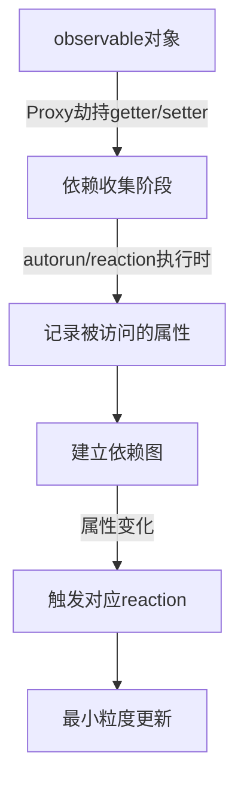

> 在跨端开发中，状态管理是连接多端逻辑一致性的中枢神经——本文深入剖析Redux与MobX在React Native、Flutter Web、小程序等多端场景下的架构适配与工程落地实践。

## 一、背景与意义

跨端开发的终极目标是"一次编写，多处运行"，但现实中，每个平台（iOS、Android、Web、小程序）都有自己独特的状态管理模式：iOS偏向MVC+Delegate，Android倾向ViewModel+LiveData，Web社区则繁荣地发展出Flux、Redux、MobX、Recoil、Zustand等一系列方案。

在一个跨端项目中，如果我们为每个平台分别维护一套状态管理逻辑：
- iOS团队用Combine + ObservableObject
- Android团队用ViewModel + StateFlow
- Web团队用Redux Toolkit
那意味着三倍的Bug修复工作量、三倍的测试成本、以及无法对齐的业务逻辑。

**跨端状态管理的核心挑战**：
- 状态源如何统一？
- 异步副作用如何跨平台一致？
- 平台差异化UI如何从同一状态派生？
- 性能开销在不同端上如何取舍？

本文将带着这些问题，深度对比Redux与MobX在跨端场景下的真实表现。

## 二、概念与定义

### 2.1 Redux：函数式不可变数据流

Redux诞生于2015年，其核心理念来自Elm架构与Flux模式：

```
View → dispatch(Action) → Reducer(纯函数) → new State → View re-render
```

**三大原则**：
1. **单一数据源**：整个应用状态存储在一棵对象树（Store）中
2. **State只读**：唯一改变状态的方式是触发Action
3. **纯函数修改**：Reducer必须是纯函数，接受旧State和Action，返回新State

### 2.2 MobX：响应式可变数据流

MobX脱胎于Meteor的Tracker和Knockout的依赖追踪，核心理念更接近Vue的响应式：

```
State(observable) → Computed(auto-derive) → Reaction(auto-effect)
```

**核心概念**：
- **observable**：可观察的状态值
- **computed**：从状态自动派生的值（惰性求值、缓存）
- **action**：修改状态的函数（可批处理）
- **reaction**：当依赖变化时自动执行的副作用

| 维度 | Redux | MobX |
|------|-------|------|
| 数据流 | 单向显式 | 隐式自动追踪 |
| 风格 | 函数式、不可变 | 面向对象、可变 |
| 心智模型 | dispatch → reducer → subscribe | observable → autorun |
| 样板代码 | 中等（搭配RTK后减少） | 较少 |
| 调试 | Time-travel debugging原生支持 | 相对复杂 |

## 三、最小示例

### 3.1 Redux示例（React Native + Redux Toolkit）

```typescript
// counterSlice.ts
import { createSlice, PayloadAction } from '@reduxjs/toolkit';

interface CounterState {
  value: number;
  history: number[];
}

const initialState: CounterState = {
  value: 0,
  history: [],
};

const counterSlice = createSlice({
  name: 'counter',
  initialState,
  reducers: {
    increment: (state) => {
      state.value += 1;
      state.history.push(state.value);
    },
    decrement: (state) => {
      state.value -= 1;
      state.history.push(state.value);
    },
    incrementByAmount: (state, action: PayloadAction<number>) => {
      state.value += action.payload;
      state.history.push(state.value);
    },
  },
});

export const { increment, decrement, incrementByAmount } = counterSlice.actions;
export default counterSlice.reducer;
```

```typescript
// store.ts
import { configureStore } from '@reduxjs/toolkit';
import counterReducer from './counterSlice';

export const store = configureStore({
  reducer: {
    counter: counterReducer,
  },
  middleware: (getDefaultMiddleware) =>
    getDefaultMiddleware({
      serializableCheck: {
        ignoredActions: ['persist/PERSIST'],
      },
    }),
});

export type RootState = ReturnType<typeof store.getState>;
export type AppDispatch = typeof store.dispatch;
```

```typescript
// CounterComponent.tsx
import React from 'react';
import { View, Text, Button, StyleSheet } from 'react-native';
import { useSelector, useDispatch } from 'react-redux';
import { increment, decrement, incrementByAmount } from './counterSlice';

export const CounterComponent: React.FC = () => {
  const count = useSelector((state: RootState) => state.counter.value);
  const dispatch = useDispatch();

  return (
    <View style={styles.container}>
      <Text style={styles.title}>跨端计数器（Redux）</Text>
      <Text style={styles.count}>{count}</Text>
      <View style={styles.buttons}>
        <Button title="-1" onPress={() => dispatch(decrement())} />
        <Button title="+1" onPress={() => dispatch(increment())} />
        <Button title="+10" onPress={() => dispatch(incrementByAmount(10))} />
      </View>
    </View>
  );
};
```

### 3.2 MobX示例（跨端共享逻辑层）

```typescript
// counterStore.ts
import { makeAutoObservable } from 'mobx';

export class CounterStore {
  value: number = 0;
  history: number[] = [];

  constructor() {
    makeAutoObservable(this);
  }

  get description(): string {
    return `当前值: ${this.value} (共操作 ${this.history.length} 次)`;
  }

  get isPositive(): boolean {
    return this.value >= 0;
  }

  increment = (): void => {
    this.value += 1;
    this.history.push(this.value);
  };

  decrement = (): void => {
    this.value -= 1;
    this.history.push(this.value);
  };

  incrementByAmount = (amount: number): void => {
    this.value += amount;
    this.history.push(this.value);
  };

  reset = (): void => {
    this.value = 0;
    this.history = [];
  };
}

// 共享Store实例
export const counterStore = new CounterStore();
```

```typescript
// counterViewModel.ts — 跨平台共享的ViewModel层
import { counterStore, CounterStore } from './counterStore';
import { autorun, reaction } from 'mobx';

export interface ICounterViewModel {
  value: number;
  description: string;
  isPositive: boolean;
  increment(): void;
  decrement(): void;
  incrementByAmount(amount: number): void;
  reset(): void;
  dispose(): void;
}

// 适配器模式：将MobX store转换为平台无关的ViewModel
export function createCounterViewModel(store: CounterStore = counterStore): ICounterViewModel {
  const disposers: (() => void)[] = [];

  // 记录每次变化
  disposers.push(
    reaction(
      () => store.value,
      (newVal, oldVal) => {
        console.log(`[CounterVM] 值变化: ${oldVal} → ${newVal}`);
      }
    )
  );

  // 当值变为负数时输出警告
  disposers.push(
    autorun(() => {
      if (store.value < 0) {
        console.warn('[CounterVM] 警告：计数器为负值！');
      }
    })
  );

  return {
    get value() { return store.value; },
    get description() { return store.description; },
    get isPositive() { return store.isPositive; },
    increment: store.increment,
    decrement: store.decrement,
    incrementByAmount: store.incrementByAmount,
    reset: store.reset,
    dispose: () => disposers.forEach(d => d()),
  };
}
```

## 四、核心知识点拆解

### 4.1 Redux的核心机制深挖

#### 中间件链 —— 副作用处理的核心

Redux本身只支持同步dispatch，所有异步操作（API请求、定时器、Native回调）都必须通过中间件处理。最流行的方案是**redux-saga**和**redux-thunk**。

```typescript
// redux-thunk示例：异步获取用户数据
export const fetchUserById = (userId: string): AppThunk => async (dispatch, getState) => {
  dispatch(userSlice.actions.setLoading(true));
  try {
    const response = await api.getUser(userId);
    dispatch(userSlice.actions.setUser(response.data));
  } catch (error) {
    dispatch(userSlice.actions.setError(error.message));
  } finally {
    dispatch(userSlice.actions.setLoading(false));
  }
};
```

**中间件的洋葱模型**：
```
dispatch(action) → middleware1 → middleware2 → reducer → middleware2 → middleware1
```

在跨端场景下，这个模型的意义在于：我们可以为不同端注入不同中间件。例如：
- **iOS端**：增加NativeLogger中间件，调用`NativeModules.ReduxLogger.log(action)`
- **小程序端**：增加StoragePersist中间件，自动写入wx.setStorageSync
- **Web端**：增加DevTools中间件，连接Redux DevTools浏览器插件

```typescript
// 跨端中间件注入示例
const getPlatformMiddlewares = (platform: string): Middleware[] => {
  const base = [thunk];
  switch (platform) {
    case 'ios':
    case 'android':
      return [...base, nativeLoggerMiddleware];
    case 'weapp':
      return [...base, weappPersistMiddleware];
    case 'web':
      return [...base, devToolsMiddleware];
    default:
      return base;
  }
};
```

#### Selector与性能优化 —— Reselect的精髓

```typescript
import { createSelector } from '@reduxjs/toolkit';

// 基础selector
const selectTodos = (state: RootState) => state.todos.items;
const selectFilter = (state: RootState) => state.todos.filter;

// 带缓存的派生selector —— 只有依赖变化时重新计算
export const selectFilteredTodos = createSelector(
  [selectTodos, selectFilter],
  (todos, filter) => {
    console.log('[Selector] 重新计算过滤列表');
    switch (filter) {
      case 'completed':
        return todos.filter(t => t.completed);
      case 'active':
        return todos.filter(t => !t.completed);
      default:
        return todos;
    }
  }
);

// 进一步组合
export const selectTodoStats = createSelector(
  [selectTodos],
  (todos) => ({
    total: todos.length,
    completed: todos.filter(t => t.completed).length,
    active: todos.filter(t => !t.completed).length,
    completionRate: todos.length > 0
      ? Math.round((todos.filter(t => t.completed).length / todos.length) * 100)
      : 0,
  })
);
```

**为什么Selector在跨端中重要？**
因为小程序和React Native的渲染开销远比Web大，每次不必要的重新渲染都意味着显著的帧率下降。Selector的缓存机制可以精确控制组件的更新范围。

### 4.2 MobX响应式追踪的细节

MobX的核心是**依赖追踪**，其实现依赖于ES6的Proxy（或装饰器模式后备）：



**MobX的三大优化机制**：

1. **惰性求值**：computed值只在被观察时才计算
2. **事务批处理**：`action`内的多次修改只触发一次reaction
3. **颗粒化订阅**：每个observable属性都有自己的订阅列表，变化不会波及不相关的组件

```typescript
// MobX的事务批处理演示
class ShoppingCart {
  items: Item[] = [];
  total: number = 0;

  constructor() {
    makeAutoObservable(this);
  }

  // ❌ 错误方式 — 每push一次都会触发reaction
  addItemsBad(items: Item[]) {
    items.forEach(item => {
      this.items.push(item); // 触发一次reaction
      this.total += item.price; // 又触发一次reaction
    });
  }

  // ✅ 正确方式 — action批处理
  @action
  addItemsGood(items: Item[]) {
    // 整个函数在一个事务中执行，只在末尾触发一次reaction
    for (const item of items) {
      this.items.push(item);
      this.total += item.price;
    }
  }

  // ✅ 或者使用runInAction
  addItemsWithRunInAction(items: Item[]) {
    runInAction(() => {
      items.forEach(item => {
        this.items.push(item);
        this.total += item.price;
      });
    });
  }
}
```

## 五、实战案例：跨端电商应用状态架构

让我们构建一个真实的跨端电商应用，包含商品列表、购物车、用户认证三个核心模块。

### 5.1 整体架构设计

```typescript
// 架构策略选择依据
interface StateArchitectureDecision {
  approach: 'redux' | 'mobx' | 'hybrid';
  reasons: string[];
  tradeoffs: { pros: string[]; cons: string[] };
}

// 对于电商应用，我们选择混合策略：
// - 全局共享数据 → Redux（可预测、可回溯）
// - UI/局部状态 → MobX（响应式、低样板）
```

**Redux层**（store定义）：

```typescript
// cartSlice.ts — 购物车
const cartSlice = createSlice({
  name: 'cart',
  initialState: {
    items: [] as CartItem[],
    couponCode: null as string | null,
    isCheckingOut: false,
  },
  reducers: {
    addItem: (state, action: PayloadAction<Product & { quantity: number }>) => {
      const existing = state.items.find(i => i.id === action.payload.id);
      if (existing) {
        existing.quantity += action.payload.quantity;
      } else {
        state.items.push({ ...action.payload, quantity: action.payload.quantity });
      }
    },
    removeItem: (state, action: PayloadAction<string>) => {
      state.items = state.items.filter(i => i.id !== action.payload);
    },
    updateQuantity: (state, action: PayloadAction<{ id: string; quantity: number }>) => {
      const item = state.items.find(i => i.id === action.payload.id);
      if (item) item.quantity = action.payload.quantity;
    },
    applyCoupon: (state, action: PayloadAction<string>) => {
      state.couponCode = action.payload;
    },
    clearCart: (state) => {
      state.items = [];
      state.couponCode = null;
    },
  },
  extraReducers: (builder) => {
    builder
      .addCase(checkoutThunk.pending, (state) => {
        state.isCheckingOut = true;
      })
      .addCase(checkoutThunk.fulfilled, (state) => {
        state.isCheckingOut = false;
        state.items = [];
        state.couponCode = null;
      })
      .addCase(checkoutThunk.rejected, (state) => {
        state.isCheckingOut = false;
      });
  },
});
```

**MobX层**（UI状态管理）：

```typescript
// UIStateStore.ts — 平台相关UI状态不可放入Redux
class UIStateStore {
  // 全局UI状态
  currentTheme: 'light' | 'dark' = 'light';
  isSidebarOpen: boolean = false;
  
  // 商品列表页UI状态
  productList: {
    scrollPosition: number;
    selectedCategory: string | null;
    isRefreshing: boolean;
    searchText: string;
  } = {
    scrollPosition: 0,
    selectedCategory: null,
    isRefreshing: false,
    searchText: '',
  };

  // 动画与过渡状态
  activeTransitions: Map<string, boolean> = new Map();

  constructor() {
    makeAutoObservable(this, {
      activeTransitions: false, // Map不需要observable
    });
  }

  // ...UI操作方法
}
```

### 5.2 跨端适配层

```typescript
// PlatformAdapter.ts — 平台感知的状态桥梁
import { Platform } from 'react-native';

export class PlatformAdapter {
  static getStorageBackend(platform: string) {
    switch (platform) {
      case 'ios':
      case 'android':
        return AsyncStorage;
      case 'weapp':
        return wx;
      case 'web':
        return localStorage;
      default:
        throw new Error(`Unsupported platform: ${platform}`);
    }
  }

  static async persistState<T>(key: string, state: T, platform: string): Promise<void> {
    const backend = this.getStorageBackend(platform);
    const serialized = JSON.stringify(state);
    
    if (platform === 'weapp') {
      await wx.setStorage({ key, data: serialized });
    } else if (platform === 'web') {
      backend.setItem(key, serialized);
    } else {
      await backend.setItem(key, serialized);
    }
  }
}
```

## 六、底层原理

### 6.1 Redux的Immutable更新本质

Redux要求Reducer返回全新的State对象，但每次"深拷贝"整个状态树是不现实的。解决方案：**结构共享（Structural Sharing）**。

```typescript
// 手动实现结构共享
const oldState = {
  todos: [
    { id: 1, text: 'Learn Redux', completed: false },
    { id: 2, text: 'Build app', completed: false },
  ],
  filter: 'all',
};

// 修改todo #1的completed
const newState = {
  ...oldState, // 引用相同的filter
  todos: oldState.todos.map(
    todo => todo.id === 1
      ? { ...todo, completed: true } // 只克隆变化的对象
      : todo // 其他todo对象引用不变
  ),
};

// 结构共享的效果：
console.log(oldState.filter === newState.filter);   // true — 未变化引用不变
console.log(oldState.todos[0] === newState.todos[0]); // false — 变化了
console.log(oldState.todos[1] === newState.todos[1]); // true — 不变
```

**Immer**库封装了这一过程，这也是Redux Toolkit推荐的方式：

```typescript
// RTK内部使用Immer，表面上"可变"的操作实际产生不可变结果
// createReducer / createSlice内部：
import { produce } from 'immer';

function counterReducer(state = { value: 0 }, action) {
  return produce(state, (draft) => {
    // 这里的"可变"操作由Immer追踪并生成不可变的新状态
    switch (action.type) {
      case 'increment':
        draft.value += 1;
        break;
      case 'decrement':
        draft.value -= 1;
        break;
    }
  });
}
```

### 6.2 MobX的Proxy依赖追踪机制

```typescript
// 简化版MobX响应式实现
class Observable {
  private listeners: Set<() => void> = new Set();
  
  constructor(private value: any) {}

  get() {
    // 依赖收集
    if (Reaction.current) {
      this.listeners.add(Reaction.current);
    }
    return this.value;
  }

  set(newValue: any) {
    if (this.value !== newValue) {
      this.value = newValue;
      // 触发所有订阅
      this.listeners.forEach(listener => listener());
    }
  }
}

// 全局反应上下文
class Reaction {
  static current: (() => void) | null = null;
  
  static track(fn: () => void) {
    const wrapper = () => {
      Reaction.current = wrapper;
      fn();
      Reaction.current = null;
    };
    wrapper();
  }
}

// autorun的实现
function autorun(fn: () => void) {
  const reaction = () => {
    Reaction.track(fn);
  };
  reaction();
  return () => { /* dispose logic */ };
}
```

**真实MobX使用Proxy的实现**：

```typescript
const observableProxy = new Proxy(target, {
  get(target, key, receiver) {
    const value = Reflect.get(target, key, receiver);
    // 依赖收集
    track(target, key);
    // 如果值是对象，递归包装
    if (typeof value === 'object' && value !== null) {
      return makeObservable(value);
    }
    return value;
  },
  set(target, key, value, receiver) {
    const oldValue = Reflect.get(target, key);
    const result = Reflect.set(target, key, value, receiver);
    if (oldValue !== value) {
      // 触发通知
      trigger(target, key);
    }
    return result;
  },
});
```

## 七、高频面试题解析

**Q1: Redux和MobX在跨端项目中如何取舍？**

A：关键看团队和项目特征。
- **选Redux的场景**：多人协作的大型项目、需要Time-travel调试、团队熟悉函数式编程、强类型项目（TypeScript配合Redux Toolkit体验极佳）
- **选MobX的场景**：快速迭代的小团队、UI频繁变化的应用（如游戏/实时仪表盘）、与现有MVVM架构的Native团队协作
- **混合使用**：Redux管理领域状态（Data Layer），MobX管理UI状态（UI Layer）

**Q2: Redux中间件的洋葱模型具体如何工作？**

A：中间件链中，`next(action)`调用序列类似以Reducer为终点的洋葱：
```
左边中间件→右边中间件→...→Reducer执行→...→右边中间件→左边中间件
```
最外层中间件最先处理dispatch，最后收尾处理。这种结构非常适合跨端场景：最外层处理平台适配，中间层处理业务逻辑，最内层是纯Reducer。

**Q3: MobX的computed如何实现缓存和惰性求值？**

A：computed有两个核心特性：
1. **惰性求值**：只有当有reaction依赖computed值时，computed才执行计算
2. **缓存**：计算后的值会被缓存，直到依赖发生变化才重新计算
3. **值比较**：如果新计算的value与旧value相同（`===`），不触发下游reaction

这通过"观察者模式+脏检查标记"实现：每个computed维护一个`dirty`标志位和一个缓存值。

## 八、总结与扩展

### 跨端状态管理的最佳实践

1. **分层不可乱**：领域状态与UI状态严格分离
2. **选择适合的工具**：没有银弹，Redux和MobX各有优势
3. **平台适配层抽象**：在状态管理Store之下增加一层适配器，屏蔽平台差异
4. **持久化策略**：跨端统一序列化方案，考虑JSON兼容性
5. **性能预算**：在小程序和低端Android设备上限制状态更新频率

### 未来趋势

- **Zustand + Immer**：轻量级不可变状态管理，API设计简洁
- **Jotai/Recoil**：原子化状态管理，天然解决组件级粒度问题
- **Signal-based**：SolidJS/Signal范式开始影响主流框架
- **SWR/React Query**：服务端状态不再需要Redux管理

跨端状态管理的本质不是选择哪个库，而是建立一套从业务状态到UI呈现的、可预测、可观测、可调试的数据流动范式。无论数据流向何方，开发者始终能清晰地回答：**状态从哪里来，经过什么变换，最终呈现为什么**。
