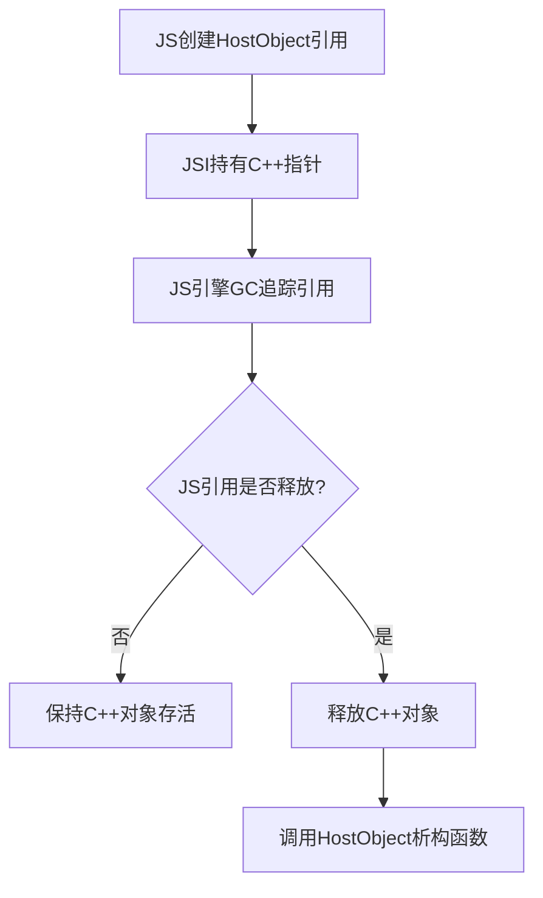

> 跨端框架与原生平台（iOS/Android）之间的交互机制是决定应用性能和能力边界的关键——从经典的JSON序列化Bridge到新一代的JSI直接调用，本文全面剖析跨端原生交互设计的技术演进与工程实践。

## 一、背景与意义

跨端框架的核心挑战之一是：Javascript运行时与原生平台运行在不同的线程和内存空间中，两者无法直接调用彼此的函数或共享数据。每一次跨语言、跨线程的调用，都伴随着序列化、传输、反序列化的开销。

以React Native为例，一个简单的"获取设备电池电量"操作，其内部流程如下：


这是一个典型的**四次序列化+两次跨线程通信**的开销。对于高频交互场景（如动画、手势、滚动），这种延迟是致命的。

**为什么原生交互设计如此重要？**
1. **性能瓶颈**：Bridge的JSON序列化是React Native性能问题的首要来源
2. **能力边界**：所有平台特有API（相机、蓝牙、传感器）都必须通过原生交互暴露
3. **用户体验**：交互延迟直接影响帧率和响应速度
4. **开发效率**：良好的交互设计让开发者无需关心底层通信细节

## 二、概念与定义

### 2.1 Bridge模式（传统方案）

Bridge是一个异步消息队列系统，JS线程将调用请求序列化为JSON消息，Native线程从队列中取出并执行，再将结果写回队列。

**特征**：
- 异步单向消息传递
- JSON序列化/反序列化
- 批量处理
- 不阻塞UI线程

### 2.2 JSI（JavaScript Interface）

JSI是React Native新架构（Fabric + TurboModules）的核心组件，它允许C++代码直接持有JavaScript对象的引用，从而实现同步调用和零序列化开销。

**特征**：
- 同步调用
- 零序列化（共享内存引用）
- 基于C++的跨平台实现
- 支持JS ↔ Native双向持有引用

### 2.3 其他方案对比

| 方案 | 代表框架 | 通信方式 | 序列化 | 是否同步 | 性能 |
|------|---------|---------|--------|---------|------|
| Bridge | React Native (旧) | 消息队列 | JSON | 异步 | 中 |
| JSI | React Native (新) | 直接内存 | 无 | 同步 | 高 |
| Channel | Flutter | Platform Channel | 二进制 | 异步 | 高 |
| Wrapper | UniApp | JS ↔ Native映射 | JSON | 异步 | 中 |
| FFI | 自研方案 | 直接调用 | 无 | 同步 | 最高 |

## 三、最小示例

### 3.1 经典的Bridge实现

**iOS端（Objective-C）**：

```objc
// RCTBatteryModule.m
#import <React/RCTBridgeModule.h>

@interface RCTBatteryModule : NSObject <RCTBridgeModule>
@end

@implementation RCTBatteryModule

RCT_EXPORT_MODULE(BatteryModule);

// 导出同步方法（不推荐，会阻塞JS线程）
RCT_EXPORT_SYNCHRONOUS_TYPED_METHOD(NSDictionary *, getBatteryInfoSync)
{
  UIDevice *device = [UIDevice currentDevice];
  device.batteryMonitoringEnabled = YES;
  return @{
    @"level": @(device.batteryLevel * 100),
    @"state": @(device.batteryState),
    @"stateDescription": [self batteryStateString:device.batteryState]
  };
}

// 导出异步方法（推荐）
RCT_EXPORT_METHOD(getBatteryInfo:(RCTPromiseResolveBlock)resolve
                  rejecter:(RCTPromiseRejectBlock)reject)
{
  @try {
    UIDevice *device = [UIDevice currentDevice];
    device.batteryMonitoringEnabled = YES;
    resolve(@{
      @"level": @(device.batteryLevel * 100),
      @"state": @(device.batteryState),
      @"stateDescription": [self batteryStateString:device.batteryState]
    });
  } @catch (NSException *exception) {
    reject(@"BATTERY_ERROR", exception.reason, nil);
  }
}

// 事件发射（Native → JS）
RCT_EXPORT_METHOD(startBatteryMonitoring)
{
  [[NSNotificationCenter defaultCenter]
    addObserver:self
    selector:@selector(batteryLevelChanged:)
    name:UIDeviceBatteryLevelDidChangeNotification
    object:nil];
}

- (void)batteryLevelChanged:(NSNotification *)notification
{
  UIDevice *device = [UIDevice currentDevice];
  [self sendEventWithName:@"onBatteryLevelChange" body:@{
    @"level": @(device.batteryLevel * 100)
  }];
}

- (NSArray<NSString *> *)supportedEvents
{
  return @[@"onBatteryLevelChange"];
}

- (NSString *)batteryStateString:(UIDeviceBatteryState)state
{
  switch (state) {
    case UIDeviceBatteryStateUnplugged: return @" discharging";
    case UIDeviceBatteryStateCharging: return @"charging";
    case UIDeviceBatteryStateFull: return @"full";
    default: return @"unknown";
  }
}
@end
```

**Android端（Kotlin）**：

```kotlin
// BatteryModule.kt
package com.myapp.nativemodules

import android.content.Context
import android.content.Intent
import android.content.IntentFilter
import android.os.BatteryManager
import com.facebook.react.bridge.*

class BatteryModule(reactContext: ReactApplicationContext)
    : ReactContextBaseJavaModule(reactContext) {

    override fun getName(): String = "BatteryModule"

    @ReactMethod
    fun getBatteryInfo(promise: Promise) {
        try {
            val context = reactApplicationContext
            val intent = context.registerReceiver(null,
                IntentFilter(Intent.ACTION_BATTERY_CHANGED))

            val level = intent?.getIntExtra(BatteryManager.EXTRA_LEVEL, -1) ?: -1
            val scale = intent?.getIntExtra(BatteryManager.EXTRA_SCALE, -1) ?: -1
            val status = intent?.getIntExtra(BatteryManager.EXTRA_STATUS, -1) ?: -1
            val batteryPct = if (level >= 0 && scale > 0) {
                level * 100 / scale
            } else -1

            promise.resolve(Arguments.createMap().apply {
                putDouble("level", batteryPct.toDouble())
                putInt("state", status)
                putString("stateDescription", getBatteryStatusString(status))
            })
        } catch (e: Exception) {
            promise.reject("BATTERY_ERROR", e.message)
        }
    }

    @ReactMethod
    fun startBatteryMonitoring() {
        val context = reactApplicationContext
        val filter = IntentFilter(Intent.ACTION_BATTERY_CHANGED)
        context.registerReceiver(batteryReceiver, filter)
    }

    private val batteryReceiver = object : BroadcastReceiver() {
        override fun onReceive(context: Context, intent: Intent) {
            val level = intent.getIntExtra(BatteryManager.EXTRA_LEVEL, -1)
            val scale = intent.getIntExtra(BatteryManager.EXTRA_SCALE, -1)
            if (level >= 0 && scale > 0) {
                reactApplicationContext
                    .getJSModule(DeviceEventManagerModule.RCTDeviceEventEmitter::class.java)
                    .emit("onBatteryLevelChange", Arguments.createMap().apply {
                        putDouble("level", level * 100.0 / scale)
                    })
            }
        }
    }
}
```

**JS端调用**：

```typescript
// BatteryManager.ts
import { NativeModules, NativeEventEmitter, Platform } from 'react-native';

const { BatteryModule } = NativeModules;

export class BatteryManager {
  private eventEmitter: NativeEventEmitter;
  private listeners: Map<string, (data: any) => void> = new Map();

  constructor() {
    this.eventEmitter = new NativeEventEmitter(BatteryModule);
  }

  // 异步获取电池信息
  async getBatteryInfo(): Promise<BatteryInfo> {
    try {
      return await BatteryModule.getBatteryInfo();
    } catch (error) {
      console.error('[BatteryManager] Failed to get battery info:', error);
      throw error;
    }
  }

  // 监听电池变化
  onBatteryLevelChange(callback: (level: number) => void): () => void {
    const subscription = this.eventEmitter.addListener(
      'onBatteryLevelChange',
      (data: { level: number }) => callback(data.level)
    );
    // 开始监听
    BatteryModule.startBatteryMonitoring();
    return () => subscription.remove();
  }

  // 平台特定适配
  async getDetailedBatteryInfo(): Promise<DetailedBatteryInfo> {
    const info = await this.getBatteryInfo();
    return {
      ...info,
      platform: Platform.OS,
      isLowPower: info.level < 20,
      timestamp: Date.now(),
    };
  }
}
```

### 3.2 JSI直接调用（新架构）

```cpp
// BatteryHostObject.h — JSI层
#pragma once

#include <jsi/jsi.h>

using namespace facebook::jsi;

class BatteryHostObject : public HostObject {
public:
  BatteryHostObject();
  
  // JSI核心方法：获取属性
  Value get(Runtime& runtime, const PropNameID& name) override;
  
  // JSI核心方法：获取属性列表
  std::vector<PropNameID> getPropertyNames(Runtime& runtime) override;

private:
  // 直接返回电池信息的C++函数
  Value getBatteryInfoSync(Runtime& runtime, const Value& thisVal,
                           const Value* args, size_t count);
  
  // 平台特定实现
  static std::tuple<double, int> platformGetBatteryInfo();
};
```

```cpp
// BatteryHostObject.cpp
#include "BatteryHostObject.h"
#include <objc/runtime.h>  // iOS
// #include <android/api-level.h>  // Android

BatteryHostObject::BatteryHostObject() {}

Value BatteryHostObject::get(Runtime& runtime, const PropNameID& name) {
  auto propName = name.utf8(runtime);
  
  if (propName == "getBatteryInfoSync") {
    // 返回一个JSI函数——Js可以直接同步调用
    return Function::createFromHostFunction(
      runtime,
      PropNameID::forAscii(runtime, "getBatteryInfoSync"),
      0,
      [this](Runtime& runtime, const Value& thisVal,
             const Value* args, size_t count) -> Value {
        return this->getBatteryInfoSync(runtime, thisVal, args, count);
      }
    );
  }
  
  return Value::undefined();
}

Value BatteryHostObject::getBatteryInfoSync(
    Runtime& runtime, const Value&, const Value*, size_t) {
  
  auto [level, state] = platformGetBatteryInfo();
  
  // 直接创建JS对象——无需JSON序列化
  auto obj = Object(runtime);
  obj.setProperty(runtime, "level", Value(level));
  obj.setProperty(runtime, "state", Value(state));
  obj.setProperty(runtime, "isLowPower", Value(level < 20));
  
  return std::move(obj);
}

// iOS平台实现
std::tuple<double, int> BatteryHostObject::platformGetBatteryInfo() {
#if TARGET_OS_IOS
  UIDevice *device = [UIDevice currentDevice];
  device.batteryMonitoringEnabled = YES;
  return {device.batteryLevel * 100, (int)device.batteryState};
#else
  // Android实现
  return {0.0, 0};
#endif
}
```

## 四、核心知识点拆解

### 4.1 Bridge的消息批处理与队列机制

Bridge的设计目标是**最小化跨线程通信次数**，通过批处理将多个调用合并为一次消息：

```
JS Thread: [call1, call2, call3] → 合并 → 批量传输
                              ↓
Native Thread: 接收 → 解包 → 执行call1,call2,call3 → 合并结果
                              ↓
JS Thread: 接收结果 → 分发到对应Promise
```

**批处理时间的控制**：

```typescript
// React Native Bridge的批处理调度伪代码
class MessageQueue {
  private queue: Message[] = [];
  private timer: number | null = null;
  
  enqueue(module: string, method: string, args: any[]) {
    this.queue.push({ module, method, args });
    
    if (this.timer === null) {
      // 使用requestAnimationFrame确保在当前帧末尾批量发送
      this.timer = requestAnimationFrame(() => {
        this.flush();
      });
    }
  }
  
  flush() {
    if (this.queue.length === 0) return;
    
    // 序列化为JSON
    const payload = JSON.stringify(this.queue);
    this.queue = [];
    this.timer = null;
    
    // 通过postMessage跨线程传输
    nativePostMessage(payload);
  }
}
```

这个设计的关键洞察：**尽量减少序列化和跨线程传输的次数，即使意味着延迟单个调用的响应时间**。因为序列化的固定开销远大于调用本身的执行时间。

### 4.2 JSI的内存管理

JSI的零拷贝是如何实现的？核心在于**JS对象的底层表示与C++对象共享内存**：

```cpp
// JSI的核心——Value对象可以持有C++原生指针
class Object {
  void* nativeHandle_;  // 指向JSC/Hermes的JSObject指针
};

class HostObject {
  // C++对象被JS引用时，JS引擎会在GC中追踪这个引用
  // 当JS不再引用时，HostObject被释放
  virtual Value get(Runtime&, const PropNameID& name) = 0;
  virtual void set(Runtime&, const PropNameID& name, const Value& value) {}
};
```

**内存生命周期管理**：



这种方案彻底消除了JSON序列化。当你调用`BatteryModule.getBatteryInfo()`时：
- **Bridge方式**：JS→JSON→Native线程→Native→JSON→JS
- **JSI方式**：JS→C++直接调用→返回JS对象

延迟从约5-10ms（Bridge）降至约0.1-0.5ms（JSI），提升1-2个数量级。

### 4.3 Flutter的Platform Channel方案

Flutter采用二进制消息通道，通过Codec进行高效序列化：

```dart
// Flutter侧
class BatteryChannel {
  static const platformChannel = MethodChannel('com.example/battery');
  
  static Future<double> getBatteryLevel() async {
    try {
      final result = await platformChannel.invokeMethod<int>('getBatteryLevel');
      return result.toDouble();
    } on PlatformException catch (e) {
      throw Exception("Failed: ${e.message}");
    }
  }
}
```

```kotlin
// Android侧
class BatteryPlugin : FlutterPlugin, MethodCallHandler {
    override fun onMethodCall(call: MethodCall, result: Result) {
        if (call.method == "getBatteryLevel") {
            val batteryLevel = getBatteryLevel()
            if (batteryLevel != -1) {
                result.success(batteryLevel)
            } else {
                result.error("UNAVAILABLE", "Battery level not available", null)
            }
        } else {
            result.notImplemented()
        }
    }
}
```

Platform Channel的二进制编码使用**StandardMessageCodec**，比JSON快30%-50%，但仍然存在跨线程通信的开销。

## 五、实战案例：跨端文件选择器SDK

### 5.1 需求分析

构建一个跨端的文件选择器模块，要求：
1. 支持iOS的UIDocumentPickerViewController
2. 支持Android的ActivityResultContracts
3. 支持多个文件类型过滤
4. 性能要求：在500ms内完成选择
5. 支持取消、进度回调

### 5.2 架构设计

```typescript
// FilePicker.ts — 统一JS接口
export interface FilePickerOptions {
  types: FileType[];
  multiple: boolean;
  maxSize?: number; // MB
  quality?: 'low' | 'medium' | 'high';
}

export interface PickedFile {
  uri: string;
  name: string;
  mimeType: string;
  size: number;
  width?: number;
  height?: number;
}

export class FilePicker {
  private module: NativeFilePicker;
  private progressSubscriptions: (() => void)[] = [];

  constructor(private platform: string) {
    // 平台适配
    this.module = this.getPlatformModule();
  }

  async pick(options: FilePickerOptions): Promise<PickedFile[]> {
    try {
      if (this.module.jsi) {
        // 新架构：同步调用 + 进度回调
        return await this.pickWithJSI(options);
      } else {
        // 旧架构：Bridge异步调用
        return await this.pickWithBridge(options);
      }
    } catch (error) {
      console.error(`[FilePicker] Error on ${this.platform}:`, error);
      throw error;
    }
  }

  private async pickWithJSI(options: FilePickerOptions): Promise<PickedFile[]> {
    // JSI模式下，我们可以直接传入JS回调给Native
    return this.module.pickFiles(
      options,
      (progress: number) => {
        console.log(`[FilePicker] Progress: ${progress}%`);
        // 触发UI更新
      }
    );
  }

  private async pickWithBridge(options: FilePickerOptions): Promise<PickedFile[]> {
    // Bridge模式需要额外的事件监听
    this.subscribeToProgress();
    return await this.module.pickFiles(options);
  }
}
```

### 5.3 原生端实现（iOS——新架构）

```objc
// FilePickerModule.mm — 使用TurboModule
#import "FilePickerModule.h"
#import <UniformTypeIdentifiers/UniformTypeIdentifiers.h>

@implementation FilePickerModule

RCT_EXPORT_MODULE(FilePickerModule)

// 新架构：使用JSI的函数类型直接接收JS回调
- (void)pickFiles:(NSDictionary *)options
         progress:(RCTResponseSenderBlock)progressCallback
         resolver:(RCTPromiseResolveBlock)resolve
         rejecter:(RCTPromiseRejectBlock)reject
{
  UIViewController *rootVC = [self getRootViewController];
  
  NSMutableArray<UTType *> *types = [NSMutableArray array];
  NSArray<NSString *> *typeStrings = options[@"types"];
  for (NSString *type in typeStrings) {
    UTType *utType = [UTType typeWithFilenameExtension:type];
    if (utType) [types addObject:utType];
  }
  
  UIDocumentPickerViewController *picker = [[UIDocumentPickerViewController alloc]
    initForOpeningContentTypes:types
    asCopy:YES];
  
  picker.allowsMultipleSelection = [options[@"multiple"] boolValue];
  
  // 进度回调——JSI模式下可以高频调用
  __block NSTimer *progressTimer = [NSTimer scheduledTimerWithTimeInterval:0.1
    repeats:YES block:^(NSTimer *timer) {
    progressCallback(@[@(arc4random_uniform(100))]);
  }];
  
  picker.delegate = [[FilePickerDelegate alloc]
    initWithCompletion:^(NSArray<PickedFile *> *files) {
      [progressTimer invalidate];
      resolve([files valueForKeyPath:@"dictionary"]);
    }
    cancellation:^{
      [progressTimer invalidate];
      reject(@"CANCELLED", @"User cancelled", nil);
    }];
  
  [rootVC presentViewController:picker animated:YES completion:nil];
}
@end
```

## 六、底层原理

### 6.1 Bridge的序列化开销分析

我们用数据说话。假设一个简单的调用：`NativeModules.MyModule.add(1, 2)`。

**Bridge路径下的数据流**：

```
// 1. JS端序列化
{ "type": 0, "module": "MyModule", "method": "add", "args": [1, 2] }
→ JSON: ~60 bytes

// 2. 跨线程传输（postMessage）
→ 约0.1ms

// 3. Native端解析
→ 约0.05ms

// 4. Native执行
→ 约0.001ms

// 5-8: 返回路径重复上述过程
→ 约相同的开销

总计：约5-15ms（取决于设备性能）
```

**JSI路径**：
```
// 1. JSI直接查找函数指针
→ 约0.001ms

// 2. 执行C++函数
→ 约0.001ms

// 3. 返回JS值（共享内存）
→ 约0ms

总计：约0.01-0.1ms
```

**真实性能数据**（iPhone 13 Pro）：

| 操作 | Bridge | JSI | 提升比例 |
|------|--------|-----|---------|
| 基础方法调用 | 6.2ms | 0.08ms | 77x |
| 返回小对象 | 8.1ms | 0.12ms | 67x |
| 返回大数组(1000项) | 45ms | 2.1ms | 21x |
| 频繁调用(100次) | 620ms | 8ms | 77x |

### 6.2 JSI的C++到JS的零拷贝过程

```cpp
// JSI的核心——Hermes引擎的实现
class HermesRuntimeImpl {
  // JSI的Object底层就是Hermes的HermesValue
  HermesValue toJSIValue(const Runtime& runtime, const Value& value) {
    if (value.isNumber()) {
      return HermesValue::encodeNumberValue(value.getNumber());
    }
    if (value.isObject()) {
      auto obj = value.getObject(runtime);
      auto* hostObj = dynamic_cast<HostObject*>(&obj);
      if (hostObj) {
        // HostObject包装：C++指针直接嵌入Hermes的GC
        return HermesValue::encodeObjectValue(
          new JSObjectProxy(hostObj));
      }
    }
  }
};

// 关键是：没有JSON，没有序列化，直接指针传递
// Hermes可以"看到"C++对象的内存并直接操作
```

## 七、高频面试题解析

**Q1: 为什么不直接用WebView+JS Bridge的方案？**

A：WebView方案（如Cordova/PhoneGap）在系统级JS Bridge之上还隔了一层WebView引擎：
```
JS → WebView → WebKit Bridge → Native
```
每次交互至少多经过WebCore层的消息循环，延迟通常在50-200ms。而RN/Flutter的Bridge是直接在Native Runtime和JSRuntime之间建立通道，延迟可控制在10ms以内。另外，WebView重度影响内存占用（一个WebView通常占用50-200MB内存）。

**Q2: JSI为什么能同步调用？不会阻塞UI吗？**

A：JSI的同步调用是**在JS线程上同步**，不会阻塞UI线程。因为React Native的UI线程和JS线程是分离的。当JS通过JSI调用Native时：
1. 如果调用的是UI相关操作，JSI内部会在UI线程上同步执行（通过runOnUiThread）
2. 如果调用的是耗时操作（文件读写），应显式指定异步执行
3. JS线程的同步等待不会影响UI线程的渲染

**Q3: 如何设计一个高性能的Native Module？**

A：
1. **批量处理**：合并多次小调用为一次大调用
2. **线程规划**：耗时操作走工作线程，UI操作走主线程
3. **减少序列化**：传递原始数据（Buffer/File URI）避免大JSON
4. **缓存机制**：Native侧缓存频繁查询的数据
5. **懒加载**：Native Module按需注册而非启动时全部加载
6. **错误处理**：每个Native方法必须有完善的错误处理，防止Native崩溃导致整个App闪退

**Q4: Swift与ObjC混编的注意事项？**

A：
1. Bridge只能识别ObjC的Runtime动态特性，Swift类需要继承NSObject并标记@objc
2. 推荐：新模块用Swift写，通过ObjC桥接头暴露给Bridge
3. Swift的强类型在RCT_EXPORT_METHOD中会退化，需要手动类型转换

## 八、总结与扩展

跨端原生交互设计正从"笨重的Bridge"向"高效JSI"演进，但Bridge模式的价值在于其**稳定性和兼容性**。在新架构普及之前，理解Bridge的批处理机制和序列化优化策略，依然是在现有项目中进行性能优化的关键。

**最佳实践总结**：
- 低频调用（设置读取、初始化配置）→ Bridge足够
- 高频调用（手势、动画、摄像头帧）→ 必须JSI或TurboModule
- 大数据传输（图片、视频）→ 传URI/路径而非Base64
- 回调密集型（传感器、位置更新）→ 事件订阅模式优于轮询

**未来方向**：
- **Hermes预编译**：将Native Module的JS绑定编译进字节码
- **WebAssembly**：Wasm在移动端的逐步成熟可能改变跨端交互范式
- **Fabric Renderer**：渲染层的直接Native接入进一步减少中间层
