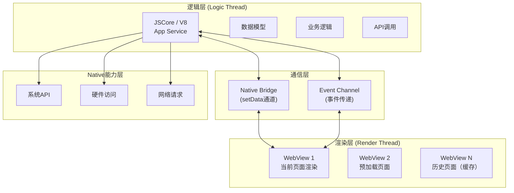
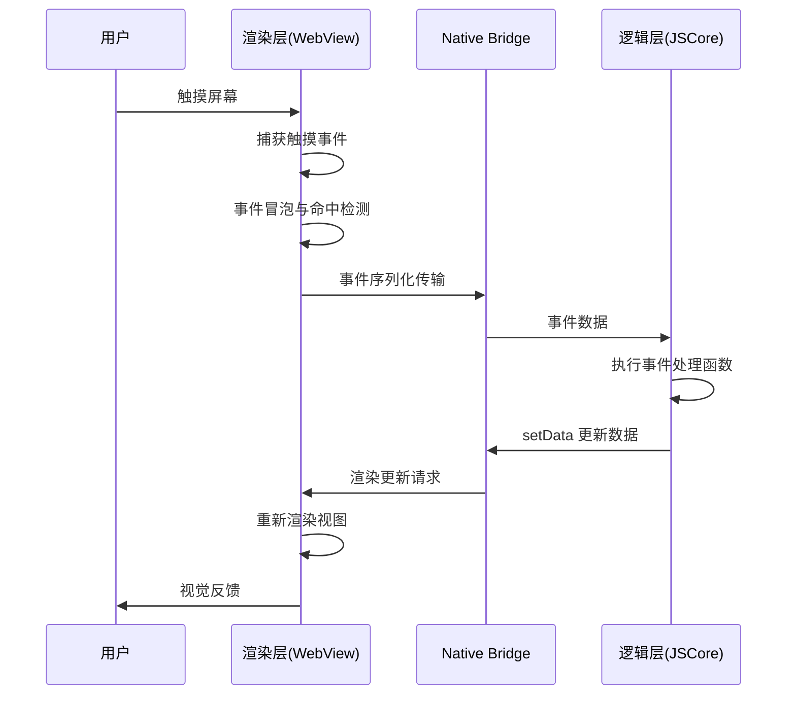
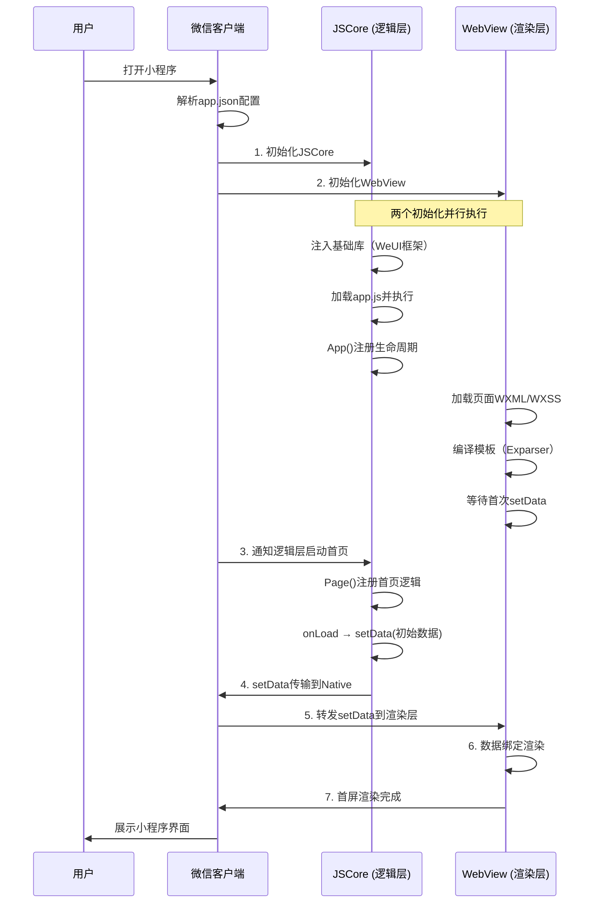

> 小程序以"双线程架构"实现了接近原生App的体验——逻辑层与渲染层完全隔离，从根本上杜绝了JS执行阻塞UI渲染的问题，同时也带来了setData通信、Native能力接入等独特的挑战。

## 一、背景与意义

### 移动端Web App的困境

在微信小程序诞生之前，移动端Web App（H5）面临几个无法解决的性能问题：

1. **JS线程与UI线程互斥**：浏览器中JS执行和DOM渲染共享同一个主线程。一次复杂的JS计算（比如数据处理、DOM遍历）会直接阻塞页面渲染，导致用户看到"白屏"或"掉帧"。
2. **DOM API性能瓶颈**：每次DOM操作都涉及复杂的重排（reflow）和重绘（repaint），在复杂页面中开销巨大。
3. **安全与隔离不足**：Web页面可以访问DOM和BOM API，存在XSS等安全风险，Native能力通过JS Bridge暴露也存在安全问题。

微信小程序团队的设计思路：**既然浏览器单线程模型有天然缺陷，为何不打破它？**

解决方案就是**双线程架构**——逻辑（JS）和渲染（DOM）运行在两个独立的线程中，互不阻塞。这是小程序相比传统H5最根本的性能优势来源。

## 二、概念与定义

### 2.1 双线程架构模型



**核心角色**：
- **渲染层**：运行在WebView中，负责页面UI的渲染和用户事件捕获
- **逻辑层**：运行在JSCore（iOS）或V8（Android）中，负责业务逻辑、数据处理、API调用
- **Native Bridge**：微信客户端提供的消息通道，负责渲染层与逻辑层之间的数据传递

### 2.2 与传统Web App的对比

| 维度 | 传统H5 | 小程序双线程 |
|------|-------|-------------|
| 线程模型 | 单线程（JS+DOM共享） | 双线程（分离） |
| DOM访问 | 直接读写 | 不可访问（通过setData更新） |
| JS阻塞影响 | 阻塞渲染，页面卡住 | 仅阻塞逻辑层，渲染不受影响 |
| 页面切换 | 浏览器多Tab | 多WebView实例 + 切换逻辑 |
| 安全沙箱 | 浏览器安全策略 | 更严格的沙箱（无DOM/BOM） |
| 能力边界 | 浏览器API | 更丰富的Native能力 |

## 三、最小示例

### 3.1 双线程通信——setData的完整流程

```javascript
// 逻辑层（app.js / page.js）
// 这段代码运行在JSCore中
Page({
  data: {
    userInfo: null,
    items: [],
    loading: false,
  },

  onLoad() {
    this.setData({ loading: true });
    
    // 模拟网络请求
    setTimeout(() => {
      // 这里修改data不会自动更新UI！
      // 必须通过setData显式通知渲染层
      this.setData({
        userInfo: { name: '张三', age: 28 },
        items: [
          { id: 1, title: '商品A', price: 99 },
          { id: 2, title: '商品B', price: 199 },
        ],
        loading: false,
      });
    }, 1000);
  },

  // 用户点击事件——事件从渲染层传递到逻辑层
  onItemTap(event) {
    const { id } = event.currentTarget.dataset;
    wx.showToast({ title: `点击了商品: ${id}` });
    
    // 修改UI需要再次setData
    this.setData({ selectedId: id });
  }
});
```

```html
<!-- 渲染层（wxml）——运行在WebView中 -->
<view class="container">
  <block wx:if="{{loading}}">
    <loading-component />
  </block>
  
  <block wx:else>
    <view class="user-card">
      <text>{{userInfo.name}}</text>
      <text>{{userInfo.age}}岁</text>
    </view>
    
    <view class="item-list">
      <view 
        class="item" 
        wx:for="{{items}}" 
        wx:key="id"
        data-id="{{item.id}}"
        catch:tap="onItemTap"
      >
        <text class="title">{{item.title}}</text>
        <text class="price">¥{{item.price}}</text>
      </view>
    </view>
  </block>
</view>
```

### 3.2 Native能力调用流程（对比H5）

```javascript
// 小程序调用Native能力
wx.getLocation({
  type: 'wgs84',
  success: (res) => {
    // 这个回调在逻辑层执行
    this.setData({
      latitude: res.latitude,
      longitude: res.longitude,
    });
  },
  fail: (err) => {
    console.error('获取位置失败:', err);
  }
});

// 对比：H5调用地理位置API（浏览器中）
// navigator.geolocation.getCurrentPosition(...)
// 
// 关键区别：
// H5: 浏览器API → 系统API（浏览器封装）
// 小程序: wx.getLocation → Native Bridge → 微信客户端API
// 
// 小程序路径更短，且微信可以拦截和处理权限（不需要用户再次确认）
```

## 四、核心知识点拆解

### 4.1 setData的通信机制与性能模型

setData是小程序中唯一允许逻辑层与渲染层通信的通道。理解它的内部机制是优化小程序性能的起点。

```javascript
// setData的内部流程（简化版）

// 逻辑层（JSCore）
Page.prototype.setData = function(data, callback) {
  // 1. 数据的JSON序列化
  const dataStr = JSON.stringify(data);
  const dataSize = dataStr.length;
  
  // 限制单次setData大小（官方建议< 1MB，实际 < 100KB 性能最佳）
  if (dataSize > 1024 * 1024) {
    console.error('setData数据量过大');
    return;
  }
  
  // 2. 逻辑层差量计算（对比上一次data，只发送变化部分）
  const diffData = shallowDiff(this.data, data);
  
  // 3. 通过Native Bridge发送到渲染层
  NativeBridge.postMessage({
    type: 'setData',
    data: JSON.stringify(diffData),
    pageId: this.__pageId__,
    callbackId: callback ? registerCallback(callback) : null,
  });
  
  // 4. 更新逻辑层的data（立即生效，不需要等渲染层确认）
  Object.assign(this.data, data);
};

// 渲染层（WebView）接收到消息后
Bridge.onNativeMessage = function(message) {
  if (message.type === 'setData') {
    const data = JSON.parse(message.data);
    
    // 5. 将数据合并到渲染层数据
    Object.assign(pageData, data);
    
    // 6. 触发数据驱动的界面更新（类似Vue/React的数据绑定）
    // 微信使用了Exparser组件系统内部的脏检查机制
    requestAnimationFrame(() => {
      updateView(pageData);
      
      // 7. 渲染完成后通知逻辑层
      if (message.callbackId) {
        NativeBridge.postMessage({
          type: 'setDataCallback',
          callbackId: message.callbackId,
        });
      }
    });
  }
};
```

**setData的性能关键指标**：

```javascript
// 不同数据量下的setData耗时实测（iPhone 12, 微信8.0）
const setDataBenchmark = {
  '1KB': { avgTime: 5, maxTime: 15 },      // ✅ 极快
  '10KB': { avgTime: 15, maxTime: 40 },     // ✅ 正常
  '50KB': { avgTime: 50, maxTime: 100 },    // ⚠️ 需要关注
  '100KB': { avgTime: 120, maxTime: 300 },  // ❌ 可能卡顿
  '500KB': { avgTime: 500, maxTime: 1500 }, // ❌ 严重卡顿
};

// 核心公式（经验值）：
// setData耗时 ≈ JSON序列化时间 + 跨线程通信时间 + 虚拟DOM Diff时间 + DOM更新时间
// 其中跨线程通信是固定开销（约2-5ms），JSON序列化与数据量成正比
```

### 4.2 事件传递机制

用户在渲染层触摸屏幕，事件需要传递到逻辑层处理：



**事件关键属性**：

```javascript
// 渲染层传递到逻辑层的事件对象
{
  type: 'tap',
  timeStamp: 1528890831234,
  target: {
    id: 'item-1',
    dataset: { id: '1', category: 'book' },
    offsetLeft: 50,
    offsetTop: 30,
  },
  currentTarget: {
    id: 'item-1',
    dataset: { id: '1', category: 'book' },
  },
  detail: {
    x: 120,
    y: 300,
    // 不同事件类型有不同的detail
  },
  touches: [{
    identifier: 0,
    pageX: 120,
    pageY: 300,
    clientX: 100,
    clientY: 280,
  }],
  changedTouches: [...],
}
```

### 4.3 页面栈与多WebView机制

小程序使用**多WebView实例**管理页面栈，而不是浏览器的历史栈：

```javascript
// 页面栈管理（微信客户端内部实现）
interface PageStackManager {
  // 每个页面对应一个独立的WebView实例
  pages: WebViewInstance[];
  currentIndex: number;
  maxPages: number; // 通常为10
}

// navigateTo: 创建新的WebView
function navigateTo(pagePath: string, params: any) {
  if (stack.currentIndex >= stack.maxPages - 1) {
    // 页面栈太深，微信客户端的处理方式是触发异常
    throw new Error('页面栈已满');
  }
  
  // 创建新WebView实例
  const newWebView = createWebView(pagePath, params);
  stack.currentIndex++;
  stack.pages[stack.currentIndex] = newWebView;
  
  // 隐藏当前WebView
  stack.pages[stack.currentIndex - 1].hide();
  
  // 显示新WebView
  newWebView.show();
  
  // 触发生命周期
  triggerLifecycle(newWebView, 'onLoad', params);
  triggerLifecycle(newWebView, 'onShow');
}

// navigateBack: 关闭当前WebView
function navigateBack(delta: number = 1) {
  const targetIndex = stack.currentIndex - delta;
  
  // 关闭当前页面WebView
  const current = stack.pages[stack.currentIndex];
  current.destroy(); // 销毁WebView，释放内存
  
  stack.pages[stack.currentIndex] = null;
  stack.currentIndex = targetIndex;
  
  // 显示目标页面WebView
  stack.pages[targetIndex].show();
  triggerLifecycle(stack.pages[targetIndex], 'onShow');
}

// switchTab / reLaunch: 清理所有非tab页面
function switchTab(tabPath: string) {
  // 保留tab页面，销毁其他页面
  for (let i = 1; i < stack.pages.length; i++) {
    if (!isTabPage(stack.pages[i])) {
      stack.pages[i].destroy();
      stack.pages[i] = null;
    }
  }
  // 重置栈
  stack.currentIndex = 0;
  stack.pages[0].show();
}
```

**多WebView的优势**：
- 页面切换时无需销毁前一个页面，保留现场（滚动位置、输入状态）
- 返回时不重新渲染（快）
- 每个页面都有独立的渲染上下文，互不干扰

## 五、实战案例：双线程架构下的性能优化

### 5.1 合理使用setData

```javascript
// ❌ 错误示范：频繁、大量setData
Page({
  onPageScroll(e) {
    // 每秒可能触发60次，每次setData都跨线程通信
    this.setData({ scrollTop: e.scrollTop });
    // 如果scrollTop还被用于绑定样式，会触发60次/秒的渲染更新
  },
  
  onReachBottom() {
    const newData = [];
    for (let i = 0; i < 100; i++) {
      newData.push({ id: i, text: `Item ${i}` });
    }
    this.setData({
      items: this.data.items.concat(newData), 
      // 每次累加，总数据量越来越大
    });
  },
});

// ✅ 正确做法：节流 + 差量更新
Page({
  onPageScroll: throttle(function(e) {
    // 1. 节流：只更新1/10的帧（约6次/秒）
    if (Math.abs(e.scrollTop - this.lastScrollUpdate) < 50) return;
    this.lastScrollUpdate = e.scrollTop;
    
    // 2. 使用WXS处理频繁的滚动事件（不经过逻辑层）
    // 见下面WXS示例
    
    // 3. 仅在需要时更新（滚动到特定位置触发动画）
    if (e.scrollTop > 500 && !this.data.showBackToTop) {
      this.setData({ showBackToTop: true });
    }
  }, 100),
});

// ✅ WXS示例：在渲染层处理动画，避免跨线程通信
// index.wxs
var scrollPosition = 0;
function onScroll(e, ins) {
  scrollPosition = e.detail.scrollTop;
  // 直接修改渲染层样式，不需要经过逻辑层
  if (scrollPosition > 500) {
    ins.selectComponent('.back-top').setStyle('opacity: 1');
  } else {
    ins.selectComponent('.back-top').setStyle('opacity: 0');
  }
}
module.exports = { onScroll: onScroll };
```

### 5.2 setData的差量更新策略

```javascript
// 手动实现差量更新：只发送变化的部分
Page({
  data: {
    list: [],
    page: 1,
    total: 0,
    filters: {
      category: '',
      priceRange: [0, 9999],
      sort: 'default',
    },
  },
  
  // 更新单个字段——差量更新天然支持
  updateFilter(key, value) {
    // 只会发送 `filters.category` 的变化到渲染层
    this.setData({ [`filters.${key}`]: value });
  },
  
  // 追加列表数据——避免全量传递
  appendList(newItems) {
    // ❌ 错误：传递整个列表（数据量会越来越大）
    // this.setData({ list: updatedList }); 
    
    // ✅ 正确：使用keyed path更新新增部分
    const newData = {};
    newItems.forEach((item, index) => {
      const targetIndex = this.data.list.length + index;
      newData[`list[${targetIndex}]`] = item;
    });
    this.setData(newData);
  },
  
  // 批量更新合并
  updateMultiple() {
    // ❌ 错误：多次setData
    // this.setData({ loading: true });
    // this.setData({ error: null });
    // this.setData({ data: someData });
    
    // ✅ 正确：一次setData传递全部变更
    this.setData({
      loading: true,
      error: null,
      data: someData,
    });
    // 内部会合并为一次跨线程通信
  },
});
```

### 5.3 使用分包避免代码注入阻塞

```javascript
// app.json - 分包配置
{
  "pages": [
    "pages/index/index",
    "pages/logs/logs"
  ],
  "subPackages": [
    {
      "root": "packageA",
      "pages": [
        "pages/category/category",
        "pages/cart/cart"
      ]
    },
    {
      "root": "packageB",
      "pages": [
        "pages/user/user",
        "pages/order/order"
      ]
    }
  ],
  "preloadRule": {
    "pages/index/index": {
      "network": "all",
      "packages": ["packageA"] // 预加载分包
    }
  }
}
```

**为什么分包对双线程架构重要？**
逻辑层需要一次性注入所有页面的JS代码。如果不分包，整个应用的JS代码在启动时全部注入，首次渲染被推迟。分包后，主包只包含首页的JS，其他页面按需注入。

### 5.4 双线程调试技巧

```javascript
// 调试双线程问题

// 1. 模拟慢渲染——在渲染层的WXS中增加延迟
// slow-render.wxs
var originalRender = render;
render = function(data) {
  // 模拟50ms的渲染延迟
  var start = getDate().getTime();
  while (getDate().getTime() - start < 50) {}
  return originalRender(data);
};

// 2. 追踪setData耗时
const originalSetData = Page.prototype.setData;
Page.prototype.setData = function() {
  const start = Date.now();
  const result = originalSetData.apply(this, arguments);
  const cost = Date.now() - start;
  
  if (cost > 50) {
    console.warn(`[Perf] setData耗时 ${cost}ms，建议优化`);
  }
  
  // 记录到性能数据
  wx.reportPerformance?.('setData_cost', cost);
  
  return result;
};

// 3. 检查页面栈深度
function getPageStackInfo() {
  const pages = getCurrentPages();
  console.log(`当前页面栈深度: ${pages.length}`);
  pages.forEach((page, i) => {
    console.log(`  [${i}] ${page.route} (dataSize: ${JSON.stringify(page.data).length}B)`);
  });
  // 建议栈深度不超过5层
}
```

## 六、底层原理

### 6.1 双线程的初始化时序



### 6.2 Exparser——小程序的组件系统

WebView中运行的不是标准的DOM操作，而是微信自研的**Exparser**组件系统：

```javascript
// Exparser的简化实现概念
class Exparser {
  constructor() {
    this.componentTree = new ComponentNode('root');
    this.data = {};
  }
  
  // 将WXML编译为组件树
  compile(wxml: string): ComponentNode {
    // WXML编译过程（简化）：
    // 1. 词法分析：解析WXML标签
    // 2. 解析数据绑定：{{xxx}}
    // 3. 解析指令：wx:if, wx:for, wx:key
    // 4. 生成组件树的描述
    // 5. 创建组件节点实例
  }
  
  // 数据更新触发
  setData(newData: any) {
    // 1. 合并数据
    Object.assign(this.data, newData);
    
    // 2. 脏检查——对比哪些数据变化了
    const changes = this.diff(this.data, this.prevData);
    
    // 3. 根据变化更新组件树
    for (const [path, value] of changes) {
      this.updateComponent(path, value);
    }
    
    // 4. 触发渲染
    this.render();
  }
  
  diff(newData: any, oldData: any): Map<string, any> {
    // 逐层对比，找出变化的路径
    // 这就是为什么setData可以用路径语法：`list[0].title`
  }
}
```

### 6.3 渲染层与逻辑层的生命线

双线程架构下，两个线程有各自独立的生命线：

```javascript
// 逻辑层：事件驱动的消息循环（类似Node.js的事件循环）
// 在JSCore中运行的简化事件循环
class JSCoreEventLoop {
  private taskQueue: Task[] = [];
  private microtaskQueue: Microtask[] = [];
  
  // 一次事件循环"tick"
  async tick() {
    // 1. 执行一个宏任务（用户事件回调、setTimeout等）
    const task = this.taskQueue.dequeue();
    if (task) await task.execute();
    
    // 2. 清空微任务队列（Promise.then等）
    while (this.microtaskQueue.length > 0) {
      const microtask = this.microtaskQueue.dequeue();
      await microtask.execute();
    }
    
    // 3. 执行Native回调
    this.processNativeCallbacks();
    
    // 4. 渲染更新（setData触发）
    this.processSetDataQueue();
  }
}

// 渲染层：每帧更新的渲染循环
class RendererEventLoop {
  private pendingSetData: SetDataRequest[] = [];
  
  // requestAnimationFrame驱动的渲染循环
  frame(timestamp: number) {
    // 1. 处理来自逻辑层的setData请求
    const requests = this.pendingSetData.splice(0);
    for (const req of requests) {
      this.applySetData(req);
    }
    
    // 2. 执行渲染
    this.render();
    
    // 3. 请求下一帧
    requestAnimationFrame(() => this.frame(timestamp));
  }
}
```

## 七、高频面试题解析

**Q1: 为什么小程序渲染速度比同功能H5快？**

A：根本原因在于双线程架构解决了"JS执行阻塞渲染"的问题。H5中一次复杂JS计算可能导致页面卡住300ms（用户能看到页面完全不可操作），而小程序中同样的JS计算在逻辑层执行，渲染层完全不受影响——用户仍然可以滚动页面、看到动画。另外，小程序使用Native组件替代部分HTML渲染（如canvas、video、map），这些组件的渲染走的是系统级硬件加速，比浏览器的软渲染快得多。

**Q2: setData的数据量限制如何计算？**

A：官方建议单次setData不超过1MB，但实践中建议控制在50KB以内。原因是：1) JSON序列化+反序列化耗时（100KB约50-100ms）；2) 跨线程传输（100KB约30-80ms）；3) Exparser组件树更新（与数据绑定的组件数量正相关）。所以关键不是setData的总数据量，而是实际**变化的字段的数量**。

**Q3: 小程序为什么没有DOM API？**

A：因为渲染层不信任逻辑层。如果允许逻辑层直接操作DOM，1) 逻辑层代码可以被恶意注入修改渲染层（安全风险）；2) 逻辑层到渲染层的路径会被绕过，双线程架构的"不阻塞"优势消失；3) 逻辑层无法感知渲染层状态（比如某个元素的宽高），需要Native额外提供获取方案。

**Q4: 小程序Worker能解决什么问题？**

A：小程序Worker是逻辑层的"辅助线程"，可以用来做大量计算（数据加密、图片处理、复杂排序），避免主逻辑层被阻塞。但Worker不能访问setData（不能更新UI），只能通过postMessage与主逻辑层通信。

## 八、总结与扩展

双线程架构是小程序性能优势的核心来源，但它也有代价：
- 开发体验下降（不能直接操纵DOM）
- setData通信有固定开销（频繁小更新不划算）
- 调试困难（两个线程的日志、断点分开）

**未来的演进方向**：
- **Skyline渲染引擎**：微信新一代渲染引擎，使用自研的渲染管线替代WebView，消除WXML/WXSS的编译开销
- **同层渲染**：Native组件与WebView层融合，不再需要覆盖在WebView之上
- **Worker增强**：Worker可以访问部分Native API，减少主线程负担

理解双线程架构，就是理解"分离"的艺术——将渲染与计算分离、将安全与便利分离、将加载与展示分离。这种分离思想不仅适用于小程序架构，也适用于前端领域的方方面面。
