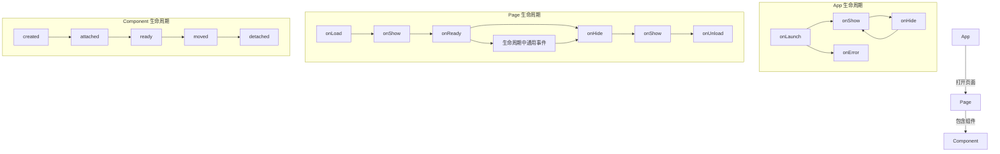
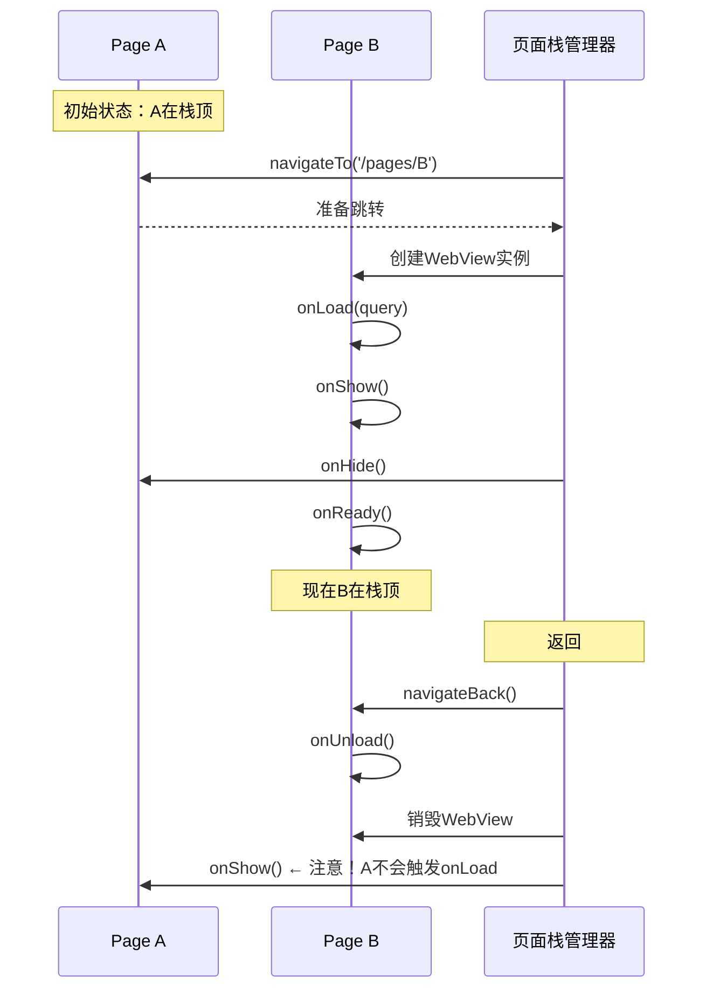

> 小程序的声明周期体系比传统Web页面复杂得多——它不仅要管理单个页面的生老病死，还要协调多WebView页面栈、应用级前后台切换、以及逻辑层与渲染层的生命周期同步。理解这套体系是写出无Bug小程序的基础。

## 一、背景与意义

### 一个真实的线上故障

某电商小程序团队在"双11"活动中遇到了一个诡异的问题：用户在A页面填写了一个表单，跳转到B页面选择商品，再返回A页面时，表单内容全部丢失。

排查发现——开发者在A页面的`onLoad`中调用了初始化表单的API，而`onLoad`在整个页面生命周期中只触发**一次**。当页面从B返回A时，不会触发`onLoad`，而是触发`onShow`。但开发者没有在`onShow`中恢复表单状态。

这个故障导致了**15%的用户在填写表单步骤流失**。

**理解生命周期不是学院派的知识点，它直接关系到用户体验和业务数据完整性。**

### 生命周期的复杂性来源

与Web页面不同，小程序的生命周期有三层：

```
App生命周期 → Page生命周期 → Component生命周期
```

每一层都有自己的触发规则和依赖关系，并且它们之间的时序是严格约定的。违反这些约定会导致：
- 数据不同步（实例A中修改的数据消失了）
- 事件监听泄露（重复绑定导致多次触发）
- 内存泄漏（页面已销毁但定时器还在跑）
- 白屏（渲染时机不对）

## 二、概念与定义

### 2.1 生命周期总览



### 2.2 各生命周期定义

**App生命周期**：

| 钩子 | 触发时机 | 特点 |
|------|---------|------|
| onLaunch | 小程序首次启动 | 全局唯一初始化时机，只触发一次 |
| onShow | 小程序启动/从后台切到前台 | 每次可见都触发 |
| onHide | 小程序切入后台 | 切到后台、锁屏、接电话时触发 |
| onError | 脚本错误/API调用失败 | 全局错误捕获 |

**Page生命周期**：

| 钩子 | 触发时机 | 参数 |
|------|---------|------|
| onLoad | 页面加载（页面栈创建新WebView） | 路由参数 |
| onShow | 页面显示（每次可见） | 无 |
| onReady | 页面首次渲染完成 | 无 |
| onHide | 页面被覆盖（跳转或切后台） | 无 |
| onUnload | 页面销毁（navigateBack） | 无 |

**Component生命周期**：

| 钩子 | 触发时机 | 备注 |
|------|---------|------|
| created | 组件实例创建 | 不能调用setData |
| attached | 组件挂载到页面 | 可获取节点信息 |
| ready | 组件渲染完成 | 可以操作组件 |
| detached | 组件被移除 | 清理资源 |

## 三、最小示例

### 3.1 完整的生命周期日志

```javascript
// app.js
App({
  onLaunch(options) {
    console.log('[App] onLaunch', options);
    // only once
  },
  onShow(options) {
    console.log('[App] onShow', options);
  },
  onHide() {
    console.log('[App] onHide');
  },
  onError(error) {
    console.error('[App] onError', error);
  },
  globalData: {
    userInfo: null,
    screenWidth: 375,
  }
});
```

```javascript
// pages/product/product.js
Page({
  data: {
    product: null,
    loaded: false,
  },

  onLoad(query) {
    console.log('[Page] onLoad', query);
    // query: { id: '123', from: 'home' }
    // 初始化数据请求
    this.loadProduct(query.id);
  },

  onShow() {
    console.log('[Page] onShow');
    // 每次页面出现——适合恢复状态、刷新数据
    if (this.data.loaded) {
      this.checkPriceChange();
    }
  },

  onReady() {
    console.log('[Page] onReady');
    // 首次渲染完成——适合操作Canvas等需要DOM环境的能力
    this.createAnimation();
  },

  onHide() {
    console.log('[Page] onHide');
    // 页面被覆盖——保存用户进度
    this.saveScrollPosition();
  },

  onUnload() {
    console.log('[Page] onUnload');
    // 页面销毁——清理所有资源
    this.destroy();
  },

  onPullDownRefresh() {
    console.log('[Page] onPullDownRefresh');
  },

  onReachBottom() {
    console.log('[Page] onReachBottom');
    this.loadMore();
  },

  onShareAppMessage() {
    return { title: '分享标题', path: '/pages/product/product?id=123' };
  },

  onPageScroll(e) {
    // 注意：高频触发，不要在其中setData
  },
  
  // 生命周期时序测试
  outputLifecycleOrder() {
    // 观察控制台日志，验证触发顺序
    console.log('预期: load → show → ready');
    console.log('返回时: hide → show');
    console.log('销毁时: unload');
  },
});
```

### 3.2 组件的生命周期

```javascript
// components/price-tag/price-tag.js
Component({
  properties: {
    price: { type: Number, value: 0 },
    originalPrice: { type: Number, value: 0 },
  },

  data: {
    isDiscounted: false,
    discountPercent: 0,
  },

  observers: {
    'price, originalPrice': function(newPrice, newOriginal) {
      // price或originalPrice变化时自动触发
      this.setData({
        isDiscounted: newPrice < newOriginal,
        discountPercent: Math.round((1 - newPrice / newOriginal) * 100),
      });
    },
  },

  // 组件生命周期
  lifetimes: {
    created() {
      console.log('[Component] created');
      // 可以访问组件属性，但不能setData
      // 适合初始化内部状态
      this._timer = null;
    },

    attached() {
      console.log('[Component] attached');
      // 已挂载到组件树，可获取节点信息
      this.updateDiscountStyle();
    },

    ready() {
      console.log('[Component] ready');
      // 渲染完成——适合创建动画、绑定事件监听
      this._timer = setInterval(() => {
        this.flashAnimation();
      }, 3000);
    },

    detached() {
      console.log('[Component] detached');
      // 组件被移除——清理定时器、取消网络请求
      if (this._timer) {
        clearInterval(this._timer);
        this._timer = null;
      }
    },
  },

  // 页面生命周期监听（组件内监听页面生命周期）
  pageLifetimes: {
    show() {
      // 页面显示时组件也可见
      this.restartAnimation();
    },
    hide() {
      // 页面隐藏时暂停动画
      this.pauseAnimation();
    },
  },

  methods: {
    updateDiscountStyle() { /* ... */ },
    flashAnimation() { /* ... */ },
    restartAnimation() { /* ... */ },
    pauseAnimation() { /* ... */ },
  },
});
```

## 四、核心知识点拆解

### 4.1 页面栈与生命周期触发时序



**关键时序规则**：
1. `onLoad` 和 `onReady` 在页面生命周期中只触发一次
2. `onShow` 和 `onHide` 可被无限次触发
3. 新页面先 `onLoad` → `onShow` → `onReady` → 旧页面才 `onHide`
4. 旧页面不会在跳转后立即 `onUnload`——只有 `navigateBack` 才会触发

```javascript
// 页面栈深度测试
Page({
  onShow() {
    const pages = getCurrentPages();
    console.log(`当前栈深度: ${pages.length}`);
    console.log(`栈顶页面: ${pages[pages.length - 1].route}`);
    
    // 栈深度>5时建议使用redirectTo而非navigateTo
    if (pages.length >= 5) {
      console.warn('[Lifecycle] 页面栈过深，建议使用redirectTo');
    }
  },
});
```

### 4.2 App前后台切换的生命周期

小程序被切入后台（用户按Home键、来电话、锁屏）时：

```javascript
// App.js
App({
  onLaunch() {
    // 初始化状态
    this.enterForegroundTime = Date.now();
    this.sessionDuration = 0;
    this.backgroundTime = 0;
  },

  onShow() {
    const now = Date.now();
    
    if (this.backgroundTime > 0) {
      // 从后台切回
      const backgroundDuration = now - this.backgroundTime;
      console.log(`[Lifecycle] 页面在后台停留了 ${backgroundDuration}ms`);
      
      // 超过30分钟返回，可能需要重新获取用户凭证
      if (backgroundDuration > 30 * 60 * 1000) {
        this.refreshSessionToken();
      }
    }
    
    this.enterForegroundTime = now;
    
    // 检查应用的可见性和交互状态
    this.checkAppHealth();
  },

  onHide() {
    const now = Date.now();
    this.sessionDuration += now - this.enterForegroundTime;
    this.backgroundTime = now;
    
    // 重要：保存会话状态
    this.saveSessionState();
    
    // 计算本次在线时长
    console.log(`[Lifecycle] 本次前台时长: ${(now - this.enterForegroundTime) / 1000}s`);
    console.log(`[Lifecycle] 累计前台时长: ${this.sessionDuration / 1000}s`);
  },
  
  // 检查是否需要刷新session
  refreshSessionToken() {
    wx.login({
      success: (res) => {
        // 更新服务器session
        wx.setStorageSync('session_key', res.code);
      },
    });
  },
  
  saveSessionState() {
    // 保存关键状态到Storage
    wx.setStorageSync('_session_data', {
      duration: this.sessionDuration,
      lastActive: Date.now(),
      timestamp: new Date().toISOString(),
    });
  },
});
```

**App前后台切换的时序总结**：

```
打开App:  onLaunch → onShow
按下Home: onHide
切回App:  onShow（第二次）
锁屏:     onHide
解锁回来: onShow
切换到另一个小程序: onHide
被杀后台: 无回调
```

### 4.3 常见生命周期问题场景

**场景1：Tab切换的生命周期**

```javascript
// Tab页面的生命周期与普通页面不同
// Tab 1 → Tab 2 切换时：

// 第一次切换到Tab 2:
// Tab2.onLoad → Tab2.onShow → Tab2.onReady

// 从Tab 1切换到Tab 2（第二次）:
// Tab2.onShow  ← only onShow, no onLoad, no onReady
// Tab1 不会被onHide（Tab页面不会被隐藏）

// Tab页面特点：
// 1. onLoad只执行一次（首次选中）
// 2. Tab切换只触发onShow（不会触发onHide/onUnload）
// 3. 生命周期类似于"栈底页面"
```

**场景2：redirectTo与navigateTo的区别**

```javascript
// navigateTo: 压栈
// Page A → navigateTo → Page B
// Page A 在栈中保留（onHide）
// Page B 在栈顶（onLoad → onShow → onReady）
// ← navigateBack → Page A onShow, Page B onUnload

// redirectTo: 替换当前页面
// Page A → redirectTo → Page B
// Page A 被销毁（onUnload）并替换为Page B
// Page B （onLoad → onShow → onReady）
// ← navigateBack → 回到Page A之前的页面（如果有）

// 区别：
// navigateTo: 保留页面、占用内存、可返回
// redirectTo: 释放页面、节省内存、不可返回（适用于登录等跳转）
```

**场景3：白屏问题的生命周期根因**

```javascript
// ❌ 常见错误：在onLoad中发起请求，但onReady已经渲染完毕了
Page({
  data: {
    content: '<p>loading...</p>', // 初始HTML内容
  },
  
  onLoad(query) {
    // 异步请求
    wx.request({
      url: 'https://api.example.com/content',
      success: (res) => {
        this.setData({ content: res.data.html });
      },
    });
  },
  
  onReady() {
    // 此时content还是loading...
    // 如果bindrender等需要富文本渲染的组件，
    // 初始loading状态可能已经触发了错误渲染
    
    // 解决方案1：初始data中不放内容
    // solution: data = { content: null } + wx:if判断
    
    // 解决方案2：请求完成后延迟渲染
    // solution: setTimeout确保ready后再setData
  },
});
```

## 五、实战案例：复杂电商页面的生命周期管理

### 5.1 场景描述

一个商品详情页需要处理以下生命周期场景：
1. 首页→商品列表→商品详情（正常跳转）
2. 商品详情→选择规格→返回详情（状态恢复）
3. 商品详情→支付→支付成功页→返回详情（状态重置）
4. 商品详情被切到后台→30分钟后回来（Token失效处理）
5. 商品详情存在多个实例（不同的商品ID，多WebView）

### 5.2 生命周期状态机实现

```javascript
// pages/detail/detail.js
const DETAIL_STATE = {
  INIT: 'init',        // 初始
  LOADING: 'loading',  // 加载中
  READY: 'ready',      // 已加载
  CHECKOUT: 'checkout',// 结算中
  PAYING: 'paying',    // 支付中
  COMPLETED: 'completed', // 支付完成
};

Page({
  data: {
    productId: null,
    product: null,
    selectedSku: null,
    quantity: 1,
    state: DETAIL_STATE.INIT,
    lastShowTime: 0,
    isFrozen: false,  // 从支付页返回时冻结状态
  },

  // ========== 核心生命周期 ==========
  
  onLoad(query) {
    console.log('[Detail] onLoad', query);
    this.currentState = DETAIL_STATE.INIT;
    
    // 1. 解析参数
    this.productId = query.id;
    this.fromPage = query.from;
    
    // 2. 初始化状态机
    this.stateMachine = new LifecycleStateMachine({
      onStateChange: (newState, oldState) => {
        console.log(`[StateMachine] ${oldState} → ${newState}`);
        this.handleStateChange(newState, oldState);
      },
    });
    
    // 3. 加载核心数据
    this.loadProductData();
  },

  onShow() {
    console.log('[Detail] onShow');
    this.data.lastShowTime = Date.now();
    
    // 核心逻辑：判断从什么页面回来的
    const pages = getCurrentPages();
    const previousPage = pages[pages.length - 2];
    
    if (previousPage) {
      const fromRoute = previousPage.route;
      
      if (fromRoute === 'pages/checkout/checkout') {
        // 从支付页返回——需要刷新订单状态
        this.handleReturnFromCheckout();
      } else if (fromRoute === 'pages/coupon/coupon') {
        // 从优惠券选择页返回——应用选中的优惠券
        this.handleReturnFromCoupon(previousPage.data.selectedCoupon);
      } else {
        // 从其他页面正常返回
        this.checkDataFreshness();
      }
    } else {
      // 首次进入或从App后台切回
      this.checkTokenFreshness();
    }
  },

  onHide() {
    console.log('[Detail] onHide');
    
    // 保存用户当前浏览状态
    this.persistViewState({
      scrollTop: this._scrollTop || 0,
      selectedTab: this.data.selectedTab,
      lastViewTime: Date.now(),
    });
  },

  onReady() {
    console.log('[Detail] onReady');
    
    // 首屏渲染完成
    this.initImageLazyLoad();
    this.initShareButton();
  },

  onUnload() {
    console.log('[Detail] onUnload');
    
    // 全面清理
    this.cleanupTimers();
    this.cleanupObservers();
    this.cancelPendingRequests();
    this.persistViewState(null); // 清除状态
  },

  // ========== 状态处理 ==========

  async loadProductData() {
    if (this.currentState !== DETAIL_STATE.INIT) return;
    
    this.setState(DETAIL_STATE.LOADING);
    
    try {
      const [product, skuList] = await Promise.all([
        this.fetchProduct(this.productId),
        this.fetchSkuList(this.productId),
      ]);
      
      this.setData({
        product,
        skuList,
        state: DETAIL_STATE.READY,
      });
      this.currentState = DETAIL_STATE.READY;
    } catch (err) {
      this.setData({ error: err.message, state: 'error' });
    }
  },

  handleReturnFromCheckout() {
    // 从支付页面返回，检查订单状态
    wx.request({
      url: `https://api.example.com/order/status`,
      data: { productId: this.productId },
      success: (res) => {
        if (res.data.orderStatus === 'paid') {
          // 已支付——重置为初始状态
          this.setData({
            selectedSku: null,
            quantity: 1,
            state: DETAIL_STATE.INIT,
            showPaymentSuccess: true,
          });
        } else {
          // 未支付——恢复之前的选择
          this.checkDataFreshness();
        }
      },
    });
  },

  checkDataFreshness() {
    // 检查数据是否过时（比如库存变化）
    const timeSinceLoad = Date.now() - this._loadTimestamp;
    if (timeSinceLoad > 5 * 60 * 1000) { // 5分钟
      this.refreshPrice();
    }
  },

  checkTokenFreshness() {
    const lastActive = wx.getStorageSync('_last_active_time') || 0;
    if (Date.now() - lastActive > 30 * 60 * 1000) {
      // 超过30分钟，刷新登录态
      this.refreshSession();
    }
    wx.setStorageSync('_last_active_time', Date.now());
  },

  persistViewState(state) {
    const key = `_detail_state_${this.productId}`;
    if (state) {
      wx.setStorage({ key, data: state });
    } else {
      wx.removeStorage({ key });
    }
  },

  // ========== 清理 ==========
  
  cleanupTimers() {
    if (this._priceTimer) clearInterval(this._priceTimer);
    if (this._countdownTimer) clearInterval(this._countdownTimer);
  },

  cleanupObservers() {
    // 清除全局事件监听
    wx.offNetworkStatusChange?.();
  },

  cancelPendingRequests() {
    // 小程序不支持取消请求，但可以通过标志位避免回调执行
    this._isUnloaded = true;
  },

  // ========== 辅助 ==========
  
  setState(newState) {
    const oldState = this.currentState;
    this.currentState = newState;
    this.stateMachine?.transition(oldState, newState);
  },
});
```

### 5.3 生命周期状态机实现

```javascript
// lifecycle-state-machine.js
class LifecycleStateMachine {
  constructor(options) {
    this.onStateChange = options.onStateChange;
    this.currentState = null;
    this.previousState = null;
    
    // 状态转换规则表
    this.transitions = {
      // from: { to: [allowed states] }
      [DETAIL_STATE.INIT]: [DETAIL_STATE.LOADING],
      [DETAIL_STATE.LOADING]: [DETAIL_STATE.READY, DETAIL_STATE.CHECKOUT],
      [DETAIL_STATE.READY]: [
        DETAIL_STATE.CHECKOUT, DETAIL_STATE.INIT, DETAIL_STATE.LOADING
      ],
      [DETAIL_STATE.CHECKOUT]: [DETAIL_STATE.PAYING, DETAIL_STATE.READY],
      [DETAIL_STATE.PAYING]: [DETAIL_STATE.COMPLETED, DETAIL_STATE.READY],
      [DETAIL_STATE.COMPLETED]: [DETAIL_STATE.INIT],
    };
  }

  transition(oldState, newState) {
    const allowed = this.transitions[oldState] || [];
    if (!allowed.includes(newState)) {
      console.warn(`[StateMachine] 非法转换: ${oldState} → ${newState}`);
      return false;
    }
    
    this.previousState = this.currentState;
    this.currentState = newState;
    this.onStateChange?.(newState, oldState);
    return true;
  }
}
```

## 六、底层原理

### 6.1 生命周期钩子的底层实现

小程序的页面和组件生命周期是由Native Bridge驱动的：

```javascript
// 内部实现（简化）
// Native层的事件调度器
class LifecycleDispatcher {
  constructor() {
    this.hooks = new Map();
  }
  
  // Native层在特定时机调用
  dispatch(instanceId, event, data) {
    const handlers = this.hooks.get(instanceId)?.[event];
    if (handlers) {
      for (const handler of handlers) {
        // 同步执行生命周期钩子（在逻辑线程）
        handler(data);
      }
    }
  }
  
  // 注册生命周期钩子
  register(instanceId, event, handler) {
    if (!this.hooks.has(instanceId)) {
      this.hooks.set(instanceId, {});
    }
    this.hooks.get(instanceId)[event] = handler;
  }
}

// 当用户从A页面跳转到B页面时：
// 步骤1: Native触发页面栈操作
// 步骤2: Native创建新的WebView（B页面）
// 步骤3: Native通过LifecycleDispatcher.dispatch(B_id, 'onLoad', query)
// 步骤4: B页面JS执行onLoad
// 步骤5: Native通过LifecycleDispatcher.dispatch(B_id, 'onShow', null)
// 步骤6: B页面JS执行onShow
// 步骤7: WebView渲染完成后，Native收到回调
// 步骤8: Native通过LifecycleDispatcher.dispatch(B_id, 'onReady', null)
// 步骤9: B页面JS执行onReady
// 步骤10: Native通过LifecycleDispatcher.dispatch(A_id, 'onHide', null)
// 步骤11: A页面JS执行onHide
```

### 6.2 生命周期与setData的时序关系

```javascript
// ⚠️ 关键认知：生命周期钩子和setData之间没有同步保证！
Page({
  onLoad() {
    this.setData({ loaded: true });
    // 此时setData的渲染还在路上（还未到达渲染层）
    // 不能假设渲染层的DOM已更新
  },
  
  onReady() {
    // 此时setData({ loaded: true }) 才可能在渲染层生效
    // 但也不一定——如果setData的数据特别大，可能在onReady之后才完成
    
    // 正确做法：用wx.nextTick或回调
    this.setData({ animation: true }, () => {
      // setData渲染完成后的回调
      console.log('setData完成，动画开始');
    });
  },
});
```

这解释了为什么**不建议在onLoad中做需要DOM的操作**——此时渲染层还没有接收到任何数据。

## 七、高频面试题解析

**Q1: onLoad和onShow的区别是什么？**

A：最核心的区别是触发次数。onLoad在整个页面生命周期中只触发一次（首次创建WebView时），而onShow每次页面呈现在用户面前时都会触发。所以：初始化数据放在onLoad，刷新/恢复状态放在onShow。注意：onLoad接受query参数（路由参数），onShow没有query参数。

**Q2: 页面被销毁（onUnload）后还能访问data吗？**

A：不能。onUnload触发后，该页面的WebView实例和JS上下文都会被立即销毁。在onUnload中访问this.data是安全的（因为还在同步执行），但任何异步回调（setTimeout/setInterval/Promise.then）在页面销毁后都不应继续执行。这就是为什么要在onUnload中取消所有定时器和网络请求。

**Q3: Tab页面的生命周期为什么特殊？**

A：Tab页面的WebView在App启动时就被创建并保持存活（不会被销毁），所以：
- onLoad只在首次选中Tab时触发一次
- Tab切换只触发onShow（不会触发onHide/onUnload）
- 这意味着Tab页面的onLoad中不适合放"仅执行一次"的功能（因为用户可能很长时间后才第一次点Tab）

**Q4: Component的attached和ready有什么区别？**

A：attached表示组件已被添加到组件树（可以获取到节点信息和属性值），ready表示组件渲染完成且setData有效。在attached中可以setData但不能保证节点已被渲染，ready中两者均可。类似Page的load和ready。

**Q5: onShow中可以做哪些操作，不能做哪些？**

A：✅ 可以做：刷新数据（如消息数）、恢复滚动位置、检查登录态、重置表单
❌ 不应做：大量setData（会导致切换卡顿）、整个页面的重新初始化（用onLoad）、耗时同步计算

## 八、总结与扩展

小程序生命周期设计的核心哲学是：**最大化利用有限的内存资源，同时保证用户体验连贯性**。

关键实践要点：
1. **利用onLoad只做一次初始化**，不要在里面做频繁变化的操作
2. **利用onShow做状态恢复和刷新**，保证用户每次看到的都是最新数据
3. **利用onHide保存用户进度**，防止数据丢失
4. **利用onUnload彻底清理**，避免内存泄漏
5. **组件内的pageLifetimes** 让组件也能感知页面的显隐变化

**未来趋势**：随着Skyline渲染引擎的推广，生命周期可能会更简化——新的引擎将取消WebView的使用，页面栈管理和生命周期触发机制都将改变。但"初始化→可见→就绪→隐藏→销毁"的基础模型不会变。
