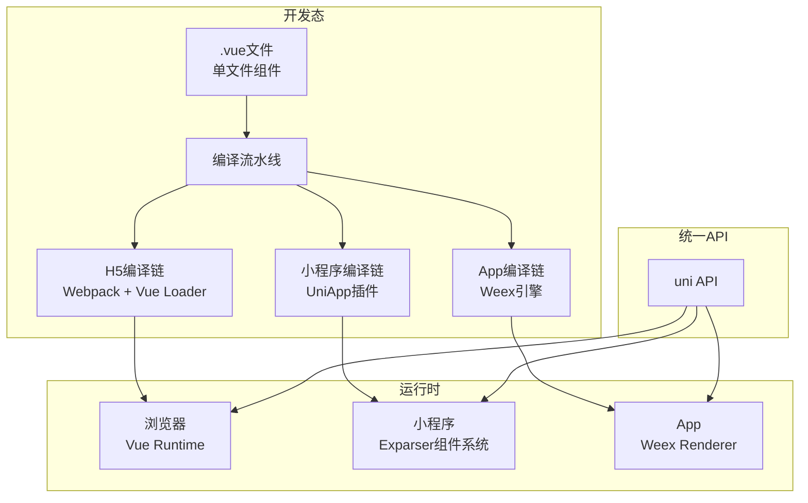
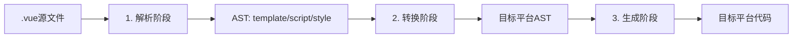

> UniApp是当前国内使用最广泛的跨端框架之一——它不是运行时桥接方案，而是将Vue组件编译为各平台目标代码的静态编译方案。本文从编译原理视角，完整揭示UniApp如何把一套Vue代码转化为App、小程序和H5三端运行的可执行产物。

## 一、背景与意义

### 跨端框架的分类

当前跨端方案可以归为两大类：

1. **运行时桥接**：React Native、Flutter——在JS/Flutter引擎层和Native层之间建立通信桥，运行时解释执行
2. **编译时转换**：UniApp、Taro 3、MPVue——将框架代码编译为各平台的"方言"代码，目标平台用其原生方式运行

UniApp选择了第二条路，它的核心逻辑是：**写Vue，出一切**。

### 为什么需要编译时方案？

UniApp的设计动机来自一个现实痛点：小程序生态是中国移动互联网的基础设施。一个电商App可能同时需要iOS App、Android App、微信小程序、支付宝小程序、百度小程序、头条小程序——6个不同的平台。

如果用传统方式，开发者需要维护6套代码。UniApp通过编译时转换，把Uin-App应用编译为：

```
┌─ UniApp源码 (Vue + 条件编译)
├──┬─ H5 (纯Vue，浏览器运行)
│  ├─ 微信小程序 (WXML + WXSS + JS)
│  ├─ 支付宝小程序 (AXML + ACSS + JS)
│  ├─ 百度小程序 (SWAN + CSS + JS)
│  └─ App端 (Vue + Weex渲染引擎，打包为APK/IPA)
└── 以及快应用等其他平台
```

## 二、概念与定义

### 2.1 UniApp的核心架构



### 2.2 与其他跨端方案的对比

| 维度 | UniApp | Taro 3 | React Native | Flutter |
|------|--------|--------|-------------|---------|
| 编译方式 | 编译时 | 编译时/运行时混合 | 运行时桥接 | 运行时自绘 |
| UI框架 | Vue | React | React | 自研Widget |
| 小程序支持 | 原生小程序 | 原生小程序 | ❌ | ❌ |
| H5支持 | Vue SPA | React SPA | 通过react-native-web | ❌ |
| Native App | Weex引擎 | 有限支持 | 原生渲染 | 自绘渲染 |
| 包体积 | 中（~200KB+） | 中 | ~3MB | ~5MB |
| 学习成本 | 低（Vue生态） | 中（React生态） | 中（React+原生） | 高（Dart） |

## 三、最小示例

### 3.1 UniApp的"一次编写，多端运行"

```vue
<!-- pages/index/index.vue -->
<template>
  <view class="container">
    <view class="header">
      <text class="title">{{ title }}</text>
      <!-- 条件编译：只有App端生效 -->
      <!-- #ifdef APP-PLUS -->
      <button type="primary" @click="handleNativeCall">
        调用原生能力
      </button>
      <!-- #endif -->
    </view>

    <uni-card 
      v-for="item in list" 
      :key="item.id"
      :title="item.name"
      :extra="item.desc"
      @click="handleCardClick(item)"
    />

    <!-- 条件编译：只在微信小程序中显示 -->
    <!-- #ifdef MP-WEIXIN -->
    <view class="weapp-only">
      <button open-type="share">分享到微信</button>
      <button open-type="contact">联系客服</button>
    </view>
    <!-- #endif -->

    <!-- 条件编译：只在支付宝小程序中显示 -->
    <!-- #ifdef MP-ALIPAY -->
    <view class="alipay-only">
      <button open-type="share">吱口令分享</button>
    </view>
    <!-- #endif -->
  </view>
</template>

<script>
export default {
  data() {
    return {
      title: '今日推荐',
      list: [],
    };
  },
  onLoad() {
    // uni-app 统一的生命周期——编译后映射为各平台的对应钩子
    this.loadData();
  },
  // onShow/onHide等小程序特有生命周期，uni-app统一封装
  onShow() {
    console.log('页面显示');
  },
  methods: {
    async loadData() {
      // 统一API：uni.request → 编译后变为 wx.request / my.request / fetch
      const res = await uni.request({
        url: 'https://api.example.com/products',
        method: 'GET',
      });
      this.list = res.data;
    },
    handleCardClick(item) {
      uni.navigateTo({
        url: `/pages/detail/detail?id=${item.id}`,
      });
    },
    // #ifdef APP-PLUS
    handleNativeCall() {
      // App端独有的API，通过plus对象访问
      plus.device.getInfo({
        success: (info) => {
          uni.showToast({ title: `设备: ${info.model}` });
        },
      });
    },
    // #endif
  },
};
</script>

<style>
.container { padding: 20rpx; }
.header { margin-bottom: 30rpx; }
.title { font-size: 36rpx; font-weight: bold; }
</style>
```

### 3.2 编译后的产物对比

```html
<!-- 编译为微信小程序产物：pages/index/index.wxml -->
<view class="container">
  <view class="header">
    <text class="title">{{title}}</text>
    <!-- App端条件编译内容已被删除 -->
  </view>
  
  <!-- uni-card编译为微信小程序自定义组件 -->
  <uni-card 
    wx:for="{{list}}" 
    wx:key="id"
    title="{{item.name}}"
    extra="{{item.desc}}"
    bind:click="handleCardClick"
  />
  
  <!-- 微信独有的open-type -->
  <view class="weapp-only">
    <button open-type="share">分享到微信</button>
    <button open-type="contact">联系客服</button>
  </view>
</view>
```

```javascript
// 编译为微信小程序产物：pages/index/index.js
const { UniPage } = require('@uni/runtime');

// Vue模板编译为WXML，Vue逻辑编译为Page()构造器
Page({
  data: {
    title: '今日推荐',
    list: [],
  },
  onLoad() {
    this.loadData();
  },
  onShow() {
    console.log('页面显示');
  },
  loadData() {
    const self = this;
    wx.request({
      url: 'https://api.example.com/products',
      method: 'GET',
      success(res) {
        self.setData({ list: res.data });
      },
    });
  },
  handleCardClick(event) {
    const item = event.currentTarget.dataset.item;
    wx.navigateTo({
      url: `/pages/detail/detail?id=${item.id}`,
    });
  },
});
```

```html
<!-- 编译为H5产物 -->
<!-- UniApp转成了标准Vue SFC，由Vue Loader处理 -->
<template>
  <div class="uni-container">
    <div class="header">
      <span class="title">{{ title }}</span>
    </div>
    <div 
      class="uni-card" 
      v-for="item in list" 
      :key="item.id"
      @click="handleCardClick(item)"
    >
      <div class="uni-card-header">{{ item.name }}</div>
      <div class="uni-card-body">{{ item.desc }}</div>
    </div>
  </div>
</template>
```

## 四、核心知识点拆解

### 4.1 编译时转换的核心机制

UniApp的编译流水线分为三个主要阶段：



**阶段一：解析（Parse）**

```javascript
// Vue SFC解析器的简化流程
function parseVue(source) {
  // 1. 分离template/script/style
  const sfc = {
    template: extractTag(source, 'template'),
    script: extractTag(source, 'script'),
    style: extractTag(source, 'style'),
  };
  
  // 2. Vue模板编译为AST
  sfc.templateAST = VueCompiler.compile(sfc.template, {
    // 平台相关的指令编译
    directives: {
      // v-if → wx:if / a:if / v-if (H5)
      if: platform === 'weixin' ? 'wx:if' 
        : platform === 'alipay' ? 'a:if' 
        : 'v-if',
      // v-for → wx:for / a:for / v-for (H5)
      for: platform === 'weixin' ? 'wx:for' 
        : platform === 'alipay' ? 'a:for' 
        : 'v-for',
    },
  });
  
  // 3. JavaScript编译（Babel + 平台插件）
  sfc.scriptAST = Babel.transform(sfc.script, {
    plugins: [
      // 转换import为require
      // 转换Vue API为uni API
      platformPlugin(platform),
    ],
  });
  
  return sfc;
}
```

**阶段二：转换（Transform）**

```javascript
// Vue模板到小程序的编译转换
function transformToMiniProgram(templateAST, platform) {
  const translator = new TemplateTranslator(platform);
  
  // 递归遍历AST节点进行转换
  return translator.transform(templateAST, {
    // 标签映射
    tagMapping: {
      'div': 'view',
      'span': 'text',
      'img': 'image',
      'p': 'view',
      'ul': 'view',
      'li': 'view',
      'a': 'navigator',
      'button': 'button',
    },
    
    // 属性映射
    attrMapping: {
      'v-if': 'wx:if',
      'v-else': 'wx:else',
      'v-for': 'wx:for',
      'v-bind:key': 'wx:key',
      '@click': 'bindtap',
      ':class': 'class',
      ':style': 'style',
    },
    
    // 事件处理器转换
    eventMapping: {
      'click': 'tap',
      'touchstart': 'touchstart',
      'touchmove': 'touchmove',
      'touchend': 'touchend',
      'longpress': 'longpress',
    },
    
    // 样式单位转换
    unitMapping: {
      'px': 'rpx',   // px转rpx（H5标准转向小程序适配）
      'rem': 'rpx',
      'vh': 'vh',     // 保留
      'vw': 'vw',     // 保留
    },
  });
}

// 虚拟列表等Vue组件生命周期到小程序生命周期的映射
const lifecycleMapping = {
  // Vue → 小程序
  'beforeCreate': 'created',
  'created': 'attached',      // 对应Component的attached
  'beforeMount': 'ready',
  'mounted': 'ready',
  'beforeUpdate': '',          // 小程序无对应
  'updated': '',
  'beforeDestroy': 'detached',
  'destroyed': 'detached',
  
  // 页面特有
  'onLoad': 'onLoad',
  'onShow': 'onShow',
  'onHide': 'onHide',
  'onReady': 'onReady',
  'onUnload': 'onUnload',
};
```

**阶段三：生成（Generate）**

```javascript
function generateCode(transformedAST, platform) {
  if (platform.startsWith('mp-')) {
    return {
      // 生成WXML/SWAN/AXML
      template: generateTemplate(transformedAST, platform),
      // 生成WXSS/ACSS/CSS
      style: generateStyle(transformedAST.style, platform),
      // 生成Page/Component构造器代码
      script: transformScript(transformedAST.script, platform),
      // 生成JSON配置
      config: {
        component: true,
        usingComponents: extractDependencies(transformedAST),
      },
    };
  } else if (platform === 'h5') {
    // H5直接输出标准Vue SFC
    return transformedAST;
  } else if (platform === 'app-plus') {
    // App端使用Weex渲染引擎，输出Vue + Weex兼容包装
    return transformToWeex(transformedAST);
  }
}
```

### 4.2 条件编译的实现

条件编译是UniApp最实用的特性之一，它通过预处理指令在编译阶段移除目标平台不需要的代码：

```vue
<!-- 条件编译语法 -->
<!-- #ifdef MP-WEIXIN -->   // "如果定义了"——仅当编译目标为微信小程序
<!-- #ifndef H5 -->         // "如果未定义"——编译目标不是H5时
<!-- #ifdef APP-PLUS || MP-WEIXIN -->  // 逻辑或
<!-- #endif -->             // 结束
```

```javascript
// 条件编译的源码级实现（Webpack Loader）
function conditionCompile(source, platform) {
  // 定义当前平台的标识
  const platformDefines = {
    'MP-WEIXIN': platform === 'weixin',
    'MP-ALIPAY': platform === 'alipay',
    'MP-BAIDU': platform === 'baidu',
    'APP-PLUS': platform === 'app-plus',
    'H5': platform === 'h5',
    'MP': platform.startsWith('mp-'),
  };
  
  // 逐行扫描处理条件编译指令
  const lines = source.split('\n');
  const output = [];
  let inBlock = true;   // 当前行是否应该输出
  let conditionStack = [{ type: 'if', evalResult: true, output: true }];
  
  for (const line of lines) {
    const trimmed = line.trim();
    
    if (trimmed.startsWith('<!-- #ifdef')) {
      // 解析条件
      const condition = parseCondition(trimmed);
      const result = evaluateCondition(condition, platformDefines);
      conditionStack.push({ type: 'if', evalResult: result, output: result });
    } else if (trimmed.startsWith('<!-- #ifndef')) {
      const condition = parseCondition(trimmed);
      const result = !evaluateCondition(condition, platformDefines);
      conditionStack.push({ type: 'if', evalResult: result, output: result });
    } else if (trimmed === '<!-- #endif -->') {
      conditionStack.pop();
    } else if (trimmed === '<!-- #else -->') {
      // 反转最近一个条件的输出
      const last = conditionStack[conditionStack.length - 1];
      if (last.type === 'if') {
        last.output = !last.evalResult;
      }
    }
    
    // 检查当前是否应该在输出中
    const shouldOutput = conditionStack.every(s => s.output);
    if (shouldOutput || trimmed.startsWith('<!-- #')) {
      output.push(line);
    } else {
      // 条件不满足的代码行被完全移除（不是注释掉）
      // 这样编译产物中完全没有目标平台以外的代码
    }
  }
  
  return output.join('\n');
}
```

### 4.3 uni API的统一封装

```javascript
// uni.request 的实现层（编译时多态）
// 在不同平台下，uni.request编译/运行时绑定到不同的底层实现

// 微信小程序实现
function requestWeixin(options) {
  return new Promise((resolve, reject) => {
    wx.request({
      url: options.url,
      method: options.method || 'GET',
      data: options.data,
      header: options.header,
      dataType: options.dataType || 'json',
      success: (res) => {
        resolve({ 
          data: res.data, 
          statusCode: res.statusCode,
          header: res.header,
        });
      },
      fail: (err) => reject(err),
    });
  });
}

// H5实现（使用fetch）
function requestH5(options) {
  return fetch(options.url, {
    method: options.method || 'GET',
    headers: options.header || {},
    body: options.data ? JSON.stringify(options.data) : undefined,
  }).then(async (response) => {
    const data = await response.json();
    return {
      data,
      statusCode: response.status,
      header: Object.fromEntries(response.headers.entries()),
    };
  });
}

// App端实现（Weex stream API）
function requestApp(options) {
  return new Promise((resolve, reject) => {
    plus.network.request(options.url, {
      method: options.method,
      data: options.data,
    }, (res) => resolve(res), (err) => reject(err));
  });
}

// 编译时根据平台选择对应实现
// 或运行时通过adapter动态选择
export const request = platformAdapters[PLATFORM] || requestH5;
```

### 4.4 App端的Weex渲染原理

UniApp在App端使用Weex作为渲染引擎——它的核心思路是"Vue组件 → Native UI"。

```javascript
// 在App端，uni-app的Vue组件被渲染为Native组件
// 例如：<view> 被映射为 Weex的 <div>
// <text> 被映射为 Weex的 <text>
// <image> 被映射为 Weex的 <image>

// Weex的核心：JS Runtime + Native Renderer
// JS层：Vue Runtime
// Bridge层：Weex JS Bridge（类似React Native的Bridge）
// Native层：iOS/Android原生组件

// Weex的布局引擎使用Flexbox（这与小程序一致）
// 所以UniApp在小程序和App端都能使用flex布局
```

## 五、实战案例：将现有Vue项目迁移到UniApp

### 5.1 迁移策略

```javascript
// 迁移前后的代码对比

// 迁移前：标准Vue项目
// src/views/ProductList.vue
<template>
  <div class="product-list">
    <div v-for="product in products" :key="product.id" class="product-card">
      
      <h3>{{ product.name }}</h3>
      <p>¥{{ product.price.toFixed(2) }}</p>
      <button @click="addToCart(product)">加入购物车</button>
    </div>
  </div>
</template>

<script>
import axios from 'axios';

export default {
  data() {
    return { products: [] };
  },
  created() {
    // Vue Router获取参数
    const categoryId = this.$route.query.categoryId;
    axios.get(`/api/products?categoryId=${categoryId}`)
      .then(res => { this.products = res.data; });
  },
  methods: {
    addToCart(product) {
      this.$router.push({ name: 'Cart', params: { productId: product.id } });
    },
  },
};
</script>

<style scoped>
.product-card { border: 1px solid #eee; padding: 12px; }
.product-card img { width: 100%; height: 200px; }
h3 { font-size: 16px; color: #333; }
</style>
```

```vue
<!-- 迁移后：UniApp版本 -->
<template>
  <view class="product-list">
    <view 
      v-for="product in products" 
      :key="product.id" 
      class="product-card"
      @click="handleCardClick(product)"
    >
      <image :src="product.image" mode="widthFix" class="product-image" />
      <view class="product-info">
        <text class="product-name">{{ product.name }}</text>
        <text class="product-price">¥{{ product.price.toFixed(2) }}</text>
        <!-- App端和小程序端按钮样式统一 -->
        <button 
          size="mini" 
          type="default" 
          @click.stop="addToCart(product)"
          class="cart-btn"
        >
          加入购物车
        </button>
      </view>
    </view>
  </view>
</template>

<script>
export default {
  data() {
    return { products: [] };
  },
  onLoad(query) {
    // 统一的onLoad生命周期——不管是页面还是组件都可用
    const categoryId = query.categoryId;
    uni.request({
      url: '/api/products',
      data: { categoryId },
      success: (res) => {
        this.products = res.data;
      },
    });
  },
  methods: {
    handleCardClick(product) {
      uni.navigateTo({
        url: `/pages/detail/detail?id=${product.id}`,
      });
    },
    addToCart(product) {
      // 调用统一API
      uni.showToast({ title: '已加入购物车', icon: 'success' });
      
      // 通过Vuex或uni.$emit共享状态
      uni.$emit('cart-update', product);
    },
  },
};
</script>

<style>
.product-card { 
  display: flex; 
  padding: 12rpx; 
  border-bottom: 1rpx solid #eee; 
}
.product-image { width: 200rpx; height: 200rpx; }
.product-info { flex: 1; margin-left: 20rpx; }
.product-name { font-size: 28rpx; color: #333; }
.product-price { font-size: 32rpx; color: #ff4500; font-weight: bold; }
.cart-btn { margin-top: 16rpx; }
</style>
```

## 六、底层原理

### 6.1 编译时转换vs运行时适配

UniApp选择了编译时方案而非运行时方案的深层原因：

```javascript
// 运行时方案的复杂度
// 如果采用"运行时适配"（即运行时判断当前环境，动态适配API），
// 需要：
// 1. 在JS层统一所有平台的语法差异
// 2. 运行时维护一个"虚拟视图层"做数据绑定
// 3. 将虚拟视图的变化映射到各平台

// 运行时方案的问题：
// 1. 代码包体积大（需要携带所有平台的适配代码）
// 2. 性能损耗（多了一层抽象，setData更慢）
// 3. 某些平台特性无法抽象（小程序open-type等）

// 编译时方案的优势：
// 1. 产物体积小（只包含目标平台代码）
// 2. 零运行时抽象损耗（编译后就是原生代码）
// 3. 支持条件编译处理平台差异
// 4. 兼容各平台特有API和特性

// 编译时方案的代价：
// 1. 调试困难（开发者看到的是编译后的代码）
// 2. 编译规则复杂（新平台需要更新编译插件）
// 3. 热更新受限（小程序需审核）
```

### 6.2 Vue 2 vs Vue 3在UniApp中的差异

```javascript
// UniApp 2.x基于Vue 2，UniApp 3.x（alpha）基于Vue 3
// 关键区别：

// Vue 2时代的UniApp（当前主流）：
// - Options API
// - 不支持Composition API（需要额外插件）
// - 编译优化有限（静态节点不标记）

// Vue 3时代的UniApp（UniApp 3.x）：
// - Composition API (setup语法)
// - Tree-shaking（只打包用到的API）
// - 编译优化（静态提升、PatchFlags）
// - 更好的TypeScript支持

// 实际迁移示例
// Vue 2 (UniApp 2.x)
export default {
  data() { return { count: 0 }; },
  computed: {
    double() { return this.count * 2; },
  },
  methods: {
    increment() { this.count++; },
  },
};

// Vue 3 (UniApp 3.x alpha)
<script setup>
import { ref, computed } from 'vue';
const count = ref(0);
const double = computed(() => count.value * 2);
const increment = () => count.value++;
</script>
```

## 七、高频面试题解析

**Q1: UniApp如何处理Vue的虚拟DOM和响应式系统？**

A：UniApp对于不同目标平台的处理方式不同：
- H5端：直接使用Vue的完整虚拟DOM和响应式系统，没有任何差异
- 小程序端：UniApp将Vue的响应式系统映射为小程序的setData机制。Vue中的数据变化会触发setData，setData再触发渲染层更新。这导致了一个微妙的差异：Vue的nextTick和微信的setData回调时序不同，UniApp做了额外的同步处理
- App端（Weex）：使用Vue + Weex Bridge，Vue的响应式通过Bridge到达Weex的Native渲染层

**Q2: UniApp的条件编译和Webpack的DefinePlugin有什么区别？**

A：DefinePlugin是运行时的变量替换，而UniApp的条件编译是**编译时的代码移除**。区别在于：
1. 条件编译的代码在编译产物中完全不存在（不是被条件判断包裹，而是被删除）
2. DefinePlugin替换后可能还存在于压缩前的代码中
3. 条件编译支持移除模板、样式和脚本三个层面，DefinePlugin只处理脚本层面的变量

**Q3: UniApp为什么能在小程序中复用Vue的组件化思想？**

A：通过编译时转换，UniApp将Vue组件的三个部分分别映射为小程序自定义组件的对应文件：
- template → WXML（标签、指令全部转换）
- script → JS（Page/Component构造器）
- style → WXSS（px → rpx，兼容样式属性）

由于小程序自定义组件本身就有生命周期、属性、事件机制，Vue组件的概念可以被直接映射。

**Q4: UniApp App端性能和原生开发差多少？**

A：UniApp App端（Weex渲染引擎）在简单列表、表单场景下性能接近原生（95%-98%），但在复杂动画、大量图片、地图等场景下比原生慢10%-30%。瓶颈主要在于JS Bridge通信开销。如果追求极致性能，建议对核心功能使用Native扩展（uni-app原生插件）。

## 八、总结与扩展

UniApp不是一个普通的跨端框架——它是一个**编译平台**：

1. **语法层面**：用Vue语法编写，通过编译生成各平台方言
2. **能力层面**：统一API适配多端，条件编译处理平台差异
3. **生态层面**：支持uni_modules插件市场，组件和模板可以跨端共享

**适合用UniApp的场景**：
- 需要同时维护多个小程序（微信、支付宝、头条等）
- 已有Vue技术栈，快速切入移动端
- 中小型项目，对极致性能不敏感

**不适合用UniApp的场景**：
- 重度依赖Native能力的应用（AR/VR、高帧率游戏）
- 对包体积敏感的场景（UniApp运行时约200KB+）
- 需要频繁热更新、灰度发布的小程序（小程序审核周期）

**未来方向**：UniApp 3.x + Vue 3 + Vite的编译流水线将带来更快的构建速度和更小的包体积，uni-app x（使用uts语言）正在试水直接编译到各端原生代码，完全不依赖WebView渲染——这是跨端框架的未来方向。
