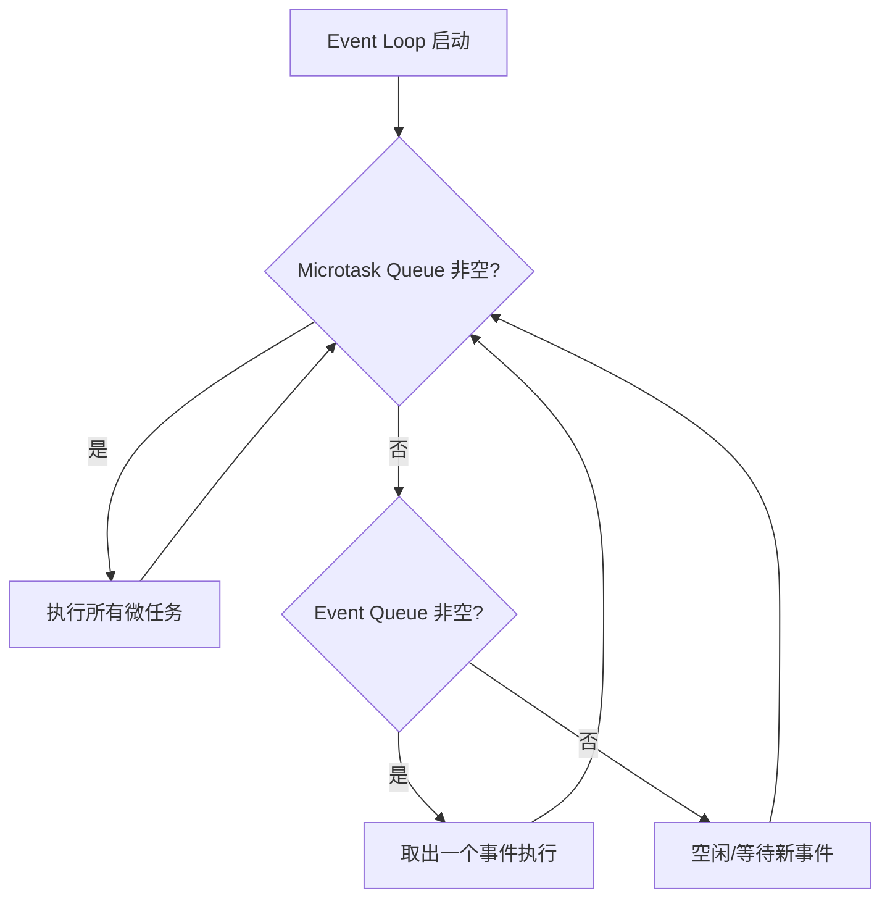

## 一句话概括

Dart 的 async/await 并非简单的语法糖，而是一套基于事件循环（Event Loop）、微任务队列（Microtask Queue）和 Future 链式调用的协作式异步调度系统，其底层通过状态机转换实现协程挂起与恢复。

## 背景与意义

在 Flutter 与 Dart 的跨端开发实践中，异步编程几乎是每一行代码都绕不开的核心命题。无论是网络请求、文件读写、数据库查询还是动画帧调度，Dart 的异步机制决定了应用的响应速度与开发体验。

很多从 JavaScript 转来的开发者会以为 Dart 的 async/await 和 JS 的 Promise 如出一辙，但实际上 Dart 的异步模型有其独特的设计取舍：单线程事件循环 + 隔离区（Isolate）的 actor 模型，让开发者几乎不需要担心显式的锁竞争，却仍能获得接近原生多线程的性能表现。

理解 async/await 的实现机制，不仅帮助你写出更高效的 Flutter 代码，更能让你在遇到诡异的异步 Bug（比如 setState 在 dispose 后调用、BuildContext 在异步回调中失效）时，迅速定位根因。

## 概念与定义

### Future

`Future<T>` 代表一个**将来会完成**的异步任务，其状态有三种：

- **Uncompleted**：任务尚未完成，等待中
- **Completed with value**：任务成功完成，携带类型为 T 的值
- **Completed with error**：任务执行中抛出了异常

```dart
Future<String> fetchUserData() {
  return Future.delayed(Duration(seconds: 2), () => '{"name": "Alice"}');
}
```

### Stream

`Stream<T>` 代表一系列异步事件的序列，与 Future 的一次性交付不同，Stream 可以多次交付数据。后面会单独成篇分析。

### async / await

`async` 标记一个函数为异步函数，使其返回值自动被包装成 `Future`。`await` 用于等待一个 Future 完成，同时挂起当前函数但**不阻塞线程**。

### Event Loop（事件循环）

Dart 的运行时维护着一个事件循环，不断从事件队列中取出任务执行。这是整个异步调度的心脏。

## 最小示例

```dart
Future<void> simulateNetworkCall() async {
  print('① 开始网络请求...');
  await Future.delayed(Duration(seconds: 1));
  print('② 网络请求完成');
}

void main() async {
  print('⏰ 程序启动');
  await simulateNetworkCall();
  print('③ main 函数结束');
}
```

输出顺序：

```
⏰ 程序启动
① 开始网络请求...
② 网络请求完成
③ main 函数结束
```

这段代码看起来是顺序执行的，但实际上 `Future.delayed` 将②的打印任务放入了事件队列，main 函数本身的 `await` 挂起了 main 的执行上下文。

## 核心知识点拆解

### 1. async 函数 → 状态机转换

Dart 编译器遇到 `async` 关键字时，会将函数体编译成一个**状态机**。每个 `await` 表达式都是一个挂起点，也是状态机的一个状态转换边界。

```dart
Future<int> computeHeavy() async {
  final a = await fetchFromCache('key_a');
  final b = await fetchFromCache('key_b');
  return a + b;
}
```

编译器会将其转换为类似以下的结构（伪代码示意）：

```dart
Future<int> computeHeavy() {
  final completer = Completer<int>();
  int a, b;
  void Function() step1, step2, step3;

  step1 = () {
    fetchFromCache('key_a').then((value) {
      a = value;
      scheduleMicrotask(step2);  // 进入下一个状态
    });
  };

  step2 = () {
    fetchFromCache('key_b').then((value) {
      b = value;
      scheduleMicrotask(step3);
    });
  };

  step3 = () {
    completer.complete(a + b);
  };

  scheduleMicrotask(step1);
  return completer.future;
}
```

虽然实际编译结果更复杂（涉及 _Future 的内部实现），但状态机模型是核心思想。

### 2. 事件循环的双队列模型

Dart 事件循环维护两个队列：

```
┌─────────────────────────────────────────┐
│           Event Loop                     │
├─────────────────────────────────────────┤
│  ① Microtask Queue（微任务队列，高优先级）  │
│     - scheduleMicrotask() 添加            │
│     - Future.then() 回调                  │
│     - async 函数的恢复点                   │
├─────────────────────────────────────────┤
│  ② Event Queue（事件队列，低优先级）        │
│     - I/O 完成回调                        │
│     - 定时器回调                           │
│     - 用户交互事件                         │
│     - 网络响应                            │
└─────────────────────────────────────────┘
```



**关键规则**：一个事件循环 tick 中，**所有微任务执行完毕**后，才会处理下一个事件队列的任务。这意味着微任务可以"插队"事件。

### 3. await 的"微任务"调度本质

当一个 `Future` 完成时（无论成功还是失败），它的 `.then()` 回调默认通过 `scheduleMicrotask` 调度。这意味着：

```dart
Future<void> demo() async {
  print('A');
  Future(() => print('D'));  // 事件队列任务
  await Future.microtask(() => print('B'));  // 微任务
  print('C');
}

void main() => demo();
// 输出: A → B → C → D
```

这里 `await Future.microtask(...)` 完成时，恢复 async 函数的回调也是通过微任务调度的，所以 C 打印在 D 之前——即使 Future 构造函数的任务先被"注册"。

### 4. synchronousAsync 与消锯齿优化

Dart 2.19 引入了 `synchronousAsync` 优化。当一个 `async` 函数体内没有任何 `await` 挂起点时，编译器可以将其编译为纯同步调用：

```dart
Future<int> noAwaitInside() async {
  return 42;  // 编译器识别到没有 await，可直接同步返回
}
```

这看起来像是一个 trivial 的优化，但在 Flutter widget 的 build 方法中频繁出现——很多 build 方法只是返回一个 widget 树，不存在异步逻辑，编译器可以省略状态机生成的额外开销。

## 实战案例

### 案例 1：await 顺序陷阱——瀑布式请求优化

```dart
// ❌ 错误写法：顺序 await 导致瀑布式延迟
Future<List<String>> fetchUserAndPostsBad(String userId) async {
  final user = await fetchUser(userId);       // 等 300ms
  final posts = await fetchPosts(userId);     // 再等 300ms
  return [user, ...posts];                     // 总计 600ms
}

// ✅ 正确写法：无依赖的 Future 并行执行
Future<List<String>> fetchUserAndPostsGood(String userId) async {
  final userFuture = fetchUser(userId);
  final postsFuture = fetchPosts(userId);
  
  final user = await userFuture;   // 两个 Future 同时开始
  final posts = await postsFuture; // 此时几乎已可用
  return [user, ...posts];          // 总计 ≈ 300ms
}
```

### 案例 2：Completer 手动控制 Future 完成

```dart
class ImagePreloader {
  final Map<String, Completer<ui.Image>> _cache = {};

  Future<ui.Image> loadImage(String url) async {
    // 如果已经在加载中，复用同一个 Future
    if (_cache.containsKey(url)) {
      return _cache[url]!.future;
    }

    final completer = Completer<ui.Image>();
    _cache[url] = completer;

    try {
      final image = await _decodeImage(url);
      completer.complete(image);
    } catch (e) {
      completer.completeError(e);
      _cache.remove(url);  // 失败时清理缓存
    }

    return completer.future;
  }
}
```

### 案例 3：超时控制——Future.any 与 Timeout 结合

```dart
Future<T> withTimeout<T>({
  required Future<T> Function() task,
  required Duration timeout,
  T Function()? onTimeout,
}) async {
  try {
    final result = await task().timeout(
      timeout,
      onTimeout: () => throw TimeoutException('操作超时'),
    );
    return result;
  } on TimeoutException {
    if (onTimeout != null) return onTimeout();
    rethrow;
  }
}

// 使用场景：API 请求兜底
Future<UserProfile> loadProfile(String id) async {
  return withTimeout(
    task: () => api.fetchProfile(id),
    timeout: Duration(seconds: 5),
    onTimeout: () => UserProfile.empty(),  // 超时时返回空数据
  );
}
```

### 案例 4：async 闭包内的生命周期管理（Flutter 特有）

```dart
class ProfileWidget extends StatefulWidget {
  @override
  State<ProfileWidget> createState() => _ProfileWidgetState();
}

class _ProfileWidgetState extends State<ProfileWidget> {
  String? _data;
  bool _disposed = false;

  @override
  void dispose() {
    _disposed = true;
    super.dispose();
  }

  Future<void> _loadData() async {
    final data = await api.fetchProfile();
    if (!_disposed && mounted) {
      setState(() => _data = data);
    }
  }

  @override
  Widget build(BuildContext context) {
    return ElevatedButton(
      onPressed: _loadData,
      child: Text('加载'),
    );
  }
}
```

这是面试高频场景：**await 之后调用 setState 必须检查 mounted**。原因在于 await 挂起期间，Widget 可能已经 dispose，此时调用 setState 会抛出 `flushed` 异常。

## 底层原理

### Dart VM 中的异步实现

Dart 的 async/await 在 VM 层面由两部分协作实现：

1. **编译器前端**：将 async 函数体识别并转换为状态机
2. **运行时库**：`_Future` 内部类和 `_EventLoop` 提供调度

#### _Future 内部流转

```dart
// 简化版 _Future 实现逻辑
class _Future<T> implements Future<T> {
  _State _state = _State.pending;
  T? _result;
  List<_Listener> _listeners = [];

  void _setValue(T value) {
    _state = _State.completed;
    _result = value;
    _propagateToListeners();
  }

  void _propagateToListeners() {
    for (final listener in _listeners) {
      _scheduleMicrotask(() {
        listener.onValue(_result);
      });
    }
  }

  Future<R> then<R>(FutureOr<R> Function(T) onValue, {Function? onError}) {
    final result = _Future<R>();
    _listeners.add(_Listener(
      onValue: (value) {
        try {
          final next = onValue(value);
          if (next is Future<R>) {
            next.then((v) => result._setValue(v));
          } else {
            result._setValue(next as R);
          }
        } catch (e) {
          result._setError(e);
        }
      },
      onError: onError,
    ));
    return result;
  }
}
```

### 协程概念在 Dart 中的体现

Dart 不是严格意义上的协程语言（如 Lua 的对称协程），但 async/await 实现了**有限协程（delimited continuations）**的关键能力：

- **挂起点**：每个 `await` 表达式
- **恢复**：Future 完成后的微任务调度
- **状态保存**：栈帧中的局部变量被提升为状态机中的字段
- **无栈特性**：挂起只需要保存寄存器/局部变量，不涉及整个调用栈的切换

### 与 JavaScript 的对比

| 特性 | Dart | JavaScript |
|------|------|------------|
| 事件循环 | 双队列（微任务+事件） | 微任务+宏任务 |
| async 函数返回值 | Future<T> | Promise<T> |
| 微任务调度 | scheduleMicrotask | queueMicrotask |
| 并行 | Isolate（独立堆+线程） | Web Worker（分离全局） |
| 异常处理 | try/catch 无缝 | try/catch 无缝 |
| await 后上下文 | 需检查 mounted | 无此概念 |

## 高频面试题解析

### Q1：Future 构造函数 vs Future.microtask vs Future.value 的区别？

```dart
Future(() => print('A'));            // 压入事件队列
Future.microtask(() => print('B'));  // 压入微任务队列
Future.value(1).then((v) => print('C')); // 立即 then，压入微任务
Future.sync(() => print('D'));       // 同步执行！
```

输出顺序：`D → B → C → A`

理由：
- `Future.sync` 的闭包是同步执行的（在当前微任务中完成）
- `Future.microtask` 立即压入微任务队列
- `Future.value(1)` 的 `.then()` 也走微任务（但晚于 B？实际顺序取决于上下文，通常 B 先）
- `Future()` 压入事件队列，最后执行

### Q2：await 在循环中会阻塞事件循环吗？

```dart
for (int i = 0; i < 1000; i++) {
  await Future.delayed(Duration.zero);
  print(i);
}
```

**不会阻塞事件循环**。每个 `await` 会让 async 函数挂起，事件循环有机会处理其他事件。但这 1000 个微任务会连续执行，可能让 UI 掉帧。优化方式：

```dart
for (int i = 0; i < 1000; i++) {
  await Future.delayed(Duration(milliseconds: 16));  // 每帧只处理一部分
  print(i);
}
```

### Q3：为什么 Future 的 then 链中抛出异常需要 catchError 而不是 try-catch？

```dart
Future<void> example() {
  return Future.value(42).then((v) {
    throw Exception('boom');
  }).catchError((e) {
    print('捕获到: $e');
  });
}
```

因为 `then` 返回的是一个新的 `Future`，异常发生在该 Future 内部，外层 try-catch 无法跨越 Future 边界。`catchError` 相当于 Promise 的 `.catch()`。

### Q4：async 函数中 finally 块会在什么时候执行？

```dart
Future<void> test() async {
  try {
    await Future.error('err');
  } finally {
    print('finally executed');
  }
}
```

`finally` 在 async 函数中会在 Future 完成后**立即执行**，即使 try 块中 await 了一个 error Future。这与同步代码的行为一致。

## 总结与扩展

### 核心要点

1. **async/await 不是魔法**：底层是状态机 + Completer + 微任务调度
2. **事件循环的双队列**：微任务队列优先于事件队列，决定了 await 恢复的时机
3. **并行而非并发**：单线程内 await 实现的是并发（交错执行），真正的并行需要 Isolate
4. **生命周期感知**：Flutter 中 await 后必须感知 Widget 生命周期

### 扩展阅读

- Dart 官方文档：[Asynchronous programming: futures, async, await](https://dart.dev/codelabs/async-await)
- Flutter 异步模式最佳实践：[Effective Asynchronous Programming](https://dart.dev/guides/language/effective-dart/async)
- 深入 `_Future` 源码：[sdk/lib/async/future_impl.dart](https://github.com/dart-lang/sdk/blob/main/sdk/lib/async/future_impl.dart)

### 下一步

理解 async/await 之后，下一篇文章将深入 Stream 流式编程——当数据不再是"一次性交付"，而是"持续流式到达"时，Dart 提供了哪些编程范式来应对？
