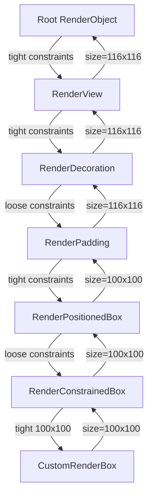
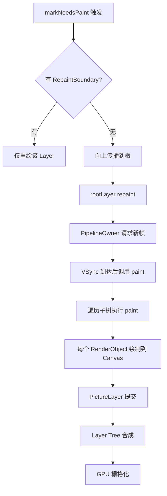

## 一句话概括

RenderObject 是 Flutter 渲染管线的执行者，它通过"父级传递约束、子级计算尺寸"的单向布局协议和"绘制上下文(PaintingContext)→Canvas→Layer"的三层绘制体系，将 Widget 的声明式描述转化为屏幕上的实际像素。

## 背景与意义

如果你写过 Flutter 的 `Container(width: 100, height: 100)`，你可能会疑惑：Container 没有尺寸约束时，这 100×100 是怎么确定的？为什么加了 `Center` 包裹后尺寸变化了？SizedBox 和 ConstrainedBox 区别在哪？

答案全部藏在 RenderObject 的布局协议中。

三棵树模型的最后一层——RenderObject 层，是 Flutter 自建渲染引擎的真正核心。在原生开发中，Android 的 View 系统有自己的 onMeasure/onLayout，iOS 的 UIView 有 layoutSubviews——而 Flutter 在所有这些平台之上，用自己的 RenderObject 统一了布局和绘制的行为。

理解 RenderObject 的布局与绘制，不仅能帮你写出高性能的自定义组件，还能让你在遇到"越界绘制"、"布局溢出"、"不必要的重绘"等性能问题时，准确找到优化方向。

## 概念与定义

### RenderObject

所有渲染对象的基类。它定义了 `layout`、`paint`、`hitTest` 等关键方法，但不规定具体的坐标系——渲染对象可以是 2D 的（RenderBox）、3D 的（未来支持）或其他自定义坐标系。

### RenderBox

继承 RenderObject，**引入了 2D 笛卡尔坐标系**。这是 Flutter 中最常用的渲染基类。所有你熟悉的 Widget——Container、Row、Column、Stack——其底层都是某种 RenderBox。

### BoxConstraints

RenderBox 的布局约束，包含四个边界值：

```dart
class BoxConstraints extends Constraints {
  final double minWidth;
  final double maxWidth;
  final double minHeight;
  final double maxHeight;
  
  const BoxConstraints({
    this.minWidth = 0.0,
    this.maxWidth = double.infinity,
    this.minHeight = 0.0,
    this.maxHeight = double.infinity,
  });
}
```

### PaintingContext

绘制上下文，封装了 Canvas 和 PictureLayer，是 RenderObject 进行实际绘制的入口。

### Layer

图层，Flutter 将渲染结果组织为图层树（Layer Tree）以支持高效的合成和重绘。

## 最小示例

```dart
import 'package:flutter/rendering.dart';
import 'package:flutter/material.dart';

// 一个最简单的自定义 RenderBox：绘制一个带边框的矩形
class CustomRenderBox extends RenderBox {
  @override
  void performLayout() {
    // 接收约束，决定尺寸
    // 如果我们想要 100x100：
    size = constraints.constrain(Size(100, 100));
    // 如果父级给了更小的约束，会取最小值
  }

  @override
  void paint(PaintingContext context, Offset offset) {
    final rect = offset & size;
    final canvas = context.canvas;
    
    // 绘制蓝色背景
    canvas.drawRect(rect, Paint()..color = Colors.blue);
    
    // 绘制红色边框
    canvas.drawRect(
      rect,
      Paint()
        ..color = Colors.red
        ..style = PaintingStyle.stroke
        ..strokeWidth = 2,
    );
  }

  @override
  bool hitTest(BoxHitTestResult result, {required Offset position}) {
    if (position.dx >= 0 && position.dx <= size.width &&
        position.dy >= 0 && position.dy <= size.height) {
      result.add(BoxHitTestEntry(this, position));
      return true;
    }
    return false;
  }
}

// 用 Widget 包装
class CustomBox extends SingleChildRenderObjectWidget {
  const CustomBox({super.key, super.child});

  @override
  RenderObject createRenderObject(BuildContext context) {
    return CustomRenderBox();
  }
}

// 使用
void main() {
  runApp(
    MaterialApp(
      home: Scaffold(
        body: Center(
          child: CustomBox(),
        ),
      ),
    ),
  );
}
```

## 核心知识点拆解

### 1. 布局协议：单向约束流



**关键规则**：

1. 父级传递 `BoxConstraints` 给子级（不是传递尺寸）
2. 子级在约束范围内决定自己的 `size`（不能超出约束）
3. 子级完成 `performLayout` 后，将 `size` 保存在 `RenderBox.size` 中
4. 父级可以读取子级的 `size`，用 `parentUsesSize` 标记是否需要监听子级尺寸变化

### 2. 约束类型的具体表现

```dart
// Tight（紧约束）：min == max
BoxConstraints.tight(Size(100, 100))
// → minWidth=100, maxWidth=100, minHeight=100, maxHeight=100
// → 子级只能接受 100x100，没有选择空间

// Loose（松约束）：min=0, max=约束值  
BoxConstraints.loose(Size(100, 100))
// → minWidth=0, maxWidth=100, minHeight=0, maxHeight=100
// → 子级可以选择 0 到 100 之间的任意尺寸

// Expand（展开）：min=约束值, max=infinity
const BoxConstraints.expand()
// → minWidth=infinity, maxWidth=infinity
// → 子级必须填满可用空间

// TightFor（显式指定一维的紧约束）
BoxConstraints.tightFor(width: 100)
// → minWidth=100, maxWidth=100, minHeight=0, maxHeight=infinity
```

```dart
// SizedBox(100, 100) 等价于 BoxConstraints.tight(Size(100,100))
// 所以 SizedBox 里的子级永远只知道"你必须是 100x100"

// Container(width: 100, height: 100) 使用 ConstrainedBox，
// 对子级施加 TightFor 约束，但如果 Container 有 child，child 的布局受 Container 的约束

// Center(child: Container...) 中 Center 传递松约束
// → Container 可以在可用范围内选择 100x100
// → 如果 Container 不指定尺寸，Center 让其保持自然尺寸（如 child text 的尺寸）
```

### 3. PerformLayout 的编写模式

```dart
// RenderBox 的 performLayout 通用模式
class MyLayoutBox extends RenderBox {
  RenderBox? get _child => firstChild as RenderBox?;

  @override
  void performLayout() {
    if (_child == null) {
      // 没有子级：直接决定自己的尺寸
      size = constraints.constrain(Size(100, 100));
      return;
    }

    // 有子级：计算子级的约束
    final childConstraints = BoxConstraints(
      minWidth: 0,
      maxWidth: constraints.maxWidth - 20,  // 左右各留 10px
      minHeight: 0,
      maxHeight: constraints.maxHeight - 20,
    );

    // 让子级布局
    _child!.layout(childConstraints, parentUsesSize: true);

    // 父级根据子级尺寸决定自身尺寸
    size = constraints.constrain(Size(
      _child!.size.width + 20,
      _child!.size.height + 20,
    ));
  }
}
```

### 4. Paint——将布局结果转化为绘制命令

```dart
abstract class RenderObject {
  // 当前帧是否需要重绘
  bool _needsPaint = true;
  
  // 是否已 painted（首次或 dirty 后）
  bool _isPainting = false;
  
  void paint(PaintingContext context, Offset offset);
  
  void markNeedsPaint() {
    _needsPaint = true;
    // 向父级传播
    // 如果有 RepaintBoundary，只重绘这个边界内的
  }
}
```

绘制流程：



### 5. Layers 与 RepaintBoundary

Flutter 将绘制结果组成 Layer Tree，以支持高效的局部重绘：

```dart
// OffsetLayer：绘制结果整体可以偏移（如滑动效果）
// PictureLayer：存储了绘制的图片/命令
// ClipRectLayer：带有裁剪效果
// TransformLayer：带有矩阵变换
// OpacityLayer：带有透明度效果
// RepaintBoundaryLayer：独立的绘制缓存
```

```dart
// RepaintBoundary 的实际作用
RepaintBoundary(
  child: ComplexWidget(),  // 这个子树在内容不变时不重绘
)
```

## 实战案例

### 案例 1：自定义流式布局——Wrap 简化版

```dart
class RenderSimpleFlow extends RenderBox
    with ContainerRenderObjectMixin<RenderBox, SimpleFlowParentData>,
         RenderBoxContainerDefaultsMixin<RenderBox, SimpleFlowParentData> {
  
  final double spacing;
  final double runSpacing;

  RenderSimpleFlow({
    List<RenderBox>? children,
    this.spacing = 8,
    this.runSpacing = 8,
  }) {
    addAll(children);
  }

  @override
  void setupParentData(RenderBox child) {
    if (child.parentData is! SimpleFlowParentData) {
      child.parentData = SimpleFlowParentData();
    }
  }

  @override
  void performLayout() {
    final constraints = this.constraints;
    final maxWidth = constraints.maxWidth;
    double currentX = 0;
    double currentY = 0;
    double maxHeightInRow = 0;

    RenderBox? child = firstChild;
    int index = 0;
    
    while (child != null) {
      // 每个子级先获取自己的约束
      child!.layout(constraints.loosen(), parentUsesSize: false);
      
      final childWidth = child!.size.width;
      final childHeight = child!.size.height;

      // 如果当前行放不下，换行
      if (currentX + childWidth > maxWidth && currentX > 0) {
        currentY += maxHeightInRow + runSpacing;
        currentX = 0;
        maxHeightInRow = 0;
      }

      // 记录子级位置
      final parentData = child!.parentData as SimpleFlowParentData;
      parentData.offset = Offset(currentX, currentY);

      currentX += childWidth + spacing;
      if (childHeight > maxHeightInRow) {
        maxHeightInRow = childHeight;
      }

      child = childAfter(child!);
      index++;
    }

    // 计算自身尺寸
    final totalHeight = currentY + maxHeightInRow;
    size = Size(constraints.maxWidth, totalHeight);
  }

  @override
  void paint(PaintingContext context, Offset offset) {
    defaultPaint(context, offset);
  }

  @override
  bool hitTestChildren(BoxHitTestResult result, {required Offset position}) {
    return defaultHitTestChildren(result, position: position);
  }
}

class SimpleFlowParentData extends ContainerBoxParentData<RenderBox> {}

// Widget 封装
class SimpleFlow extends MultiChildRenderObjectWidget {
  final double spacing;
  final double runSpacing;

  const SimpleFlow({
    super.key,
    required super.children,
    this.spacing = 8,
    this.runSpacing = 8,
  });

  @override
  RenderObject createRenderObject(BuildContext context) {
    return RenderSimpleFlow(spacing: spacing, runSpacing: runSpacing);
  }

  @override
  void updateRenderObject(BuildContext context, RenderSimpleFlow renderObject) {
    renderObject.spacing = spacing;
    renderObject.runSpacing = runSpacing;
  }
}

// 使用
SimpleFlow(
  spacing: 12,
  runSpacing: 8,
  children: [
    Container(width: 60, height: 60, color: Colors.red),
    Container(width: 100, height: 80, color: Colors.blue),
    Container(width: 80, height: 60, color: Colors.green),
    Container(width: 120, height: 100, color: Colors.orange),
    Container(width: 60, height: 60, color: Colors.purple),
  ],
)
```

### 案例 2：局部重绘优化——巧用 RepaintBoundary

```dart
class ChatScreen extends StatelessWidget {
  final List<Message> messages;

  @override
  Widget build(BuildContext context) {
    return ListView.builder(
      itemCount: messages.length,
      itemBuilder: (context, index) {
        final message = messages[index];
        
        // ❌ 不建议这么做：所有消息项在一个 layer 中，
        //    任何一条消息变化都会重绘整个列表
        // return MessageItem(message: message);
        
        // ✅ 推荐：每条消息用 RepaintBoundary 包裹
        //    只有变化的那条消息重绘自己，其他复用缓存
        return RepaintBoundary(
          child: MessageItem(message: message),
        );
      },
    );
  }
}

// ✅ 更进一步：结合 AutomaticKeepAlive
class MessageItem extends StatefulWidget {
  final Message message;
  const MessageItem({super.key, required this.message});

  @override
  State<MessageItem> createState() => _MessageItemState();
}

class _MessageItemState extends State<MessageItem>
    with AutomaticKeepAliveClientMixin {
  @override
  bool get wantKeepAlive => true;  // 即使滑出屏幕也保持

  @override
  Widget build(BuildContext context) {
    super.build(context);  // 必须调用
    return RepaintBoundary(
      child: Container(
        padding: EdgeInsets.all(8),
        child: Text(widget.message.content),
      ),
    );
  }
}
```

### 案例 3：自定义动画 RenderObject

```dart
class RenderAnimatedProgressBar extends RenderBox {
  double _progress;
  
  RenderAnimatedProgressBar({double progress = 0})
      : _progress = progress.clamp(0, 1);

  double get progress => _progress;
  
  set progress(double value) {
    final clamped = value.clamp(0, 1);
    if (clamped != _progress) {
      _progress = clamped;
      markNeedsPaint();  // 只需要重绘，不需要重新布局
    }
  }

  @override
  void performLayout() {
    size = constraints.constrain(Size(constraints.maxWidth, 20));
  }

  @override
  void paint(PaintingContext context, Offset offset) {
    final canvas = context.canvas;
    final rect = offset & size;

    // 背景
    canvas.drawRRect(
      RRect.fromRectAndRadius(rect, Radius.circular(10)),
      Paint()..color = Colors.grey[300]!,
    );

    if (_progress > 0) {
      // 进度条
      final progressRect = Rect.fromLTWH(
        offset.dx,
        offset.dy,
        size.width * _progress,
        size.height,
      );
      
      // 颜色根据进度变化
      final color = Color.lerp(
        Colors.orange,
        Colors.green,
        _progress,
      )!;

      canvas.drawRRect(
        RRect.fromRectAndRadius(progressRect, Radius.circular(10)),
        Paint()..color = color,
      );

      // 绘制进度文字
      final textPainter = TextPainter(
        text: TextSpan(
          text: '${(_progress * 100).toInt()}%',
          style: TextStyle(color: Colors.white, fontSize: 12),
        ),
        textDirection: TextDirection.ltr,
      );
      textPainter.layout();
      textPainter.paint(
        canvas,
        Offset(
          offset.dx + size.width / 2 - textPainter.width / 2,
          offset.dy + size.height / 2 - textPainter.height / 2,
        ),
      );
    }
  }
}
```

## 底层原理

### Flutter 框架的 Frame Pipeline

一个完整的帧渲染流水线如下：

```
Widget build → Layout → Paint → Composite → Rasterize
     |           |        |         |            |
  16.67ms       ~0       ~2ms     ~0.5ms       ~5ms
```

总预算 16.67ms（60fps）或 8.33ms（120fps）。关键路径在布局和栅格化。

### Layout and Paint 的 Dirty 标记系统

Flutter 使用"脏标记（dirty flag）"系统来跟踪需要更新的节点：

```dart
abstract class RenderObject {
  bool _needsLayout = true;
  bool _needsPaint = true;
  
  void markNeedsLayout() {
    _needsLayout = true;
    // 向上传播到最近的 RenderOwner
    if (_relayoutBoundary != null) {
      // 如果在 relayout boundary 内，只标记自己
      _relayoutBoundary!._needsLayout = true;
    } else {
      // 否则传播到根
    }
  }
}
```

**Relayout Boundary** 是一个重要的优化：当一个 RenderObject 的尺寸变化不会影响父级时，它就是一个 relayout boundary（比如 `parentUsesSize == false` 的子级）。这样，布局变化时只需要重新布局这个子树，不需要从根部重新布局。

### PaintingContext 的工作方式

```dart
class PaintingContext extends ClipContext {
  final Canvas canvas;
  PictureLayer _currentLayer;
  
  void paintChild(RenderObject child, Offset offset) {
    if (child.isRepaintBoundary) {
      // 子级是 RepaintBoundary：创建新的 Layer
      final childLayer = OffsetLayer();
      // ...
      child._paintWithContext(childContext, offset);
      childLayer.add(childContext._currentLayer);
    } else {
      // 没有特殊边界：直接在当前 layer 上画
      child.paint(this, offset);
    }
  }
}
```

这就是 RepaintBoundary 的本质：**它创建了一个独立的 PictureLayer，将自己的绘制结果与父级隔离开来**。这样，当这个子级的内容不变时，前一次的绘制结果可以直接复用，父级的重绘不会影响到它。

## 高频面试题解析

### Q1：Layout 和 Paint 哪个更耗时？

大多数场景下 Layout 更耗时。原因：

1. Layout 涉及递归计算，每个节点的布局都可能影响父级和子级
2. Paint 在大部分情况下只是记录绘制命令到 PictureLayer（不是真正的像素渲染）
3. 真正的栅格化（rasterization）发生在 GPU 上

但在某些特定场景（如大量文本绘制），Paint 也可能成为瓶颈。

### Q2：Container 的 alignment 参数为什么能让 child 居中？

```dart
Container(
  alignment: Alignment.center,
  child: Text('Hello'),
)
```

Container 内部使用 `Align`（渲染对象为 `RenderPositionedBox`）。`RenderPositionedBox.performLayout` 的实现：

```dart
class RenderPositionedBox extends RenderBox {
  @override
  void performLayout() {
    if (child != null) {
      // 给子级松约束
      child!.layout(constraints.loosen(), parentUsesSize: true);
      
      // 计算子级在父级中的偏移
      final childSize = child!.size;
      final x = alignment.alongOffset(size - childSize).dx;
      final y = alignment.alongOffset(size - childSize).dy;
      
      final parentData = child!.parentData as BoxParentData;
      parentData.offset = Offset(x, y);
    }
  }
}
```

关键点：父级先用松约束让子级决定自己的尺寸（Text 根据自己的文本内容和样式决定宽高），然后计算子级在父级内的偏移位置。

### Q3：为什么 RenderObject 的 performLayout 中不能读取子级的 size？

更准确的说：在子级没有完成 `layout()` 之前，它的 size 是未定义的（默认 `Size.zero`）。你必须先调用 `child.layout(constraints)`，然后才能读取 `child.size`。

### Q4：markNeedsLayout 和 markNeedsPaint 有什么区别？

| 场景 | 调用方法 |
|------|---------|
| 子级尺寸变化 | markNeedsLayout |
| 绘制属性变化 | markNeedsPaint |
| 两者都变 | 都调用，框架会自动去重 |
| 仅位置变化 | 不需要调用（由父级管理 offset） |

## 总结与扩展

### 核心要点

1. **单向约束协议**：父级传约束 → 子级决定尺寸 → 父级利用子级尺寸
2. **盒模型**：RenderBox 是所有布局的基础，BoxConstraints 规定了尺寸边界
3. **脏标记系统**：Relayout Boundary + Repaint Boundary 隔离了布局/绘制的影响范围
4. **PaintingContext + Canvas + Layer**：三层绘制体系，支持高效的局部重绘和合成
5. **高性能要点**：使用 Relayout Boundary 减少布局传播，使用 Repaint Boundary 减少重绘范围

### 扩展阅读

- Flutter 渲染管道：[docs.flutter.dev/perf/rendering](https://docs.flutter.dev/perf/rendering)
- RenderObject 源码：[github.com/flutter/flutter/blob/main/packages/flutter/lib/src/rendering/object.dart](https://github.com/flutter/flutter/blob/main/packages/flutter/lib/src/rendering/object.dart)
- Flutter 布局约束交互教程：[docs.flutter.dev/development/ui/layout/constraints](https://docs.flutter.dev/development/ui/layout/constraints)
- 性能调优指南：[docs.flutter.dev/perf/best-practices](https://docs.flutter.dev/perf/best-practices)

### 下一步

RenederObject 的布局绘制机制是渲染体系的核心。下一篇文章将讲述 Flutter 最神奇的特性之一——Hot Reload（热重载），以及它在三棵树模型中实现增量更新的完整原理。
