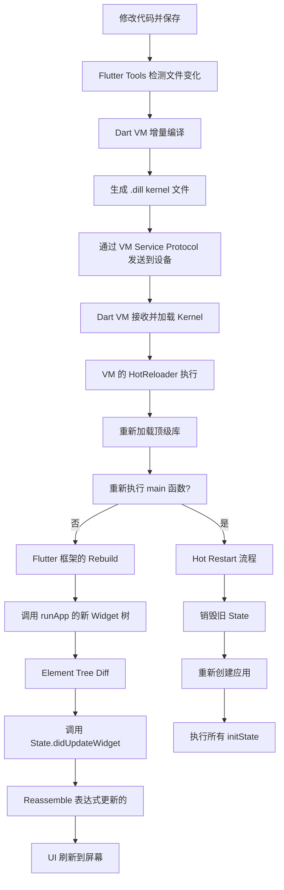

## 一句话概括

Flutter 的热重载（Hot Reload）通过 Dart VM 的增量编译（Incremental Compilation）将代码变更编译为 Kernel 文件，由 Flutter 框架的 Element 树 diff 机制决定性地更新 UI，在保持应用状态的同时实现亚秒级 UI 更新。

## 背景与意义

如果你用原生开发（iOS/Android）写过 UI，你一定经历过"改一行代码 → 重新编译 → 等待 30 秒到 5 分钟 → 启动 App → 导航到目标页面"的痛苦循环。一个 300ms 的 UI 调整，往往需要 5 分钟的等待才能看到效果。

Flutter 的热重载把这个循环缩短到了 1 秒以内。你改完代码，Ctrl+S，1 秒后手机上的界面就更新了，而且状态保持完好——你不需要重新登录、不需要重新导航到你正在调试的页面。

这个特性的开发体验革命性是 Flutter 生态的核心竞争力之一。理解热重载的工作原理，不仅能在你遇到热重载失败时快速定位问题，还能让你意识到哪些代码写法会影响热重载的效果。

## 概念与定义

### Hot Reload（热重载）

将修改后的 Dart 代码注入到运行中的 Dart VM，然后用 Element 树的 update 机制重建 Widget 树，保持当前状态不变。

### Hot Restart（热重启）

重新创建整个应用，重置所有状态。比完整编译快，但比 Hot Reload 慢（重走所有 initState）。

### Incremental Compilation（增量编译）

Dart VM 只重新编译发生变化的源文件，不会重新编译整个项目。编译产物是 `.dill`（Kernel）文件。

### Kernel / .dill

Dart 编译过程的中间产物，一种序列化的 AST（抽象语法树）表示。VM 可以直接加载和执行 .dill 文件。

### Element Tree Diff

Flutter 框架中，当新的 Widget 树生成后，Element 树通过比较 runtimeType 和 key 来决定是复用、创建还是销毁 Element。

## 最小示例

```dart
import 'package:flutter/material.dart';

void main() {
  runApp(const MyApp());
}

class MyApp extends StatelessWidget {
  const MyApp({super.key});

  @override
  Widget build(BuildContext context) {
    return MaterialApp(
      home: Scaffold(
        appBar: AppBar(title: const Text('Hot Reload Demo')),
        body: const CounterPage(),
      ),
    );
  }
}

class CounterPage extends StatefulWidget {
  const CounterPage({super.key});

  @override
  State<CounterPage> createState() => _CounterPageState();
}

class _CounterPageState extends State<CounterPage> {
  int _count = 0;

  @override
  Widget build(BuildContext context) {
    return Center(
      child: Column(
        mainAxisSize: MainAxisSize.min,
        children: [
          Text('计数: $_count', style: const TextStyle(fontSize: 32)),
          const SizedBox(height: 16),
          ElevatedButton(
            onPressed: () => setState(() => _count++),
            child: const Text('增加'),
          ),
        ],
      ),
    );
  }
}
```

**实验步骤**：

1. 运行 App，点击按钮将计数增加到 5
2. 修改 `Text('计数: $_count')` 为 `Text('Count: $_count')`
3. 保存文件（Ctrl+S / Cmd+S）
4. 观察热重载效果：计数=5 仍然保持，但文本变为 "Count: 5"

这就是热重载的魔力——**状态保持 + 代码更新**。

## 核心知识点拆解

### 1. 热重载的完整流程



### 2. 增量编译的核心机制

当你在 IDE 中保存文件时，`flutter_tools` 检测到 `.dart` 文件的变化，执行以下操作：

```
1. 找到修改的文件列表
2. 重新编译这些文件（以及受影响的文件）
3. 生成 .dill 中间文件
4. 通过 VM Service Protocol 发送到设备

这个过程利用 Dart VM 的 "Frontend Server" (CFE)，
后者维护一个常驻进程，仅增量编译变更的库。
```

**增量编译的粒度**是 **Library（库）** 级别。一个 Dart 文件编译为一个库。当你修改了文件 A，而文件 B 导入了 A 中的内容，则 A 和 B 都需要重新编译。

### 3. VM Service Protocol 的热重载消息

```
// Flutter Tools 发送给 Dart VM 的热重载请求协议简化版：
{
  "method": "HotReloader.reloadSources",
  "params": {
    "forceCompile": false,
    "pause": false,
    "uri": "file:///path/to/project/lib/main.dart"
  }
}

// Dart VM 的响应：
{
  "type": "Success",
  "method": "HotReloader.reloadSources",
  "result": {
    "success": true,
    "details": {
      "finalized": true,
      "usedSources": ["main.dart", "counter_page.dart"]
    }
  }
}
```

### 4. Flutter 框架的 Rebuild 机制

VM 层加载了新的代码之后，Flutter 框架调用 `WidgetsBinding.reassembleApplication()`：

```dart
// WidgetsBinding 中的热重载响应
Future<void> reassembleApplication() async {
  // 1. 通知所有 Element 调用 reassemble
  // 2. 触发所有 BuildOwner 执行 rebuild
  // 3. 重新调用 runApp 中传入的 Widget 的 build
  //    但保留当前的 Element 树
  rebuild();
}
```

`rebuild()` 的核心是重新调用顶层 Widget 的 `build()` 方法，返回新的 Widget 树，然后让 Element 树通过 diff 来决定如何更新。

### 5. 热重载何时失效？

```dart
// 以下几种情况会导致热重载失效，需要 Hot Restart：

// 1. 修改全局变量/静态变量的初始化
final List<int> globalList = [1, 2, 3];  // 修改这里，热重载不会重置 globalList

// 2. 修改 static final 常量的初始化
class AppConfig {
  static final String name = 'MyApp';  // 改成 'NewApp'，已编译引用不会更新
}

// 3. 修改 enum 定义
enum Status { loading, ready, error }  // 新增一个值 → 需要重启

// 4. 修改泛型的类型参数
class DataService<T> { /* ... */ }  // 改了泛型约束 → 需要重启

// 5. 修改类继承关系
class A extends B {}  // 改成 extends C → 需要重启

// 6. 添加新的静态成员
class MyClass {
  static void newMethod() {}  // 新增 → 已加载的类定义不包含这个方法
}
```

Flutter Tools 在检测到这些变更时，会自动 Fallback 到 Hot Restart。

## 实战案例

### 案例 1：热重载中 State 保持的最佳实践

```dart
class FormScreen extends StatefulWidget {
  @override
  State<FormScreen> createState() => _FormScreenState();
}

class _FormScreenState extends State<FormScreen> {
  final _nameController = TextEditingController(text: '张三');
  final _emailController = TextEditingController(text: 'zhang@example.com');
  bool _agreedToTerms = false;

  @override
  void initState() {
    super.initState();
    // ✅ 数据在 initState 中初始化——热重载后会保持
    // 注意：initState 不会在热重载时再次执行
    _loadSavedData();
  }

  @override
  void reassemble() {
    super.reassemble();
    // ⚠️ reassemble 在热重载时被调用
    // 你可以在这里做热重载时的特殊处理
    debugPrint('🔄 热重载触发 reassemble');
  }

  @override
  void didUpdateWidget(FormScreen oldWidget) {
    super.didUpdateWidget(oldWidget);
    // ⚠️ Widget 的配置变更时调用——热重载也可能触发
    // 如果你的 Widget 参数变了，在这里处理
  }

  @override
  Widget build(BuildContext context) {
    return Form(
      child: Column(
        children: [
          TextField(controller: _nameController),
          TextField(controller: _emailController),
          CheckboxListTile(
            value: _agreedToTerms,
            onChanged: (v) => setState(() => _agreedToTerms = v ?? false),
            title: const Text('同意条款'),
          ),
        ],
      ),
    );
  }

  void _loadSavedData() {
    // 模拟加载数据
  }
}
```

**热重载后的行为**：
- `_nameController`：保持，当前输入内容不变
- `_emailController`：保持
- `_agreedToTerms`：保持当前值（true/false）
- `initState`：不会重新执行
- `didUpdateWidget`：会被调用（因为热重载产生了新的 Widget 实例）

### 案例 2：热重载与网络请求状态

```dart
class UserProfileScreen extends StatefulWidget {
  final String userId;
  const UserProfileScreen({super.key, required this.userId});

  @override
  State<UserProfileScreen> createState() => _UserProfileScreenState();
}

class _UserProfileScreenState extends State<UserProfileScreen> {
  UserProfile? _user;
  bool _loading = true;
  String? _error;

  @override
  void initState() {
    super.initState();
    _fetchUser();
  }

  Future<void> _fetchUser() async {
    setState(() => _loading = true);
    try {
      final user = await ApiService.fetchUser(widget.userId);
      if (mounted) {
        setState(() {
          _user = user;
          _loading = false;
        });
      }
    } catch (e) {
      if (mounted) {
        setState(() {
          _error = e.toString();
          _loading = false;
        });
      }
    }
  }

  @override
  Widget build(BuildContext context) {
    if (_loading) return const CircularProgressIndicator();
    if (_error != null) return Text('错误: $_error');
    
    return Column(
      children: [
        Text('用户: ${_user?.name ?? ""}'),
        Text('邮箱: ${_user?.email ?? ""}'),
        // 热重载后修改这里，_user 数据仍然保持
        // 新增一行：
        Text('金币: ${_user?.coins ?? 0}'),
      ],
    );
  }
}
```

热重载后，如果数据请求已经完成，`_user` 保持之前的数据，UI 会立即显示新增的"金币"行。**不需要等待重新请求**——这就是状态保持的威力。

### 案例 3：热重载失败的调试

```dart
// 热重载失败时的日志分析
// Flutter Tools 的日志会输出失败原因：

// Scenario 1: 编译错误
// ══╡ APP LOG ╞══════════════════════════════════════
// Error: Compilation failed with 1 error:
// lib/main.dart:10:21: Error: Missing argument for parameter 'child'
//   Widget build => Container();  // 少了 child

// Scenario 2: 语法结构变更
// ════════════════════════════════════════════════════
// Hot reload failed due to structural changes in class _MyState.
// This is likely caused by changes to member fields or their
// initialization.
// Performing hot restart instead...

// Scenario 3: 热重载部分成功（部分库未能加载）
// WARNING: Hot reload was attempted but some libraries failed.
// The app may be in an inconsistent state.
```

当你看到 `Hot reload failed` 时，最佳实践是：先等 Flutter Tools 自动 fallback 到 hot restart。如果它没有 fallback，手动点击 IDE 的 Hot Restart 按钮（⚡按钮长按选 Restart）。

## 底层原理

### Dart VM 的 HotReloader 实现

```dart
// Dart VM 中 HotReloader 的核心逻辑（简化伪代码）
class HotReloader {
  void reloadSources(List<String> uris) {
    // 1. 暂停所有 Isolate
    isolates.forEach((isolate) => isolate.pause());
    
    // 2. 重新编译源文件
    final newKernel = frontendCompiler.compile(uris);
    
    // 3. 给所有 Isolate 注入新代码
    for (final isolate in isolates) {
      // 遍历当前堆中的所有类
      for (final oldClass in isolate.heap.classes) {
        if (newKernel.hasClass(oldClass.name)) {
          final newClass = newKernel.getClass(oldClass.name);
          
          // 4. 检查是否需要更新旧类
          if (isStructurallyCompatible(oldClass, newClass)) {
            // 更新类定义（添加/修改方法等）
            isolate.updateClassDefinition(oldClass, newClass);
          } else {
            // 结构不兼容，标记需要重启
            throw HotReloadException('incompatible class structure');
          }
        }
      }
    }
    
    // 5. 恢复 Isolate
    isolates.forEach((isolate) => isolate.resume());
  }
}
```

### 为什么热重载能保持状态？

核心原因在于 Dart 对象在堆上的**引用**没有改变：

```
热重载前：
  State 对象 0x1234 (_count=5)
     ↓ 引用
  initState() 方法 → 旧版方法表
  
热重载后：
  State 对象 0x1234 (_count=5)  ← 同一个对象！
     ↓ 引用（更新了方法表）
  initState() 方法 → 新版方法表
  build() 方法 → 新版方法表
  
State 对象的 _count 字段仍在 0x1234 堆地址上，值为 5。
只是它的方法（build 等）被替换成了新版本。
```

这就是状态保持的底层原理：**对象不变，方法变**。

### 增量编译与 AOT 的关系

注意：热重载在 Debug 模式下工作，因为 Debug 模式用的是 JIT（Just-In-Time）编译，VM 运行时解析 Kernel 文件。Release 模式使用 AOT（Ahead-Of-Time），代码被编译为机器码，无法热更。

```
Debug 模式：.dart → Kernel (.dill) → JIT → VM 执行
                       ↓
               热重载注入新 Kernel

Release 模式：.dart → AOT → 原生机器码（ARM64/x64）
                       ↓
               不支持热重载
```

### 热重载 vs 热重启 vs 完整重启的耗时对比

```
│              │ 时间范围   │ 状态保持 │ 适用场景               │
│──────────────│───────────│─────────│───────────────────────│
│ 热重载(Hot Reload) │ 0.3-1s   │ ✅ 是    │ UI 调整、逻辑微调      │
│ 热重启(Hot Restart)│ 3-5s     │ ❌ 否    │ 结构变更、全局变量变更  │
│ 完整重启(reload)   │ 30s-5min │ ❌ 否    │ 依赖变更、配置变更      │
```

## 高频面试题解析

### Q1：热重载时哪些生命周期方法会被调用？

```dart
// 热重载后的调用顺序（从框架到 Widget）：
// 1. reassembleApplication() — Flutter 框架层
// 2. Element.reassemble() — 所有 Element
// 3. State.reassemble() — State 对象！注意这不是生命周期
// 4. Element.rebuild() — 重建 Widget 树
// 5. Element.update(newWidget) — 更新 Element 配置
// 6. State.didUpdateWidget(oldWidget) — 通知 State Widget 变了
// 7. State.build() — 重新构建 UI

// ❌ 不调用：
// initState() — 不调用，State 对象存在
// dispose() — 不调用
// didChangeDependencies() — 仅当依赖变化时调用
```

### Q2：什么时候热重载会丢失状态？

除了上述的结构不兼容变更，还有：
1. **GlobalKey 使用不当**：如果热重载导致 GlobalKey 的引用变化，Element 可能在树中重新挂载
2. **修改了 `const` 构造函数**：const 构造函数可能在编译期内联，热重载后内联值不变
3. **修改了枚举的 `values`**：枚举在 VM 中有特殊的缓存，新增/删除枚举值需要重启
4. **修改了 Mixin**：Mixin 的应用方式特殊，热重载后混入的方法可能不完整

### Q3：为什么有些热重载后 UI 没变但代码确实更新了？

可能的原因：
1. **BuildContext 被 invalidate**：热重载后，之前持有的 BuildContext 引用仍然有效，但如果它在树中被重建了，调用 context 方法可能报错
2. **Stream/EventBus 监听未重新绑定**：热重载不会重新执行 `initState` 中的监听绑定，如果监听逻辑改了，需要手动重新绑定
3. **图片/字体等资源不会重新加载**：热重载只加载 Dart 代码变更，资源文件变更需要 hot restart

```dart
// 解决方法：在 reassemble 中重新绑定
@override
void reassemble() {
  super.reassemble();
  _subscription?.cancel();
  _setupListeners();  // 重新设置监听
}
```

### Q4：热重载能否处理 Flutter Plugin 的修改？

不能。Flutter Plugin 通常包含原生代码（Android 的 Kotlin/Java、iOS 的 Swift/ObjC）。原生代码的修改：
- Android：需要 `flutter run` 重新编译（或使用 Android Studio 的 Instant Run）
- iOS：需要 `flutter run` 重新编译

热重载只处理 Dart 代码。如果修改涉及 MethodChannel 的名称或参数类型，还需要确保 Dart 端和原生端的协议一致。

## 总结与扩展

### 核心要点

1. **增量编译**：Dart VM 的前端编译器只重编变更的库，产出 .dill 文件
2. **方法表替换**：VM 在运行中用新方法表替换旧类的方法表，对象引用不变
3. **Element 树复用**：Flutter 框架通过 Element diff 机制，只更新变化的 UI 部分
4. **状态保持**：State 对象的字段值在热重载中保持，这得益于 Dart 对象堆式内存管理
5. **限制条件**：结构不兼容的变更会触发 hot restart fallback，Plugin 变更需要完整重新编译

### 扩展阅读

- Flutter 热重载官方文档：[docs.flutter.dev/tools/hot-reload](https://docs.flutter.dev/tools/hot-reload)
- Dart VM Service Protocol：[github.com/dart-lang/sdk/blob/main/runtime/vm/service/service.md](https://github.com/dart-lang/sdk/blob/main/runtime/vm/service/service.md)
- Flutter 增量编译源码：[github.com/flutter/flutter/blob/main/packages/flutter_tools/lib/src/hot.dart](https://github.com/flutter/flutter/blob/main/packages/flutter_tools/lib/src/hot.dart)

### 下一步

下一篇文章将以口述形式完整梳理 Flutter 三棵树的渲染流程——从 Widget 配置开始，到 Element 的实例化、diff 和复用，再到 RenderObject 的布局和绘制，最后合成到屏幕像素，形成一个端到端的渲染故事。
