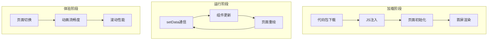

> 小程序性能优化不是单一维度的加速——它涉及加载、渲染、运行、通信四个阶段的协同调优。本文以一个从2.1秒降至0.8秒首屏的真实优化案例为线索，系统性地拆解小程序性能优化的全链路方法论。

## 一、背景与意义

### 为什么小程序需要专门优化？

一个真实的数据：某内容类小程序，首屏加载时间从1.5秒优化到0.9秒后，用户跳出率降低了37%，页面平均访问深度从2.3页提升到4.1页。

**小程序性能瓶颈的来源**：
1. **双线程架构的开销**：每一次setData都要跨线程通信
2. **逻辑层代码膨胀**：一个大型小程序可能有500KB以上的JS代码
3. **渲染层DOM复杂度**：WXML编译为虚拟DOM后，更新开销与节点数成正比
4. **微信客户端的资源竞争**：多个小程序共享JS引擎

**性能指标金字塔**：

```
        首屏加载（用户第一印象）
        /     |     \
    页面切换  交互响应  列表滚动
        \     |     /
         后台稳定性
```

每一层都是用户可感知的性能维度。

## 二、概念与定义

### 2.1 小程序性能指标体系



| 指标 | 含义 | 良好标准 | 采集方法 |
|------|------|---------|---------|
| 代码包大小 | 主包+分包体积 | 主包<1MB, 总包<4MB | 开发者工具 |
| 首屏耗时 | 用户看到有意义内容 | <1.5s | wx.getPerformance |
| setData频率 | 每秒setData次数 | <10次/秒 | 自定义上报 |
| 渲染帧率 | 页面滑动时的帧率 | >45fps | 工具面板 |
| 页面切换耗时 | navigateTo/navigateBack | <300ms | 自定义埋点 |

### 2.2 优化分类

```
小程序性能优化
├── 加载优化（缩短首屏时间）
│   ├── 代码包体积：分包、压缩、tree-shaking
│   ├── 代码注入：按需注入、预加载
│   ├── 数据请求：预请求、缓存、并行
│   └── 首屏渲染：骨架屏、渐进渲染
├── 运行优化（减少卡顿）
│   ├── setData优化：差量更新、合并、节流
│   ├── 渲染优化：wx:if vs hidden、虚拟列表
│   ├── 图片优化：WebP、懒加载、CDN
│   └── 事件优化：事件委托、WXS
└── 体验优化（提升流畅度）
    ├── 页面切换：预创建WebView
    ├── 动画优化：transform代替top/left
    └── 反馈优化：loading状态、触摸反馈
```

## 三、最小示例

### 3.1 首屏加载优化全流程

```javascript
// app.js — 启动优化
App({
  onLaunch() {
    // 1. 关键数据预加载（下载代码包时并行发起）
    this._prefetchCriticalData();
    
    // 2. 缓存策略初始化
    this._initCacheStrategy();
  },

  async _prefetchCriticalData() {
    // 在代码包注入阶段就发起网络请求
    // 这样页面onLoad时可能已经拿到数据了
    const promises = [
      this._getUserInfo(),
      this._getSystemConfig(),
    ];
    
    // 预加载结果缓存到globalData
    const [userInfo, config] = await Promise.all(promises);
    this.globalData.prefetched = { userInfo, config };
  },

  _initCacheStrategy() {
    // 配置CDN缓存策略
    const cdnConfig = wx.getStorageSync('cdn_config') || {};
    this.globalData.cdnBase = cdnConfig.base || 'https://cdn.example.com';
  },
});
```

```javascript
// pages/home/home.js — 首屏渲染优化
Page({
  data: {
    // 分层加载策略
    criticalData: null,    // 立即展示的关键数据
    secondaryData: null,   // 次要数据（延迟加载）
    deferredData: null,    // 非首屏数据（懒加载）
    pageReady: false,      // 骨架屏控制
  },

  onLoad(query) {
    // 1. 立即显示骨架屏（首次setData，数据量最小化）
    this.setData({ pageReady: false });
    
    // 2. 从globalData获取预加载数据
    const prefetched = getApp().globalData.prefetched;
    
    // 3. 关键数据优先渲染
    this.setData({
      criticalData: prefetched.userInfo,
      pageReady: true,  // 骨架屏→真实内容
    });
    
    // 4. 发起次要数据请求（此时首屏已在渲染）
    this.loadSecondaryData();
    
    // 5. 非首屏内容：等页面可见后再加载
    this.onShow = () => {
      if (!this.data.deferredData) {
        this.loadDeferredData();
      }
    };
  },

  async loadSecondaryData() {
    // 次要数据：不在首屏视图中，但在上下附近
    const data = await this._fetch('/api/home/recommend');
    this.setData({ secondaryData: data });
  },

  async loadDeferredData() {
    // 非首屏：需要滚动才可见的底部内容
    const data = await this._fetch('/api/home/footer');
    this.setData({ deferredData: data });
  },
});
```

### 3.2 setData深度优化

```javascript
// ❌ 反例：每秒60次setData
Page({
  onPageScroll(e) {
    this.setData({ scrollTop: e.scrollTop });
  },
});

// ✅ 正例1：节流
Page({
  onPageScroll: throttle(function(e) {
    this.setData({ scrollTop: e.scrollTop });
  }, 200), // 每秒5次
});

// ✅ 正例2：WXS处理——完全绕过逻辑层
// scroll-handler.wxs
function onScroll(e, ins) {
  var scrollTop = e.detail.scrollTop;
  // 直接操作渲染层样式
  if (scrollTop > 200) {
    ins.selectComponent('.back-to-top').addClass('show');
  } else {
    ins.selectComponent('.back-to-top').removeClass('show');
  }
}
module.exports = { onScroll: onScroll };

// ✅ 正例3：分路径差量更新
Page({
  appendItem(item) {
    const key = `list[${this.data.list.length}]`;
    // 只传递新添加的一项，而非整个list
    this.setData({ [key]: item });
  },
});

// ✅ 正例4：合并多次setData
Page({
  handleBatchUpdate() {
    // 多次setData合并为一次
    const data = {};
    if (condition1) data.field1 = value1;
    if (condition2) data.field2 = value2;
    // ...更多条件
    this.setData(data);
  },
});
```

## 四、核心知识点拆解

### 4.1 代码分包与按需注入

**分包的策略**：

```json
// app.json
{
  "pages": [
    "pages/index/index",
    "pages/logs/logs"
  ],
  "subPackages": [
    {
      "root": "package-a/",
      "pages": [
        "pages/detail/detail",
        "pages/list/list"
      ],
      "independent": false
    },
    {
      "root": "package-b/",
      "pages": [
        "pages/user/user",
        "pages/order/order"
      ],
      "independent": true  // 独立分包
    }
  ],
  "preloadRule": {
    "pages/index/index": {
      "network": "all",
      "packages": ["package-a"]  // 预加载分包
    }
  }
}
```

**分包的收益**：

```javascript
// 不分包
// 总JS体积 800KB → 全部注入JSCore → 首屏延迟 800ms

// 分包（主包300KB + 分包A 200KB + 分包B 300KB）
// 主包 300KB → 快速注入 → 首屏延迟 300ms
// 分包A 200KB → 预加载（浏览首页时静默加载）
// 分包B 300KB → 点击用户Tab时按需加载
```

**独立分包**的特殊优势：
- 独立分包不需要依赖主包的代码
- 可以从独立分包直接启动小程序（跳过主包加载）
- 适用于启动页、登录页等场景

```json
// 独立分包配置示例（如：从分享卡片直接打开商品详情）
{
  "subPackages": [
    {
      "root": "share-card/",
      "pages": ["pages/product/product"],
      "independent": true
    }
  ]
}
```

### 4.2 图片优化策略

图片通常是小程序中体积最大的资源：


```javascript
// 图片优化的最佳实践

// 1. 使用WebP格式（小程序支持）
// 服务器端实现图片格式协商
const IMAGE_HOST = 'https://cdn.example.com';
function getImageUrl(path, options = {}) {
  const params = new URLSearchParams();
  params.set('x-oss-process', 'image');
  
  if (options.width) params.set('resize', `w_${options.width}`);
  if (options.quality) params.set('quality', `q_${options.quality}`);
  
  // 自动协商WebP（微信WebView支持WebP）
  params.set('format', 'webp');
  
  return `${IMAGE_HOST}/${path}?${params.toString()}`;
}

// 2. 懒加载——只加载可见区域图片
// index.wxml
<scroll-view scroll-y bindscrolltolower="onScrollToLower">
  <view class="image-grid">
    <view 
      wx:for="{{items}}" 
      wx:key="id" 
      class="image-item"
    >
      <image 
        src="{{item.inView ? item.fullUrl : item.placeholder}}"
        mode="aspectFill"
        lazy-load
        webp
        bind:load="onImageLoaded"
        data-index="{{index}}"
      />
    </view>
  </view>
</scroll-view>

// index.js
Page({
  data: {
    visibleRange: { start: 0, end: 10 }, // 可见范围
    items: [],
  },
  
  // Intersection Observer风格的可见性检测
  onPageScroll(e) {
    const viewportHeight = wx.getSystemInfoSync().windowHeight;
    const scrollTop = e.scrollTop;
    
    // 计算当前可见的图片范围（每张图片高度200px）
    const start = Math.max(0, Math.floor(scrollTop / 200) - 5);
    const end = Math.ceil((scrollTop + viewportHeight) / 200) + 5;
    
    if (start !== this.data.visibleRange.start || 
        end !== this.data.visibleRange.end) {
      this.setData({ visibleRange: { start, end } });
    }
  },
});

// 3. 预加载下一屏图片
Page({
  prefetchNextBatch() {
    const nextItems = this.data.items.slice(
      this.data.visibleRange.end,
      this.data.visibleRange.end + 20
    );
    // 提前创建Image对象触发下载（但不显示）
    nextItems.forEach(item => {
      wx.downloadFile({
        url: getImageUrl(item.path, { width: 300 }),
        success: (res) => {
          item.cachedPath = res.tempFilePath;
        },
      });
    });
  },
});
```


### 4.3 虚拟列表（长列表优化）

小程序中，一个包含200个item的列表就可能开始卡顿。虚拟列表技术只渲染可见区域的DOM节点：

```javascript
// components/virtual-list/virtual-list.js
Component({
  properties: {
    items: { type: Array, value: [] },
    itemHeight: { type: Number, value: 100 }, // 每个项目的高度（rpx）
    overscan: { type: Number, value: 5 },     // 上下额外渲染的行数
  },

  data: {
    // 可见区域的数据切片
    visibleItems: [],
    paddingTop: 0,
    paddingBottom: 0,
    startIndex: 0,
    endIndex: 0,
  },

  lifetimes: {
    attached() {
      // 从 wx.getSystemInfoSync() 获取屏幕高度
      const sysInfo = wx.getSystemInfoSync();
      this.screenHeight = sysInfo.windowHeight * (750 / sysInfo.windowWidth);
      this.lastScrollTop = 0;
      
      // 绑定滚动事件
      this._onScroll = this._handleScroll.bind(this);
    },
  },

  observers: {
    'items': function(newItems) {
      // items变化时计算出可见区域
      this._updateVisibleRange(newItems, this.lastScrollTop);
    },
  },

  methods: {
    _handleScroll(e) {
      const scrollTop = e.detail.scrollTop;
      this.lastScrollTop = scrollTop;

      if (Math.abs(scrollTop - this.lastUpdateScrollTop) < this.data.itemHeight) {
        return; // 变化不够一个item高度，跳过
      }

      this._updateVisibleRange(this.data.items, scrollTop);
    },

    _updateVisibleRange(items, scrollTop) {
      if (!items || items.length === 0) return;

      const itemHeight = this.data.itemHeight;
      const viewportHeight = this.screenHeight;
      const overscan = this.data.overscan;

      // 计算可见范围
      let startIndex = Math.floor(scrollTop / itemHeight);
      let endIndex = Math.ceil((scrollTop + viewportHeight) / itemHeight);

      // 扩展overscan
      startIndex = Math.max(0, startIndex - overscan);
      endIndex = Math.min(items.length, endIndex + overscan);

      if (startIndex === this.data.startIndex && endIndex === this.data.endIndex) {
        return; // 没有变化
      }

      // 切出可见项
      const visibleItems = items.slice(startIndex, endIndex);
      const paddingTop = startIndex * itemHeight;
      const paddingBottom = (items.length - endIndex) * itemHeight;

      this.setData({
        visibleItems,
        paddingTop,
        paddingBottom,
        startIndex,
        endIndex,
      });

      this.lastUpdateScrollTop = scrollTop;
    },

    // 滚动到指定索引
    scrollToIndex(index) {
      this.triggerEvent('scrollTo', { top: index * this.data.itemHeight });
    },
  },
});
```


```html
<!-- virtual-list.wxml -->
<scroll-view 
  class="virtual-list-container" 
  scroll-y 
  bindscroll="_handleScroll"
  enhanced
  show-scrollbar="{{false}}"
>
  <!-- 上面占位（保持滚动条长度） -->
  <view style="height: {{paddingTop}}rpx;" />
  
  <!-- 可见区域 -->
  <view class="visible-items">
    <view 
      wx:for="{{visibleItems}}" 
      wx:key="id"
      class="list-item"
      style="height: {{itemHeight}}rpx;"
    >
      <slot name="item" item="{{item}}" index="{{startIndex + index}}" />
    </view>
  </view>
  
  <!-- 下面占位 -->
  <view style="height: {{paddingBottom}}rpx;" />
  
  <view class="invisible-placeholder" 
        style="height: 1px; width: 1px; opacity: 0;"
        slot="placeholder" />
</scroll-view>
```


### 4.4 WXS——渲染层高性能计算

WXS（WeiXin Script）是运行在渲染层的脚本语言，可以绕过逻辑层处理高频计算：

```javascript
// 在WXS中处理数据格式化
// format.wxs
var filters = {
  // 价格格式化
  formatPrice: function(price) {
    return (price / 100).toFixed(2);
  },
  
  // 时间格式化
  formatTime: function(timestamp) {
    var date = getDate(timestamp * 1000);
    var year = date.getFullYear();
    var month = date.getMonth() + 1;
    var day = date.getDate();
    var hour = date.getHours();
    var minute = date.getMinutes();
    
    // 今天只显示时间
    var today = getDate();
    if (year === today.getFullYear() && 
        month === (today.getMonth() + 1) && 
        day === today.getDate()) {
      return (hour < 10 ? '0' + hour : hour) + ':' + 
             (minute < 10 ? '0' + minute : minute);
    }
    
    return year + '-' + month + '-' + day;
  },
  
  // 文本截断
  truncate: function(text, maxLength) {
    if (!text) return '';
    if (text.length <= maxLength) return text;
    return text.substring(0, maxLength) + '...';
  },
  
  // 数字格式化（千分位）
  formatNumber: function(num) {
    var str = num.toString();
    var parts = str.split('.');
    parts[0] = parts[0].replace(/\B(?=(\d{3})+(?!\d))/g, ',');
    return parts.join('.');
  }
};

module.exports = filters;
```


```html
<!-- WXML中使用WXS -->
<wxs src="./format.wxs" module="fmt" />

<view class="product-item">
  <text class="price">¥{{fmt.formatPrice(item.price)}}</text>
  <text class="sales">已售{{fmt.formatNumber(item.sales)}}件</text>
  <text class="desc">{{fmt.truncate(item.description, 50)}}</text>
  <text class="time">{{fmt.formatTime(item.createTime)}}</text>
</view>
```


## 五、实战案例：电商首页从2.1s到0.8s的优化实录

### 5.1 优化前状态

| 优化前指标 | 数值 |
|-----------|------|
| 首屏加载时间 | 2.1s |
| 代码包体积(主包) | 1.8MB |
| 首屏请求数 | 8个（串行） |
| 首屏setData次数 | 6次 |
| 图片数量 | 24张（无懒加载） |

### 5.2 优化措施

**Step 1: 分包减重**

```diff
// 优化前：所有代码都在主包
// 优化后：只保留首页相关代码在主包
- "subPackages": []  // 无分包
+ "subPackages": [{
+   "root": "packages/sub/",
+   "pages": [
+     "pages/list/list",
+     "pages/detail/detail",
+     "pages/cart/cart"
+   ]
+ }]

// 效果：主包从1.8MB降到520KB
```

**Step 2: 数据预加载**

```javascript
// app.js — 预加载首屏数据
App({
  prefetchedData: {},
  
  onLaunch() {
    // 在注入代码包的同步等待期就发起请求
    this._prefetchHomeData();
  },
  
  async _prefetchHomeData() {
    const promises = [
      this._fetch('/api/home/banners', { priority: 'high' }),
      this._fetch('/api/home/categories'),
      this._fetch('/api/home/hot-products', { timeout: 1500 }),
    ];
    
    const results = await Promise.allSettled(promises);
    this.prefetchedData = {
      banners: results[0].status === 'fulfilled' ? results[0].value : [],
      categories: results[1].status === 'fulfilled' ? results[1].value : [],
      hotProducts: results[2].status === 'fulfilled' ? results[2].value : [],
    };
  },
});
```

**Step 3: setData合并与差量**

```diff
// 优化前：多组件各自setData
- this.setData({ loading: true });
- bannerComp.setData({ banners: data.banners });
- categoryComp.setData({ categories: data.categories });
- listComp.setData({ products: data.products });

// 优化后：一次性主包推送
+ this.setData({
+   'bannerData.items': data.banners,
+   'categoryData.items': data.categories,
+   'productData.items': data.products,
+   loading: false,
+ });
// 跨线程通信次数从4次降为1次
```

**Step 4: 图片懒加载+WebP**


```diff
- <image src="{{item.image}}" mode="widthFix" />
+ <image 
+   src="{{item.image}}?x-oss-process=image/resize,w_750/format,webp"
+   mode="widthFix" 
+   lazy-load
+   webp
+ />
// 首屏图片加载量从24张降至4张
```


### 5.3 优化后数据

| 优化后指标 | 数值 | 提升 |
|-----------|------|------|
| 首屏加载时间 | 0.8s | +62% |
| 代码包体积(主包) | 520KB | -71% |
| 首屏请求数 | 3个（并行） | -62.5% |
| 首屏setData次数 | 2次 | -66.7% |
| 用户跳出率 | -37% | - |

## 六、底层原理

### 6.1 setData的性能模型

```javascript
// setData耗时 = 逻辑层JSON序列化 + 跨线程传输 + 渲染层JSON反序列化 + 虚拟DOM Diff + 真实DOM操作

// 各阶段的耗时占比（经验值，数据量50KB-100KB）：
// JSON序列化: 15%
// 跨线程传输: 20%
// JSON反序列化: 15%
// 虚拟DOM Diff: 30%
// 真实DOM操作: 20%

// 关键洞察：DOM操作只占20%，所以减少setData频率比减少setData体积更重要
// 10次*10KB ≈ 10次*20%操作时间 = 2次*50KB的大操作 ≈ 同样时间
// 但10次通信的开销远大于2次通信！
```

### 6.2 源码注入的优化原理

小程序启动时，微信客户端需要将JS代码注入到逻辑层的JSCore：

```
代码包下载 → 解压 → 主包JS注入 → app.js执行 → page代码注入 → page.js执行

注入速度与代码包大小呈线性关系：
100KB → ~100ms
500KB → ~500ms
1MB → ~1000ms

所以：减小代码包体积 = 直接缩短启动时间
```

**独立分包为何快？**
独立分包无需等待主包注入完成，可以直接从独立分包的"入口"启动，绕过主包的代码注入开销。

## 七、高频面试题解析

**Q1: 为什么虚拟列表在小程序中特别重要？**

A：相比于使用React Native（原生滚动列表）或Web（浏览器虚拟滚动库），小程序的渲染层WebView的滚动性能更差。因为：1) WebView是嵌入在微信中的，硬件加速支持有限；2) 渲染层和逻辑层的通信延迟放大了每帧的计算时间；3) 微信对单个页面的DOM节点数有限制（约1万个节点后有性能下降）。虚拟列表可以将渲染层的工作量从"渲染所有的N个节点"降为"只渲染可见的约20个节点"，大大降低了渲染压力。

**Q2: setData优化中最容易被忽略的一点是什么？**

A：不是数据量大小，而是setData的**路径数**。setData({ 'a.b.c': 1, 'a.b.d': 2 }) 的路径比 { 'a.b.c': 1 } 多一倍，路径检索和Diff占比很大。实际上，只更新5个路径的100KB数据，可能比更新100个路径的10KB数据更快。因为每条路径都要经过"解析→检查→Diff→调度"的完整链路。

**Q3: 小程序首屏加载的关键优化路径是什么？**

A：1) 分包让主包变小（减少JS注入时间）；2) 骨架屏快速填充首屏（用户感知到"快"）；3) 关键数据预加载（网络请求与代码注入并行）；4) 减少首屏渲染节点数（移除不可见内容）；5) 压缩图片（WebP + 裁剪到适当尺寸）。

**Q4: WXS到底解决了什么问题？**

A：WXS解决了"高频事件不可用逻辑层"的问题。比如滚动事件的帧率是60fps，如果每个scroll事件都走setData到逻辑层，会导致每秒60次跨线程通信，直接瘫痪。WXS运行在渲染层，可以零延迟响应事件，只把"需要逻辑层处理"的少数事件（如滚动到某位置触发请求）传递过去，通信频率从60次/秒降到1-2次/秒。

## 八、总结与扩展

小程序性能优化没有银弹，它是一个系统工程：

**加载阶段**：分包 + 预加载 + 骨架屏 → 用户觉得"快"
**运行阶段**：差量setData + WXS + 虚拟列表 → 交互"流畅"
**资源阶段**：WebP + 懒加载 + 请求缓存 → 不浪费"带宽"

**常见误区**：
- ❌ 只优化加载不优化渲染（用户等到了页面但点击不动）
- ❌ 过度优化（一个setData调用都要纠结 -> 先测再优化）
- ❌ 只关注代码体积不关注数据量（setData传了100KB的数据到渲染层）
- ❌ 忽略低端机测试（iPhone 14上流畅的页面在红米上可能卡成PPT）

**持续监控**：性能优化不是一次性的，在每个版本迭代中都应该：
1. 设定性能预算（首屏<1.5s，包体积<1MB）
2. CI中集成性能测试
3. 线上埋点监控各端性能指标
4. 性能退化自动报警

最后，分享一个最有效的优化建议：**在有明确的性能指标之前，不要做任何性能优化**。先跑分、先埋点、先找到真正的瓶颈点。
