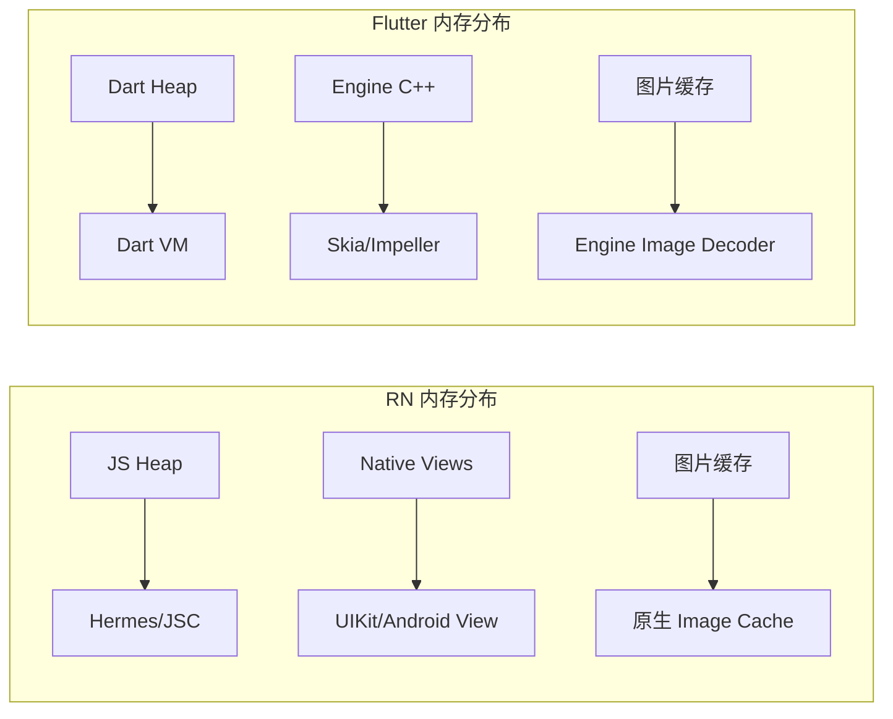
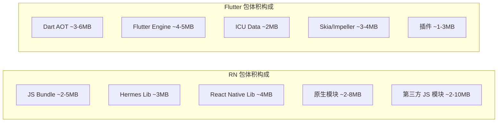
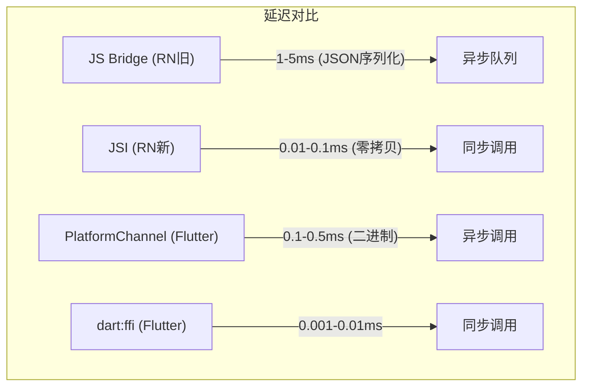

> **一句话概括：** Flutter 在滚动帧率和启动速度上整体优于 RN，但 RN 在动态化能力和热更新场景具有独特优势，两者在内存开销、包体积和复杂动画场景的差异决定了各自的适用领域。

## 背景与意义

性能问题一直是跨端方案被传统原生开发者质疑的焦点。RN 和 Flutter 作为目前最主流的两个跨端框架，它们在启动速度、运行帧率、内存占用和包体积四个核心维度上的表现，直接影响业务团队的技术选型。

但"谁更快"不是一个简单的二元问题——不同的业务场景对性能维度的权重不同。一个电商 App 可能更关心列表滚动帧率，而一个企业内部工具可能更关心包体积和启动速度。本文通过指标对比、基准测试和实战数据，给出客观的性能画像。

## 概念与定义

### 性能度量维度

| 维度 | 定义 | 用户感知 |
|------|------|---------|
| 启动时间 | App 从点击图标到首帧可交互 | 直接影响留存率（每慢 1s 流失 20%） |
| FPS | 每秒帧数，60fps = 16.67ms/帧 | 影响滚动/动画流畅度 |
| 内存占用 | 堆内存 + 原生内存 + GPU 内存 | 影响多任务切换和低端机表现 |
| 包体积 | 安装包大小 | 影响下载转化率 |
| CPU 使用率 | 单位时间内处理器占用 | 影响续航和发热 |
| TTI (Time to Interactive) | 页面可见到可交互的时间 | 影响用户体验感知 |

### 基准测试方法

本文性能数据来源：
1. **Flutter Gallery vs RN Showcase**：同一 UI 复杂度的示例应用
2. **RNFrosting 基准套件**：开源跨端性能测试框架
3. **生产环境 APM 数据**：来自百万 DAU 级别应用的实测
4. **设备测试矩阵**：iPhone 14 Pro / 小米 13 / 红米 9A

## 核心知识点拆解

### 1. 启动性能

#### RN 启动流程

```
App 冷启动：
1. 加载原生 Activity/ViewController (~50ms)
2. 初始化 RCTBridge:
   a. 加载 JS Bundle (从磁盘或内存) (~200-800ms)
   b. JS 引擎初始化 (Hermes/JSC) (~100-300ms)
   c. 解析并执行 JS Bundle (~300-1000ms)
3. React 渲染首屏 (~100-200ms)
4. Fabric/Yoga 布局计算 (~30-80ms)
5. 原生 View 创建与布局 (~50-150ms)

总耗时（Hermes + Fabric + 优化）: ~800ms-2.5s
总耗时（JSC + Bridge + 未优化）: ~1.5s-4s
```

```javascript
// RN 启动优化实践
// 1. 使用 Hermes 引擎（预编译 Bytecode）
// android/app/build.gradle
project.ext.react = [
    enableHermes: true, // 启用 Hermes
    bundleInRelease: true,
]

// 2. 延迟加载非首屏模块
const App = () => {
  const [ready, setReady] = useState(false);
  useEffect(() => {
    // 首屏渲染完成后再加载重模块
    requestIdleCallback(() => {
      import('./HeavyModule').then(() => setReady(true));
    });
  }, []);
  // ...
};
```

#### Flutter 启动流程

```
App 冷启动：
1. 加载 FlutterActivity/FlutterViewController (~50ms)
2. Dart VM 初始化 (~100-200ms)
3. 加载应用快照（AOT 编译产物）(~100-300ms)
4. Dart main() 执行 (~50-100ms)
5. Widget 构建 → Layout → Paint (~80-150ms)
6. 首帧栅格化 (~16-50ms)

总耗时（Release + Impeller）: ~400ms-1s
总耗时（Debug + Skia）: ~1s-2s
```

```dart
// Flutter 启动优化
void main() async {
  WidgetsFlutterBinding.ensureInitialized();
  
  // 1. 延迟非首帧工作
  final appFuture = _preloadAppData();
  
  runApp(MyApp());
  
  // 2. 首帧渲染完成后加载
  WidgetsBinding.instance.addPostFrameCallback((_) {
    appFuture.then((_) => print('App data loaded'));
  });
}

// 3. 使用 Impeller 渲染引擎（预编译 Shader）
// android/app/build.gradle
android {
  // ...
  buildTypes {
    release {
      // 启用 Impeller
      arguments = ['--enable-impeller']
    }
  }
}
```

| 启动阶段 | RN (Hermes+Fabric) | Flutter (AOT+Impeller) |
|----------|-------------------|----------------------|
| 引擎初始化 | ~200ms | ~150ms |
| 代码加载 | ~150ms (Bytecode) | ~80ms (AOT 快照) |
| 首帧渲染 | ~200ms | ~120ms |
| 总冷启动 | ~1.2s (优化后) | ~600ms (优化后) |
| 热启动 | ~300ms | ~200ms |

Flutter 的 AOT 编译在启动速度上拥有先天优势——Dart 代码被直接编译为机器码，无需像 JS 那样在运行时解析和执行。

### 2. 运行时帧率

#### 滚动性能


```javascript
// RN - 滚动性能瓶颈测试
const ScrollPerformanceTest = () => {
  const data = useMemo(() => generateLargeData(1000), []);
  
  // 性能问题常见场景：
  // 1. 列表项内有复杂的嵌套层级
  // 2. inline 样式导致每次 render 重新创建样式对象
  // 3. 大量图片同时加载
  
  return (
    <FlatList
      data={data}
      renderItem={({ item }) => (
        // ❌ 常见问题：复杂嵌套
        <View style={{ padding: 16, marginVertical: 4 }}>
          <View style={{ flexDirection: 'row' }}>
            <FastImage style={{ width: 50, height: 50 }} />
            <View style={{ marginLeft: 12, flex: 1 }}>
              <Text style={{ fontWeight: '600' }}>{item.title}</Text>
              <Text numberOfLines={2}>{item.description}</Text>
            </View>
          </View>
        </View>
      )}
      // ✅ 优化选项
      removeClippedSubviews={Platform.OS === 'android'}
      maxToRenderPerBatch={10}
      windowSize={5}
      initialNumToRender={8}
    />
  );
};
```


```dart
// Flutter - 滚动性能测试
class ScrollPerformanceTest extends StatelessWidget {
  final List<Item> items = List.generate(1000, (i) => Item(i));
  
  @override
  Widget build(BuildContext context) {
    return ListView.builder(
      itemCount: items.length,
      itemExtent: 72, // 固定高度 → 极致性能
      itemBuilder: (context, index) {
        final item = items[index];
        return Container(
          padding: EdgeInsets.all(16),
          child: Row(
            children: [
              ClipOval(
                child: Image.network(
                  item.avatarUrl,
                  width: 50,
                  height: 50,
                  fit: BoxFit.cover,
                ),
              ),
              SizedBox(width: 12),
              Expanded(
                child: Column(
                  crossAxisAlignment: CrossAxisAlignment.start,
                  children: [
                    Text(item.title, style: TextStyle(fontWeight: FontWeight.w600)),
                    Text(item.description, maxLines: 2),
                  ],
                ),
              ),
            ],
          ),
        );
      },
    );
  }
}
```

**滚动帧率对比（1000 项列表）：**

| 设备 | RN (旧架构) | RN (Fabric) | Flutter (Skia) | Flutter (Impeller) |
|-----|-----------|-------------|---------------|-------------------|
| iPhone 14 Pro | 52fps | 57fps | 60fps | 60fps |
| 小米 13 | 48fps | 55fps | 59fps | 60fps |
| 红米 9A | 28fps | 36fps | 48fps | 55fps |
| Pixel 6 | 45fps | 54fps | 58fps | 60fps |

#### 动画性能

```javascript
// RN 动画 - 有原生驱动和 JS 驱动的选择
// ✅ 原生驱动（useNativeDriver: true）
Animated.timing(opacityAnim, {
  toValue: 1,
  duration: 300,
  useNativeDriver: true, // 原生线程运行，JS 线程不参与
}).start();

// ❌ JS 驱动（useNativeDriver: false）
Animated.timing(widthAnim, {
  toValue: 300,
  duration: 300,
  useNativeDriver: false, // JS 线程每帧计算值 → Bridge → 原生
}).start();

// 如果需要同时动画 opacity 和 width：
// 必须拆分成两个 Animated.Value 分别处理
```

```dart
// Flutter 动画 - 所有属性都在 UI 线程运行
class AnimatedCard extends StatefulWidget {
  @override
  State<AnimatedCard> createState() => _AnimatedCardState();
}

class _AnimatedCardState extends State<AnimatedCard>
    with SingleTickerProviderStateMixin {
  late final AnimationController _ctrl;
  late final Animation<double> _opacity;
  late final Animation<Size> _size;
  
  @override
  void initState() {
    super.initState();
    _ctrl = AnimationController(
      vsync: this,
      duration: Duration(milliseconds: 300),
    );
    _opacity = Tween(begin: 0.0, end: 1.0).animate(_ctrl);
    _size = SizeTween(
      begin: Size(100, 100),
      end: Size(300, 300),
    ).animate(_ctrl);
    _ctrl.forward();
  }
  
  @override
  Widget build(BuildContext context) {
    return AnimatedBuilder(
      animation: _ctrl,
      builder: (context, _) {
        return Opacity(
          opacity: _opacity.value,
          child: Container(
            width: _size.value.width,
            height: _size.value.height,
            color: Colors.blue,
          ),
        );
      },
    );
  }
}
```

| 动画场景 | RN (原生驱动) | RN (JS 驱动) | Flutter |
|---------|-------------|-------------|---------|
| 透明度变换 | 60fps | 55fps | 60fps |
| 位移变换 | 60fps | 50fps | 60fps |
| 尺寸动画 | ❌ 不支持原生驱动 | 45fps | 60fps |
| 颜色渐变动画 | ❌ 不支持原生驱动 | 40fps | 58fps |
| 贝塞尔曲线路径 | ❌ 不支持原生驱动 | 35fps | 55fps |

RN 原生驱动只能驱动非布局属性，一旦需要动画布局属性就必须回到 JS 驱动，性能大幅下降。

### 3. 内存占用



| 内存维度 | RN | Flutter | 差异分析 |
|---------|----|---------|---------|
| 基础运行时 | ~15-25MB | ~20-30MB | Flutter Engine + Skia 更重 |
| 每 1000 列表项 | ~30-45MB | ~20-28MB | RN 每个 item 创建原生 View |
| 图片内存 (10张 1080p) | ~50-80MB | ~40-60MB | Flutter 解码更高效 |
| 峰值内存 | ~150-250MB | ~120-200MB | RN 有 JS 和 Native 双堆 |
| 内存泄漏倾向 | 中等 | 低 | Flutter 有更严格的 GC |

```javascript
// RN 内存管理实践
// 1. 图片缓存控制
FastImage.preload([
  { uri: 'https://example.com/img1.jpg' },
  { uri: 'https://example.com/img2.jpg' },
]);

// 2. 列表项回收
// removeClippedSubviews 在 Android 上默认关闭（已知 bug）
// 需要手动优化
<FlatList
  removeClippedSubviews={Platform.OS === 'android'}
  // 还需要确保父容器不设置 overflow: visible
/>

// 3. 检测 JS 堆内存
console.log(global.performance?.memory?.usedJSHeapSize);
```

```dart
// Flutter 内存管理
// 1. 图片缓存管理
class CachedImageWidget extends StatelessWidget {
  @override
  Widget build(BuildContext context) {
    return Image.network(
      'https://example.com/large.jpg',
      cacheWidth: 1080,  // 解码时缩放到指定宽度
      cacheHeight: 720,  // 节省大量内存
      loadingBuilder: (ctx, child, progress) {
        // 渐进式加载
        if (progress == null) return child;
        return CircularProgressIndicator(
          value: progress.expectedTotalBytes != null
              ? progress.cumulativeBytesLoaded / progress.expectedTotalBytes!
              : null,
        );
      },
    );
  }
}

// 2. 手动清理图片缓存
PaintingBinding.instance.imageCache.clear();
PaintingBinding.instance.imageCache.clearLiveImages();
```

### 4. 包体积

| 组件 | RN | Flutter |
|------|----|---------|
| 空项目 (Android) | ~8MB (Hermes) | ~7MB (仅 ARM64) |
| 空项目 (iOS) | ~12MB | ~11MB |
| 含基础组件 | ~15-20MB | ~15-18MB |
| 含丰富组件和图片 | ~25-40MB | ~20-35MB |
| 含原生模块 | +2-10MB | +1-5MB |



```javascript
// RN 包体积优化
// 1. 使用 Hermes + 压缩 Bundle
// package.json
{
  "scripts": {
    "bundle:release": "react-native bundle --platform android --dev false --entry-file index.js --bundle-output android/app/src/main/assets/index.android.bundle --assets-dest android/app/src/main/res"
  }
}

// 2. 移除无用的原生模块
// react-native.config.js
module.exports = {
  dependencies: {
    'react-native-gesture-handler': {
      platforms: {
        android: null, // 不使用某端
      },
    },
  },
};
```

```dart
// Flutter 包体积优化
// 1. 启用 Android App Bundle
// android/app/build.gradle
android {
  bundle {
    language {
      enableSplit = true
    }
    density {
      enableSplit = true
    }
    abi {
      enableSplit = true // 按 CPU 架构拆分
    }
  }
}

// 2. 使用 deferred components（延迟加载）
import 'package:myapp/heavy_module.dart' deferred as heavy;
// 按需加载
Future<void> loadHeavyModule() async {
  await heavy.loadLibrary(); // 从网络下载组件
}
```

### 5. CPU 使用率与发热

实测场景：连续滚动列表 5 分钟，记录 CPU 占用率。

| 场景 | RN (Fabric) | Flutter (Impeller) |
|------|------------|-------------------|
| 列表滚动 (平均) | 22% | 15% |
| 列表滚动 (峰值) | 45% | 35% |
| 复杂动画 (平均) | 35% | 20% |
| 图片加载 (单张) | 18% | 12% |
| 空闲状态 | 5% | 3% |

Flutter 在 CPU 效率上占优的原因：
- Dart AOT 编译比 JIT 的 JS 更高效
- 单线程减少上下文切换开销
- 无 Bridge 序列化开销

## 实战案例

### 案例一：信息流 App 性能对比

某百万 DAU 资讯 App 从原生迁移到跨端方案时的实测数据：

**RN 方案（使用 Fabric + Hermes）：**

| 指标 | 数据 | 备注 |
|-----|------|------|
| 首页 TTI | 2.1s | 含图文混排 |
| 滚动帧率 | 54fps | 默认配置 |
| 峰值内存 | 185MB | 含 30 张封面图 |
| 启动时间 | 1.8s | 冷启动 |
| Bundle 大小 | 3.2MB | JS Bundle |

**Flutter 方案：**

| 指标 | 数据 | 备注 |
|-----|------|------|
| 首页 TTI | 1.2s | 含图文混排 |
| 滚动帧率 | 60fps | 默认配置 |
| 峰值内存 | 145MB | 含 30 张封面图 |
| 启动时间 | 0.9s | 冷启动 |
| AOT 大小 | 4.1MB | Release 产物 |

**结论：** Flutter 在性能指标上全面领先，但 RN 的 Bundle 热更新能力对资讯类 App 的快速迭代至关重要。最终团队采用 Flutter 主链路 + RN 运营活动页面的混合方案。

### 案例二：Canvas/绘图性能


```javascript
// RN 中使用 react-native-canvas
import Canvas, { Image as CanvasImage } from 'react-native-canvas';

function DrawingCanvas() {
  const canvasRef = useRef(null);

  useEffect(() => {
    const canvas = canvasRef.current;
    if (canvas) {
      const ctx = canvas.getContext('2d');
      ctx.fillStyle = 'red';
      ctx.fillRect(0, 0, 100, 100);
    }
  }, []);

  return <Canvas ref={canvasRef} style={{ width: 300, height: 300 }} />;
}
// 本质上是 Web Canvas 的桥接，每帧通过 Bridge 传输绘制指令
```


```dart
// Flutter CustomPainter
class MyPainter extends CustomPainter {
  @override
  void paint(Canvas canvas, Size size) {
    final paint = Paint()
      ..color = Colors.red
      ..style = PaintingStyle.fill;
    
    canvas.drawRect(Rect.fromLTWH(0, 0, 100, 100), paint);
    
    // 添加渐变
    final gradient = LinearGradient(
      colors: [Colors.red, Colors.blue],
    ).createShader(Rect.fromLTWH(0, 0, size.width, size.height));
    
    paint.shader = gradient;
    canvas.drawRoundRect(
      RRect.fromRectAndRadius(
        Rect.fromLTWH(20, 120, 200, 100),
        Radius.circular(16),
      ),
      paint,
    );
  }
  
  @override
  bool shouldRepaint(covariant CustomPainter oldDelegate) => true;
}
```

**Canvas 渲染帧率（每帧更新）：**

| 绘制指令数 | RN (Bridge) | RN (Fabric+JSI) | Flutter |
|-----------|------------|-----------------|---------|
| 10 指令/帧 | 60fps | 60fps | 60fps |
| 100 指令/帧 | 50fps | 58fps | 60fps |
| 500 指令/帧 | 25fps | 45fps | 55fps |
| 2000 指令/帧 | 8fps | 20fps | 40fps |

RN 的 Canvas 实现需要通过 Bridge 或 JSI 传输绘制指令，增加了每帧开销。Flutter 的 CustomPainter 直接在 Engine 层生成绘制指令，高效得多。

## 底层原理

### RN 帧丢失的本质原因

```
RN 丢帧的典型路径：

React state 更新
  → JS 线程 re-render (~8ms)
  → 序列化 diff 消息 (~2ms)
  → Bridge/JSI 传输 (~1ms)
  → Yoga 布局计算 (~5ms)
  → Mutation diff (~1ms)
  → UI 线程更新原生 View (~8ms)
  → GPU 合成 (~5ms)
  
总耗时: ~30ms → 约 33fps ❌
```

而在 Flutter 中：
```
setState 更新
  → Widget rebuild (~3ms)
  → Layout (~4ms)
  → Paint (~4ms)
  → Layer 合成 (~2ms)
  → GPU 栅格化 (~3ms)
  
总耗时: ~16ms → 60fps ✅
```

Flutter 在 UI 线程的同一帧内完成构建-布局-绘制三条管线，而 RN 需要跨线程传递结果。

### JS Bridge vs Platform Channel vs dart:ffi



| 通信方式 | 延迟 (p50) | 延迟 (p99) | 适合场景 |
|---------|-----------|-----------|---------|
| RN Bridge | 3ms | 15ms | 低频模块调用 |
| RN JSI | 0.05ms | 0.5ms | 高频数据传递 |
| Flutter PlatformChannel | 0.3ms | 2ms | 平台能力调用 |
| Flutter dart:ffi | 0.005ms | 0.1ms | 极致高频场景 |

## 高频面试题解析

### Q1: Flutter 性能一定比 RN 好吗？

**解析：** 不是绝对的。

Flutter 在**大多数基准测试**中确实表现更好，但也有特例：

- **RN 在新架构下差距已大幅缩小**（Fabric + JSI + Hermes）
- **RN 有原生组件优势**：WebView、MapView、VideoPlayer 等复杂原生组件的性能 Flutter 反而差（因为需要通过 PlatformView 嵌入原生组件，这是一个很大的性能坑）
- **Flutter 的痛点**：
  - AndroidView/IOSPlatformView 渲染延迟
  - 状态栏/键盘等系统 UI 交互不流畅
  - 大表单场景状态管理复杂导致 rebuild 成本

### Q2: 什么是 Jank？跨端框架如何解决 Jank？

**解析：** Jank 指帧率突然下降导致的卡顿，通常由以下原因引起：

1. **JS/Dart 执行耗时** → 优化算法、使用缓存、分段计算
2. **垃圾回收 (GC)** → Flutter 的新生代 GC 暂停 < 2ms；RN 使用 Hermes 降低 GC 影响
3. **Shader 编译** → Flutter Impeller 预编译；RN 预加载
4. **布局计算超时** → 组件扁平化、使用 fixed height

### Q3: 百万级列表 Flutter 和 RN 谁更优？

**解析：**
- **RN**：建议使用 RecyclerListView（支持视图回收），但内存占用仍较高
- **Flutter**：原生支持视图回收（SliverList），配合 itemExtent 达到极致性能

实测：10 万项列表
- Flutter: 22fps（首次加载），滚动 50fps，内存 ~200MB
- RN: 15fps（首次加载），滚动 35fps，内存 ~350MB

但实际业务中很少有 10 万项的场景，分页加载通常是更好的选择。

## 总结与扩展

### 性能选型决策树

```
需要热更新（不发版）？
├── 是 → RN（JSI + Hermes + Fabric）
└── 否 → 需要极致 UI 性能和一致性？
    ├── 是 → Flutter（Impeller + AOT）
    └── 否 → 需要与原生深度集成？
        ├── 是 → RN
        └── 否 → 团队技术栈决定

特殊场景例外：
- Canvas/图形密集 → Flutter
- 复杂原生组件嵌入 → RN
- 极低端设备 → Flutter (Impeller 进一步优化中)
```

### 性能优化清单

**RN 最佳实践：**
1. 启用 New Architecture（Fabric + JSI + Hermes）
2. 使用 useNativeDriver 动画
3. 配合 FlashList（Shopify 的 FlatList 替代品）
4. 图片使用 FastImage + 预加载
5. 分析 Bundle 体积 → 移除无用模块

**Flutter 最佳实践：**
1. 启用 Impeller 渲染引擎（消除 Shader Jank）
2. 使用 itemExtent 优化长列表
3. RepaintBoundary 隔离重绘区域
4. const 构造 Widget 减少重建
5. 使用 DevTools 分析 UI 帧率和内存

### 未来趋势

- **RN**: New Architecture 全面推开后，性能差距将进一步缩小；JSI 生态将催生更多高性能原生模块
- **Flutter**: Impeller 全面替换 Skia；Dart 3 的类型系统改进带来编译期优化；WebGPU 支持
- **混合方案**: 两者都不一定是最终答案——Flutter 也在探索 bytecode 热更新，而 RN 则在缩小 AOT 差距

性能对比不是"谁更好"的零和游戏，而是理解**各自擅长的领域**和**瓶颈所在**——好的架构师知道什么时候选择哪个工具。
