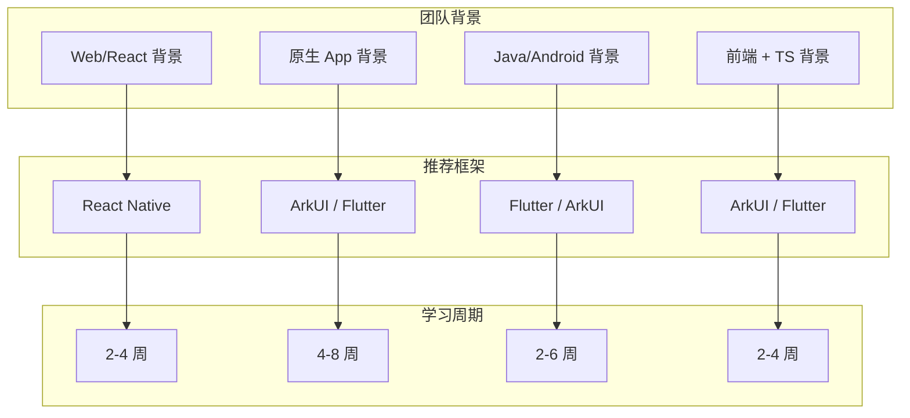
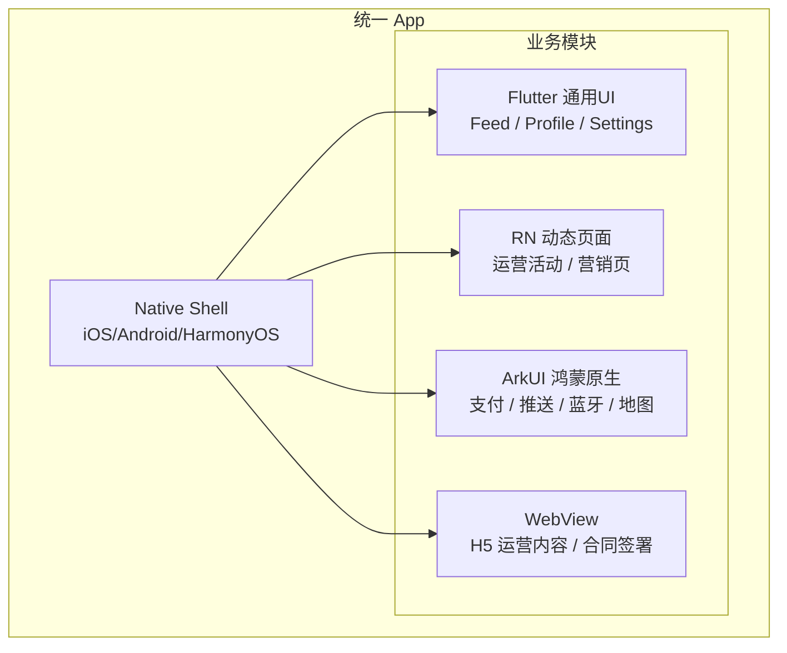

> **一句话概括：** RN 适合动态化优先的 Web 背景团队，Flutter 适合追求性能和一致性的独立跨端方案，鸿蒙 ArkUI 是纯鸿蒙原生应用和政企市场的必选项——选型不是比较孰优孰劣，而是匹配业务场景与技术基因。

## 背景与意义

2026 年的跨端技术栈比以往任何时候都更加复杂。几年前你只需要在 RN 和 Flutter 之间做选择，现在还要加上 HarmonyOS ArkUI 这个强有力的原生方案。而随着 Apple Vision Pro 的发布和 Web 标准的演进，跨端的边界还在继续扩展。

技术选型的错误可能会浪费团队数月的工作，甚至影响产品的市场窗口。因此建立一个系统化的选型框架至关重要。

## 概念与定义

### 选型评估维度

```
影响跨端框架选型的五大类因素：

1. 业务因素
   ├── 目标平台（iOS / Android / HarmonyOS / Web / Desktop）
   ├── 性能要求（列表 / 动画 / 启动 / 内存）
   ├── 动态化需求（热更新 / A/B 测试 / 运营活动）
   └── 生命周期（MVP / 长期维护 / 持续迭代）

2. 技术因素
   ├── 与原生平台的集成深度
   ├── 复杂 UI 能力（自定义形状 / Canvas / 3D）
   ├── 第三方 SDK 兼容性
   └── 异步 / 并发处理能力

3. 团队因素
   ├── 现有技术栈
   ├── 学习成本与培训周期
   ├── 人才获取难度
   └── 团队规模与组织架构

4. 生态因素
   ├── 三方库覆盖度
   ├── 社区活跃度与知识沉淀
   ├── 工具链成熟度
   └── 商业/厂商支持力度

5. 战略因素
   ├── 国产化与合规要求
   ├── 出海 vs 国内市场
   ├── 厂商锁定风险
   └── 未来迁移成本
```

## 核心知识点拆解

### 1. 平台覆盖矩阵

| 目标平台 | RN | Flutter | ArkUI |
|---------|----|---------|-------|
| iOS | ✅ 成熟 | ✅ 成熟 | ❌ 不适用 |
| Android | ✅ 成熟 | ✅ 成熟 | ❌ 不适用 |
| HarmonyOS | ⚠️ 适配中 | ✅ 可用 | ✅ 原生 |
| Web | ⚠️ react-native-web | ✅ 可用 (Beta) | ❌ 不适用 |
| macOS | ❌ 社区方案 | ✅ 稳定 | ❌ 不适用 |
| Windows | ❌ 社区方案 | ✅ 稳定 | ❌ 不适用 |
| Linux | ❌ 社区方案 | ✅ 稳定 | ❌ 不适用 |

```javascript
// RN 平台适配示例
import { Platform } from 'react-native';

const styles = StyleSheet.create({
  container: {
    padding: 16,
    ...Platform.select({
      ios: {
        shadowColor: '#000',
        shadowOffset: { width: 0, height: 2 },
        shadowOpacity: 0.25,
      },
      android: {
        elevation: 4,
      },
    }),
  },
});
```

```dart
// Flutter 平台适配
import 'dart:io' show Platform;

Widget build() {
  if (Platform.isIOS) {
    return CupertinoPageScaffold(
      navigationBar: CupertinoNavigationBar(
        middle: Text('iOS Style'),
      ),
      child: Center(child: Text('Cupertino UI')),
    );
  } else if (Platform.isAndroid) {
    return Scaffold(
      appBar: AppBar(title: Text('Material Style')),
      body: Center(child: Text('Material UI')),
    );
  } else {
    // HarmonyOS 或其他平台
    return Scaffold(
      appBar: AppBar(title: Text('Default Style')),
      body: Center(child: Text('Generic UI')),
    );
  }
}
```

### 2. 性能需求与框架匹配

```mermaid
graph LR
    subgraph 性能需求优先级
        A[启动速度]
        B[滚动帧率]
        C[动画流畅度]
        D[内存效率]
        E[包体积]
    end
    
    subgraph 框架得分 (1-10)
        RN: 启动6 滚动7 动画7 内存6 体积8
        Flutter: 启动8 滚动9 动画9 内存8 体积7
        ArkUI: 启动9 滚动10 动画10 内存9 体积9
    end
```

**按性能需求筛选：**

| 目标 | 推荐方案 | 备注 |
|------|---------|------|
| 极致启动速度 (< 500ms) | ArkUI | 原生冷启动最快 |
| 百毫秒级启动 | Flutter | AOT 编译优势 |
| 千元机流畅滚动 | ArkUI > Flutter > RN | 原生操控 1:0 |
| 复杂自定义动画 | Flutter | 自绘引擎 + 丰富动画 API |
| 低内存设备 (< 3GB) | ArkUI (首选) / Flutter (可接受) | RN 较吃力 |
| 极小的安装包 | RN (8MB) | Hermes 方案 |

### 3. 动态化与热更新需求

这是选型中最容易被低估的维度。很多团队上线后才发现"不可动态更新"的代价。

```javascript
// RN - CodePush 热更新示例
import codePush from 'react-native-code-push';

class App extends React.Component {
  componentDidMount() {
    // 启动时检查更新
    codePush.sync({
      updateDialog: false,
      installMode: codePush.InstallMode.ON_NEXT_RESTART,
    });
  }
  
  render() {
    return <MainApp />;
  }
}

// 包装整个 App
export default codePush(App);
```

```dart
// Flutter - 热更新方案（社区方案）
// Flutter 官方没有 CodePush 等价物
// 社区方案如 flutter_distributor + shorebird
class AppUpdater {
  static Future<void> checkForUpdate() async {
    final currentVersion = await _getCurrentVersion();
    final latestVersion = await _fetchLatestVersion();
    
    if (latestVersion > currentVersion) {
      // 下载新版本 AOT 快照
      await _downloadPatch(latestVersion);
      // 重启应用生效
      await _restartApp();
    }
  }
}
```

```typescript
// ArkUI - 鸿蒙原生 HAP 更新
// 鸿蒙支持 HAP 级别的热更新
@Entry
@Component
struct AppUpdatePage {
  @State progress: number = 0
  
  build() {
    Column() {
      Text('检查更新...')
      ProgressBar({ value: this.progress, total: 100 })
      
      Button('立即更新')
        .onClick(() => {
          const bundleInstaller = new BundleInstaller()
          bundleInstaller.installBundle({
            bundlePath: '/data/app/update.hap',
            callback: (err: Error, data: Result) => {
              if (!err) {
                // 重启应用
                Application.restartProcess()
              }
            }
          })
        })
    }
  }
}
```

| 动态化能力 | RN | Flutter | ArkUI |
|-----------|----|---------|-------|
| JS Bundle 热更新 | ✅ CodePush | ❌ 无官方方案 | N/A |
| AOT 补丁更新 | N/A | ⚠️ 社区方案 (Shorebird) | ✅ 系统级 HAP 更新 |
| 运营动态页面 | ✅ 完整方案 | ⚠️ 需自建 | ⚠️ 需自建 |
| A/B 测试框架 | ✅ 丰富 | ✅ 有方案 | ⚠️ 有限 |
| 运行时注入 | ✅ 原生支持 | ❌ 困难 | ❌ 不支持 |

### 4. 团队与技术匹配



**团队技能矩阵匹配度：**

| 团队背景 | RN | Flutter | ArkUI | 说明 |
|---------|----|---------|-------|------|
| React/Web 工程师 | ⭐⭐⭐⭐⭐ | ⭐⭐⭐ | ⭐⭐ | React 知识可迁移 80% |
| iOS 原生 (Swift) | ⭐⭐⭐ | ⭐⭐⭐⭐ | ⭐⭐⭐ | Dart 语法与 Swift 接近 |
| Android 原生 (Kotlin) | ⭐⭐⭐ | ⭐⭐⭐⭐ | ⭐⭐⭐⭐ | Dart 简洁，ArkUI 语音类似 |
| 全栈/Node.js | ⭐⭐⭐⭐ | ⭐⭐⭐ | ⭐⭐⭐ | JS/TS 经验可直接用 |
| Java 服务端 | ⭐⭐⭐ | ⭐⭐⭐⭐ | ⭐⭐⭐⭐ | OOP 思维迁移 |
| 零基础新手 | ⭐⭐⭐⭐ | ⭐⭐⭐ | ⭐⭐⭐⭐ | 取决于偏好 |

## 实战案例

### 案例一：国内某电商平台的完整选型过程

**背景：** 日活 200 万，目标平台 iOS + Android + 鸿蒙需求明确

**第一轮筛选：**

| 候选方案 | 理由 | 问题 |
|---------|------|------|
| ✅ Flutter | 跨端一致性好，性能优秀 | 热更新能力弱 |
| ✅ RN | 动态化强，Web 团队基础好 | 鸿蒙支持弱 |
| ❌ ArkUI 纯原生 | 不跨平台 | 需要三套代码 |
| ✅ Flutter + ArkUI 混合 | 兼顾性能与鸿蒙深度集成 | 架构复杂度高 |

**最终决定：** Flutter 主体 + ArkUI 鸿蒙原生模块（支付/推送/账号）

**关键决策因子（按权重排序）：**
1. 性能一致性（权重 25%）
2. 鸿蒙兼容性（权重 20%）
3. 开发效率（权重 20%）
4. 人才可获取性（权重 15%）
5. 热更新能力（权重 10%）
6. 工具链成熟度（权重 10%）

**选型得分（加权）：**
- Flutter: 7.8/10
- RN: 6.5/10
- ArkUI 纯原生: 5.2/10
- Flutter + ArkUI 混合: 8.5/10

### 案例二：海外社交 App 选型

**背景：** 初创公司，目标全球市场 iOS + Android，MVG 6 个月上线

```javascript
// 选型核心考量
const selectionFactors = {
  // 1. 速度优先 - 快速MVP
  timeToMarket: 'critical', // 6个月
  
  // 2. 平台要求
  platforms: ['iOS', 'Android'],
  harmonyOS: false,
  
  // 3. 团队背景
  teamSize: 4,
  teamSkills: ['React', 'TypeScript', 'Node.js'],
  
  // 4. 性能要求
  scrollPerformance: 'high', // 社交 Feed 流
  animation: 'medium',
  customUI: 'low',
  
  // 5. 动态化需求
  hotUpdate: true, // 不发版更新
  dynamicContent: true, // 服务端驱动 UI
}

// 决策结果：👉 React Native
// 理由：
// 1. 团队全栈 Web 背景，零学习曲线
// 2. CodePush 支持不发版迭代
// 3. 6个月 MVP 开发效率最高
// 4. 不需要迁移至鸿蒙
```

### 案例三：政企数字化 App 选型

**背景：** 政府客户，国产化要求，仅需鸿蒙端，高安全性要求

**决策树：**

```
Q: 是否需要 iOS/Android？
  → 否（只做鸿蒙）
Q: 是否有国产化合规要求？
  → 是（必须纯鸿蒙）
Q: 是否需要与其他平台共享代码？
  → 否（独立 App）
Q: 安全等级要求？
  → 高（数据不出设备）

结论：👉 ArkUI 纯原生
理由：唯一满足国产化要求的方案
      系统级安全保障
      最佳鸿蒙适配体验
      华为认证生态
```

### 案例四：多场景下的混合架构

大型企业应用常需要同时支持多种场景：



这种架构在 2026 年已相当常见：
- **Flutter** 负责主体 UI（性能敏感 + 跨平台统一）
- **RN** 负责动态页面（运营活动需要快速迭代）
- **ArkUI** 负责鸿蒙系统深度集成
- **WebView** 负责低频运营内容

## 选型决策矩阵

### 评分卡 (1-10, 10最佳)

| 场景需求 | 权重 | RN | Flutter | ArkUI |
|---------|------|----|---------|-------|
| iOS 表现 | 10% | 8 | 9 | N/A |
| Android 表现 | 15% | 7 | 9 | N/A |
| HarmonyOS 表现 | 15% | 4 | 7 | 10 |
| 热更新能力 | 10% | 9 | 4 | 6 |
| 跨平台代码复用 | 15% | 7 | 9 | 1 |
| 性能 (列表/动画) | 10% | 7 | 9 | 10 |
| 开发效率 | 10% | 9 | 8 | 7 |
| 生态成熟度 | 10% | 8 | 9 | 6 |
| 团队人才供给 | 5% | 8 | 7 | 5 |

### 场景→方案映射

| 场景 | 推荐方案 | 备选方案 | 理由 |
|-----|---------|---------|------|
| 混合平台 App (iOS+Android) | Flutter | RN | 性能一致性更好 |
| 混合平台 App (+HarmonyOS) | Flutter | RN + ArkUI 混合 | 跨端 + 鸿蒙深度集成 |
| 纯鸿蒙 App | ArkUI | 无 | 唯一选择 |
| 运营活动动态页面 | RN + CodePush | Flutter 自建热更新 | 成熟度差距明显 |
| 企业工具/后台 | RN | Flutter | Web 生态 + 快速迭代 |
| 社交/媒体 App | Flutter | RN | 滑动性能决定 |
| 教育/可视化 App | Flutter | ArkUI (鸿蒙专版) | Canvas 绘图优势 |
| 金融 App | Flutter (跨端) / ArkUI (鸿蒙) | RN | 性能和安全性要求 |
| 游戏/CAS 工具 | Flutter | 原生 | 自绘引擎优势 |
| MVP 快速验证 | RN | Flutter | React 生态最成熟 |
| 大厂现有原生迁移 | Flutter | 视团队而定 | 可渐进式引入 |

## 底层原理

### 选型的经济学模型

```
技术选型的"总成本"可以建模为：

Total Cost = 
  Development Cost (开发成本)
  + Maintenance Cost (维护成本)
  + Migration Cost (迁移成本)
  + Opportunity Cost (机会成本)

其中：
  Development Cost ∝ (代码行数 × 语言复杂度) / 团队生产力
  Maintenance Cost ∝ (平台数 × 框架变更频率) / 框架稳定性
  Migration Cost = 解耦程度 × 耦合度
  Opportunity Cost = 被放弃方案可能带来的收益
```

### 多平台代码复用率

```javascript
// 代码复用率估算
const codeReuseRatios = {
  'RN': {
    'iOS + Android': 0.80,  // 80% 代码共享
    '+ Web (react-native-web)': 0.60, // 加入 Web 后降到 60%
    '+ HarmonyOS': 0.55,  // 加入鸿蒙后 55%
  },
  'Flutter': {
    'iOS + Android': 0.95,  // 95% 共享
    '+ Web': 0.70,  // Web 端需适配
    '+ Desktop': 0.65,  // Desktop 适配
    '+ HarmonyOS': 0.90,  // 鸿蒙端几乎不变
  },
  'ArkUI': {
    'HarmonyOS only': 0.95,
    '+ iOS + Android': 0.0, // 无法共享
  }
};
```

## 高频面试题解析

### Q1: 团队有 10 人，现有产品需要从 iOS + Android 扩展到 HarmonyOS，怎么选？

**解析：** 这是一个常见的"增量迁移"场景。

**推荐方案：Flutter 渐进式引入**
1. 第 1 阶段：用 Flutter Module 嵌入现有原生 App
2. 第 2 阶段：将通用 UI 层（设置页、个人中心、Feed 流）迁移到 Flutter
3. 第 3 阶段：对新开发的鸿蒙端功能，直接用 Flutter 实现
4. 第 4 阶段：渐进替换完所有页面

**为什么不推荐 RN？** 现有团队是原生背景，RN 的 JS 层会增加维护复杂度
**为什么不推荐纯 ArkUI？** 需要三套代码，维护成本太高

### Q2: Flutter 和 RN 的性能差距在 2026 年还明显吗？

**解析：** 差距在缩小，但仍然存在。

**原始差距：** Flutter 在滚动（+20%）、动画（+30%）、启动（+40%）上的优势
**RN 新架构缩小差距后的情况：**
- 滚动性能差距：从 30% 缩小到 10-15%
- 启动速度差距：从 50% 缩小到 30%（Hermes + Fabric）
- 复杂动画差距：从 40% 缩小到 25%

**结论：** 如果你的 App 对性能有极端要求（如 60fps 不丢帧），Flutter 仍是更好的选择。如果性能不是第一优先（企业内部工具、轻度内容型 App），RN 完全可接受。

### Q3: 鸿蒙 ArkUI 的优势是否能弥补跨平台能力的缺失？

**解析：** 取决于业务的"广度"和"深度"。

**ArkUI 优于跨端框架的领域：**
- 纯鸿蒙场景：最佳性能（100% 系统优化）
- 国产化合规：唯一合规方案
- 华为生态能力：鸿蒙特有 API 的直接访问
- 政企市场：华为认证体系

**跨端框架优于 ArkUI 的领域：**
- 多平台覆盖：一套代码覆盖 iOS + Android + Web
- 人才获取：跨端开发者更多
- 非华为设备：无法覆盖

**答案：** 对于纯鸿蒙 App，ArkUI 的优势远大于跨平台能力的缺失。对于需要覆盖多平台的产品，ArkUI 无法替代跨端框架。

### Q4: 如何避免"迁移陷阱"——选择框架后想换却发现成本极高？

**解析：** 核心策略是"保持业务层与框架层解耦"。

```dart
// 解耦策略示例 - 业务逻辑与 UI 分离
// 1. 使用 UseCase / Repository 模式
abstract class UserRepository {
  Future<User> getUser(String id);
  Future<void> updateUser(User user);
}

// 2. 将业务逻辑放在纯 Dart/TS 层
class UserService {
  final UserRepository repo;
  
  Future<User> getUserWithPosts(String userId) async {
    final user = await repo.getUser(userId);
    return user;
  }
}

// 3. UI 层只依赖 Service，不直接依赖框架 API
// 这样切换框架时只需要重写 UI 层
```

**具体实践：**
- 业务逻辑写在 Pure Dart / Pure JS 中，不依赖框架 API
- 使用依赖注入管理框架依赖
- 将路由、导航抽象到统一协议层
- 数据层使用统一接口（Repository 模式）

这样即使未来从 RN 换到 Flutter，或从 Flutter 换到 ArkUI，也只是重写 UI 层（约 30-50% 代码），业务逻辑和数据层都可复用。

## 总结与扩展

### 选型决策三步法

```
Step 1: 确定不可妥协的硬约束
  ├── 必上鸿蒙且纯鸿蒙 → ArkUI
  ├── 必须动态更新 → RN
  ├── 必须覆盖 4+ 平台 → Flutter
  └── 极致性能要求 → ArkUI 或 Flutter

Step 2: 评估团队技术与学习曲线
  ├── React 团队 → 优先 RN
  ├── 原生团队 → Flutter 或 ArkUI
  └── 新团队 → Flutter（最长线投资）

Step 3: 验证生态满足度
  ├── 核心 SDK 是否都有对应 package？
  ├── 社区资源是否足够支撑开发？
  └── 长期维护成本是否有预估？
```

### 趋势展望（2026-2028）

1. **RN 新架构**将在 2027 年达到成熟，性能差距缩小至 5-10%
2. **Flutter + 鸿蒙**的组合会成为国内主流跨端模式
3. **ArkUI** 将在华为生态内部彻底取代现有跨端方案
4. **混合架构**（Flutter + RN + ArkUI）将越来越常见，而不是单一框架

最后分享一个观点：**没有"最好的框架"，只有"最合适的框架"。** 与框架本身的技术能力相比，**团队对框架的热爱程度**和**持续投入的意愿**往往是决定项目成败的更关键因素。
