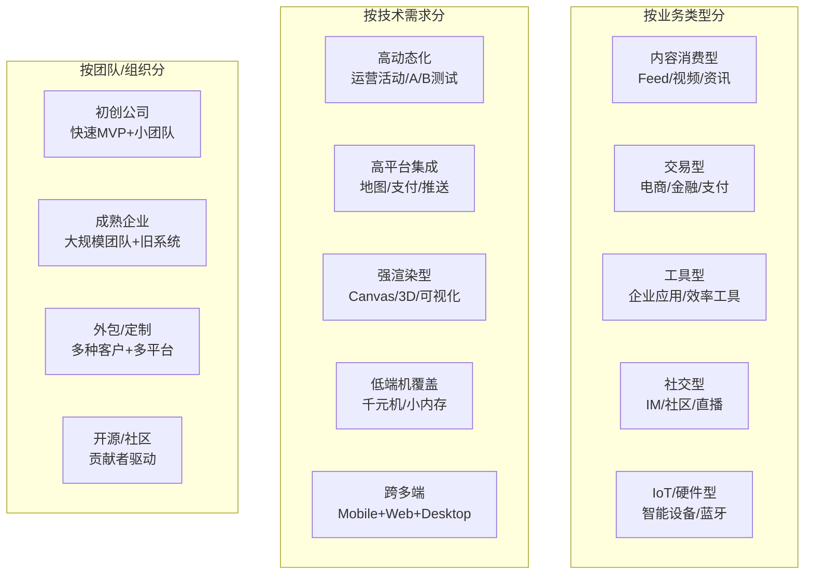
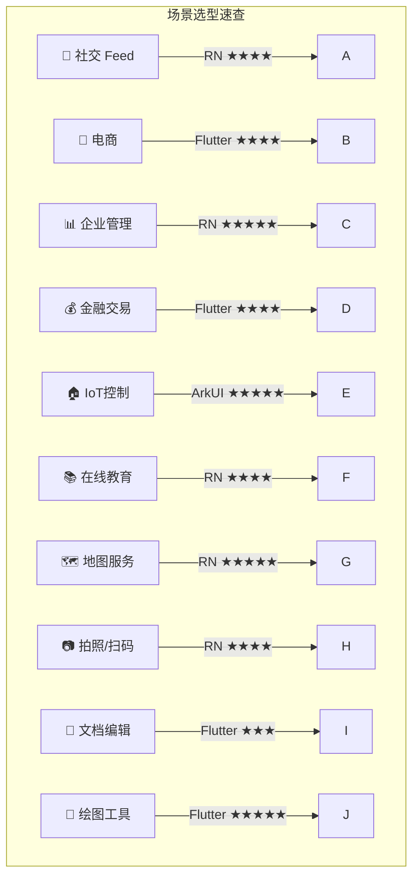

> **一句话概括：** 跨端框架没有普适的最优解——社交 Feed 流、电商复杂列表、企业工具、金融交易、IoT 设备……每种业务场景对性能、动态化、平台集成和团队能力有截然不同的权重，框架选择本质是场景与方案的最优匹配。

## 背景与意义

2026 年，跨端开发已经迈过了"能不能用"的阶段，进入了"怎么用好"的深水区。曾经的口号式对比（"Flutter 比 RN 快"、"ArkUI 更国产化"）已经无法指导实际决策。

问题在于：**不同的业务场景对框架能力的要求差异巨大。** 一个即时通讯 App 最关心的是列表滚动性能和消息同步延迟；一个电商 App 最关心的是页面动态配置和秒杀流畅度；一个 IoT 控制面板最关心的是设备通信可靠性和蓝牙集成能力。

本文从 10 个典型业务场景出发，深度分析每个场景的核心需求，给出明确的框架匹配度评分，配套完整的代码示例和权衡分析。

## 概念与定义

### 场景分类框架



## 十大典型场景深度分析

### 场景一：社交媒体 Feed 流

**核心需求：** 高性能列表滚动 + 图片加载 + 视频播放 + 动态评论


```javascript
// RN Feed 流实现
// 痛点：列表项内有视频组件时，滚动卡顿明显
function FeedList() {
  const [feedData, setFeedData] = useState([]);
  
  return (
    <FlatList
      data={feedData}
      renderItem={({ item }) => (
        <FeedCard item={item}>
          {item.type === 'video' && (
            <VideoPlayer
              source={{ uri: item.videoUrl }}
              paused={!item.isVisible}
              // 需要配合 onViewableItemsChanged 控制播放
            />
          )}
          <LikeButton itemId={item.id} />
          <CommentSection comments={item.comments} />
        </FeedCard>
      )}
      // 关键优化参数
      windowSize={5}
      maxToRenderPerBatch={10}
      removeClippedSubviews={true}
      onViewableItemsChanged={useCallback(({ viewableItems }) => {
        // 控制视频播放状态
        setVisibleItems(viewableItems.map(v => v.key));
      }, [])}
    />
  );
}
```


```dart
// Flutter Feed 流
class FeedScreen extends StatelessWidget {
  final List<FeedItem> items;
  
  @override
  Widget build(BuildContext context) {
    return ListView.builder(
      itemCount: items.length,
      itemExtent: null, // 动态高度
      addAutomaticKeepAlives: true,
      cacheExtent: 500, // 预加载 500px
      itemBuilder: (context, index) {
        final item = items[index];
        return FeedCard(
          child: Column(
            children: [
              if (item.type == FeedType.video)
                VideoPlayerWidget(url: item.videoUrl),
              LikeButton(itemId: item.id),
              CommentSection(comments: item.comments),
            ],
          ),
        );
      },
    );
  }
}
```

| 评估维度 | RN | Flutter | ArkUI |
|---------|----|---------|-------|
| 滚动性能 (1000项) | 7/10 | 9/10 | 10/10 |
| 视频集成 | 8/10 | 6/10 | 7/10 |
| 评论交互 | 8/10 | 8/10 | 8/10 |
| 动态内容渲染 | 9/10 | 7/10 | 6/10 |
| **综合推荐** | **推荐** | 可选 | 仅鸿蒙 |

**推荐原因：** Feed 流对**动态内容**的管理需求（不同卡片类型、A/B 测试、运营配置）远高于对极致滚动性能的需求。Flutter 虽然滚动更流畅，但动态内容管理不如 RN 灵活。且 RN 的 video 插件生态（react-native-video）远优于 Flutter（video_player 功能有限）。

### 场景二：电商 App

**核心需求：** 列表流畅度 + 运营动态化 + 秒杀倒计时 + 3D 展示

```javascript
// RN 电商的运营动态页面
// 服务端驱动 UI (SDUI) 模式
function ProductPage({ config: serverConfig }) {
  // 根据服务端配置动态渲染组件
  const sections = serverConfig.map((section, index) => {
    switch (section.type) {
      case 'carousel':
        return <ImageCarousel images={section.data} />;
      case 'countdown':
        return <CountdownTimer endTime={section.endTime} />;
      case 'grid':
        return <ProductGrid products={section.products} />;
      case 'flash_sale':
        return <FlashSaleSection items={section.items} />;
      default:
        return null;
    }
  });
  
  return <ScrollView>{sections}</ScrollView>;
}

// 使用 Animated 实现原生驱动的秒杀倒计时
function CountdownTimer({ endTime }) {
  const animatedValue = useRef(new Animated.Value(0)).current;
  
  useEffect(() => {
    const interval = setInterval(() => {
      const remaining = endTime - Date.now();
      if (remaining <= 0) {
        clearInterval(interval);
        // 触发秒杀结束逻辑
      }
    }, 1000);
    return () => clearInterval(interval);
  }, []);
  
  return (
    <Animated.View>
      <Text>距离结束: {formatTime(endTime - Date.now())}</Text>
    </Animated.View>
  );
}
```

```dart
// Flutter 电商 - 自绘的优势
class ProductPage extends StatelessWidget {
  final ServerConfig config;
  
  // 商品 3D 展示 - Flutter 自绘优势
  Widget build3DViewer(String productId) {
    return GestureDetector(
      onPanUpdate: (details) {
        // 实时更新 3D 模型旋转角度
        setState(() => _rotation += details.delta.dx * 0.01);
      },
      child: CustomPaint(
        painter: Model3DPainter(productId, _rotation),
        size: Size(300, 300),
      ),
    );
  }
}
```

| 评估维度 | RN | Flutter | ArkUI |
|---------|----|---------|-------|
| 运营动态化 | 9/10 | 6/10 | 5/10 |
| 秒杀/倒计时精度 | 7/10 | 9/10 | 10/10 |
| 商品列表滚动 | 7/10 | 9/10 | 9/10 |
| 3D/AR 展示 | 5/10 | 8/10 | 7/10 |
| 支付集成 | 7/10 | 7/10 | 8/10 |
| **综合推荐** | **可选** | **推荐** | 鸿蒙专用 |

**推荐原因：** 电商 App 最核心的矛盾在于"运营需要快速迭代" vs "用户要求流畅体验"。Flutter 在体验维度更强（滚动、动画、3D 展示），但动态运营能力需要额外搭建服务端驱动 UI 框架。如果团队有能力搭建 SDUI 层，Flutter 是更优选择。

### 场景三：企业级管理后台

**核心需求：** 快速迭代 + 大量表单 + 数据可视化 + 跨端（Mobile + Web）

```javascript
// RN + react-native-web 共享代码
// 一个组件同时用于 Mobile 和 Web
function DataTable({ columns, data }) {
  const isWeb = Platform.OS === 'web';
  
  return (
    <View style={styles.container}>
      <ScrollView horizontal={!isWeb}>
        <View>
          {/* Header */}
          <View style={styles.headerRow}>
            {columns.map(col => (
              <Text key={col.key} style={[styles.cell, { width: col.width }]}>
                {col.title}
              </Text>
            ))}
          </View>
          {/* Rows */}
          {data.map((row, i) => (
            <View key={i} style={styles.row}>
              {columns.map(col => (
                <Text key={col.key} style={[styles.cell, { width: col.width }]}>
                  {row[col.key]}
                </Text>
              ))}
            </View>
          ))}
        </View>
      </ScrollView>
    </View>
  );
}

// 表单共享
function UserForm({ onSubmit }) {
  const [form] = Form.useForm();
  
  return (
    <Form form={form} onFinish={onSubmit}>
      <Form.Item name="name" label="姓名" rules={[{ required: true }]}>
        <Input />
      </Form.Item>
      <Form.Item name="email" label="邮箱">
        <Input type="email" />
      </Form.Item>
      <Button type="primary" htmlType="submit">
        提交
      </Button>
    </Form>
  );
}
```

```dart
// Flutter 管理后台的优势
// Material 3 组件 + 响应式布局
class DashboardScreen extends StatelessWidget {
  @override
  Widget build(BuildContext context) {
    return LayoutBuilder(
      builder: (context, constraints) {
        if (constraints.maxWidth > 900) {
          // 宽屏：显示侧边栏 + 内容
          return Row(
            children: [
              NavigationRail(
                selectedIndex: 0,
                destinations: [
                  NavigationRailDestination(icon: Icon(Icons.dashboard), label: Text('仪表盘')),
                  NavigationRailDestination(icon: Icon(Icons.people), label: Text('用户管理')),
                  NavigationRailDestination(icon: Icon(Icons.settings), label: Text('设置')),
                ],
              ),
              Expanded(child: _buildContent(context)),
            ],
          );
        } else {
          // 窄屏：底部导航栏
          return Scaffold(
            body: _buildContent(context),
            bottomNavigationBar: NavigationBar(
              destinations: [
                NavigationDestination(icon: Icon(Icons.dashboard), label: '仪表盘'),
                NavigationDestination(icon: Icon(Icons.people), label: '用户'),
              ],
            ),
          );
        }
      },
    );
  }
}
```

| 评估维度 | RN | Flutter | ArkUI |
|---------|----|---------|-------|
| 表单开发效率 | 9/10 | 7/10 | 6/10 |
| 跨 Web 能力 | 8/10 | 6/10 | 1/10 |
| 表格/数据组件 | 8/10 | 7/10 | 5/10 |
| 快速迭代 | 9/10 | 7/10 | 6/10 |
| **综合推荐** | **推荐** | 可选 | ❌ |

**推荐原因：** 企业工具最关键的是**开发速度和代码复用**。RN 的 React hooks + 大量 Web 级表单组件 + react-native-web 方案，是管理后台的最优选择。Flutter 的 LayoutBuilder 响应式布局很强大，但表单生态较弱。

### 场景四：金融交易 App

**核心需求：** 安全性 + 性能稳定性 + 图表可视化 + 无障碍

```javascript
// RN 金融 App - 实时行情
function StockChart({ symbol, data }) {
  // 使用 react-native-svg 绘制 K 线
  return (
    <View style={styles.chartContainer}>
      <Svg height={300} width={width}>
        {/* K线绘制 */}
        {data.map((candle, i) => (
          <Line
            key={i}
            x1={i * candleWidth + candleWidth / 2}
            y1={candle.high}
            x2={i * candleWidth + candleWidth / 2}
            y2={candle.low}
            stroke={candle.close > candle.open ? '#00C853' : '#FF1744'}
            strokeWidth={1}
          />
        ))}
      </Svg>
      <Text>最新价: {data[data.length - 1].close}</Text>
    </View>
  );
}

// 安全键盘输入 - 需要原生模块
import SecureInput from 'react-native-secure-input';
<SecureInput
  pinLength={6}
  onComplete={handleAuth}
  secure={true}
/>
```

```dart
// Flutter 金融 App - CustomPainter 绘制高性能图表
class CandlestickChart extends StatelessWidget {
  final List<CandleData> data;
  
  @override
  Widget build(BuildContext context) {
    return CustomPaint(
      painter: CandlestickPainter(data),
      size: Size(MediaQuery.of(context).size.width, 300),
    );
  }
}

class CandlestickPainter extends CustomPainter {
  final List<CandleData> data;
  
  CandlestickPainter(this.data);
  
  @override
  void paint(Canvas canvas, Size size) {
    final candleWidth = size.width / data.length;
    final paint = Paint()..strokeWidth = 1;
    
    for (var i = 0; i < data.length; i++) {
      final candle = data[i];
      final x = i * candleWidth + candleWidth / 2;
      final isUp = candle.close >= candle.open;
      
      // 画影线
      paint.color = isUp ? Color(0xFF00C853) : Color(0xFFFF1744);
      canvas.drawLine(
        Offset(x, candle.high),
        Offset(x, candle.low),
        paint,
      );
      
      // 画实体
      paint.style = PaintingStyle.fill;
      paint.color = isUp ? Color(0xFF00C853) : Color(0xFFFF1744);
      canvas.drawRect(
        Rect.fromCenter(
          center: Offset(x, candle.open + (candle.close - candle.open) / 2),
          width: candleWidth * 0.6,
          height: (candle.close - candle.open).abs(),
        ),
        paint,
      );
    }
  }
  
  @override
  bool shouldRepaint(CandlestickPainter oldDelegate) {
    return oldDelegate.data != data;
  }
}
```

| 评估维度 | RN | Flutter | ArkUI |
|---------|----|---------|-------|
| 图表性能 | 6/10 | 9/10 | 8/10 |
| 安全键盘/加密 | 7/10 | 7/10 | 9/10 |
| 动画流畅度 | 7/10 | 9/10 | 10/10 |
| 无障碍支持 | 7/10 | 7/10 | 9/10 |
| 稳定性 | 7/10 | 8/10 | 9/10 |
| **综合推荐** | ❌ | **推荐** | 鸿蒙推荐 |

**推荐原因：** 金融 App 对稳定性和性能的要求极高。Flutter 的 CustomPainter 可以轻松实现高性能 K 线图，RN 的 react-native-svg 在大量数据点下性能下降明显。Flutter AOT 编译和确定性 GC 更适合金融场景。

### 场景五：IoT 智能家居控制

**核心需求：** 蓝牙 BLE 集成 + 实时状态 + 离线可用 + 低功耗

```typescript
// ArkUI IoT 控制面板 - 鸿蒙原生
@Entry
@Component
struct DeviceControlPanel {
  @State devices: SmartDevice[] = []
  @State bluetoothStatus: BluetoothStatus = BluetoothStatus.Disconnected
  
  aboutToAppear() {
    // 连接蓝牙 - 直接使用系统 API
    bluetooth.startBLEScan({
      success: (result: Array<ScanResult>) => {
        this.devices = result.map(r => ({
          name: r.deviceName,
          rssi: r.rssi,
          address: r.deviceId,
        }))
      }
    })
  }
  
  build() {
    Column() {
      // 设备列表
      ForEach(this.devices, (device: SmartDevice) => {
        Row() {
          Text(device.name)
          Text('信号: ${device.rssi} dBm')
          Toggle({
            type: ToggleType.Switch,
            isOn: device.isConnected
          }).onChange((isOn: boolean) => {
            // 直接通过系统 API 控制蓝牙
            bluetooth.sendData(device.address, JSON.stringify({
              command: 'toggle',
              value: isOn
            }))
          })
        }
      })
    }
    .onPageHide(() => {
      // 页面隐藏时关闭蓝牙以省电
      bluetooth.stopBLEScan()
      bluetooth.disconnect()
    })
  }
}
```

```dart
// Flutter IoT - 需要 flutter_blue_plus 插件
class DeviceControl extends StatefulWidget {
  @override
  State<DeviceControl> createState() => _DeviceControlState();
}

class _DeviceControlState extends State<DeviceControl> {
  List<ScanResult> scanResults = [];
  FlutterBluePlus flutterBlue = FlutterBluePlus.instance;
  
  @override
  void initState() {
    super.initState();
    startScan();
  }
  
  Future<void> startScan() async {
    // 需要检查蓝牙权限
    var status = await Permission.bluetooth.request();
    if (status.isGranted) {
      flutterBlue.scanResults.listen((results) {
        setState(() => scanResults = results);
      });
      flutterBlue.startScan(
        withServices: [Guid("180F")], // Battery Service
        scanMode: ScanMode.lowLatency,
      );
    }
  }
  
  Future<void> toggleDevice(String deviceId, bool on) async {
    // 连接并发送指令
    final device = await flutterBlue.connect(deviceId);
    await device.writeCharacteristic(
      Guid("FFE1"), // 自定义特征值
      utf8.encode('{"command": "toggle", "value": ${on.toString()}}'),
    );
  }
  
  @override
  void dispose() {
    flutterBlue.stopScan();
    super.dispose();
  }
}
```

| 评估维度 | RN | Flutter | ArkUI |
|---------|----|---------|-------|
| BLE 集成 | 6/10 | 7/10 | 9/10 |
| 实时数据 | 7/10 | 8/10 | 9/10 |
| 低功耗优化 | 5/10 | 6/10 | 9/10 |
| 离线缓存 | 8/10 | 8/10 | 9/10 |
| **综合推荐** | ❌ | 可选 | **推荐** |

**推荐原因：** IoT 场景对系统集成的深度要求远高于 UI 性能。ArkUI 直接访问鸿蒙的蓝牙 API，没有中间层损耗，且系统级低功耗管理策略完善。Flutter 通过 plugin 访问 BLE，延迟和电量控制不如原生。

### 场景六：在线教育/Live 直播

**核心需求：** 低延迟音视频 + 白板绘制 + IM 聊天 + 动态课件

```javascript
// RN 直播 - WebRTC 集成
import { MediaStream, RTCPeerConnection } from 'react-native-webrtc';

class LiveRoom extends React.Component {
  peerConnection = new RTCPeerConnection({
    iceServers: [{ urls: 'stun:stun.l.google.com:19302' }],
  });
  
  async startStream() {
    const stream = await mediaDevices.getUserMedia({
      video: true,
      audio: true,
    });
    
    stream.getTracks().forEach(track =>
      this.peerConnection.addTrack(track, stream)
    );
    
    const offer = await this.peerConnection.createOffer();
    await this.peerConnection.setLocalDescription(offer);
    
    // 发送 offer 到信令服务器
    ws.send(JSON.stringify({ type: 'offer', sdp: offer }));
  }
  
  // 白板 - 使用 react-native-canvas
  renderWhiteboard() {
    return (
      <Canvas
        ref={canvasRef}
        onTouchMove={(e) => {
          const ctx = canvasRef.current.getContext('2d');
          ctx.lineTo(e.nativeEvent.x, e.nativeEvent.y);
          ctx.stroke();
        }}
      />
    );
  }
}
```

```dart
// Flutter 直播 - 使用 flutter_livekit 或自定义
class LiveRoom extends StatefulWidget {
  @override
  State<LiveRoom> createState() => _LiveRoomState();
}

class _LiveRoomState extends State<LiveRoom> {
  // flutter_webrtc + flutter_livekit
  final RTCVideoRenderer _localRenderer = RTCVideoRenderer();
  
  @override
  void initState() {
    super.initState();
    _initializeLiveStream();
  }
  
  Future<void> _initializeLiveStream() async {
    await _localRenderer.initialize();
    // LiveKit 连接
    final room = Room();
    await room.connect('wss://live.example.com', 'token');
    
    // 本地视频轨道
    final localVideoTrack = await LocalVideoTrack.create(true);
    await localVideoTrack.addRenderer(_localRenderer);
    
    // 信令处理
    room.addListener(() {
      if (room.connectionState == ConnectionState.connected) {
        setState(() => _connected = true);
      }
    });
  }
}
```

| 评估维度 | RN | Flutter | ArkUI |
|---------|----|---------|-------|
| WebRTC 集成 | 8/10 | 7/10 | 7/10 |
| 白板绘制 | 6/10 | 9/10 | 7/10 |
| IM 集成 | 8/10 | 8/10 | 7/10 |
| 音频延迟 | 8/10 | 7/10 | 9/10 |
| **综合推荐** | **推荐** | 可选 | 鸿蒙推荐 |

**推荐原因：** 在线教育场景中，WebRTC 的成熟集成最重要。RN 的 react-native-webrtc 经过了大量生产环境验证，文档完善、问题修复及时。Flutter 的 flutter_webrtc 也足够好，但在个别边缘情况下不如 RN 稳定。

### 场景七：地图/位置服务

**核心需求：** 原生地图（Google Maps / 高德 / 百度 / 华为地图）+ 手势交互


```javascript
// RN 地图 - react-native-maps
<MapView
  style={styles.map}
  initialRegion={{
    latitude: 39.9042,
    longitude: 116.4074,
    latitudeDelta: 0.01,
    longitudeDelta: 0.01,
  }}
  onRegionChangeComplete={(region) => {
    // 加载该区域 POI 数据
    fetchPOIs(region);
  }}>
  
  <Marker
    coordinate={{ latitude: 39.9042, longitude: 116.4074 }}
    title="故宫"
    description="北京市东城区"
  >
    <Callout>
      <View style={styles.callout}>
        <Text style={styles.title}>故宫博物院</Text>
        <Text>开放时间: 8:30-17:00</Text>
      </View>
    </Callout>
  </Marker>
</MapView>
```


```dart
// Flutter 地图 - 需要 PlatformView
// 性能低于 RN 的原生地图
Widget buildMap() {
  return GoogleMap(
    initialCameraPosition: CameraPosition(
      target: LatLng(39.9042, 116.4074),
      zoom: 12,
    ),
    markers: {
      Marker(
        markerId: MarkerId('1'),
        position: LatLng(39.9042, 116.4074),
        infoWindow: InfoWindow(
          title: '故宫',
          snippet: '北京市东城区',
        ),
      ),
    },
    onMapCreated: (controller) {
      _mapController = controller;
    },
  );
}
```

| 评估维度 | RN | Flutter | ArkUI |
|---------|----|---------|-------|
| 地图组件成熟度 | 9/10 | 6/10 | 8/10 |
| 手势交互流畅度 | 8/10 | 5/10 | 8/10 |
| 多提供商支持 | 9/10 | 6/10 | 4/10 |
| **综合推荐** | **推荐** | ❌ | 鸿蒙推荐 |

**推荐原因：** 地图组件是 RN 的传统强项。react-native-maps 支持 Google Maps（iOS/Android）、高德地图、华为地图等多种 Provider。Flutter 的地图需要通过 PlatformView（AndroidView）嵌入原生组件，手势冲突问题一直是痛点，连 Google 自家的 google_maps_flutter 都有性能问题。

### 场景八：拍照/扫码/文档扫描

```dart
// Flutter Camera - 拍照功能
class CameraScreen extends StatefulWidget {
  @override
  State<CameraScreen> createState() => _CameraScreenState();
}

class _CameraScreenState extends State<CameraScreen> {
  CameraController? _controller;
  
  @override
  void initState() {
    super.initState();
    _initCamera();
  }
  
  Future<void> _initCamera() async {
    _controller = CameraController(
      await availableCameras().then((c) => c.first),
      ResolutionPreset.high,
      enableAudio: false,
    );
    await _controller!.initialize();
    setState(() {});
  }
  
  Future<void> takePicture() async {
    final XFile photo = await _controller!.takePicture();
    // 图片处理
    final bytes = await photo.readAsBytes();
    // OCR / 文档扫描
    final text = await _recognizeText(bytes);
  }
  
  @override
  Widget build(BuildContext context) {
    if (_controller == null || !_controller!.value.isInitialized) {
      return CircularProgressIndicator();
    }
    return CameraPreview(_controller!);
  }
}
```

```javascript
// RN Camera - 使用 react-native-vision-camera
function CameraView() {
  const camera = useRef<Camera>(null);
  
  const takePhoto = async () => {
    const photo = await camera.current.takeSnapshot({
      quality: 90,
      skipMetadata: true,
    });
    // OCR 处理
    const text = await TextRecognition.recognize(photo.path);
    return text;
  };
  
  return (
    <Camera
      ref={camera}
      style={StyleSheet.absoluteFill}
      device={backCamera}
      isActive={true}
      photo={true}
    />
  );
}
```

| 场景 | RN | Flutter | 推荐 |
|-----|----|---------|------|
| 拍照/扫码 | 9/10 | 8/10 | RN |
| 文档扫描 | 7/10 | 6/10 | RN |
| 实时滤镜 | 6/10 | 8/10 | Flutter |
| **综合** | | | **RN (扫码/拍照) / Flutter (滤镜)** |

### 场景九：在线文档/富文本编辑器

```dart
// Flutter 富文本 - 使用 flutter_quill
QuillEditor.basic(
  controller: _controller,
  configurations: QuillEditorConfigurations(
    autoFocus: true,
    expands: true,
    padding: EdgeInsets.all(16),
    placeholder: '开始编辑...',
    // 支持多种格式
    enableInteractiveSelection: true,
  ),
);

// 自定义嵌入对象
class ImageEmbed extends Embeddable {
  ImageEmbed(String url) : super('image', {'url': url});
}

// Flutter 的富文本原生自绘，滚动和交互都交由自身引擎
// 不依赖 WebView 或原生文本组件
```

| 评估维度 | RN | Flutter | ArkUI |
|---------|----|---------|-------|
| 富文本编辑 | 5/10 | 7/10 | 4/10 |
| 协同编辑 | 6/10 | 5/10 | 4/10 |
| **综合推荐** | ❌ | **推荐** | ❌ |

### 场景十：Canvas/创意/绘图工具

```dart
// Flutter 绘图工具 - 完全自绘
class DrawingCanvas extends StatefulWidget {
  @override
  State<DrawingCanvas> createState() => _DrawingCanvasState();
}

class _DrawingCanvasState extends State<DrawingCanvas> {
  List<DrawingPoint> points = [];
  
  @override
  Widget build(BuildContext context) {
    return GestureDetector(
      onPanStart: (details) => setState(() {
        points.add(DrawingPoint(details.localPosition, Paint()..strokeWidth = 3));
      }),
      onPanUpdate: (details) => setState(() {
        points.last.points.add(details.localPosition);
      }),
      child: CustomPaint(
        painter: DrawingPainter(points),
        size: Size.infinite,
      ),
    );
  }
}

class DrawingPainter extends CustomPainter {
  final List<DrawingPoint> strokes;
  
  @override
  void paint(Canvas canvas, Size size) {
    for (final stroke in strokes) {
      final path = Path();
      if (stroke.points.isEmpty) continue;
      
      path.moveTo(stroke.points.first.dx, stroke.points.first.dy);
      for (int i = 1; i < stroke.points.length; i++) {
        path.lineTo(stroke.points[i].dx, stroke.points[i].dy);
      }
      canvas.drawPath(path, stroke.paint);
    }
  }
  
  @override
  bool shouldRepaint(covariant DrawingPainter oldDelegate) => true;
}
```

| 评估维度 | RN | Flutter | ArkUI |
|---------|----|---------|-------|
| 绘图性能 | 5/10 | 9/10 | 7/10 |
| 自定义渲染 | 4/10 | 10/10 | 7/10 |
| 3D 支持 | 4/10 | 7/10 | 5/10 |
| **综合推荐** | ❌ | **推荐** | 鸿蒙推荐 |

**推荐原因：** 这是 Flutter 表现最突出的场景之一。自绘引擎 + CustomPainter 让 Flutter 是天生的绘图工具平台。

## 场景快速参考表



## 总结与扩展

### 核心原则

1. **没有万能框架**——每个场景有不同的优先需求
2. **混合架构是常态**——大型项目通常会同时使用 2-3 种框架
3. **团队能力决定上限**——再好的框架也需要好的团队驾驭
4. **动态化需求常被低估**——上线后就发现不发版更新的需求越来越多

### 场景决策清单

在每次技术选型前，问这 5 个问题：

1. **目标平台有哪些？**（仅说明对跨非开发端的需求）
2. **性能要求有多高？**（列表、动画、启动各占权重）
3. **需要动态更新吗？**（能否接受定期 App Store 审核？）
4. **团队技能栈是什么？**（Web/原生/鸿蒙背景？）
5. **核心 SDK 支持度如何？**（地图、支付、推送、音视频都有对应的包吗？）

### 未来趋势

2026-2028 年，跨端场景将进一步细化：

- **AI 直接生成 UI**——Flutter/Rob 都可能被 AI 用来生成界面，框架的"可程序化"程度将变得重要
- **泛终端扩展**——汽车仪表盘、智能手表、折叠屏将纳入跨端的范畴
- **性能不再是瓶颈**——随着设备性能提升，框架差异将缩小，生态和开发体验成为主要考量
- **混合渲染**——Flutter + 原生、RN + 原生、Flutter + RN 的混合渲染方案会越来越成熟

最终的结论：**场景决定框架，而非框架决定场景。**
