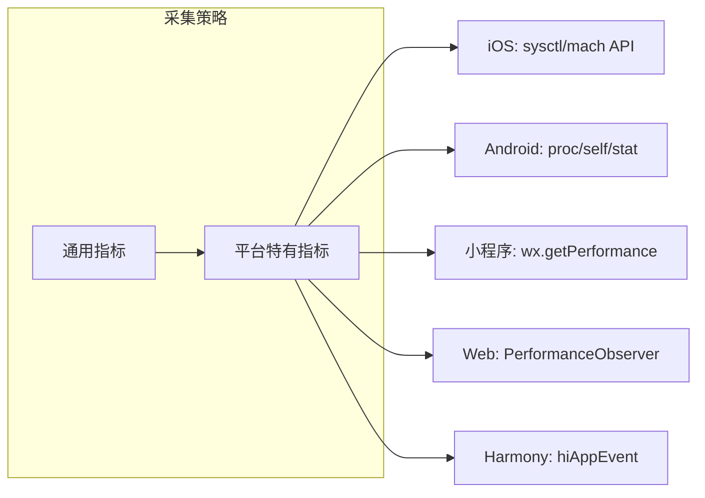

> 跨端应用的性能监控不是简单地在多端部署同一套指标采集脚本——它需要针对各平台特性设计统一的性能模型、差异化采集策略和一致的可视化体系，本文构建了一套端到端的跨端APM落地方法论。

## 一、背景与意义

当企业从单一平台扩展到跨端开发后，一个棘手的问题浮现：**同样的代码在不同平台上的表现截然不同**。

一个在iOS上60fps流畅运行的动画，在小程序上可能掉到20fps；一个在Web上秒开的页面，在低端Android上需要3秒才能渲染；一个在网络通畅时表现良好的接口，在弱网环境下可能超时导致应用白屏长达10秒。

**缺乏统一性能监控的后果**：
- 无法量化"卡顿"——设计师说卡，开发者说不卡
- 无法定位瓶颈——同样的延迟，是JS计算慢？布局花费久？还是接口响应慢？
- 无法对比优化效果——改完后"感觉快了一点"，实际毫无改善
- 版本回退风险——不知道哪个版本引入了性能退化

跨端性能监控体系的终极目标：**以统一的度量衡，量化所有端上的性能表现，自动发现退化并定位根因**。

## 二、概念与定义

### 2.1 核心性能指标（Cross-Platform Metrics）

| 指标 | 含义 | 目标值 | 采集难度 |
|------|------|--------|---------|
| FCP | 首屏内容渲染时间 | <1.5s | 低 |
| TTI | 可交互时间 | <3s | 中 |
| FPS | 帧率 | >55 fps | 低 |
| ANR | 应用无响应次数 | 0/天 | 低 |
| PLT | 页面加载时间 | <2s | 中 |
| Memory | 内存占用峰值 | <300MB | 低 |
| CPU | CPU使用率 | <40% 常态 | 中 |
| BundleSize | 包体积 | iOS<50MB, Android<15MB | 低 |

### 2.2 监控架构的核心角色

```
数据采集层 → 数据汇聚层 → 数据分析层 → 可视化报警层
```

**每一层在跨端场景下的特殊要求**：
1. **采集层**：对终端用户无感知，性能开销 < 1ms/次
2. **汇聚层**：支持多端异构数据的统一Schema
3. **分析层**：支持跨端对比分析、版本对比
4. **报警层**：支持分平台、分版本的分级报警

## 三、最小示例

### 3.1 基础性能监控SDK

```typescript
// CrossPlatformPerfMonitor.ts
// 一个轻量级跨端性能监控SDK核心

interface PerfMetric {
  name: string;
  value: number;
  platform: string;
  timestamp: number;
  tags?: Record<string, string>;
}

interface PerfSpan {
  name: string;
  startTime: number;
  endTime?: number;
  children: PerfSpan[];
  attributes: Record<string, any>;
}

class PerfMonitor {
  private metrics: PerfMetric[] = [];
  private activeSpans: Map<string, PerfSpan> = new Map();
  private isPaused: boolean = false;
  private uploadInterval: number = 30000; // 30s上报一次
  private uploadTimer: ReturnType<typeof setInterval> | null = null;

  constructor(private platform: string, private appVersion: string) {
    this.startAutoUpload();
    this.captureStartupMetrics();
  }

  // 记录单值指标
  recordMetric(name: string, value: number, tags?: Record<string, string>) {
    if (this.isPaused) return;
    this.metrics.push({
      name,
      value,
      platform: this.platform,
      timestamp: Date.now(),
      tags: { ...tags, version: this.appVersion },
    });

    // 缓冲区超过100条立即上报
    if (this.metrics.length >= 100) {
      this.flush();
    }
  }

  // 追踪耗时操作（Span模式）
  startSpan(name: string, attributes?: Record<string, any>): string {
    const spanId = `${name}_${Date.now()}_${Math.random().toString(36).slice(2)}`;
    const span: PerfSpan = {
      name,
      startTime: performance.now(),
      children: [],
      attributes: attributes || {},
    };
    this.activeSpans.set(spanId, span);
    return spanId;
  }

  endSpan(spanId: string, extraAttributes?: Record<string, any>) {
    const span = this.activeSpans.get(spanId);
    if (!span) return;

    span.endTime = performance.now();
    const duration = span.endTime - span.startTime;

    this.metrics.push({
      name: `span.${span.name}`,
      value: duration,
      platform: this.platform,
      timestamp: Date.now(),
      tags: {
        ...span.attributes,
        ...extraAttributes,
        version: this.appVersion,
      },
    });

    this.activeSpans.delete(spanId);
  }

  // 启动性能采集
  private captureStartupMetrics() {
    // FCP采集（不同平台不同实现）
    if (this.platform === 'weapp') {
      const sysInfo = wx.getSystemInfoSync();
      this.recordMetric('device.memory', sysInfo.memory || -1);
    }

    if (typeof performance !== 'undefined') {
      // 用PerformanceObserver采集FCP
      try {
        const observer = new PerformanceObserver((list) => {
          for (const entry of list.getEntries()) {
            if (entry.name === 'first-contentful-paint') {
              this.recordMetric('FCP', entry.startTime);
              observer.disconnect();
            }
          }
        });
        observer.observe({ type: 'paint', buffered: true });
      } catch (e) {
        // PerformanceObserver不可用（小程序环境）
        this.recordMetric('FCP', -1);
      }
    }
  }

  // JS线程卡顿检测
  startJankDetection() {
    let lastTime = performance.now();
    const checkInterval = setInterval(() => {
      const now = performance.now();
      const delta = now - lastTime;
      // 如果间隔超过50ms（约20fps），记录一次卡顿
      if (delta > 50) {
        this.recordMetric('jank', delta, {
          expectedInterval: '16',
          actualDelay: delta.toFixed(0),
        });
      }
      lastTime = now;
    }, 1000);

    return () => clearInterval(checkInterval);
  }

  private flush() {
    if (this.metrics.length === 0) return;
    const batch = this.metrics.splice(0);
    this.uploadBatch(batch);
  }

  private async uploadBatch(batch: PerfMetric[]) {
    try {
      // 压缩发送
      const compressed = this.compress(batch);
      await fetch('https://apm.example.com/v1/metrics', {
        method: 'POST',
        headers: { 'Content-Type': 'application/json' },
        body: JSON.stringify({ metrics: compressed }),
        // 性能监控的上报请求不阻塞主流程
        keepalive: true,
      });
    } catch (e) {
      // 上报失败静默处理，避免循环
      console.warn('[PerfMonitor] Upload failed:', e);
    }
  }

  // 轻量压缩：去除冗余字段
  private compress(batch: PerfMetric[]): any[] {
    const platform = batch[0].platform;
    const version = batch[0].tags?.version;
    return batch.map(m => ({
      n: m.name,
      v: Math.round(m.value * 100) / 100,
      t: m.timestamp,
      ...(m.tags ? { g: { ...m.tags, p: undefined, version: undefined } } : {}),
    }));
  }

  private startAutoUpload() {
    this.uploadTimer = setInterval(() => this.flush(), this.uploadInterval);
    // 页面卸载时立即上报
    window.addEventListener?.('beforeunload', () => this.flush());
  }

  destroy() {
    if (this.uploadTimer) clearInterval(this.uploadTimer);
    this.flush();
  }
}
```

### 3.2 框架层性能埋点（以React Native为例）

```typescript
// 包装React Navigation实现页面级别的性能监控
import { perfMonitor } from './PerfMonitor';

const withPageTracking = (WrappedComponent: React.ComponentType, pageName: string) => {
  return class extends React.Component {
    private spanId: string;

    componentDidMount() {
      this.spanId = perfMonitor.startSpan('page.render', { page: pageName });
      
      // 测量布局完成时间
      requestAnimationFrame(() => {
        perfMonitor.endSpan(this.spanId, { layoutComplete: true });
        perfMonitor.recordMetric(`page.${pageName}.tti`, Date.now());
      });
    }

    componentDidUpdate(prevProps: any) {
      // 追踪页面更新性能
      const updateSpanId = perfMonitor.startSpan('page.update', { page: pageName });
      requestAnimationFrame(() => {
        perfMonitor.endSpan(updateSpanId);
      });
    }

    componentWillUnmount() {
      // 无痕埋点：页面停留时长自动记录
      perfMonitor.recordMetric(`page.${pageName}.duration`, Date.now());
    }

    render() {
      return <WrappedComponent {...this.props} />;
    }
  };
};
```

## 四、核心知识点拆解

### 4.1 跨端APM的通用数据模型

统一的数据模型是跨端性能监控的基石。一个设计不良的数据模型会直接导致多维分析能力丧失：

```protobuf
// 统一的跨端性能数据模型（Protobuf定义）
syntax = "proto3";

message PerfRecord {
  // 必填字段
  string app_id = 1;
  string platform = 2;       // ios / android / weapp / web / harmony
  string version = 3;        // 应用版本号
  string user_id = 4;
  int64 timestamp = 5;       // 时间戳（毫秒）

  // 指标类型
  oneof metric {
    MetricCounter counter = 10;
    MetricTimer timer = 11;
    MetricSpan span = 12;
    MetricAnr anr = 13;
    MetricMemory memory = 14;
    MetricNetwork network = 15;
  }

  // 自定义标签
  map<string, string> tags = 20;
  // 设备信息（自动采集）
  DeviceInfo device = 21;
}

message MetricSpan {
  string name = 1;
  double duration_ms = 2;
  string parent_span_id = 3;
  string trace_id = 4;
  map<string, string> attributes = 5;
  bool is_error = 6;
  string error_message = 7;
}

message DeviceInfo {
  string model = 1;
  string os_version = 2;
  int32 memory_mb = 3;
  int32 storage_free_mb = 4;
  string network_type = 5;  // wifi / 4g / 5g / offline
  string carrier = 6;
  double battery_level = 7;
  string screen_resolution = 8;
}
```

这个数据模型的意义在于：**所有平台采集的数据都共享同一套Schema**，后端分析时无需做数据转换。对比之下，很多团队各端独立采集，导致后端需要对三套不同格式的数据做归一化，增加了复杂度和出错概率。

### 4.2 各平台差异化采集策略



**iOS特有采集**：
```objc
// 获取iOS每秒的FPS
- (void)startFPSTracking {
    CADisplayLink *displayLink = [CADisplayLink displayLinkWithTarget:self
                                                             selector:@selector(step:)];
    [displayLink addToRunLoop:[NSRunLoop mainRunLoop] forMode:NSRunLoopCommonModes];
}

- (void)step:(CADisplayLink *)link {
    static int frameCount = 0;
    static NSTimeInterval lastTime = 0;
    frameCount++;
    if (lastTime == 0) { lastTime = link.timestamp; return; }
    
    NSTimeInterval elapsed = link.timestamp - lastTime;
    if (elapsed >= 1.0) {
        int fps = frameCount;
        [self sendMetric:@"fps" value:fps tags:nil];
        frameCount = 0;
        lastTime = link.timestamp;
    }
}
```

**Android特有采集**：
```kotlin
// 获取Android应用的内存占用
class MemoryCollector(private val context: Context) {
    fun collectMemoryMetrics(): MemoryMetrics {
        val runtime = Runtime.getRuntime()
        val activityManager = context.getSystemService(Context.ACTIVITY_SERVICE) 
            as ActivityManager
        
        val memInfo = ActivityManager.MemoryInfo()
        activityManager.getMemoryInfo(memInfo)
        
        return MemoryMetrics(
            javaHeap = (runtime.totalMemory() - runtime.freeMemory()) / 1024 / 1024,
            nativeHeap = Debug.getNativeHeapAllocatedSize() / 1024 / 1024,
            totalHeap = (memInfo.totalMem - memInfo.availMem) / 1024 / 1024,
            isLowMemory = memInfo.lowMemory,
            threshold = memInfo.threshold / 1024 / 1024
        )
    }
    
    fun collectFrameMetrics(): FrameMetrics {
        return FrameMetrics(
            totalFrames = FrameMetricsManager.totalFrames,
            jankyFrames = FrameMetricsManager.jankyFrames,
            jankPercent = if (FrameMetricsManager.totalFrames > 0) {
                (FrameMetricsManager.jankyFrames.toDouble() / 
                 FrameMetricsManager.totalFrames) * 100
            } else 0.0
        )
    }
}
```

**小程序特有采集**：
```typescript
// 小程序性能数据采集
export function collectMiniProgramMetrics() {
  // 1. 运行时性能
  const performance = wx.getPerformance();
  const entryList = performance.getEntries();
  
  // 2. 内存
  const memInfo = performance.getMemoryInfo();
  
  // 3. 分包加载
  const loadSubpackageMetrics = {
    packageName: '',
    downloadCost: 0,
    loadCost: 0,
  };
  
  // 4. 渲染层耗时 - 通过小程序特有的WXS埋点
  const renderTiming = {
    setDataTime: 0,     // setData耗时
    renderTime: 0,      // 渲染耗时
    virtualDomTime: 0,  // 虚拟DOM diff时间
  };

  return { performance, memInfo, loadSubpackageMetrics, renderTiming };
}
```

## 五、实战案例：跨端电商应用的全链路APM部署

### 5.1 整体架构

```
┌─────────────┐   ┌─────────────┐   ┌─────────────┐
│  iOS端       │   │  Android端   │   │  小程序端    │
│ PerfSDK     │   │ PerfSDK     │   │ PerfSDK     │
└──────┬──────┘   └──────┬──────┘   └──────┬──────┘
       │                 │                 │
       └─────────────────┼─────────────────┘
                         ▼
              ┌─────────────────────┐
              │    数据汇聚层        │
              │  (Kafka / Flink)    │
              └──────────┬──────────┘
                         ▼
              ┌─────────────────────┐
              │   实时计算引擎       │
              │  (实时异常检测)      │
              └──────────┬──────────┘
                         ▼
              ┌─────────────────────┐
              │  数据可视化 + 报警   │
              │  (Grafana + Pager)  │
              └─────────────────────┘
```

### 5.2 性能退化自动检测

```typescript
// PerformanceRegressionDetector.ts
// 自动检测性能退化

interface RegressionRule {
  metric: string;
  platform: string;
  // 与上周同一天的均值对比
  baseline: number;
  // 阈值：偏差超过30%视为退化
  threshold: 'absolute' | 'percentage';
  thresholdValue: number;
  severity: 'warning' | 'critical';
}

class RegressionDetector {
  private rules: RegressionRule[] = [
    {
      metric: 'FCP',
      platform: 'all',
      baseline: 0,
      threshold: 'absolute',
      thresholdValue: 500, // FCP退化超过500ms
      severity: 'critical',
    },
    {
      metric: 'FPS',
      platform: 'all',
      baseline: 55,
      threshold: 'percentage',
      thresholdValue: 20, // FPS下降超过20%
      severity: 'critical',
    },
    {
      metric: 'span.page.home.render',
      platform: 'weapp',
      baseline: 800,
      threshold: 'percentage',
      thresholdValue: 30,
      severity: 'warning',
    },
  ];

  async checkRegression(metricData: PerfMetric[]): Promise<Alert[]> {
    const alerts: Alert[] = [];

    for (const rule of this.rules) {
      const relevantData = metricData.filter(
        m => m.name === rule.metric && 
        (rule.platform === 'all' || m.platform === rule.platform)
      );

      if (relevantData.length === 0) continue;

      const currentAvg = this.calculateAvg(relevantData);
      const baseline = await this.getBaseline(rule.metric, rule.platform);
      
      if (this.isRegression(currentAvg, baseline, rule)) {
        alerts.push({
          metric: rule.metric,
          currentAvg,
          baseline,
          deviation: ((currentAvg - baseline) / baseline) * 100,
          severity: rule.severity,
          timestamp: Date.now(),
          platform: relevantData[0].platform,
        });
      }
    }

    return alerts;
  }

  private isRegression(current: number, baseline: number, rule: RegressionRule): boolean {
    if (baseline <= 0) return false;
    
    if (rule.threshold === 'absolute') {
      // FCP/FCP-like指标越大越差
      return current > baseline + rule.thresholdValue;
    } else {
      // 百分比退化
      const deviation = Math.abs((current - baseline) / baseline) * 100;
      return deviation > rule.thresholdValue;
    }
  }

  private async getBaseline(metric: string, platform: string): Promise<number> {
    // 从时序数据库查询上周同期的P50值
    const response = await fetch(
      `https://apm.example.com/v1/baseline?metric=${metric}&platform=${platform}&period=7d`
    );
    const data = await response.json();
    return data.p50;
  }
}
```

### 5.3 监控面板设计

```typescript
// 跨端性能看板的关键SQL查询（ClickHouse）

-- 1. 版本对比：各端FCP趋势
SELECT 
    toDate(timestamp) as day,
    platform,
    version,
    quantile(0.5)(value) as p50_fcp,
    quantile(0.9)(value) as p90_fcp,
    quantile(0.99)(value) as p99_fcp
FROM perf_metrics
WHERE metric = 'FCP'
  AND timestamp >= now() - INTERVAL 14 DAY
GROUP BY day, platform, version
ORDER BY day;

-- 2. 异常用户聚合
SELECT 
    user_id,
    countIf(metric = 'jank' AND value > 200) as major_janks,
    countIf(metric = 'anr') as anr_count,
    maxIf(value, metric = 'memory') as peak_memory
FROM perf_metrics
WHERE timestamp >= now() - INTERVAL 1 DAY
GROUP BY user_id
HAVING major_janks > 10 OR anr_count > 0
ORDER BY major_janks DESC;

-- 3. 页面级别性能排比
SELECT 
    tags['page'] as page_name,
    platform,
    count() as visits,
    quantile(0.5)(value) as p50_tti,
    quantile(0.9)(value) as p90_tti
FROM perf_metrics
WHERE metric LIKE 'page.%.tti'
  AND timestamp >= now() - INTERVAL 1 DAY
GROUP BY page_name, platform
ORDER BY p90_tti DESC;
```

## 六、底层原理

### 6.1 setData的性能开销（小程序核心瓶颈）

小程序的渲染层和逻辑层分离，setData是两者通信的唯一通道。理解setData的性能模型是跨端监控的关键：

```typescript
// setData的性能损耗分析
interface SetDataCost {
  jsonEncode: number;   // JSON序列化数据
  threadTransfer: number; // 跨线程传输
  diffCompute: number;  // 虚拟DOM对比
  realDomUpdate: number; // 实际DOM操作
  total: number;
}

// 实测数据（iPhone 11，微信8.0）：
// setData(1KB) ~ 15ms
// setData(10KB) ~ 50ms
// setData(100KB) ~ 300ms
// setData(500KB) ~ 1500ms ❌ 明显卡顿

// 优化目标：单次setData < 20KB，耗时 < 50ms
```

**监控setData的最佳实践**：

```typescript
// 小程序性能监控SDK中的setData监控
const originalSetData = Page.prototype.setData;
Page.prototype.setData = function(data: any, callback?: () => void) {
  const startTime = Date.now();
  const dataSize = estimateDataSize(data);
  
  // 记录setData耗时
  return originalSetData.call(this, data, () => {
    const cost = Date.now() - startTime;
    
    if (cost > 100 || dataSize > 50 * 1024) {
      // 超过阈值的setData，上报性能问题
      perfMonitor.recordMetric('setData.slow', cost, {
        dataSize: String(dataSize),
        page: this.route,
      });
    }
    
    callback?.();
  });
};

function estimateDataSize(data: any): number {
  // 估算JSON序列化后的字节数
  try {
    return new Blob([JSON.stringify(data)]).size;
  } catch {
    return 0;
  }
}
```

### 6.2 FPS计算的三种方法比较

| 方法 | 精度 | 性能开销 | 平台支持 |
|------|------|---------|---------|
| requestAnimationFrame时间差 | 中 | 低 | Web/RN |
| CADisplayLink (iOS) | 高 | 低 | iOS |
| FrameMetrics (Android) | 高 | 低 | Android 7+ |
| Choreographer (Android) | 高 | 中 | Android所有版本 |

**为什么requestAnimationFrame计算FPS不可靠？**

```typescript
// requestAnimationFrame计算得到的FPS是"JS线程的空闲度"而非渲染帧率
let lastFrameTime = performance.now();
let frames = 0;

function trackFPS() {
  const now = performance.now();
  frames++;
  
  if (now - lastFrameTime >= 1000) {
    const fps = frames;
    // 这个FPS反映的是JS线程的繁忙程度
    // 如果JS线程空闲，raf回调准时触发，显示60fps
    // 但如果渲染线程已经卡死，raf仍然可能准时触发
    // 所以：raf FPS可能给出"假阳性"（JS流畅但渲染卡了）
    reportFPS(fps);
    frames = 0;
    lastFrameTime = now;
  }
  
  requestAnimationFrame(trackFPS);
}
```

真正可靠的方案是**使用平台级API**+物理时间来辅助判断：

```typescript
// 混合FPS监测方案
class HybridFPSMonitor {
  private rafFPS: number = 60;
  private platformFPS: number = 60;
  private jankCount: number = 0;
  
  constructor(private platform: string) {
    this.setupRAFMonitor();
    this.setupPlatformMonitor();
  }
  
  private setupRAFMonitor() {
    let last = performance.now();
    const track = () => {
      const now = performance.now();
      // 如果raf间隔>100ms且平台FPS也在下降，确定是真实卡顿
      if (now - last > 100 && this.platformFPS < 50) {
        this.jankCount++;
        this.reportJank(now - last);
      }
      last = now;
      requestAnimationFrame(track);
    };
    requestAnimationFrame(track);
  }
  
  private setupPlatformMonitor() {
    // 各平台注册各自的FPS回调
    if (this.platform === 'weapp') {
      // 小程序通过WXS或微信的FPS API
      wx.onAccelerometerChange?.(({ fps }) => {
        this.platformFPS = fps;
      });
    }
  }
}
```

## 七、高频面试题解析

**Q1: 性能监控SDK如何确保自身不影响应用性能？**

A：核心策略有三：
1. **轻量采集**：每个数据点控制在几个纳秒级别，缓冲区积累再批量上报
2. **采样率控制**：全量用户10%采样 + 错误用户100%采样
3. **低优先级上传**：使用`requestIdleCallback`安排上报，不影响首屏渲染；使用`Navigator.sendBeacon`做卸载上报
4. **熔断机制**：如果某个失败的上报一直在重试，立即停止（最多重试3次）

**Q2: 跨端性能分析的难点在哪里？**

A：最大的难点是"指标对等性"。同一个"页面加载时间"在Web上可以测量`performance.timing`，在RN上可以用Native的生命周期回调，在小程序上则靠`wx.getPerformance`。这些指标的触发时机、粒度定义完全不同，直接对比会产生误导。解决方案是建立"虚拟指标"：将各端的原始指标映射到同一抽象维度。

**Q3: FPS在小程序上为什么普遍比RN低？**

A：因为小程序的渲染层（WebView）和逻辑层（JSCore）完全分离，每一次数据更新都要经过"逻辑层→序列化→Native桥→WebView→解析→渲染"的路径，天然比RN多了2-3次通信。

**Q4: APM如何与CI/CD集成？**

A：在CI流水线中增加"性能门禁"：
1. 用自动化脚本跑关键页面的性能测试
2. 对比当前分支与主干的性能基线
3. FCP升高超过200ms则阻断合并

## 八、总结与扩展

跨端性能监控体系的构建是一项系统工程，它要求：
1. **统一的数据模型**——让多端数据可在同一张表内分析
2. **差异化的采集策略**——尊重各平台特性
3. **自动化的退化检测**——在用户投诉前发现问题
4. **可视化的排查工具**——让工程师能快速定位根因

**不要做的**（一些常见误区）：
- ❌ 每个端独立部署一套APM工具（数据孤岛）
- ❌ 只采集标准指标不采集自定义Span（定位不了问题）
- ❌ 监控数据不上云、不持久化（优化效果不可回溯）
- ❌ 堆叠太多指标（维护成本 > 收益）

APM系统本身也是一款产品，它的用户是工程师。好的APM应该让工程师"一眼看出问题在哪里"，而不只是在仪表盘上堆满花花绿绿的图表。
